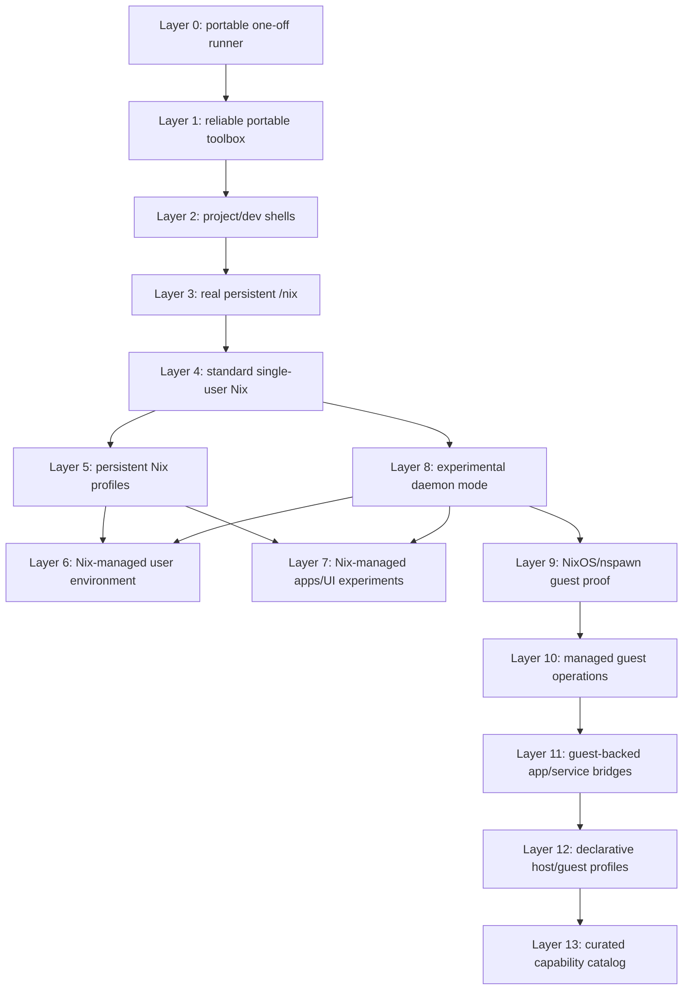
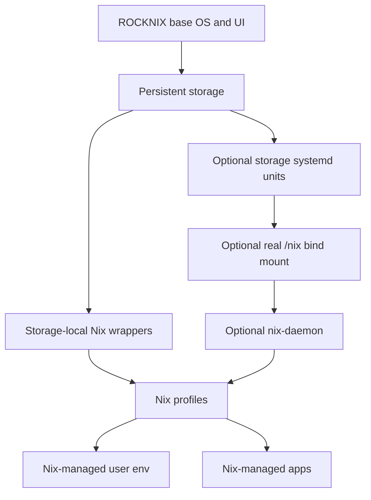

# feat: Layer Nix integration on ROCKNIX

## Overview

Build Nix support on the Odin2 Portal / SM8550 ROCKNIX install as a sequence of **usable layers**. Each layer must leave the device with a practical new capability, not merely internal plumbing.

The goal is not to convert ROCKNIX into NixOS. ROCKNIX continues to own boot, kernel, firmware, hardware quirks, EmulationStation, and image updates. Nix becomes an additive user/development/app layer that we can push progressively until ROCKNIX constraints make the next layer not worth it.

## Problem Frame

The current POC proves that Nix can run on-device through `nix-portable` with `proot`, with state under the writable storage partition. That is useful but limited: it is manual, not documented as a repeatable install, and not equivalent to a real `/nix` store.

ROCKNIX boots from a read-only squashfs root with persistent writable state under the device storage partition. Standard Nix expects a durable `/nix` path, so deeper integration requires either virtualization, a storage-backed mount, or image-level support.

Device paths such as `/storage` and `/nix` in this document refer to ROCKNIX runtime paths, not repository file references.

## Requirements Trace

- R1. Preserve the existing ROCKNIX boot model, update model, and EmulationStation-first UX.
- R2. Build Nix capability one layer at a time, with each layer independently testable and reversible.
- R3. Every layer must provide a usable outcome: a thing the user can do after the layer lands.
- R4. Keep early layers fully under the persistent storage partition.
- R5. Progressively evaluate whether ROCKNIX can support a real `/nix`, standard Nix, persistent profiles, app/user-environment management, and eventually a daemon.
- R6. Avoid committing to NixOS-like control of the base OS; ROCKNIX remains the base operating system.
- R7. Provide clear validation and rollback points so failed experiments do not strand the device.
- R8. Prefer repo-backed integration only after manual/runtime behavior is understood.
- R9. Treat Nix inputs, binary caches, and installer artifacts as trust boundaries because early layers run as root on the device.

## Scope Boundaries

- This plan does not replace ROCKNIX with NixOS.
- This plan does not move kernel, bootloader, firmware, or image creation under Nix.
- This plan does not require Chromium, Steam, or EmulationStation to be managed by Nix.
- This plan does not assume the standard Nix daemon will work without image changes.
- This plan does not promise every Nix package will run correctly on ROCKNIX; graphical, GPU, audio, and service-heavy packages require separate validation.
- This plan does not count a layer as complete unless it creates an end-user or operator-visible capability.

### Deferred to Separate Tasks

- Running untrusted flakes or arbitrary Nix expressions on the handheld: out of scope for this experiment.
- Managing ROCKNIX build inputs with Nix: out of scope for this device-runtime experiment.
- Replacing ROCKNIX system packages with Nix packages: out of scope unless a later experiment explicitly reopens it.

## Context & Research

### Relevant Code and Patterns

- `projects/ROCKNIX/packages/rocknix/profile.d/001-functions` adds `/storage/bin` to `PATH`, which is the correct low-risk entry point for storage-local wrapper commands.
- `projects/ROCKNIX/packages/sysutils/systemd/patches/systemd-0001-move-etc-systemd-system-to-storage-.config-system.d.patch` moves systemd system config units to `/storage/.config/system.d`, allowing persistent user-provided services.
- `projects/ROCKNIX/packages/sysutils/systemd/system.d/userconfig.service` initializes persistent config before normal services, which matters for any future boot-time mount or service integration.
- `projects/ROCKNIX/packages/sysutils/autostart/sources/autostart` runs custom scripts from the storage config area before starting the UI, which provides a fallback integration path when systemd ordering is not enough.
- `projects/ROCKNIX/packages/virtual/image/package.mk` controls project image composition and is the likely place to include an optional Nix integration package if this graduates from storage-only experimentation.
- `packages/virtual/misc-packages/package.mk` uses `ADDITIONAL_PACKAGES`, giving a lower-friction way to include experimental packages in developer builds.

### Institutional Learnings

- No repository `docs/solutions/` learnings were found for this topic.
- Prior on-device investigation established that `/` is mounted from read-only squashfs and `/storage` is writable and persistent.
- Prior POC established that `nix-portable` works on SM8550 when forced to `proot`, while its default namespace path fails with a permission error.

### External References

- Determinate Systems, “Nix on the Steam Deck”: standard pattern is persistent storage plus a boot-created `/nix` bind mount.
- Determinate installer OSTree planner: Fedora Atomic-style systems use persistent storage such as `/var/home/nix`, create `/nix`, and bind-mount it through systemd units.
- `DavHau/nix-portable`: supports virtualizing `/nix/store` under a user-owned directory, with `proot` fallback when user namespaces are unavailable.
- `nix-community/nix-user-chroot`: rootless Nix approach that depends on unprivileged user namespaces, which may not fit the current ROCKNIX device.

## Key Technical Decisions

| Decision | Rationale |
|---|---|
| Define layers by usable outcome, not mechanism | Each layer should answer “what can I do now that I could not do before?” |
| Keep Layer 0 as the current POC baseline | It already proves package execution and should remain the fallback while deeper layers are tested. |
| Force `NP_RUNTIME=proot` for portable layers | The device rejected the default namespace setup, while `proot` successfully ran `nix run nixpkgs#hello`. |
| Treat a real `/nix` as an image-level change | The root filesystem is squashfs, so creating a durable root-level mountpoint requires an image/package change rather than a runtime-only script. |
| Put persistent profiles before daemon mode | `nix profile` gives practical day-to-day value with less service/user complexity than `nix-daemon`. |
| Put app/UI experiments before daemon mode | User-facing packages expose the real compatibility boundary faster than daemon plumbing. |
| Make daemon support the late experimental layer | Multi-user Nix requires users/groups, service units, and stricter ordering; it should not block practical Nix use. |
| Pin and verify external artifacts before making integration repeatable | Nix-portable, standard Nix installers, and binary caches are external trust boundaries, and early experiments run as root. |

## Open Questions

### Resolved During Planning

- Can a storage-only Nix POC work on the current device? Yes. `nix-portable` with `NP_RUNTIME=proot` successfully ran `nix run nixpkgs#hello`.
- Can a normal `/nix` be created purely from storage scripts? No, not reliably. A mountpoint must exist on the root filesystem, and ROCKNIX root is read-only squashfs.
- Should daemon mode be early? No. It is less immediately useful than profiles, user environments, and app experiments, and it has more boot/service risk.

### Deferred to Implementation

- Exact `nix-portable` release pin and checksum: choose and verify during implementation because upstream release state can change.
- Exact trusted Nix substituters and public keys: define during implementation before documenting the setup as repeatable.
- Whether standard official Nix install works unchanged on ROCKNIX `aarch64`: depends on live runtime behavior after `/nix` exists.
- Whether daemon mode works with ROCKNIX’s trimmed systemd and user model: depends on image-level experiments and live service behavior.
- Which Nix-managed graphical packages are viable on ROCKNIX Wayland/Freedreno: validate package by package.

## Output Structure

Expected new repository shape if the experiment graduates into a ROCKNIX package:

```text
projects/ROCKNIX/packages/tools/nix-integration/
  package.mk
  profile.d/
    085-nix-integration.conf
  scripts/
    nixctl
    nix-portable-install
    nix-portable-run
    nix-doctor
    nix-layer-activate
  system.d/
    nix-storage-setup.service
    nix.mount
    nix-daemon.service
    nix-daemon.socket
  tests/
    nix-integration-static-checks.sh
    nix-integration-runtime-smoke.sh

documentation/PER_DEVICE_DOCUMENTATION/SM8550/
  NIX_EXPERIMENT.md
```

This tree is a scope declaration, not a rigid implementation constraint. The implementing agent may split or rename files if ROCKNIX package conventions point to a better shape.

## High-Level Technical Design

> *This illustrates the intended approach and is directional guidance for review, not implementation specification. The implementing agent should treat it as context, not code to reproduce.*

| Layer | Usable outcome | Example capability | Store model | Needs image rebuild? | Exit criteria |
|---|---|---|---|---|---|
| 0 | Portable one-off runner | Run `nix run nixpkgs#hello` over SSH | `nix-portable` under storage using `proot` | No | Already proven on device. |
| 1 | Reliable portable Nix toolbox | Run `nix`, `nix-shell`, `nix-run`, and `nix-doctor` from storage | `nix-portable` under storage using `proot` | No | Install, repair, doctor, and remove are repeatable after reboot. |
| 2 | Project/dev shells on device | Enter repeatable shells for Node/Python/Ruby/debug tools | Portable store | No | At least one practical dev shell works and is documented. |
| 3 | Real persistent `/nix` | `/nix/store` exists and persists across reboot | Storage bind-mounted to `/nix` | Yes | `/nix` is mounted from storage and ROCKNIX still boots if disabled. |
| 4 | Standard single-user/root Nix | Run `nix run`, `nix shell`, and evaluation without `nix-portable` | Real `/nix` store | Yes | Standard Nix works directly with documented config. |
| 5 | Persistent Nix profiles | Install tools once and run them normally from shell | Real `/nix` store | Yes | `nix profile install` makes CLI tools persist across reboot. |
| 6 | Nix-managed user environment | Manage selected `/storage` tools/config in a reversible way | Real or portable store | Yes for best result | Activation manages only declared storage-local files. |
| 7 | Nix-managed apps/UI experiments | Launch a real app or custom UI dependency from Nix | Real store preferred | Yes for best result | At least one useful app/UI experiment launches under ROCKNIX. |
| 8 | Experimental daemon mode | Use `nix-daemon` if ROCKNIX supports it | Real `/nix` store plus daemon | Yes | Daemon works without impacting boot, SSH, UI, Steam/FEX, or Chromium. |

### Proposed guest/service layers after Layer 8

Layer 9 has been implemented and hardware-validated as a bounded proof. Layer 10 proof-mode managed guest operations and Layer 11 one-shot bridges have also been implemented and hardware-validated on `thor`; Layer 10b is the active bootable-rootfs validation increment and remains separate from persistent guest services. Later layers are directional only and should each receive their own plan before execution. They preserve the same invariant: ROCKNIX remains the host OS and owns boot, kernel, firmware, default UI startup, Steam/FEX integration, and image updates.

| Layer | Proposed outcome | Example capability | Boundary / stop rule |
|---|---|---|---|
| 9 | NixOS/nspawn guest proof | Start a storage-backed NixOS-ish guest with a one-shot Nix proof | Go on `thor` for bounded manual proof; no boot autostart; no passthrough; `--register=no` required because machined is disabled. |
| 10 | Managed guest operations | `nixctl guest status/preflight/init/run/shell/start/stop/cleanup` plus resource limits | Proof mode is Go on `thor` for one-shot guest commands; bootable start/stop is implemented but not hardware-Go. Guest must be easy to stop, delete, throttle, and keep idle during gameplay. |
| 10b | Bootable guest rootfs validation | Reproducible bootable rootfs artifact, safe import/provenance, root-specific start/stop smoke | Active validation increment. Go requires a real NixOS/container-style rootfs artifact, checksum/provenance metadata, manual start/stop evidence, disabled unit after reboot, and no residual guest process. |
| 11 | Guest-backed app/service bridges | `nixctl bridge install/run/remove` wrappers that call selected guest commands | Go on `thor` for opt-in one-shot bridges that leave no guest running. Persistent services, guest SSH, graphics/audio/input, and autostart wait for Layer 10b bootable validation. |
| 12 | Declarative host/guest profiles | Reproducible profiles declaring packages, guest services, bridges, launchers, and resource limits | Profiles may manage Nix/guest/user-space state only; never ROMs, saves, Steam/FEX state, boot, firmware, or base packages. |
| 13 | Curated capability catalog | `nixctl catalog enable dev-toolbox` for hardware-validated workflows | Catalog items must be curated, smoke-tested, and hardware-scoped; not arbitrary internet flakes as root. |

Full NixOS replacement remains outside this layered path unless a later requirements/planning pass deliberately reopens hardware ownership. The blocker is not whether Nix can run; it is whether NixOS can safely replace ROCKNIX's device enablement, boot/update flow, graphics/input/audio stack, and Steam/FEX behavior.

Layer dependency graph:



## Success Metrics

- Layer 1 succeeds when a fresh storage-only setup can run a trivial Nix package after reboot with no image changes and has a working doctor/repair path.
- Layer 2 succeeds when the device can enter at least one useful dev shell and run a real development/debugging tool from it.
- Layer 3 succeeds when `/nix` is a persistent storage-backed mount and ROCKNIX still boots normally if that mount is disabled.
- Layer 4 succeeds when standard Nix can run without nix-portable virtualization.
- Layer 5 succeeds when profile-installed CLI tools persist and are available in normal SSH shells.
- Layer 6 succeeds when a declared storage-local environment can be activated and rolled back without touching unrelated user files.
- Layer 7 succeeds when at least one useful user-facing app or UI experiment launches from Nix under ROCKNIX.
- Layer 8 succeeds only if daemon mode survives reboot and failure does not affect SSH, Sway, EmulationStation, Steam/FEX, or Chromium.
- The experiment succeeds overall if each layer has a clear keep/stop decision backed by runtime evidence.

## Dependencies / Prerequisites

- Reliable SSH access to the device for recovery and log inspection.
- Current storage backup before any Layer 3+ image-level changes.
- A custom ROCKNIX image or package inclusion path before attempting a real `/nix` mountpoint.
- Agreement that storage-only Nix remains the fallback while deeper layers are tested.

## Alternative Approaches Considered

| Approach | Why not first |
|---|---|
| Standard Nix installer immediately | Requires `/nix`; the current root filesystem cannot create that path persistently at runtime. |
| Nix daemon immediately | Adds users/groups and service-ordering complexity before the practical single-user layers are proven. |
| `nix-user-chroot` | Depends on unprivileged user namespace behavior that already appears constrained on the device. |
| Full NixOS-style control | Conflicts with the current goal: ROCKNIX should continue to own boot, kernel, firmware, and image updates. |

## Implementation Units

- [x] **Unit 1: Layer 1 — Reliable portable Nix toolbox**

**Goal:** Turn the current manual POC into a repeatable storage-only toolbox with install, run, doctor, repair, and remove workflows.

**Requirements:** R1, R2, R3, R4, R7, R9

**Dependencies:** Layer 0 POC already exists on device.

**Files:**
- Create: `projects/ROCKNIX/packages/tools/nix-integration/scripts/nix-portable-install`
- Create: `projects/ROCKNIX/packages/tools/nix-integration/scripts/nix-portable-run`
- Create: `projects/ROCKNIX/packages/tools/nix-integration/scripts/nix-doctor`
- Create: `projects/ROCKNIX/packages/tools/nix-integration/tests/nix-integration-static-checks.sh`
- Create: `projects/ROCKNIX/packages/tools/nix-integration/tests/nix-integration-runtime-smoke.sh`
- Create: `documentation/PER_DEVICE_DOCUMENTATION/SM8550/NIX_EXPERIMENT.md`

**Approach:**
- Keep all mutable Nix state under the storage partition.
- Wrap nix-portable so callers do not need to remember `NP_RUNTIME=proot` or the storage location.
- Add `nix-doctor` checks for architecture, writable storage, network access, wrapper presence, artifact integrity, configured substituters, and proot runtime selection.
- Add explicit repair/remove behavior so this layer is safe to re-run.

**Patterns to follow:**
- Storage-local command pattern from `projects/ROCKNIX/packages/rocknix/profile.d/001-functions`.
- Existing ROCKNIX user-facing scripts under `projects/ROCKNIX/packages/rocknix/sources/scripts`.

**Test scenarios:**
- Happy path: On `aarch64`, running the wrapper with `--version` reports a Nix version and uses storage-backed state.
- Happy path: Running a cached package through the wrapper prints the expected program output without writing to the read-only root.
- Edge case: If network access is unavailable before first install, the installer exits with a clear message and leaves no partial active wrapper.
- Edge case: If storage has insufficient free space, doctor reports the problem before package downloads begin.
- Error path: If nix-portable is missing, not executable, or checksum-mismatched, doctor reports the exact artifact state and the install script can repair it.
- Integration: After reboot, the wrapper still resolves from the expected storage path and can run the same smoke package.

**Verification:**
- The device has a usable `/storage`-local Nix toolbox that can run one-off packages and diagnose itself.

- [x] **Unit 2: Layer 2 — Project/dev shells on device**

**Goal:** Make Nix useful for real on-device development and debugging by supporting repeatable shells with practical tools.

**Requirements:** R2, R3, R4, R7

**Dependencies:** Unit 1

**Files:**
- Modify: `projects/ROCKNIX/packages/tools/nix-integration/scripts/nix-portable-run`
- Modify: `projects/ROCKNIX/packages/tools/nix-integration/scripts/nix-doctor`
- Modify: `documentation/PER_DEVICE_DOCUMENTATION/SM8550/NIX_EXPERIMENT.md`
- Test: `projects/ROCKNIX/packages/tools/nix-integration/tests/nix-integration-runtime-smoke.sh`

**Approach:**
- Document and smoke-test practical dev shells, not only `hello`.
- Start with CLI/dev packages that avoid GPU/audio integration assumptions.
- Keep commands storage-only and proot-backed until the real `/nix` layer exists.
- Capture known performance limits so slow proot behavior is expected rather than mistaken for failure.

**Patterns to follow:**
- Storage-local wrappers from Unit 1.
- ROCKNIX documentation style under `documentation/PER_DEVICE_DOCUMENTATION/SM8550/`.

**Test scenarios:**
- Happy path: A shell containing a small CLI tool starts and runs that tool successfully.
- Happy path: A language runtime shell starts and can print its version.
- Edge case: A large shell download reports progress and does not fill storage unexpectedly.
- Error path: If a requested package is unavailable for `aarch64-linux`, the wrapper surfaces the Nix error without corrupting local state.
- Integration: Exiting the dev shell returns the user to the normal ROCKNIX shell environment.

**Verification:**
- The user can use Nix for at least one real development/debugging workflow on the device.

- [x] **Unit 3: Package Layers 1–2 as optional ROCKNIX tooling**

**Goal:** Make the storage-only toolbox and dev-shell support buildable as optional ROCKNIX tooling while keeping it disabled by default until mature.

**Requirements:** R1, R2, R3, R4, R8

**Dependencies:** Units 1-2

**Files:**
- Create: `projects/ROCKNIX/packages/tools/nix-integration/package.mk`
- Create: `projects/ROCKNIX/packages/tools/nix-integration/profile.d/085-nix-integration.conf`
- Modify: `projects/ROCKNIX/options`
- Modify: `projects/ROCKNIX/packages/virtual/image/package.mk`
- Test: `projects/ROCKNIX/packages/tools/nix-integration/tests/nix-integration-static-checks.sh`

**Approach:**
- Add a package that installs scripts and optional profile integration, but does not auto-install large Nix state into the image.
- Gate inclusion behind a build option such as a Nix-integration support flag or developer-only package selection.
- Keep downloaded nix-portable state in storage, not in the read-only system image.
- Ensure package-provided wrappers can adopt an existing manual storage POC without destructive overwrite.

**Patterns to follow:**
- Package recipe conventions from `packages/readme.md`.
- Optional dependency style in `projects/ROCKNIX/packages/virtual/image/package.mk`.
- Profile snippets such as `projects/ROCKNIX/packages/wayland/compositor/sway/profile.d/050-sway.conf`.

**Test scenarios:**
- Happy path: When the package is enabled in a developer image, scripts are present in the target image and storage state is still created at runtime.
- Happy path: When the package is disabled, default ROCKNIX image composition is unchanged.
- Edge case: If storage already contains a manually installed nix-portable POC, package-provided wrappers adopt it without destructive overwrite.
- Error path: If the pinned nix-portable artifact cannot be downloaded during runtime installation, the wrapper reports a recoverable failure.
- Integration: The package does not change EmulationStation boot behavior or existing `/storage/bin` custom scripts.

**Verification:**
- Developer builds can include the usable portable layers without forcing Nix onto release users.

- [x] **Unit 4: Layer 3 — Real persistent `/nix`**

**Goal:** Create the minimum image-level support needed for a standard `/nix` path backed by persistent storage.

**Requirements:** R2, R3, R5, R7, R8

**Dependencies:** Unit 3

**Files:**
- Modify: `projects/ROCKNIX/packages/tools/nix-integration/package.mk`
- Create: `projects/ROCKNIX/packages/tools/nix-integration/system.d/nix-storage-setup.service`
- Create: `projects/ROCKNIX/packages/tools/nix-integration/system.d/nix.mount`
- Modify: `documentation/PER_DEVICE_DOCUMENTATION/SM8550/NIX_EXPERIMENT.md`
- Test: `projects/ROCKNIX/packages/tools/nix-integration/tests/nix-integration-runtime-smoke.sh`

**Approach:**
- Add an empty `/nix` directory to the image only when the optional integration package is included.
- Use ROCKNIX’s persistent systemd config model to prepare the storage-backed Nix directory and bind-mount it to `/nix`.
- Order the mount early enough for later Nix services, but not so early that it races storage initialization.
- Keep nix-portable as a fallback even when the real `/nix` layer exists.

**Patterns to follow:**
- `projects/ROCKNIX/packages/sysutils/systemd/system.d/userconfig.service` for early storage/config ordering.
- `projects/ROCKNIX/packages/sysutils/systemd/patches/systemd-0001-move-etc-systemd-system-to-storage-.config-system.d.patch` for where persistent units live.
- External OSTree and Steam Deck Nix patterns using persistent storage plus bind-mounted `/nix`.

**Test scenarios:**
- Happy path: On boot, `/nix` exists as a mount backed by persistent storage and has expected ownership/permissions.
- Happy path: Files created under `/nix` persist across reboot.
- Edge case: If the storage-backed Nix directory is missing, the setup service creates it without touching unrelated storage data.
- Edge case: If the mount fails, ROCKNIX still boots to EmulationStation and logs a clear Nix integration failure.
- Error path: If storage is not mounted or is read-only, the service fails closed without blocking core UI startup.
- Integration: The real `/nix` layer coexists with the storage-only nix-portable wrapper during transition.

**Verification:**
- The device has a real persistent `/nix` path that is useful for standard Nix experiments and safe to disable.

- [ ] **Unit 5: Layer 4 — Standard single-user/root Nix**

**Goal:** Determine whether standard Nix can run directly on ROCKNIX once `/nix` is available, without nix-portable virtualization.

**Requirements:** R2, R3, R5, R6, R7, R9

**Dependencies:** Unit 4

**Files:**
- Create: `projects/ROCKNIX/packages/tools/nix-integration/scripts/nixctl`
- Modify: `projects/ROCKNIX/packages/tools/nix-integration/profile.d/085-nix-integration.conf`
- Modify: `documentation/PER_DEVICE_DOCUMENTATION/SM8550/NIX_EXPERIMENT.md`
- Test: `projects/ROCKNIX/packages/tools/nix-integration/tests/nix-integration-runtime-smoke.sh`

**Approach:**
- Add `nixctl` as the single front door for selecting and reporting the active layer: portable, real-store single-user, profile, user-env, app, or daemon.
- Validate standard Nix separately from nix-portable so failures do not break the working fallback.
- Prefer root/single-user validation first because the device is already root-oriented and multi-user build users add risk.
- Record compatibility gaps such as missing certificates, shell assumptions, dynamic linker assumptions, or sandbox restrictions.

**Patterns to follow:**
- Existing ROCKNIX scripts that expose operational workflows, such as `projects/ROCKNIX/packages/rocknix/sources/scripts/rocknix-update` and `projects/ROCKNIX/packages/rocknix/sources/scripts/installtointernal`.

**Test scenarios:**
- Happy path: With `/nix` mounted, standard Nix reports its version and evaluates a trivial expression.
- Happy path: Standard Nix runs a trivial cached package without using nix-portable.
- Edge case: If standard Nix is unavailable or broken, `nixctl` falls back to the portable layer when configured to do so.
- Error path: If sandboxing is unsupported, the failure is documented and the recommended config disables sandboxing only for this layer.
- Error path: If certificates or DNS are missing for binary cache downloads, doctor reports the missing dependency rather than presenting a generic Nix failure.
- Integration: Standard Nix usage does not modify ROCKNIX boot, UI, SSH, Steam, or Chromium state.

**Verification:**
- The user can run normal Nix commands directly, without nix-portable, while ROCKNIX remains the base OS.

- [ ] **Unit 6: Layer 5 — Persistent Nix profiles for CLI tools**

**Goal:** Make Nix useful day-to-day by allowing tools to be installed once and used normally from SSH/shell sessions.

**Requirements:** R2, R3, R5, R6, R7

**Dependencies:** Unit 5

**Files:**
- Modify: `projects/ROCKNIX/packages/tools/nix-integration/scripts/nixctl`
- Modify: `projects/ROCKNIX/packages/tools/nix-integration/profile.d/085-nix-integration.conf`
- Modify: `documentation/PER_DEVICE_DOCUMENTATION/SM8550/NIX_EXPERIMENT.md`
- Test: `projects/ROCKNIX/packages/tools/nix-integration/tests/nix-integration-runtime-smoke.sh`

**Approach:**
- Expose profile-installed binaries in a way that fits ROCKNIX’s `/storage/bin` and profile conventions.
- Start with low-risk CLI packages such as search, JSON, shell, or editor tools.
- Keep profile activation explicit and reversible.
- Document garbage collection and disk usage expectations.

**Patterns to follow:**
- `/storage/bin` path behavior from `projects/ROCKNIX/packages/rocknix/profile.d/001-functions`.
- Profile snippet style from existing `profile.d` package files.

**Test scenarios:**
- Happy path: Installing a CLI tool through a Nix profile makes the binary available in a fresh SSH shell.
- Happy path: The installed tool persists across reboot.
- Edge case: If a Nix-profile binary name conflicts with an existing ROCKNIX command, the plan documents precedence and doctor reports it.
- Error path: If profile activation fails, the previous shell PATH behavior remains available.
- Integration: Existing `/storage/bin` scripts for Chromium and other custom tools remain callable.

**Verification:**
- The device gains persistent Nix-managed CLI tools that feel normal to use from shell sessions.

- [x] **Unit 7: Layer 6 — Nix-managed user environment**

**Goal:** Use the working Nix layer to manage selected user-space tools/config under storage without claiming ownership of the ROCKNIX base OS.

**Requirements:** R1, R2, R3, R6, R7

**Dependencies:** Unit 6

**Files:**
- Create: `projects/ROCKNIX/packages/tools/nix-integration/scripts/nix-layer-activate`
- Modify: `projects/ROCKNIX/packages/tools/nix-integration/scripts/nixctl`
- Modify: `documentation/PER_DEVICE_DOCUMENTATION/SM8550/NIX_EXPERIMENT.md`
- Test: `projects/ROCKNIX/packages/tools/nix-integration/tests/nix-integration-runtime-smoke.sh`

**Approach:**
- Define a narrow initial managed surface: shell tools, storage-local wrappers, and optional config files under storage.
- Avoid managing `/usr`, boot files, kernel modules, firmware, or ROCKNIX-provided system services.
- Track ownership for files created by the Nix-managed layer.
- Refuse to overwrite user-owned storage files without an explicit migration decision.

**Patterns to follow:**
- Existing custom storage integration through `/storage/bin`, `/storage/.config/profile.d`, `/storage/.config/system.d`, and `/storage/.config/autostart`.

**Test scenarios:**
- Happy path: A Nix-managed CLI/user environment becomes available through the expected storage-local PATH and runs successfully.
- Happy path: Disabling the Nix-managed environment removes or bypasses only files owned by the Nix layer.
- Edge case: If a user-created file conflicts with a Nix-managed file, activation refuses to overwrite without an explicit migration decision.
- Error path: If activation fails halfway, rollback restores the previous storage-local wrappers.
- Integration: EmulationStation still starts as the default UI and existing custom Chromium scripts remain available.

**Verification:**
- Nix can manage a narrow, reversible user environment while ROCKNIX continues to manage the base system.

**Implementation note (2026-05-05):** Implemented as `nix-layer-activate` with a line-oriented activation manifest, ownership metadata under `/storage/.config/nix-integration/layer6`, `nixctl user-env` dispatch, `nix-doctor` Layer 6 checks, temp-surface runtime smoke, and opt-in hardware smoke/reboot verification. Initial managed surfaces are `/storage/bin` and `/storage/.config/profile.d`; autostart/systemd remain deferred.

- [x] **Unit 8: Layer 7 — Nix-managed apps and UI experiments**

**Goal:** Validate whether Nix can supply useful user-facing apps or custom UI dependencies on ROCKNIX.

**Requirements:** R1, R2, R3, R5, R6, R7

**Dependencies:** Unit 6; Unit 5 minimum

**Files:**
- Modify: `projects/ROCKNIX/packages/tools/nix-integration/scripts/nixctl`
- Modify: `documentation/PER_DEVICE_DOCUMENTATION/SM8550/NIX_EXPERIMENT.md`
- Test: `projects/ROCKNIX/packages/tools/nix-integration/tests/nix-integration-runtime-smoke.sh`

**Approach:**
- Start with one useful app or UI dependency whose success can be observed without replacing EmulationStation.
- Prefer launchers/manual tools before any boot integration.
- Test Wayland, GPU, audio, and input assumptions explicitly for each app candidate.
- Treat replacing the custom Chromium AppImage with Nix-managed Chromium as a separate app-specific experiment, not a prerequisite.

**Patterns to follow:**
- Existing manual Chromium launcher pattern under storage.
- Existing module/tool launcher patterns such as `projects/ROCKNIX/packages/virtual/emulators/sources/Start Steam.sh`.

**Test scenarios:**
- Happy path: A selected Nix-managed app launches manually from SSH or an on-device tool entry.
- Happy path: The app can be relaunched after reboot without reinstalling.
- Edge case: If the app requires unavailable GPU/Wayland/audio features, the failure is documented as package-specific, not a Nix-layer failure.
- Error path: If the app crashes, EmulationStation and Sway remain recoverable.
- Integration: App launch does not replace the default UI unless explicitly enabled in a separate future task.

**Verification:**
- At least one real user-facing app or custom UI dependency can be installed and launched through Nix.

**Implementation note (2026-05-05):** Implemented with `docs/plans/2026-05-05-003-feat-nix-layer-7-app-ui-experiments-plan.md`, a browser-like Layer 6 launcher fixture, Layer 7 status/doctor readiness checks, CI-safe temp-surface smoke coverage, and opt-in hardware validation. Validated on `thor` with `nixpkgs#chromium`: readiness smoke passed, a Sway-launched Chromium window appeared as `about:blank - Chromium`, the app binary resolved from `/nix/store`, Crashpad/config/cache were isolated under Layer 7 experiment roots, reboot verification passed, and the launcher deactivated cleanly.

- [x] **Unit 9: Layer 8 — Experimental nix-daemon mode**

**Goal:** Explore whether ROCKNIX can support daemon-style Nix with dedicated service/socket integration and build users.

**Requirements:** R2, R3, R5, R6, R7, R9

**Dependencies:** Unit 5; Units 6-8 provide practical justification for whether daemon mode is worth pursuing.

**Files:**
- Create: `projects/ROCKNIX/packages/tools/nix-integration/system.d/nix-daemon.service`
- Create: `projects/ROCKNIX/packages/tools/nix-integration/system.d/nix-daemon.socket`
- Modify: `projects/ROCKNIX/packages/tools/nix-integration/package.mk`
- Modify: `projects/ROCKNIX/packages/tools/nix-integration/scripts/nixctl`
- Modify: `documentation/PER_DEVICE_DOCUMENTATION/SM8550/NIX_EXPERIMENT.md`
- Test: `projects/ROCKNIX/packages/tools/nix-integration/tests/nix-integration-runtime-smoke.sh`

**Approach:**
- Treat daemon mode as experimental and opt-in.
- Add any required build users/groups through the image package only if ROCKNIX’s passwd/group handling supports it safely.
- Order daemon units after the `/nix` mount and storage setup.
- Keep single-user/root Nix as the rollback path.
- Do not expose daemon mode as the default until repeated boot, update, and package-run tests pass.

**Patterns to follow:**
- Systemd unit installation conventions from `scripts/install` and package `system.d` directories.
- ROCKNIX’s existing systemd customization via `/storage/.config/system.d`.

**Test scenarios:**
- Happy path: The daemon socket starts only after `/nix` is mounted.
- Happy path: A Nix client can communicate with the daemon and run a trivial cached package.
- Edge case: If daemon mode is disabled, standard single-user/root Nix still works.
- Edge case: If build users are missing or invalid, daemon setup reports the exact missing identity requirement.
- Error path: If the daemon fails to start, ROCKNIX still boots and the failure is isolated to Nix.
- Integration: Daemon mode does not interfere with `systemd-binfmt`, FEX/Steam launch behavior, or the Sway/EmulationStation service chain.

**Verification:**
- Daemon mode either works as a usable optional layer or is rejected with enough evidence to stop pursuing it.

**Implementation note (2026-05-05):** Implemented Layer 8 diagnostics, image-time daemon identity gate, opt-in daemon units, `nixctl daemon` lifecycle controls, and opt-in `LAYER8_SMOKE=1`/reboot smoke path in `docs/plans/2026-05-05-004-feat-nix-layer-8-daemon-mode-plan.md`. First hardware run on `thor` reached the safety gate as designed: an image without `NIX_DAEMON_SUPPORT=yes` lacks `nixbld`, so preflight refused activation and left no Layer 8 state. A second image built from `feat/nix-layer-8-daemon-mode` with `NIX_DAEMON_SUPPORT=yes` was applied to `thor`. With that image: preflight passed, `nixctl daemon enable` started the socket, `NIX_REMOTE=daemon nix store ping` reported `Trusted: 1`, `NIX_REMOTE=daemon nix run nixpkgs#hello` printed `Hello, world!`, reboot persistence (prepare + reboot + verify) succeeded, and `nixctl daemon disable` cleaned up to inactive while leaving Layer 4 single-user/root Nix as the fallback. Decision: keep Layer 8 as an opt-in capability behind `NIX_DAEMON_SUPPORT=yes`; default images continue to use Layer 4.

- [ ] **Unit 10: Layer-aware rollback, update behavior, and stopping rules**

**Goal:** Make the experiment safe to continue by defining how to validate, rollback, and stop at every layer.

**Requirements:** R2, R3, R6, R7, R8

**Dependencies:** Units 1-9 as evidence sources

**Files:**
- Modify: `documentation/PER_DEVICE_DOCUMENTATION/SM8550/NIX_EXPERIMENT.md`
- Modify: `projects/ROCKNIX/packages/tools/nix-integration/scripts/nix-doctor`
- Modify: `projects/ROCKNIX/packages/tools/nix-integration/scripts/nixctl`
- Test: `projects/ROCKNIX/packages/tools/nix-integration/tests/nix-integration-runtime-smoke.sh`

**Approach:**
- Document rollback per layer: portable cleanup, dev-shell cleanup, real `/nix` mount disablement, standard Nix removal, profile rollback, user-environment deactivation, app removal, and daemon disablement.
- Define update checks for ROCKNIX image updates, especially whether `/nix` mountpoint support remains present.
- Define stopping rules for high-cost paths such as daemon support if ROCKNIX’s trimmed user/systemd model makes them too fragile.
- Make `nixctl status` report the current active layer and the next safe layer.

**Patterns to follow:**
- Existing operational documentation under `documentation/PER_DEVICE_DOCUMENTATION/SM8550/`.
- Recovery-oriented scripts such as `projects/ROCKNIX/packages/rocknix/sources/post-update` and `projects/ROCKNIX/packages/rocknix/sources/scripts/rocknix-update`.

**Test scenarios:**
- Happy path: Doctor reports the active layer, its backing storage, and whether rollback metadata exists.
- Happy path: `nixctl status` explains what capability is currently usable and what the next layer requires.
- Edge case: After a ROCKNIX update, doctor detects whether image-level `/nix` support is still present.
- Error path: If a layer is partially installed, `nixctl` reports the incomplete state and recommends the safest next action.
- Integration: Rollback documentation covers preserving unrelated storage data such as SSH config, Chromium, Steam data, and ROMs.

**Verification:**
- A future operator can identify the active Nix layer, validate it, use it, and roll it back without rediscovering the experiment history.

## System-Wide Impact

- **Interaction graph:** Nix integration touches storage-local shell wrappers, optional profile snippets, optional systemd units, optional apps, and eventually image composition. It must not alter UI startup services except through explicit user action.
- **Error propagation:** Nix setup failures should log and fail closed. They should not block boot, SSH, storage mounting, Sway, or EmulationStation.
- **State lifecycle risks:** Nix stores can become large; every layer needs disk-space checks and garbage-collection guidance.
- **API surface parity:** If wrappers are exposed through `/storage/bin`, equivalent documentation and doctor checks must exist so SSH sessions and on-device shells behave consistently.
- **Integration coverage:** Reboot persistence, ROCKNIX update behavior, and coexistence with Steam/FEX and Chromium require runtime smoke coverage beyond static file checks.
- **Unchanged invariants:** ROCKNIX owns boot files, kernel, firmware, hardware quirks, and default UI startup. Nix is an additive runtime/user-space layer.



## Risks & Dependencies

| Risk | Mitigation |
|------|------------|
| Nix store consumes too much storage | Add doctor disk checks, document garbage collection, and keep stores under a known storage path. |
| Layers become plumbing-only milestones | Require each layer to document a usable command/workflow and pass a smoke scenario that proves it. |
| Real `/nix` cannot exist without image changes | Treat `/nix` as an image/package milestone, not a runtime-only promise. |
| Daemon mode conflicts with ROCKNIX’s trimmed systemd/user model | Keep daemon support late, experimental, and optional; preserve single-user/root fallback. |
| Nix-managed files overwrite user customizations | Require ownership tracking and refuse conflicting activation by default. |
| External Nix artifacts or substituters become a trust risk | Pin installer artifacts, record checksums, document trusted substituters/keys, and avoid running untrusted flakes as root. |
| ROCKNIX updates remove image-level `/nix` support | Add post-update validation and document recovery/rebuild requirements. |
| Graphical Nix packages fail due to Wayland/GPU/audio assumptions | Validate CLI tools first; treat GUI apps as Layer 7 package-specific compatibility work. |
| `proot` performance is poor | Accept for Layers 0-2; move performance-sensitive use to real `/nix` if Layer 4 works. |

## Documentation / Operational Notes

- Document the active layer clearly in `documentation/PER_DEVICE_DOCUMENTATION/SM8550/NIX_EXPERIMENT.md`.
- Each layer section must include: usable outcome, example command/workflow, validation, rollback, and stopping rule.
- Mark Layers 0-2 as safe storage-only experiments.
- Mark Layer 3+ as requiring a custom ROCKNIX image or package inclusion.
- Keep rollback instructions next to each layer, not only at the end.
- Include a note that Nix does not replace ROCKNIX updates and should not be used to mutate `/usr` or boot files.

## Sources & References

- Related code: `projects/ROCKNIX/packages/rocknix/profile.d/001-functions`
- Related code: `projects/ROCKNIX/packages/sysutils/systemd/system.d/userconfig.service`
- Related code: `projects/ROCKNIX/packages/sysutils/systemd/patches/systemd-0001-move-etc-systemd-system-to-storage-.config-system.d.patch`
- Related code: `projects/ROCKNIX/packages/sysutils/autostart/sources/autostart`
- Related code: `projects/ROCKNIX/packages/virtual/image/package.mk`
- Related code: `packages/virtual/misc-packages/package.mk`
- External: `https://determinate.systems/blog/nix-on-the-steam-deck`
- External: `https://github.com/DeterminateSystems/nix-installer/blob/main/src/planner/ostree.rs`
- External: `https://github.com/DavHau/nix-portable`
- External: `https://github.com/nix-community/nix-user-chroot`
