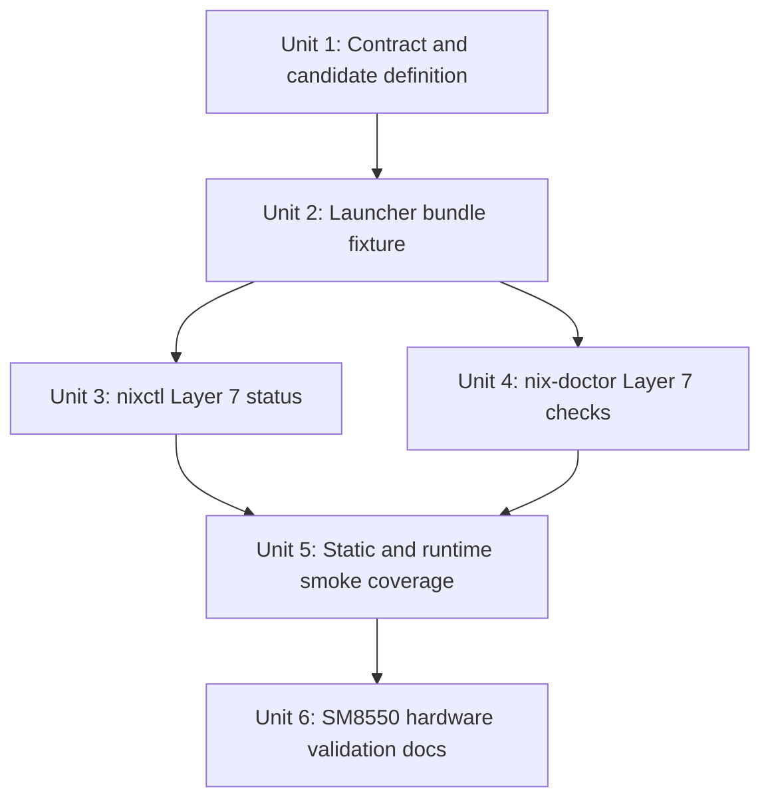
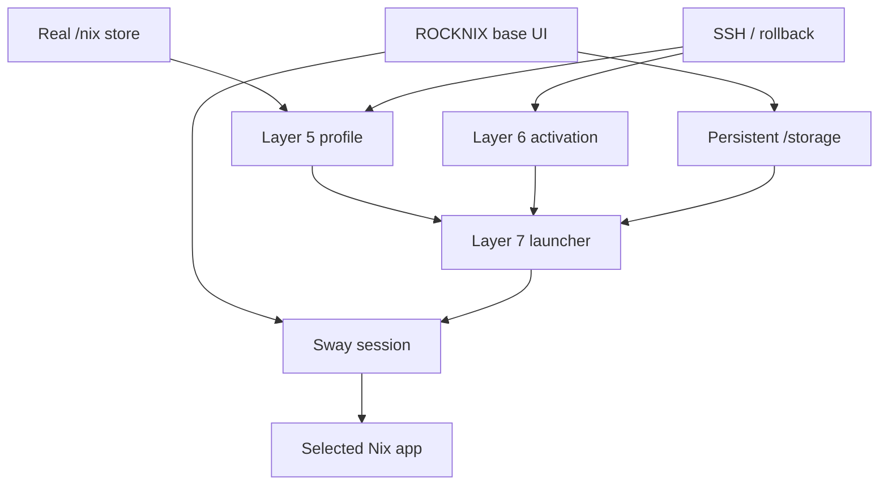

# feat: Add Nix Layer 7 app and UI experiments

## Overview

Layer 7 extends the proven ROCKNIX Nix stack from CLI/profile/user-environment management into manually launched user-facing applications. The first slice should prove that a Nix-supplied app or UI dependency can be installed through the existing real `/nix` store, exposed through a reversible Layer 6 launcher, launched under ROCKNIX Sway, relaunched after reboot, and removed without changing the default EmulationStation-first system.

This is not a general app manager yet. It is a controlled compatibility experiment that turns one useful graphical or browser-like app into a documented, repeatable path while preserving SSH recovery, game performance, and ROCKNIX ownership of the base OS.

## Problem Frame

Layers 4-6 proved that standard single-user Nix, persistent profiles, and managed storage-local wrappers/profile snippets work on SM8550 ROCKNIX. The remaining uncertainty is whether Nix can provide practical user-facing apps in the actual ROCKNIX runtime: Wayland/Sway, Freedreno/GPU, audio, touch/controller input, fullscreen behavior, storage-local profiles, and coexistence with EmulationStation, Steam/FEX, and existing browser experiments.

Layer 7 should answer that with evidence from one useful app first, then leave a pattern for future app/UI experiments. A prior Nix-launched Chromium script reportedly worked on-screen, and recent Steam desktop/manual-launch work exposed the important constraints: launch from the active Sway session, avoid default UI takeover, document package-specific failures separately from Nix-layer failures, and keep recovery paths boring.

## Requirements Trace

- R1. Launch at least one useful Nix-managed app or UI dependency manually under ROCKNIX without replacing EmulationStation or default UI startup.
- R2. Use Layer 6 activation for any persistent `/storage/bin` launcher or profile snippet so activation, conflict refusal, rollback, and cleanup remain ownership-tracked.
- R3. Keep app state under explicit storage-local paths and avoid mutating `/usr`, `/flash`, `/boot`, firmware, kernel modules, ROCKNIX services, ROMs, saves, Steam/FEX state, and existing browser state.
- R4. Report Layer 7 readiness and app experiment state through existing operator surfaces (`nixctl status`, `nix-doctor`) without making app launch mandatory for normal Nix health.
- R5. Validate graphical runtime assumptions explicitly: Sway launch context, Wayland/X11 fallback, GPU acceleration or software fallback, audio, input/touch/controller, fullscreen/window management, exit behavior, and relaunch after reboot.
- R6. Preserve rollback: deactivating the Layer 7 launcher removes only Layer 6-owned files, uninstall guards remain safe, and failed app launches do not strand SSH, Sway, EmulationStation, Steam/FEX, or existing storage data.
- R7. Document package-specific findings so future app candidates can reuse the pattern without treating every graphical failure as a base Nix failure.
- R8. Prove the launched app binary resolves from the Nix profile/store path, not from a ROCKNIX system binary or unrelated storage script.

## Scope Boundaries

- Do not replace EmulationStation, `essway`, Sway startup, or the default ROCKNIX UI flow.
- Do not add boot-time app autostart, storage systemd units, or `/storage/.config/autostart.sh` integration in this layer.
- Do not manage broad dotfiles, browser profiles outside the selected experiment path, Steam/FEX state, ROMs, saves, or ROCKNIX package-managed services.
- Do not require `nix-daemon`; Layer 7 should work with the existing single-user/root Nix and profile model.
- Do not classify a package-specific Wayland/GPU/audio failure as a failure of Layers 4-6 unless the evidence shows the Nix substrate itself is broken.
- Do not promise that all Nix graphical packages work on ROCKNIX; this layer proves one useful candidate and captures the evaluation pattern.

### Deferred to Separate Tasks

- App catalog, UI picker, or Ports integration for multiple apps: future Layer 7 iteration after one manual launcher is validated.
- Autostart/systemd activation surfaces: future Layer 6/7 expansion after wrapper/profile activation remains stable.
- Daemon-backed app installs or multi-user Nix: Layer 8 or later.
- Replacing existing ROCKNIX Chromium/Steam flows with Nix-managed equivalents: app-specific follow-up after manual launch proof.

## Context & Research

External research was not used for this plan. The relevant constraints are ROCKNIX-specific and already documented locally; upstream Nix/Wayland guidance is less useful than the device evidence from Layers 4-6 and recent Steam/Chromium experiments.

### Relevant Code and Patterns

- `projects/ROCKNIX/packages/tools/nix-integration/scripts/nixctl` is the existing front door for Layer 4 install/uninstall, Layer 5 profile status, and Layer 6 user-env activation.
- `projects/ROCKNIX/packages/tools/nix-integration/scripts/nix-doctor` is the existing health surface for layer-aware diagnostics and should gain Layer 7 checks without making graphical launch a default smoke requirement.
- `projects/ROCKNIX/packages/tools/nix-integration/scripts/nix-layer-activate` already owns the safe activation model for `/storage/bin` and `/storage/.config/profile.d`.
- `projects/ROCKNIX/packages/tools/nix-integration/tests/fixtures/layer6-user-env/manifest` is the manifest fixture pattern to mirror for a Layer 7 launcher bundle.
- `projects/ROCKNIX/packages/tools/nix-integration/tests/nix-integration-runtime-smoke.sh` already has opt-in hardware modes for Layer 4-6 and should add an opt-in Layer 7 smoke rather than exercising graphics in default CI.
- `projects/ROCKNIX/packages/tools/nix-integration/tests/nix-integration-static-checks.sh` guards package installation, script syntax, and expected layer hooks.
- `projects/ROCKNIX/packages/virtual/emulators/sources/Start Steam.sh` is an existing user-facing launcher shape to reference for operator expectations, not a direct implementation target.
- `documentation/PER_DEVICE_DOCUMENTATION/SM8550/NIX_EXPERIMENT.md` is the operational source of truth for layer status, validation, stopping rules, and rollback.

### Institutional Learnings

- `docs/solutions/developer-experience/nix-layer-6-managed-user-environment-rocknix-2026-05-05.md`: Layer 6 should manage only declared storage-local files, refuse non-owned conflicts, reject empty manifests, and cleanly deactivate before `/nix/store` removal.
- `docs/solutions/developer-experience/nix-layer-5-persistent-profiles-rocknix-2026-05-05.md`: Layer 5 uses standard `nix profile`; `nixctl` is lifecycle/status/doctor, not a package-manager wrapper.
- `docs/solutions/runtime-errors/rocknix-nix-profiled-path-reset-2026-05-05.md`: profile snippets must sort after ROCKNIX BusyBox profile reset; app launchers should not rely on fragile PATH ordering unless doctor can report it.
- `docs/solutions/runtime-errors/steam-desktop-ui-arm64-manifest-spinner-rocknix-2026-05-04.md`: graphical desktop experiments need correct launch context and should preserve known working Steam state rather than mutate it opportunistically.
- `docs/solutions/best-practices/manual-steam-game-launching-rocknix-arm64-2026-05-04.md`: launch visible graphical programs through the active Sway session, treat Gamescope/Wayland/X11 behavior as package-specific, and confirm UI recovery after exit.
- `docs/solutions/best-practices/rocknix-sm8550-power-profiling-2026-05-04.md`: app validation should include performance/power observations for lightweight games/apps, with reversible power profile handling when profiling is part of the experiment.

### External References

- None used. Package-specific docs may be consulted during implementation if the selected app fails due to known upstream Wayland/GPU/audio behavior.

## Key Technical Decisions

| Decision | Rationale |
|---|---|
| Start with a single app experiment | Layer 7 is a compatibility proof, not an app catalog. One useful app creates stronger evidence than many shallow unvalidated launchers. |
| Prefer the known Chromium/browser-like path as the first candidate | Prior evidence suggests Nix-launched Chromium can render on-screen; browser-like UI dependencies are useful for custom UI work and easy to observe. |
| Keep launcher activation in Layer 6 | Layer 6 already provides conflict refusal, ownership metadata, rollback, and uninstall safety for `/storage/bin` and profile snippets. |
| Keep package install in standard `nix profile` | Layer 5 explicitly chose standard Nix profile semantics. Layer 7 should not invent a second package manager. |
| Add status/doctor awareness before broad app automation | Operators need to see missing package, inactive launcher, bad profile state, or stale Layer 6 ownership without guessing. |
| Make graphical hardware smoke opt-in | Default CI cannot prove Sway/GPU/audio behavior and should not attempt to launch graphical apps. Hardware validation should be explicit. |
| Treat app failures as candidate results | A failed Chromium/Wayland/GPU path may still be a useful Layer 7 result if the layer reports and documents it clearly and a fallback candidate can be tried. |

## Open Questions

### Resolved During Planning

- Should Layer 7 use Layer 6 for persistent launchers? Yes. This keeps `/storage/bin` changes ownership-tracked and reversible.
- Should Layer 7 add boot or autostart integration? No. Manual launch first; boot integration is intentionally deferred.
- Should Layer 7 depend on `nix-daemon`? No. Existing single-user/root Nix and profiles are sufficient for the first app experiment.
- Should the first candidate be app-catalog breadth or one deep proof? One deep proof; the layer succeeds when one useful app is repeatably launched and documented.

### Deferred to Implementation

- Exact first candidate package: start with the prior Chromium/browser-like evidence, but switch to a lightweight Wayland app if Nix Chromium is unavailable, too large, or fails for package-specific reasons.
- Exact launcher flags: finalize after observing the selected app under ROCKNIX Sway; document Wayland/X11/GPU/audio choices as app-specific findings.
- Exact Nix package attribute: choose the package that evaluates and substitutes cleanly on `aarch64-linux` during implementation.
- Exact storage profile path for the selected app: choose a path that avoids existing browser/Steam/FEX state and document it before hardware validation.
- Whether Ports integration is worthwhile: decide only after manual launcher validation is boring.

## Output Structure

Expected new repository shape for the first Layer 7 slice:

```text
projects/ROCKNIX/packages/tools/nix-integration/
  docs/
    layer7-app-experiment-contract.md
  tests/
    fixtures/
      layer7-apps/
        browser/
          manifest
          files/
            bin/
              rocknix-layer7-browser
            profile.d/
              999-rocknix-layer7-browser
```

This tree is a scope declaration. The implementer may adjust names if the selected first candidate is not browser-like, but the first iteration should still have one app-specific fixture bundle and one contract doc.

## High-Level Technical Design

> *This illustrates the intended approach and is directional guidance for review, not implementation specification. The implementing agent should treat it as context, not code to reproduce.*

```mermaid
flowchart TB
  Profile[Layer 5 profile package]
  Bundle[Layer 7 app bundle]
  Activate[Layer 6 activation]
  Launcher[/storage/bin app launcher]
  Sway[Active ROCKNIX Sway session]
  App[Nix-managed app]
  Doctor[nixctl / nix-doctor]
  Docs[SM8550 docs + solution notes]

  Profile --> Launcher
  Bundle --> Activate
  Activate --> Launcher
  Launcher --> Sway
  Sway --> App
  Activate --> Doctor
  Profile --> Doctor
  App --> Docs
  Doctor --> Docs
```

Layer 7 should make the app launch path explicit:

1. Nix profile provides the package binary or runtime dependency.
2. A Layer 7 bundle declares only storage-local launcher/profile files.
3. Layer 6 activates the bundle and records ownership.
4. The launcher enters or targets the active Sway session without replacing default UI startup.
5. `nixctl status` and `nix-doctor` report whether the package and launcher are ready.
6. Hardware validation records what worked, what failed, and how to deactivate.

## Implementation Units



- [x] **Unit 1: Define the Layer 7 app experiment contract**

**Goal:** Make the Layer 7 boundary explicit before adding app-specific launchers: what a bundle may manage, how it relates to `nix profile`, what state it may create, and what remains forbidden.

**Requirements:** R1, R2, R3, R6, R7

**Dependencies:** Completed Layer 6 activation contract and current layered Nix roadmap.

**Files:**
- Create: `projects/ROCKNIX/packages/tools/nix-integration/docs/layer7-app-experiment-contract.md`
- Modify: `documentation/PER_DEVICE_DOCUMENTATION/SM8550/NIX_EXPERIMENT.md`
- Modify: `docs/plans/2026-04-28-001-feat-layered-nix-integration-plan.md`
- Test: `projects/ROCKNIX/packages/tools/nix-integration/tests/nix-integration-static-checks.sh`

**Approach:**
- Define Layer 7 as manually launched Nix-managed apps/UI dependencies exposed through Layer 6-managed storage files.
- State that package installation remains standard `nix profile` and that Layer 7 does not own package add/remove semantics.
- List allowed first-iteration surfaces: `/storage/bin/<launcher>` and `/storage/.config/profile.d/<snippet>` via Layer 6 only.
- List forbidden surfaces: `/usr`, `/flash`, `/boot`, kernel modules, firmware, ROMs, saves, Steam/FEX state, existing browser profiles, ROCKNIX services, default UI startup.
- Define app-specific state/config/cache rules: app data must be under explicit `/storage/.local/share/nix-apps/layer7/<app>`, `/storage/.config/nix-apps/layer7/<app>`, or `/storage/.cache/nix-apps/layer7/<app>` experiment paths and must not reuse existing user data unless the operator opts in outside the layer.
- Capture stopping rules for graphical failures, recovery loss, storage bloat, and performance regression.

**Patterns to follow:**
- `projects/ROCKNIX/packages/tools/nix-integration/docs/layer6-activation-contract.md`
- `docs/solutions/developer-experience/nix-layer-6-managed-user-environment-rocknix-2026-05-05.md`
- `documentation/PER_DEVICE_DOCUMENTATION/SM8550/NIX_EXPERIMENT.md`

**Test scenarios:**
- Static: contract doc exists and names Layer 6 activation as the only persistent launcher mechanism.
- Static: contract doc names the allowed surfaces and forbidden ROCKNIX/system/user-data surfaces.
- Static: SM8550 experiment doc contains a Layer 7 section with success criteria, validation, rollback, and stopping rules.

**Verification:**
- A future operator can read the contract and know whether a proposed app experiment belongs in Layer 7 or should be deferred/rejected.

- [x] **Unit 2: Add the first Layer 7 launcher bundle fixture**

**Goal:** Create a concrete app experiment bundle shape that Layer 6 can preflight/activate/deactivate, with a launcher that checks for its Nix-provided app dependency and targets the active Sway session safely.

**Requirements:** R1, R2, R3, R5, R6, R8

**Dependencies:** Unit 1; Layer 6 activation engine.

**Files:**
- Create: `projects/ROCKNIX/packages/tools/nix-integration/tests/fixtures/layer7-apps/browser/manifest`
- Create: `projects/ROCKNIX/packages/tools/nix-integration/tests/fixtures/layer7-apps/browser/files/bin/rocknix-layer7-browser`
- Create: `projects/ROCKNIX/packages/tools/nix-integration/tests/fixtures/layer7-apps/browser/files/profile.d/999-rocknix-layer7-browser`
- Modify: `projects/ROCKNIX/packages/tools/nix-integration/docs/layer7-app-experiment-contract.md`
- Test: `projects/ROCKNIX/packages/tools/nix-integration/tests/nix-integration-runtime-smoke.sh`
- Test: `projects/ROCKNIX/packages/tools/nix-integration/tests/nix-integration-static-checks.sh`

**Approach:**
- Use a browser-like fixture name because the prior Chromium script is the strongest starting evidence, but keep the contract generic enough for future app candidates.
- Make the launcher fail clearly when the selected Nix profile binary is missing, rather than silently falling back to a ROCKNIX/system binary.
- Make the readiness path prove the selected binary resolves through `${HOME}/.nix-profile/bin` or `/nix/store`, not `/usr`, `/bin`, or an unrelated `/storage/bin` script.
- Make the launcher use explicit app state/config/cache directories under `/storage` that are separate from existing browser, Steam, FEX, and game state.
- Include environment/profile snippet only for app-specific variables that are safe in normal shells; avoid broad changes that alter unrelated commands.
- Keep the fixture busybox-shell compatible and suitable for temp-surface runtime smoke.

**Patterns to follow:**
- `projects/ROCKNIX/packages/tools/nix-integration/tests/fixtures/layer6-user-env/manifest`
- `projects/ROCKNIX/packages/tools/nix-integration/tests/fixtures/layer6-user-env/files/bin/rocknix-layer6-smoke`
- `docs/solutions/best-practices/manual-steam-game-launching-rocknix-arm64-2026-05-04.md`

**Test scenarios:**
- Happy path: activating the fixture into temporary Layer 6 surfaces creates the browser launcher and optional profile snippet with expected modes.
- Happy path: running the launcher in dependency-check mode reports the expected Nix profile dependency contract without launching graphics.
- Happy path: dependency-check mode reports a Nix profile/store-backed binary path and refuses non-Nix/system fallback paths.
- Edge case: when the expected app binary is absent, the launcher exits non-zero with a clear install/readiness message and does not create app state.
- Edge case: the profile snippet is idempotent when sourced more than once and does not duplicate PATH or app environment values.
- Error path: if a non-owned file already exists at the launcher target, activation refuses and preserves the user file through the Layer 6 conflict path.
- Integration: deactivation removes the Layer 7 launcher/profile snippet and leaves unrelated storage files untouched.

**Verification:**
- The Layer 7 bundle is a real Layer 6 activation target and can be validated safely in default temp-surface tests without launching a graphical app.

- [x] **Unit 3: Add Layer 7 app status to `nixctl`**

**Goal:** Teach the existing operator front door to report whether the first app experiment is installed, activated, and ready to launch without turning `nixctl` into an app package manager.

**Requirements:** R2, R4, R6, R8

**Dependencies:** Unit 2.

**Files:**
- Modify: `projects/ROCKNIX/packages/tools/nix-integration/scripts/nixctl`
- Modify: `projects/ROCKNIX/packages/tools/nix-integration/tests/nix-integration-runtime-smoke.sh`
- Modify: `projects/ROCKNIX/packages/tools/nix-integration/tests/nix-integration-static-checks.sh`
- Test: `projects/ROCKNIX/packages/tools/nix-integration/tests/nix-integration-runtime-smoke.sh`
- Test: `projects/ROCKNIX/packages/tools/nix-integration/tests/nix-integration-static-checks.sh`

**Approach:**
- Extend `nixctl status` with a Layer 7 section rather than adding package install/remove subcommands.
- Report readiness dimensions separately: real Nix present, Layer 5 profile link present, selected app binary found or missing, selected binary origin is Nix-backed or unsafe, Layer 6 launcher active/inactive, app state path present/absent.
- If adding a subcommand, keep it read-only or delegate to Layer 6 for activation; avoid duplicating `nix profile install` or `nixctl user-env activate` semantics.
- Make all paths configurable for tests with environment overrides, following existing Layer 6 temp-surface patterns.

**Patterns to follow:**
- Layer 5 profile status functions in `projects/ROCKNIX/packages/tools/nix-integration/scripts/nixctl`
- Layer 6 status functions in `projects/ROCKNIX/packages/tools/nix-integration/scripts/nixctl`
- `docs/solutions/developer-experience/nix-layer-5-persistent-profiles-rocknix-2026-05-05.md`

**Test scenarios:**
- Happy path: with a fake app binary and active temp Layer 6 launcher, `nixctl status` reports Layer 7 ready/active.
- Happy path: with no app launcher active, `nixctl status` reports Layer 7 inactive without failing the whole status command.
- Edge case: with launcher active but app binary missing, status reports a not-ready app dependency state and points at the package/profile layer rather than Layer 6.
- Edge case: with app binary present but launcher inactive, status reports that the package exists but no managed launcher is active.
- Error path: with partial Layer 6 state, status surfaces the partial activation state and avoids claiming Layer 7 is ready.

**Verification:**
- `nixctl status` gives enough information to decide whether to install the candidate package, activate/deactivate the launcher, or investigate Layer 6 state.

- [x] **Unit 4: Add Layer 7 diagnostics to `nix-doctor`**

**Goal:** Add health checks for Layer 7 readiness and stale/broken app experiment state while keeping graphical launch validation opt-in.

**Requirements:** R3, R4, R5, R6, R8

**Dependencies:** Unit 2; Unit 3 can land before or after this unit, but both should agree on status vocabulary.

**Files:**
- Modify: `projects/ROCKNIX/packages/tools/nix-integration/scripts/nix-doctor`
- Modify: `projects/ROCKNIX/packages/tools/nix-integration/tests/nix-integration-runtime-smoke.sh`
- Modify: `projects/ROCKNIX/packages/tools/nix-integration/tests/nix-integration-static-checks.sh`
- Test: `projects/ROCKNIX/packages/tools/nix-integration/tests/nix-integration-runtime-smoke.sh`
- Test: `projects/ROCKNIX/packages/tools/nix-integration/tests/nix-integration-static-checks.sh`

**Approach:**
- Check only non-graphical readiness by default: Layer 4 real Nix, Layer 5 profile link, expected app binary, Nix-backed binary origin, Layer 6 launcher ownership, app state path safety, and obvious storage pressure.
- Treat missing app package as a warning or Layer 7 not-ready state, not a base Nix failure, unless an explicit Layer 7 smoke mode requires it.
- Detect unsafe state paths that point at existing Steam/FEX/browser profiles or forbidden system locations.
- Detect active launcher files whose source or store-backed references are missing, reusing Layer 6 metadata when possible.
- Add an opt-in hardware smoke flag for actual app launch observation; default doctor should not start GUI apps.

**Patterns to follow:**
- `check_layer6` in `projects/ROCKNIX/packages/tools/nix-integration/scripts/nix-doctor`
- Layer 5 profile/bin checks in `projects/ROCKNIX/packages/tools/nix-integration/scripts/nix-doctor`
- Runtime smoke environment override patterns in `projects/ROCKNIX/packages/tools/nix-integration/tests/nix-integration-runtime-smoke.sh`

**Test scenarios:**
- Happy path: fake app binary plus active temp launcher yields Layer 7 ready diagnostics.
- Happy path: inactive Layer 7 yields informational diagnostics and does not make `nix-doctor --offline` fail.
- Edge case: app state, config, or cache path configured to a forbidden location is reported as unsafe.
- Edge case: app command resolves to `/usr`, `/bin`, or unrelated `/storage/bin`; doctor reports unsafe/non-Nix origin instead of Layer 7 ready.
- Edge case: active launcher points at missing app dependency; doctor reports Layer 7 not ready but preserves existing lower-layer diagnostics.
- Error path: partial Layer 6 activation causes doctor to fail or warn consistently with existing Layer 6 behavior and does not claim Layer 7 readiness.
- Integration: `--offline` still works and does not require network, app downloads, or graphical launch.

**Verification:**
- `nix-doctor` can distinguish lower-layer health from app-experiment readiness, and operators can understand why a Layer 7 launch is or is not safe to try.

- [x] **Unit 5: Extend static, runtime, and opt-in hardware smoke coverage**

**Goal:** Prove the Layer 7 control surfaces in CI-safe temp directories and define a hardware-only graphical validation path for SM8550.

**Requirements:** R1, R2, R4, R5, R6

**Dependencies:** Units 2-4.

**Files:**
- Modify: `projects/ROCKNIX/packages/tools/nix-integration/tests/nix-integration-static-checks.sh`
- Modify: `projects/ROCKNIX/packages/tools/nix-integration/tests/nix-integration-runtime-smoke.sh`
- Modify: `projects/ROCKNIX/packages/tools/nix-integration/docs/layer7-app-experiment-contract.md`
- Test: `projects/ROCKNIX/packages/tools/nix-integration/tests/nix-integration-static-checks.sh`
- Test: `projects/ROCKNIX/packages/tools/nix-integration/tests/nix-integration-runtime-smoke.sh`

**Approach:**
- Add default temp-surface checks for fixture syntax, Layer 6 activation/deactivation, `nixctl status`, `nix-doctor`, missing app binary behavior, and forbidden state-path detection.
- Add opt-in hardware validation mode for actual app launch under Sway, similar to the existing Layer 4-6 opt-in smokes.
- Split hardware validation into prepare/verify/cleanup phases if reboot persistence is tested, following Layer 5/6 patterns.
- Record logs under `/tmp` or explicit storage experiment paths without touching Steam/FEX/browser production state.
- Make graphical launch criteria observational and explicit: visible window, input response, exit behavior, Sway/EmulationStation recovery, and relaunch after reboot.

**Patterns to follow:**
- Layer 6 temp-surface smoke in `projects/ROCKNIX/packages/tools/nix-integration/tests/nix-integration-runtime-smoke.sh`
- Layer 5 and Layer 6 opt-in hardware smoke structure in `projects/ROCKNIX/packages/tools/nix-integration/tests/nix-integration-runtime-smoke.sh`
- `docs/solutions/best-practices/manual-steam-game-launching-rocknix-arm64-2026-05-04.md`

**Test scenarios:**
- Happy path: default runtime smoke activates/deactivates the Layer 7 fixture in temp surfaces and verifies status/doctor output without launching graphics.
- Happy path: opt-in hardware smoke launches the selected app manually under Sway and records visible-window evidence.
- Edge case: hardware smoke skips or fails clearly when the selected app package is not installed in the Nix profile.
- Edge case: reboot verification confirms the launcher and app profile state survive reboot only when intentionally prepared.
- Error path: failed graphical launch leaves SSH available and does not leave Layer 6 in partial state.
- Integration: after cleanup, Layer 6 reports inactive or expected managed-file state, and existing Layer 4/5/6 smokes still pass.

**Verification:**
- Default tests prove the control-plane behavior; hardware smoke proves the actual graphical runtime behavior on `thor` without making CI depend on graphics.

- [x] **Unit 6: Document SM8550 validation and package-specific findings**

**Goal:** Turn Layer 7 evidence into durable operational guidance, including success/failure details for the selected candidate and a clear keep/stop decision.

**Requirements:** R1, R5, R6, R7

**Dependencies:** Unit 5 hardware validation.

**Files:**
- Modify: `documentation/PER_DEVICE_DOCUMENTATION/SM8550/NIX_EXPERIMENT.md`
- Modify: `docs/plans/2026-04-28-002-nix-layers-3-plus-handoff.md`
- Create: `docs/solutions/developer-experience/nix-layer-7-app-ui-experiments-rocknix-2026-05-05.md`
- Test: `projects/ROCKNIX/packages/tools/nix-integration/tests/nix-integration-static-checks.sh`

**Approach:**
- Record the selected app candidate, package/profile dependency, launcher bundle, state path, flags, and observed behavior.
- Separate base-layer validation from package-specific findings: real Nix/profile/activation status belongs to the layer; Wayland/GPU/audio/input quirks belong to the candidate app.
- Document how to deactivate the launcher, remove the package through standard Nix profile commands, and clean only the explicit app experiment state path.
- Capture reboot results, UI recovery, storage impact, and any power/performance notes.
- Update the roadmap checkbox and handoff only after hardware validation is complete or after a documented stop decision.

**Patterns to follow:**
- `docs/solutions/developer-experience/nix-layer-6-managed-user-environment-rocknix-2026-05-05.md`
- `documentation/PER_DEVICE_DOCUMENTATION/SM8550/NIX_EXPERIMENT.md`
- `docs/plans/2026-04-28-002-nix-layers-3-plus-handoff.md`

**Test scenarios:**
- Static: documentation links the Layer 7 contract, selected fixture, `nixctl`, `nix-doctor`, and hardware validation results.
- Static: solution frontmatter uses valid `docs/solutions/` schema values and includes searchable tags for ROCKNIX, Nix, Layer 7, SM8550, and the selected app.
- Static: docs include rollback and stopping rules that preserve unrelated storage data.

**Verification:**
- A future operator can reproduce the Layer 7 app experiment, understand whether it succeeded, and remove it without rediscovering the session history.

## System-Wide Impact



- **Interaction graph:** Layer 7 touches Nix profiles, Layer 6 activation, storage-local launchers/profile snippets, Sway launch context, selected app state, and operator diagnostics. It must not alter ROCKNIX boot or default UI services.
- **Error propagation:** Missing app packages, unsafe state paths, and launch-context problems should report as Layer 7 not-ready or package-specific failures. Lower-layer failures should remain attributed to Layer 4/5/6 checks.
- **State lifecycle risks:** App caches/profiles can grow quickly. The first candidate must use an explicit experiment state path and document cleanup separately from Nix store garbage collection.
- **API surface parity:** SSH, Sway-launched commands, `nixctl status`, and `nix-doctor --offline` should agree on whether the app experiment is ready.
- **Integration coverage:** Unit tests can prove activation/status/doctor behavior; only hardware validation can prove visible window, input, audio, fullscreen, exit, recovery, and reboot relaunch.
- **Unchanged invariants:** ROCKNIX owns boot, kernel, firmware, image updates, EmulationStation/Sway startup, Steam/FEX state, ROMs, saves, and package-managed services. Nix remains additive and reversible.

## Risks & Dependencies

| Risk | Mitigation |
|---|---|
| Nix Chromium or the selected app is unavailable or too large on `aarch64-linux` | Treat package choice as deferred to implementation; start with Chromium evidence but allow a lightweight Wayland fallback. |
| App launches from SSH but not visibly under Sway | Require active Sway launch-context validation and document whether `swaymsg`/Wayland/X11 fallback is needed. |
| App writes into existing browser, Steam, or FEX state | Require explicit experiment state/config/cache paths, set XDG config/cache roots for browser-like apps, and add doctor checks for forbidden state locations. |
| Graphical app crash wedges Sway or blocks EmulationStation recovery | Keep manual launch only, validate SSH recovery, and stop Layer 7 if Sway/EmulationStation cannot recover. |
| Launcher activation overwrites user files | Use Layer 6 activation only; preserve existing non-owned conflict refusal tests. |
| Storage bloat from app closure/cache | Report storage impact, document package/profile removal and app-state cleanup, and include storage-pressure checks in doctor where practical. |
| Layer 7 status becomes an app manager by accident | Keep package install/remove delegated to standard `nix profile` and launcher install/remove delegated to `nixctl user-env`. |

## Documentation / Operational Notes

- Update `documentation/PER_DEVICE_DOCUMENTATION/SM8550/NIX_EXPERIMENT.md` with Layer 7 status, validation commands in prose form, cleanup guidance, and stopping rules.
- Add a Layer 7 solution doc only after hardware validation or a well-evidenced stop decision.
- Cross-link Layer 5 and Layer 6 docs so future app work keeps package install and launcher activation separate.
- Record package-specific app findings separately from base Nix layer status.
- If using power profiling during validation, link to `docs/solutions/best-practices/rocknix-sm8550-power-profiling-2026-05-04.md` rather than embedding a second power guide.

## Sources & References

- Layered roadmap: `docs/plans/2026-04-28-001-feat-layered-nix-integration-plan.md`
- Layer 3+ handoff: `docs/plans/2026-04-28-002-nix-layers-3-plus-handoff.md`
- Layer 6 plan: `docs/plans/2026-05-05-002-feat-nix-layer-6-user-environment-plan.md`
- SM8550 Nix experiment doc: `documentation/PER_DEVICE_DOCUMENTATION/SM8550/NIX_EXPERIMENT.md`
- Layer 6 solution: `docs/solutions/developer-experience/nix-layer-6-managed-user-environment-rocknix-2026-05-05.md`
- Manual Steam/Sway launch learning: `docs/solutions/best-practices/manual-steam-game-launching-rocknix-arm64-2026-05-04.md`
- Steam desktop ARM64 manifest learning: `docs/solutions/runtime-errors/steam-desktop-ui-arm64-manifest-spinner-rocknix-2026-05-04.md`
- SM8550 power profiling learning: `docs/solutions/best-practices/rocknix-sm8550-power-profiling-2026-05-04.md`
- Existing control tool: `projects/ROCKNIX/packages/tools/nix-integration/scripts/nixctl`
- Existing diagnostics: `projects/ROCKNIX/packages/tools/nix-integration/scripts/nix-doctor`
- Existing activation engine: `projects/ROCKNIX/packages/tools/nix-integration/scripts/nix-layer-activate`
