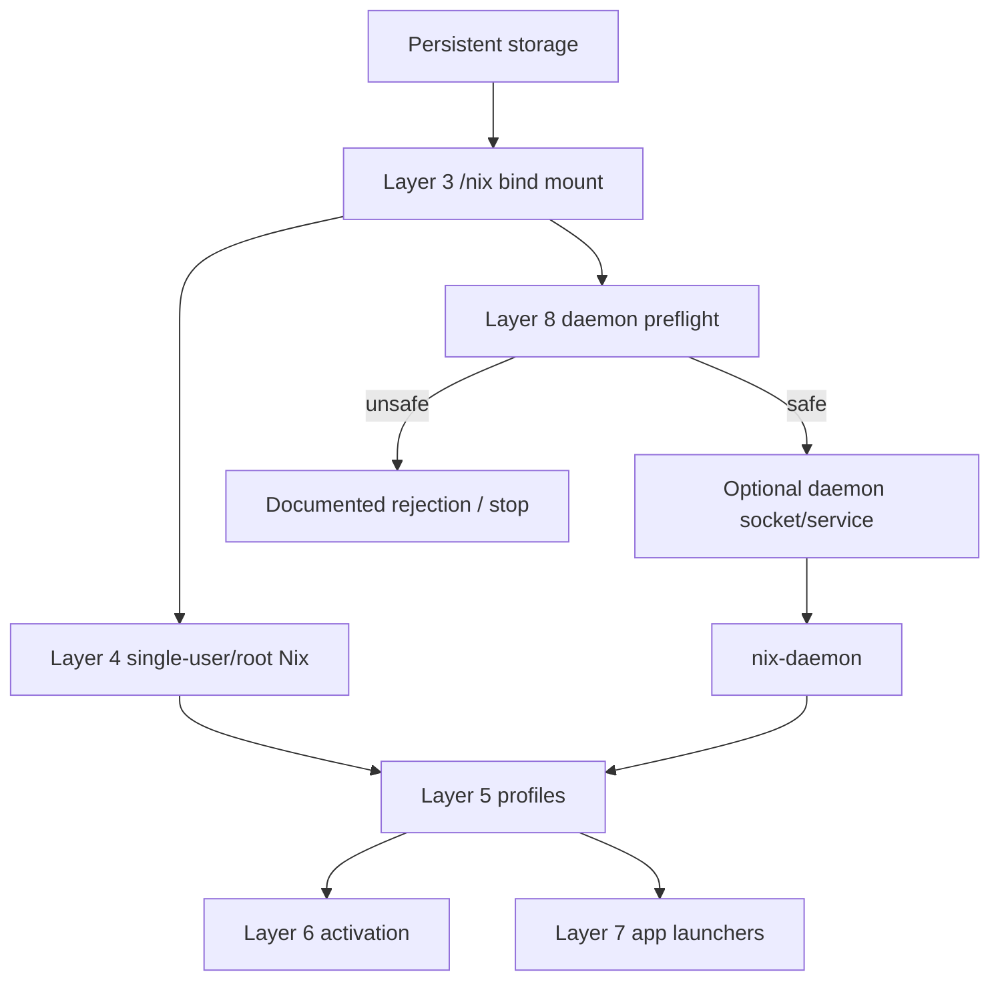

# feat: Add experimental Nix daemon mode for ROCKNIX

## Overview

Layer 8 explores whether ROCKNIX can safely run daemon-style Nix as an optional layer on top of the already validated storage-backed `/nix`, standard single-user/root Nix, persistent profiles, Layer 6 activation, and Layer 7 app launch path.

This is not a migration to NixOS and not a replacement for the working single-user model. The desired outcome is a clear keep/stop decision: either daemon mode works as a safe optional capability, or the experiment rejects it with enough evidence that future work can stop forcing `nix-daemon` into ROCKNIX and prefer the existing single-user layers or a future nspawn/NixOS guest approach.

## Problem Frame

Layers 4-7 now provide real practical Nix value on SM8550 without a daemon: normal Nix commands, profile-installed CLI tools, reversible storage-local launchers, and a Nix-profile Chromium launched under ROCKNIX Sway. Daemon mode is the remaining question from the layered plan because it may unlock more standard multi-user Nix behavior, but it also introduces the highest ROCKNIX integration risk: systemd socket/service ordering, build identities, daemon configuration outside `/etc`, and failure isolation during boot.

The plan treats daemon mode as an experiment behind explicit opt-in controls. It must preserve SSH recovery, the EmulationStation/Sway service chain, Steam/FEX behavior, Chromium/Layer 7 app behavior, and the ability to fall back to Layer 4 single-user/root Nix.

## Requirements Trace

- R1. Preserve ROCKNIX as the base OS owner for boot, kernel, firmware, image updates, EmulationStation, and Sway.
- R2. Keep Layer 8 independently testable, reversible, and opt-in.
- R3. Prove a usable daemon outcome: a Nix client communicates with `nix-daemon` and runs a trivial cached package.
- R4. Keep all mutable daemon config/state under `/storage` or `/nix`, never under read-only `/etc`, `/usr`, `/flash`, or boot surfaces.
- R5. Add daemon diagnostics to `nixctl status` and `nix-doctor` before relying on hardware validation.
- R6. Preserve Layer 4 single-user/root Nix as the fallback path when daemon mode is disabled or rejected.
- R7. Refuse or clearly report missing build identity/config prerequisites instead of silently starting an unsafe daemon.
- R8. Validate reboot behavior and failure isolation before marking Layer 8 usable.
- R9. Document a stopping rule if ROCKNIX's trimmed systemd/user model makes daemon mode too fragile.

## Scope Boundaries

- This plan does not make daemon mode the default Nix path.
- This plan does not replace the existing Layer 4 `nixctl install --no-daemon` path.
- This plan does not require Layer 6 or Layer 7 to depend on the daemon.
- This plan does not manage ROCKNIX services, UI startup, Steam/FEX, ROMs, saves, browser profiles, kernel modules, firmware, `/usr`, `/flash`, or boot files through Nix.
- This plan does not run arbitrary untrusted flakes as root during validation.
- This plan does not attempt full NixOS-style system management on the ROCKNIX host.

### Deferred to Separate Tasks

- NixOS-style daemon behavior inside an nspawn guest: separate Layer 9/nspawn work.
- Remote builders or substituter policy beyond cache.nixos.org: future optimization/security work if daemon mode survives.
- Autostarting Nix-managed apps or adding Ports/catalog UI entries: future Layer 7+ work, not daemon validation.

## Context & Research

### Relevant Code and Patterns

- `projects/ROCKNIX/packages/tools/nix-integration/package.mk` currently installs Nix integration scripts, creates the `/nix` mountpoint, and enables `nix-storage-setup.service` plus `nix.mount`.
- `projects/ROCKNIX/packages/tools/nix-integration/system.d/nix.mount` already orders `Before=nix-daemon.service`, anticipating Layer 8.
- `projects/ROCKNIX/packages/tools/nix-integration/system.d/nix-storage-setup.service` prepares `/storage/.nix-root` before the `/nix` bind mount.
- `projects/ROCKNIX/packages/tools/nix-integration/scripts/nixctl` owns Layer 4 lifecycle and currently writes `build-users-group =` for the single-user/root model.
- `projects/ROCKNIX/packages/tools/nix-integration/scripts/nix-doctor` already checks Layer 3 mount state, Layer 4 Nix health, profile state, Layer 6 activation, and Layer 7 readiness.
- `config/functions` exposes image-time `add_user` and `add_group` helpers. Existing packages such as `packages/audio/pipewire/package.mk` and `projects/ROCKNIX/packages/sysutils/systemd/package.mk` use those helpers for system users/groups.
- `projects/ROCKNIX/packages/sysutils/systemd/package.mk` shows ROCKNIX systemd is intentionally trimmed: several subsystems are disabled, including `sysusers`, `machined`, `homed`, and many optional services.
- `documentation/PER_DEVICE_DOCUMENTATION/SM8550/NIX_EXPERIMENT.md` says Layer 8 should not start unless single-user/root Nix, persistent profiles, managed activation, and app/UI experiments produce a clear reason to accept daemon complexity.

### Institutional Learnings

- `docs/solutions/developer-experience/nix-layer-5-persistent-profiles-rocknix-2026-05-05.md`: standard `nix profile` already provides persistent CLI tools; daemon mode must justify itself beyond profile convenience.
- `docs/solutions/developer-experience/nix-layer-6-managed-user-environment-rocknix-2026-05-05.md`: activation must track ownership and refuse unsafe storage conflicts. Daemon work should preserve this safety posture and not broaden managed surfaces implicitly.
- `docs/solutions/developer-experience/nix-layer-7-app-ui-experiments-rocknix-2026-05-05.md`: app/UI compatibility is package-specific. Daemon success must not be treated as proof that graphical packages work broadly.
- `docs/solutions/runtime-errors/rocknix-nix-profiled-path-reset-2026-05-05.md`: profile ordering matters because ROCKNIX's BusyBox profile reset can undo earlier PATH changes. Daemon-related profile snippets must preserve the `998-nix-integration.conf` ordering contract.

### External References

- Nix reference manual installation guidance: Linux multi-user Nix commonly uses `nix-daemon` and build users, whereas single-user install remains a simpler fallback.
- Upstream Nix `install-multi-user.sh` and `install-systemd-multi-user.sh`: multi-user Nix expects `/nix/var/nix/daemon-socket`, build users/groups, daemon/socket units, and service initialization that assumes a conventional writable system configuration path.

## Key Technical Decisions

| Decision | Rationale |
|---|---|
| Keep daemon mode opt-in and disabled by default | Layer 4-7 already work; daemon failures should not affect normal Nix use or boot. |
| Add a preflight/feasibility gate before enabling any unit | Build identities, config paths, and socket paths are structural prerequisites and should fail early with specific messages. |
| Use image-time users/groups only if required and safe | ROCKNIX has `add_user`/`add_group` helpers at build time, but no runtime user-management path should be invented under `/storage`. |
| Keep daemon config storage-backed | `/etc` is read-only; daemon configuration must live under `/storage` or another supported persistent path and be explicitly referenced by the service. |
| Preserve the current single-user config as fallback | Existing `build-users-group =` behavior is correct for root/single-user Nix and should remain recoverable after daemon disablement. |
| Prefer socket activation only after ordering is proven | Socket activation is standard for Nix daemon, but the socket must not start before `/nix` is mounted. |
| Treat failure isolation as a pass/fail criterion | A daemon that works but degrades SSH, Sway, EmulationStation, Steam/FEX, or Chromium is not acceptable. |
| Make rejection a valid outcome | If build identities or service ordering are too fragile, the plan should document rejection rather than force daemon mode. |

## Open Questions

### Resolved During Planning

- Should Layer 8 be required for Layer 6 or Layer 7? No. Layers 6 and 7 are already validated on the single-user/root model.
- Should daemon units be enabled by the package automatically? No. The package may ship units, but daemon activation must be explicit and opt-in.
- Should runtime scripts create build users/groups? No. Build identities, if needed, belong in image-time package integration using ROCKNIX's existing `add_user`/`add_group` helpers.
- Should daemon failure block boot? No. Daemon units must be optional and isolated from core UI/recovery targets.

### Deferred to Implementation

- Exact daemon configuration environment: implementation must verify which Nix-supported config mechanism works for a daemon on ROCKNIX without writing `/etc/nix/nix.conf`.
- Exact build user count and UID/GID range: implementation should choose image-time identities only after confirming upstream Nix daemon requirements and avoiding conflicts with existing ROCKNIX IDs.
- Whether the existing official Nix tarball includes usable `nix-daemon` binaries and unit templates for this environment: verify from the installed Nix closure on device.
- Whether socket activation or direct service start is more reliable on ROCKNIX's trimmed systemd: validate on hardware before declaring the preferred mode.
- Whether daemon mode materially improves any current workflow: validate after the basic daemon works; if not, document it as unnecessary.

## Success Metrics

- `nixctl status` can distinguish inactive, eligible, enabled, running, failed, unsupported, and rejected Layer 8 states.
- `nix-doctor --offline` can evaluate daemon prerequisites without starting daemon mode or requiring network access.
- An opt-in hardware run proves a Nix client can communicate with `nix-daemon` and run a trivial cached package.
- Reboot verification proves daemon mode can survive restart or be cleanly disabled afterward.
- Failure validation proves daemon startup failure does not affect boot, SSH, Sway, EmulationStation, Steam/FEX, Chromium, or Layer 4 single-user Nix.
- If daemon mode is rejected, the docs identify the exact blocker and recommended fallback path.

## Dependencies / Prerequisites

- Layer 3 persistent `/nix` bind mount is present and healthy.
- Layer 4 standard single-user/root Nix is installed and remains recoverable.
- Layer 5 profile behavior is known-good so daemon validation can compare against existing profile state.
- SSH recovery is available before hardware daemon smoke starts.
- The device is in a state where daemon failure can be tolerated and recovered without data-preservation concerns beyond `/storage` cleanup.
- Any SM8550 full-image update or reboot into updater still follows the established ABL-slot precheck discipline.

## Alternative Approaches Considered

| Approach | Why not chosen for Layer 8 |
|---|---|
| Keep Layers 4-7 only | This may be the final answer, but Layer 8 exists to gather enough evidence to decide rather than assume. |
| Enable daemon units automatically with the package | Too risky: package inclusion would change boot/service behavior before hardware validation. |
| Create `nixbld` users/groups at runtime under `/storage` | Conflicts with ROCKNIX's image-owned user model and creates unclear identity persistence semantics. |
| Write daemon config into `/etc/nix` | `/etc` is part of the read-only base image/runtime surface and should not be mutated by Layer 8. |
| Move straight to nspawn/NixOS guest | Likely cleaner for full daemon-backed NixOS behavior, but it answers a larger Layer 9 question and should not obscure whether host daemon mode is feasible. |

## High-Level Technical Design

> *This illustrates the intended approach and is directional guidance for review, not implementation specification. The implementing agent should treat it as context, not code to reproduce.*

Layer 8 introduces a new optional state that sits beside, not underneath, the existing single-user model:



Daemon mode should have explicit states in diagnostics:

| State | Meaning | Expected operator action |
|---|---|---|
| `unsupported` | Required daemon prerequisites are structurally missing | Stop Layer 8 or rebuild with missing image-time support. |
| `available` | Real Nix and `/nix` exist; daemon units/config are present but disabled | Single-user Nix remains primary; opt in only for validation. |
| `enabled` | Daemon socket/service activation has been requested | Run doctor and hardware smoke before reboot validation. |
| `running` | Client can reach the daemon and run a trivial package | Proceed to reboot/failure-isolation validation. |
| `failed` | Daemon unit/socket/config failed | Preserve Layer 4 fallback and report rollback instructions. |
| `rejected` | Evidence shows daemon mode is not worth pursuing | Document the stop decision and keep Layers 4-7. |

## Implementation Units

- [x] **Unit 1: Add Layer 8 feasibility and stop-gate diagnostics**

**Goal:** Teach `nixctl` and `nix-doctor` to report whether daemon mode is even eligible before any daemon unit is enabled.

**Requirements:** R2, R5, R6, R7, R9

**Dependencies:** Existing Layer 3/4 status checks.

**Files:**
- Modify: `projects/ROCKNIX/packages/tools/nix-integration/scripts/nixctl`
- Modify: `projects/ROCKNIX/packages/tools/nix-integration/scripts/nix-doctor`
- Test: `projects/ROCKNIX/packages/tools/nix-integration/tests/nix-integration-static-checks.sh`
- Test: `projects/ROCKNIX/packages/tools/nix-integration/tests/nix-integration-runtime-smoke.sh`
- Modify: `documentation/PER_DEVICE_DOCUMENTATION/SM8550/NIX_EXPERIMENT.md`

**Approach:**
- Add a Layer 8 status section that is read-only by default.
- Report real Nix binary availability, `/nix` mount state, daemon binary presence, daemon unit presence, daemon socket path expectations, build-users-group configuration, and known fallback status.
- Add explicit statuses for `available`, `unsupported`, `enabled`, `running`, and `failed` rather than a vague boolean.
- Keep checks offline-capable where possible; network/package execution can remain opt-in hardware validation.
- Include a stop-gate message when build users/groups, config path support, or unit ordering are missing.

**Patterns to follow:**
- Existing `nixctl status` Layer 4-7 sections.
- Existing `nix-doctor --offline` style: warn for inactive optional layers, fail only when an active layer is inconsistent.

**Test scenarios:**
- Happy path: With no daemon files present, status reports Layer 8 as inactive/available or unsupported without failing Layer 4-7 checks.
- Happy path: With fake daemon unit fixtures in temporary paths, runtime smoke reports the expected Layer 8 state without touching real `/storage` surfaces.
- Edge case: If `/nix` is not mounted, Layer 8 status reports the missing Layer 3 prerequisite and preserves Layer 4 fallback messaging.
- Edge case: If the daemon binary is absent from the Nix installation, doctor reports that daemon validation cannot proceed.
- Error path: If active daemon metadata exists but units are missing, doctor fails the active Layer 8 state and prints rollback guidance.
- Integration: Existing Layer 5, Layer 6, and Layer 7 status output remains unchanged when daemon mode is inactive.

**Verification:**
- Operators can run status/doctor before enabling daemon mode and get a clear go/no-go decision with fallback guidance.

- [x] **Unit 2: Define the daemon build identity and configuration model**

**Goal:** Establish the minimum safe image-time identity/config support needed for daemon mode, or reject daemon mode if ROCKNIX cannot provide it cleanly.

**Requirements:** R4, R6, R7, R9

**Dependencies:** Unit 1 diagnostics.

**Files:**
- Modify: `projects/ROCKNIX/packages/tools/nix-integration/package.mk`
- Test: `projects/ROCKNIX/packages/tools/nix-integration/tests/nix-integration-static-checks.sh`
- Modify: `documentation/PER_DEVICE_DOCUMENTATION/SM8550/NIX_EXPERIMENT.md`

**Approach:**
- Use ROCKNIX image-time helpers for any required `nixbld` group or `nixbld*` users; do not create identities at runtime.
- Choose IDs only after checking existing ROCKNIX user/group allocations to avoid collisions.
- Keep daemon configuration out of `/etc`; define a storage-backed config location that the daemon service can point to explicitly.
- Preserve the existing Layer 4 single-user `~/.config/nix/nix.conf` and avoid destructive rewrites when daemon mode is disabled.
- If a safe build identity/config path cannot be proven, mark Layer 8 as rejected in docs and diagnostics instead of continuing.

**Patterns to follow:**
- `config/functions` `add_user` / `add_group` conventions.
- `packages/audio/pipewire/package.mk` and `projects/ROCKNIX/packages/sysutils/systemd/package.mk` for image-time identity creation.
- Existing `nixctl` generated config comments and safety checks.

**Test scenarios:**
- Happy path: Static checks find daemon identity definitions only when Layer 8 support is intentionally enabled in the package.
- Happy path: Runtime smoke with fixture passwd/group data recognizes valid daemon build identities and reports daemon mode eligible.
- Edge case: If the selected UID/GID collides with existing ROCKNIX identities, static/runtime checks report the collision.
- Edge case: If daemon config is missing but daemon mode is inactive, doctor warns rather than failing.
- Error path: If daemon mode is active with missing build-users-group config, doctor fails Layer 8 and recommends disabling daemon mode.
- Integration: Layer 4 single-user/root Nix still reads its existing config when daemon mode is disabled.

**Verification:**
- Daemon identity and config prerequisites are explicit, testable, and reversible before any systemd unit can run.

- [x] **Unit 3: Add opt-in daemon socket/service units**

**Goal:** Ship `nix-daemon` systemd units that can be activated explicitly and that order correctly after storage-backed `/nix` is ready.

**Requirements:** R1, R2, R3, R4, R6, R8

**Dependencies:** Unit 2 identity/config model.

**Files:**
- Create: `projects/ROCKNIX/packages/tools/nix-integration/system.d/nix-daemon.socket`
- Create: `projects/ROCKNIX/packages/tools/nix-integration/system.d/nix-daemon.service`
- Modify: `projects/ROCKNIX/packages/tools/nix-integration/package.mk`
- Test: `projects/ROCKNIX/packages/tools/nix-integration/tests/nix-integration-static-checks.sh`
- Test: `projects/ROCKNIX/packages/tools/nix-integration/tests/nix-integration-runtime-smoke.sh`

**Approach:**
- Install daemon units without enabling them by default.
- Require and order after `nix.mount` so the daemon never starts against the squashfs mountpoint.
- Bind daemon configuration to the storage-backed config path chosen in Unit 2.
- Keep service failure local to Nix; it must not be required by boot, UI, SSH, Sway, EmulationStation, Steam/FEX, or Chromium services.
- Prefer socket activation if it proves reliable, but keep direct service validation as an implementation-time fallback if ROCKNIX socket activation behaves poorly.

**Patterns to follow:**
- `projects/ROCKNIX/packages/tools/nix-integration/system.d/nix.mount` ordering.
- Existing package `system.d` service files under `packages/` and `projects/ROCKNIX/packages/`.
- ROCKNIX service enablement conventions in `projects/ROCKNIX/packages/tools/nix-integration/package.mk`.

**Test scenarios:**
- Happy path: Static checks verify daemon units exist, are not enabled by default, and declare ordering after `nix.mount`.
- Happy path: Runtime smoke with a fixture unit tree recognizes daemon units and reports them inactive until explicitly enabled.
- Edge case: If `nix.mount` is missing or inactive, daemon unit checks report blocked startup rather than trying to start.
- Error path: If a daemon unit declares dependencies on core UI or SSH services, static checks reject the unit relationship.
- Error path: If the daemon service fails, systemd marks only the daemon unit failed and core ROCKNIX services remain outside the dependency chain.
- Integration: `nix.mount` keeps its existing Layer 3 behavior for single-user Nix when daemon units are absent or disabled.

**Verification:**
- Daemon units can be present in the image without changing default boot behavior, and their dependency graph is safe before hardware activation.

- [x] **Unit 4: Add explicit daemon lifecycle controls to `nixctl`**

**Goal:** Provide a single front door for enabling, disabling, preflighting, and inspecting daemon mode while preserving single-user fallback.

**Requirements:** R2, R3, R5, R6, R7, R8

**Dependencies:** Units 1-3.

**Files:**
- Modify: `projects/ROCKNIX/packages/tools/nix-integration/scripts/nixctl`
- Modify: `projects/ROCKNIX/packages/tools/nix-integration/scripts/nix-doctor`
- Test: `projects/ROCKNIX/packages/tools/nix-integration/tests/nix-integration-runtime-smoke.sh`
- Modify: `documentation/PER_DEVICE_DOCUMENTATION/SM8550/NIX_EXPERIMENT.md`

**Approach:**
- Add a narrow `nixctl daemon` command group for status/preflight/enable/disable/rollback semantics.
- Make preflight mandatory before enable; enable should refuse if Layer 3, Layer 4, identity, config, or unit prerequisites are missing.
- Record daemon activation metadata under `/storage/.config/nix-integration/layer8` so doctor can distinguish inactive, active, failed, and partially enabled states.
- Disable should stop units, remove activation metadata, restore single-user config expectations, and leave `/nix` plus profile-installed packages intact.
- Rollback should be safe after partial activation and should not remove unrelated Nix store/profile state.

**Patterns to follow:**
- `nixctl user-env` dispatch pattern for a separate lifecycle surface.
- Layer 6 ownership/state metadata model, adapted to daemon activation metadata rather than managed files.
- Layer 4 uninstall guardrails that refuse destructive cleanup while higher layers are active.

**Test scenarios:**
- Happy path: `daemon preflight` reports eligible when all fixture prerequisites are present.
- Happy path: `daemon disable` returns the system to inactive Layer 8 state without changing Layer 4/5 profile status.
- Edge case: Running enable twice is idempotent or clearly reports that daemon mode is already active.
- Edge case: Disabling daemon mode when it is already inactive is safe and leaves single-user Nix untouched.
- Error path: Enable refuses when Layer 6/7 are active only if their active files would depend on daemon-only behavior; otherwise it preserves them and reports the dependency decision.
- Error path: Partial activation leaves recoverable metadata and doctor recommends rollback rather than manual deletion.
- Integration: `nixctl status` shows daemon state alongside existing Layer 4-7 sections without hiding profile/app readiness.

**Verification:**
- Operators can opt into and out of daemon mode through `nixctl` without hand-editing units or losing the existing single-user Nix installation.

- [x] **Unit 5: Add daemon smoke and reboot validation paths**

**Goal:** Extend static/runtime smoke coverage so daemon mode can be validated safely in CI-like temporary fixtures and opt-in hardware runs.

**Requirements:** R2, R3, R5, R7, R8

**Dependencies:** Units 1-4.

**Files:**
- Modify: `projects/ROCKNIX/packages/tools/nix-integration/tests/nix-integration-static-checks.sh`
- Modify: `projects/ROCKNIX/packages/tools/nix-integration/tests/nix-integration-runtime-smoke.sh`
- Modify: `projects/ROCKNIX/packages/tools/nix-integration/scripts/nix-doctor`
- Modify: `documentation/PER_DEVICE_DOCUMENTATION/SM8550/NIX_EXPERIMENT.md`

**Approach:**
- Keep default runtime smoke non-destructive and fixture-based.
- Add opt-in hardware smoke guarded by an explicit environment flag such as `LAYER8_SMOKE=1`.
- Add prepare/verify reboot modes only after the initial hardware daemon smoke passes.
- Hardware smoke should prove client-to-daemon communication, a trivial cached package, daemon status in `nixctl`, and doctor health.
- Verification should include cleanup/disable so Layer 8 does not remain active unintentionally after reboot validation.

**Patterns to follow:**
- Layer 5, Layer 6, and Layer 7 opt-in smoke/reboot verification structure.
- Current runtime smoke safety overrides for active higher layers.

**Test scenarios:**
- Happy path: Default runtime smoke exercises Layer 8 fixture checks without starting systemd units or writing real daemon state.
- Happy path: Opt-in hardware smoke validates daemon client communication and reports Layer 8 running.
- Happy path: Reboot prepare leaves daemon mode active intentionally; reboot verify confirms the daemon is still healthy and then disables it.
- Edge case: If `/tmp` test trees are lost after reboot, docs remind operators to recopy the test tree before verify.
- Error path: If daemon client communication fails, smoke reports daemon logs/status and preserves single-user Nix fallback.
- Error path: If daemon starts before `/nix` is mounted, validation fails the ordering contract.
- Integration: During daemon smoke, SSH remains connected/recoverable and Sway/EmulationStation remain unaffected.

**Verification:**
- Layer 8 has the same evidence quality as Layers 5-7: static checks, safe default runtime smoke, opt-in hardware smoke, reboot verification, and cleanup.

- [x] **Unit 6: Document hardware findings, rollback, and the keep/reject decision**

**Goal:** Capture the final Layer 8 outcome so future work knows whether daemon mode is a supported optional layer or a rejected path.

**Requirements:** R1, R2, R6, R8, R9

**Dependencies:** Unit 5 hardware validation or explicit feasibility rejection.

**Files:**
- Modify: `docs/plans/2026-04-28-001-feat-layered-nix-integration-plan.md`
- Modify: `docs/plans/2026-04-28-002-nix-layers-3-plus-handoff.md`
- Modify: `documentation/PER_DEVICE_DOCUMENTATION/SM8550/NIX_EXPERIMENT.md`
- Create: `docs/solutions/developer-experience/nix-layer-8-daemon-mode-rocknix-2026-05-05.md`

**Approach:**
- Document the exact hardware state validated: device, branch, Nix version, daemon state, profile state, and reboot outcome.
- Record whether daemon mode is useful enough to keep or should be rejected in favor of Layers 4-7 and future nspawn work.
- Keep rollback instructions next to validation instructions: disable daemon, restore single-user config, verify Layer 4/5 status, and avoid deleting `/nix` unless doing a full reset.
- If daemon mode is rejected, update plans/docs with the reason and the recommended alternative.

**Patterns to follow:**
- `docs/solutions/developer-experience/nix-layer-7-app-ui-experiments-rocknix-2026-05-05.md` for validation evidence structure.
- SM8550 Nix experiment documentation sections for layer-specific smoke and stopping rules.

**Test scenarios:**
- Test expectation: none -- documentation-only unit. Completion is reviewed by checking that validation evidence, rollback, and keep/reject state are present and consistent across docs.

**Verification:**
- Future agents can tell whether Layer 8 should be used, repeated, or avoided without replaying the whole investigation.

## System-Wide Impact

- **Interaction graph:** Layer 8 touches image package identity definitions, optional systemd units, `/nix` mount ordering, daemon configuration, `nixctl`, `nix-doctor`, runtime smoke tests, and SM8550 operational docs.
- **Error propagation:** Daemon failures should stay inside Layer 8 diagnostics and systemd unit state. They must not propagate into boot-critical targets, SSH, Sway, EmulationStation, Steam/FEX, Chromium, Layer 6 activation, or Layer 7 launcher cleanup.
- **State lifecycle risks:** Daemon mode may create daemon sockets, logs, temp roots, gcroots, per-user profiles, and build-user-owned paths under `/nix/var/nix`. Cleanup must distinguish daemon activation state from the shared Nix store/profile state.
- **API surface parity:** `nixctl status`, `nixctl daemon`, and `nix-doctor` must agree on daemon states and rollback recommendations.
- **Integration coverage:** Unit-level fixture tests are not enough; hardware validation must include client-to-daemon behavior, reboot persistence, failure isolation, and fallback to single-user Nix.
- **Unchanged invariants:** ROCKNIX still owns boot, kernel, firmware, updates, default UI startup, Steam/FEX integration, and base packages. Nix daemon mode is optional infrastructure only.

```mermaid
flowchart TB
  Package[image package]
  Identities[optional build identities]
  Mount[/nix mount]
  Config[storage daemon config]
  Socket[nix-daemon.socket]
  Service[nix-daemon.service]
  Nixctl[nixctl daemon/status]
  Doctor[nix-doctor]
  Smoke[Layer 8 smoke]
  Base[ROCKNIX boot/UI/SSH]
  Fallback[Layer 4 single-user fallback]

  Package --> Identities
  Package --> Socket
  Package --> Service
  Mount --> Socket
  Mount --> Service
  Config --> Service
  Nixctl --> Socket
  Nixctl --> Service
  Doctor --> Config
  Doctor --> Socket
  Doctor --> Service
  Smoke --> Nixctl
  Smoke --> Doctor
  Socket -.must not require.-> Base
  Service -.must not require.-> Base
  Service -.preserve.-> Fallback
```

## Risks & Dependencies

| Risk | Likelihood | Impact | Mitigation |
|------|------------|--------|------------|
| ROCKNIX user/group model cannot safely support Nix build users | Medium | High | Gate identity creation in Unit 2; reject Layer 8 if safe image-time identities are not possible. |
| Daemon reads the wrong config because `/etc/nix` is read-only or absent | Medium | High | Require an explicit storage-backed daemon config path and test daemon-visible settings before enabling. |
| Socket starts before `/nix` is mounted | Medium | High | Require ordering after `nix.mount`; make this a static and hardware smoke assertion. |
| Daemon failure affects boot/UI services | Low/Medium | Critical | Do not add daemon to core target dependency chains; validate failure isolation on hardware. |
| Daemon state cleanup deletes useful Layer 4/5 profile/store data | Medium | High | Separate Layer 8 activation metadata from `/nix` store/profile cleanup; disable daemon without removing `/nix`. |
| Daemon mode provides no practical benefit over Layers 4-7 | High | Low/Medium | Make rejection a valid documented outcome; do not keep daemon mode merely because it can start. |
| Hardware validation leaves daemon enabled unintentionally | Medium | Medium | Reboot verify should disable daemon after success unless explicitly told to keep it active. |
| Build identity UID/GID choices collide with ROCKNIX packages | Low/Medium | Medium | Check existing `add_user`/`add_group` allocations and add static collision checks. |

## Documentation / Operational Notes

- Mark Layer 8 as experimental in all user-facing docs until repeated hardware validation proves it safe.
- Keep Layer 4 uninstall guarded when Layer 8 is active, because daemon state may depend on `/nix`.
- Document the exact rollback order: disable daemon, verify single-user Nix, then decide whether to keep or remove `/nix`.
- For SM8550 full image updates, keep the existing ABL-slot precheck discipline before rebooting into updater.
- If Layer 8 is rejected, update docs to say so plainly rather than leaving it as perpetually pending work.

## Sources & References

- Related plan: `docs/plans/2026-04-28-001-feat-layered-nix-integration-plan.md`
- Related handoff: `docs/plans/2026-04-28-002-nix-layers-3-plus-handoff.md`
- Related plan: `docs/plans/2026-05-05-003-feat-nix-layer-7-app-ui-experiments-plan.md`
- Related solution: `docs/solutions/developer-experience/nix-layer-5-persistent-profiles-rocknix-2026-05-05.md`
- Related solution: `docs/solutions/developer-experience/nix-layer-6-managed-user-environment-rocknix-2026-05-05.md`
- Related solution: `docs/solutions/developer-experience/nix-layer-7-app-ui-experiments-rocknix-2026-05-05.md`
- Related code: `projects/ROCKNIX/packages/tools/nix-integration/package.mk`
- Related code: `projects/ROCKNIX/packages/tools/nix-integration/system.d/nix.mount`
- Related code: `projects/ROCKNIX/packages/tools/nix-integration/system.d/nix-storage-setup.service`
- Related code: `projects/ROCKNIX/packages/tools/nix-integration/scripts/nixctl`
- Related code: `projects/ROCKNIX/packages/tools/nix-integration/scripts/nix-doctor`
- Related code: `config/functions`
- Related code: `packages/audio/pipewire/package.mk`
- Related code: `projects/ROCKNIX/packages/sysutils/systemd/package.mk`
- External docs: `https://nix.dev/manual/nix/latest/installation`
- External code: `https://github.com/NixOS/nix/blob/master/scripts/install-multi-user.sh`
- External code: `https://github.com/NixOS/nix/blob/master/scripts/install-systemd-multi-user.sh`
