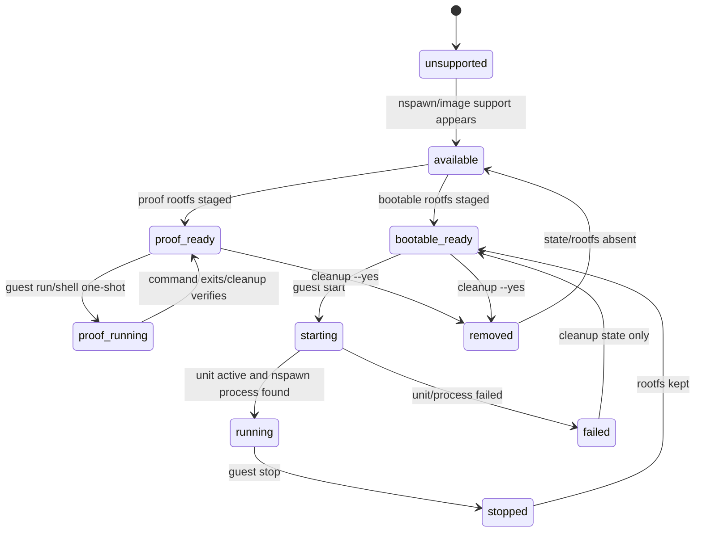
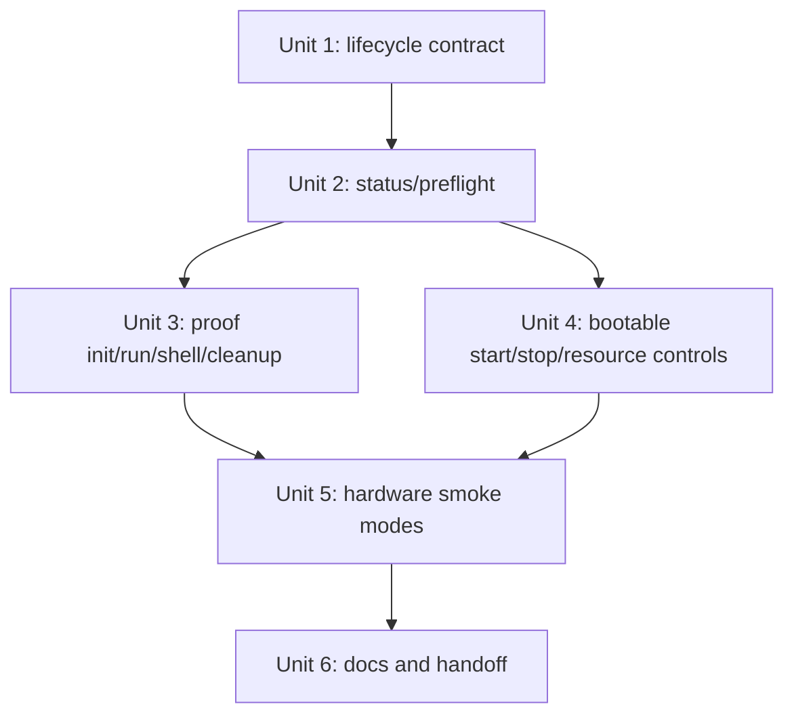
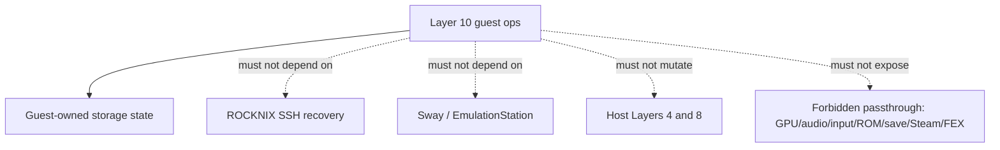

# feat: Add Layer 10 managed nspawn guest operations

## Overview

Layer 10 turns the successful Layer 9 `systemd-nspawn` proof into a small, opt-in, reversible guest operations surface. The goal is not to make ROCKNIX a NixOS host and not to expose game/UI hardware into the guest. The goal is to let an operator prepare, inspect, run, stop, shell into, and clean up a storage-backed guest with clear safety rails.

Layer 10 should introduce `nixctl guest ...` as the supported control surface and extend `nix-doctor` from Layer 9 readiness reporting into lifecycle health reporting. It should preserve the Layer 9 invariants: no boot autostart, no dependency from SSH/Sway/EmulationStation to the guest, no GPU/audio/input/ROM/save/Steam/FEX passthrough, no host service takeover, and cleanup that touches only guest-owned state.

The core design distinction is that ROCKNIX now has two possible guest rootfs shapes:

| Rootfs mode | Example rootfs | Supported operations in Layer 10 | Not supported |
|---|---|---|---|
| `proof` | Minimal on-device nix+bash closure under `/storage/machines/rocknix-guest` | `status`, `preflight`, `run`, `shell`, `cleanup` | Long-running `start`/`stop` as a booted guest |
| `bootable` | NixOS/container-style rootfs with an init/systemd entry point | `status`, `preflight`, `start`, `stop`, `run`/`shell` where safe, `cleanup` | Any graphical/audio/input passthrough |

This prevents Layer 10 from over-promising lifecycle management for the Layer 9 proof rootfs. A minimal rootfs can prove command execution; a bootable rootfs is required before `nixctl guest start` can manage a long-running service.

## Problem Frame

Layer 9 proved on `thor` that a custom ROCKNIX image can preserve `/usr/bin/systemd-nspawn`, run a one-shot command inside a staged guest rootfs with `--register=no`, and leave the host healthy afterward. That proof was intentionally manual and bounded. The next problem is operational repeatability: future experiments should not require hand-written nspawn commands, ad hoc process cleanup, or ambiguous state interpretation.

The management layer must be conservative because SSH recovery and game performance are hard constraints. A failed guest should be a stopped guest plus a useful error message, not a broken boot, inaccessible SSH session, or mystery background workload. Layer 10 therefore manages the guest as a sidecar workload under `/storage`, not as a replacement for any ROCKNIX host service.

## Requirements Trace

- R1. Add a supported `nixctl guest` command surface for guest status, preflight, init/register, run/shell, start, stop, and cleanup.
- R2. Preserve all Layer 9 safety boundaries: no autostart, no enabled guest unit by default, no host boot/UI/recovery dependency, no forbidden passthrough.
- R3. Distinguish proof rootfs from bootable rootfs so `start` refuses non-bootable roots instead of failing obscurely.
- R4. Keep all Layer 10 mutable state under `/storage/.config/nix-integration/layer10` and guest rootfs state under `/storage/machines/rocknix-guest` by default.
- R5. Use standalone `systemd-nspawn --register=no`; do not depend on `machinectl` or `systemd-machined` because ROCKNIX builds systemd with `machined=false`.
- R6. Provide resource-control defaults for long-running bootable guests so accidental guest work is bounded during normal ROCKNIX use.
- R7. Make start/stop/cleanup idempotent and safe to retry after partial failures.
- R8. Extend `nix-doctor --offline` and `nixctl status` so guest lifecycle health is readable without mutating state.
- R9. Add static and runtime fixture coverage before hardware validation.
- R10. Validate on hardware only after the current `custom` image baseline is confirmed healthy, since Layer 10 depends on the merged Layer 9 image-first floor.

## Scope Boundaries

- This plan does not remove or replace ROCKNIX SSH. Host SSH remains the recovery path.
- This plan does not start the guest during boot or enable a guest unit by default.
- This plan does not add guest-backed app launchers, Ports entries, desktop entries, browser bridges, or service bridges.
- This plan does not pass through `/dev/dri`, audio sockets/devices, `/dev/input`, Wayland/Sway sockets, ROM directories, save directories, Steam state, FEX state, or browser profiles.
- This plan does not make the guest own host services such as SSH, networking, Sway, EmulationStation, Steam, FEX, update, firmware, or kernel modules.
- This plan does not implement declarative host/guest profiles.
- This plan does not implement guest rootfs update/rollback as a product feature. It reserves state metadata needed for later update/rollback work, but cleanup remains the only destructive operation in this layer.

### Deferred to Separate Tasks

- Layer 11: guest-backed app/service bridges, including any alternate-port guest SSH experiment.
- Layer 12: declarative host/guest profiles and reproducible rootfs/service declarations.
- Layer 13+: any primary host service takeover or removal of ROCKNIX-provided recovery services.
- Layer 10b or Layer 12: guest rootfs update/rollback, once the rootfs provenance format is stable.

## Context & Research

### Relevant Code and Patterns

- `projects/ROCKNIX/packages/tools/nix-integration/scripts/nixctl` is the existing operator front door for Layers 4-9. It already has nested command patterns for `user-env` and `daemon` actions, status printing, idempotent state transitions, environment overrides, and safety-first messaging.
- `projects/ROCKNIX/packages/tools/nix-integration/scripts/nix-doctor` mirrors `nixctl` readiness logic for layered health checks and already includes Layer 9 functions such as `layer9_state`, `layer9_eligibility`, and `layer9_running`.
- `projects/ROCKNIX/packages/tools/nix-integration/tests/nix-integration-runtime-smoke.sh` uses fixtureable fake binaries, fake state directories, fake systemctl, and opt-in hardware smoke flags. Layer 10 should follow that pattern rather than making default CI start real containers.
- `projects/ROCKNIX/packages/tools/nix-integration/tests/nix-integration-static-checks.sh` asserts package shape and important safety contracts. Layer 10 should add explicit checks that guest units are not enabled and that nspawn invocations include `--register=no`.
- `projects/ROCKNIX/packages/tools/nix-integration/docs/layer9-nspawn-guest-contract.md` defines the current guest safety boundary. Layer 10 should create a lifecycle contract that extends it without weakening forbidden passthrough rules.
- `projects/ROCKNIX/packages/sysutils/systemd/package.mk` is the active ROCKNIX systemd override. Layer 10 should not change this unless hardware validation proves a missing packaged dependency; Layer 9 already added the `NIX_NSPAWN_SUPPORT` gate.
- `documentation/PER_DEVICE_DOCUMENTATION/SM8550/NIX_EXPERIMENT.md` is the device-facing operator record and should gain Layer 10 status/validation notes after implementation.

### Institutional Learnings

- `docs/solutions/developer-experience/nix-layer-9-nspawn-guest-proof-rocknix-2026-05-06.md`: patch the ROCKNIX systemd override, keep `--register=no`, validate no enabled unit and no guest process remains, and treat fallback as host health plus cleanup rather than feature equivalence.
- `docs/solutions/best-practices/stage-nspawn-rootfs-from-onboard-nix-closures-rocknix-2026-05-06.md`: the minimal nix+bash closure rootfs is useful for one-shot proof/run/shell, but it is not a full bootable NixOS guest.
- `docs/solutions/developer-experience/nix-layer-8-daemon-mode-rocknix-2026-05-05.md`: optional system-level behavior must be preflighted, reversible, and stored under `/storage`-owned config/state; boot and SSH must not depend on the optional layer.
- `docs/solutions/developer-experience/custom-fork-update-sm8550-rocknix-2026-05-04.md`: SM8550 full-image updates require ABL slot precheck before reboot into updater.
- `docs/solutions/runtime-errors/rocknix-nix-remote-copy-profile-store-mismatch-2026-05-05.md`: avoid ambiguous host/guest store coupling. Layer 10 should default to guest-local rootfs/store state and document any future shared-store variant separately.

### External References

- No new external research was required for this plan. The design is constrained primarily by already validated ROCKNIX-specific behavior: `machined=false`, `systemd-nspawn --register=no`, storage-local state, and the Layer 9 proof result.

## Key Technical Decisions

| Decision | Rationale |
|---|---|
| Add `nixctl guest` as a nested action family | Matches existing `nixctl daemon` and `nixctl user-env` operator patterns while keeping guest operations discoverable. |
| Use Layer 10 state dir separate from Layer 9 | Layer 9 remains a proof/readiness layer; Layer 10 owns lifecycle metadata under `/storage/.config/nix-integration/layer10`. |
| Treat proof and bootable rootfs modes differently | The Layer 9 minimal closure rootfs cannot be safely advertised as a booted long-running guest. Clear mode detection avoids confusing failures. |
| Generate or manage a disabled storage-local unit for bootable guests | A unit gives systemd-owned process tracking/resource controls without adding boot autostart. Storage-local generation supports live prototyping and clean removal. |
| Do not rely on machined or machinectl | ROCKNIX intentionally disables machined. All operations must use direct nspawn, systemctl for the service unit, ps/pid evidence, and optional namespace entry only if available. |
| Resource-control long-running guests by default | CPU/I/O/task/memory bounds protect game performance and host recoverability. Unsupported controls should be reported clearly rather than silently assumed. |
| Make cleanup conservative and path-gated | `cleanup` must refuse to remove paths outside the configured guest root and must never touch host `/nix`, Layer 6, Layer 8, ROMs, saves, Steam/FEX, or base OS state. |
| Defer update/rollback | Rootfs provenance is not stable enough yet. Premature update/rollback would expand the blast radius before lifecycle basics are hardware-proven. |

## Open Questions

### Resolved During Planning

- Should Layer 10 replace ROCKNIX SSH? No. Host SSH remains the recovery path.
- Should Layer 10 enable guest autostart? No. The unit should be disabled/not installable by default, and `start` remains manual.
- Should Layer 10 support the Layer 9 minimal proof rootfs? Yes, but only for `run`/`shell`/proof-style operations, not for long-running `start`.
- Should Layer 10 include GPU/audio/input passthrough? No. That belongs to Layer 11+ bridge work.
- Should Layer 10 require a rebuilt image for live prototyping? No. Most behavior can be prototyped with storage-local scripts and generated units, but the final shipped Layer 10 validation requires a rebuilt image.

### Deferred to Implementation

- Exact rootfs bootability heuristic: implementation should choose robust checks for init/systemd presence after inspecting actual bootable rootfs layouts.
- Exact namespace-entry mechanism for shelling into a running guest: use direct one-shot nspawn for stopped roots; only support running-guest shell if available host tools make it reliable without machined.
- Exact supported resource-control keys on ROCKNIX systemd 255.8: implementation should probe/report support during preflight and hardware validation.
- Exact unit file location resolution: follow ROCKNIX's patched systemd storage unit convention and make it fixtureable in tests.
- Whether the first hardware validation should use the existing minimal proof rootfs only or stage a real bootable NixOS/container rootfs as well. The plan assumes both modes should be tested if the bootable artifact is ready.

## Success Metrics

- `nixctl guest status` reports rootfs mode, bootability, running state, unit path, resource policy, and cleanup boundaries without mutating state.
- `nixctl guest preflight` distinguishes unsupported nspawn, missing kernel/cgroup prerequisites, missing rootfs, proof-only rootfs, and bootable rootfs.
- `nixctl guest run` or `nixctl guest shell` can execute a bounded command in the Layer 9 minimal proof rootfs using `--register=no`.
- `nixctl guest start` refuses proof-only roots with a clear message and starts only bootable roots.
- `nixctl guest stop` is idempotent and leaves no nspawn process for the configured root.
- `nixctl guest cleanup` removes only the configured guest root and Layer 10 metadata after explicit confirmation or `--yes`.
- `nix-doctor --offline` reports Layer 10 health and fails only on active unsafe states, not on absent optional guest state.
- Default boot after image update has no running guest and no enabled guest unit.
- SSH, Sway, EmulationStation, Layer 4, Layer 8, and host update behavior remain healthy before and after Layer 10 validation.

## Dependencies / Prerequisites

- The current `custom` image build from commit `198c045c2e` should be validated first because it merged Layer 9 and the image-first removal of nix-portable.
- Layer 9 support must be present on the target device: `/usr/bin/systemd-nspawn` exists and `nixctl status` reports Layer 9 `available` or `proof-ready`.
- The test device should have SSH recovery verified before any long-running guest start.
- `/storage` must have enough free space for the chosen guest rootfs and logs.
- Hardware validation should follow the established SM8550 ABL precheck discipline before any full image update.

## Alternative Approaches Considered

| Approach | Why not chosen |
|---|---|
| Keep Layer 10 as direct `systemd-nspawn` shell snippets only | Too easy to leave processes behind or forget safety flags; does not compound the Layer 9 proof into repeatable operations. |
| Use `machinectl` for shell/status | Not available because ROCKNIX builds systemd with `machined=false`. |
| Enable `systemd-nspawn@rocknix-guest.service` at boot | Violates the no-autostart and SSH/game-performance safety constraints. |
| Manage guest lifecycle entirely inside Nix | Premature. ROCKNIX must remain the host owner; `nixctl` is the host-side safety gate. |
| Implement update/rollback immediately | Rootfs provenance and snapshot strategy are not settled; cleanup and re-init are enough for this layer. |

## High-Level Technical Design

> *This illustrates the intended approach and is directional guidance for review, not implementation specification. The implementing agent should treat it as context, not code to reproduce.*

Layer 10 extends Layer 9's read-only status model into an explicit state machine:



The intended component interaction is:

```mermaid
flowchart TB
  Operator[nixctl guest command]
  Nixctl[nixctl guest dispatcher]
  State[Layer 10 state dir under /storage/.config/nix-integration/layer10]
  Rootfs[Guest root under /storage/machines/rocknix-guest]
  Unit[Disabled storage-local rocknix guest unit]
  Nspawn[/usr/bin/systemd-nspawn --register=no]
  Doctor[nix-doctor Layer 10 checks]
  Host[ROCKNIX host: SSH/Sway/EmulationStation/Layers 4-8]

  Operator --> Nixctl
  Nixctl --> State
  Nixctl --> Rootfs
  Nixctl --> Unit
  Unit --> Nspawn
  Nixctl --> Nspawn
  Doctor --> State
  Doctor --> Rootfs
  Doctor --> Unit
  Nspawn -. must not own .-> Host
```

## Implementation Units

- [x] **Unit 1: Define Layer 10 lifecycle contract**

**Goal:** Create the contract that distinguishes proof versus bootable roots, allowed commands, state ownership, resource policy, and forbidden surfaces before implementation expands the lifecycle surface.

**Requirements:** R2, R3, R4, R5, R6, R10

**Dependencies:** Layer 9 contract and proof docs exist.

**Files:**
- Create: `projects/ROCKNIX/packages/tools/nix-integration/docs/layer10-guest-lifecycle-contract.md`
- Modify: `projects/ROCKNIX/packages/tools/nix-integration/tests/nix-integration-static-checks.sh`
- Modify: `documentation/PER_DEVICE_DOCUMENTATION/SM8550/NIX_EXPERIMENT.md`

**Approach:**
- Define rootfs modes: `absent`, `proof`, `bootable`, `invalid`.
- Define Layer 10 state root: `/storage/.config/nix-integration/layer10`.
- Define default guest root: `/storage/machines/rocknix-guest`.
- Define command semantics for `status`, `preflight`, `init`, `run`, `shell`, `start`, `stop`, and `cleanup`.
- Explicitly preserve Layer 9 forbidden passthrough surfaces.
- Define that any service/unit is disabled by default and must not introduce boot dependencies.
- Define resource policy defaults and override boundaries at the contract level, without over-specifying exact implementation syntax.

**Patterns to follow:**
- `projects/ROCKNIX/packages/tools/nix-integration/docs/layer9-nspawn-guest-contract.md`
- `docs/solutions/developer-experience/nix-layer-9-nspawn-guest-proof-rocknix-2026-05-06.md`

**Test scenarios:**
- Static: contract doc exists and mentions `/storage/.config/nix-integration/layer10` and `/storage/machines/rocknix-guest`.
- Static: contract doc states `--register=no` and no `machinectl` dependency.
- Static: contract doc forbids autostart and forbidden passthrough surfaces.
- Static: contract doc distinguishes proof rootfs from bootable rootfs.

**Verification:**
- Reviewers can tell what Layer 10 is allowed to manage, what it must refuse, and which rootfs modes support which commands before reading implementation code.

- [x] **Unit 2: Add read-only Layer 10 status and preflight**

**Goal:** Extend `nixctl` and `nix-doctor` so operators can understand Layer 10 lifecycle readiness without starting, stopping, or deleting anything.

**Requirements:** R1, R3, R4, R5, R8, R9

**Dependencies:** Unit 1 complete.

**Files:**
- Modify: `projects/ROCKNIX/packages/tools/nix-integration/scripts/nixctl`
- Modify: `projects/ROCKNIX/packages/tools/nix-integration/scripts/nix-doctor`
- Modify: `projects/ROCKNIX/packages/tools/nix-integration/tests/nix-integration-runtime-smoke.sh`
- Modify: `projects/ROCKNIX/packages/tools/nix-integration/tests/nix-integration-static-checks.sh`

**Approach:**
- Add Layer 10 environment overrides following the Layer 8/9 style, for example `NIX_LAYER10_STATE_DIR`, `NIX_LAYER10_GUEST_ROOT`, `NIX_LAYER10_UNIT_NAME`, `NIX_LAYER10_SYSTEMD_DIR`, and `NIX_LAYER10_SKIP_KERNEL_CHECK`.
- Add `nixctl guest status` and `nixctl guest preflight` as read-only actions.
- Include Layer 10 summary in top-level `nixctl status`, but avoid noisy failures when no guest is configured.
- Reuse Layer 9 nspawn/kernel readiness checks where possible, but keep Layer 10 state/mode detection separate.
- Classify rootfs mode with explicit outcomes: absent, proof, bootable, invalid, running, failed.
- Report running state via unit state when available and process evidence as fallback; never require machined.
- Extend `nix-doctor` so inactive/absent Layer 10 is OK, while active-but-unsafe state can warn or fail with a Layer 10-specific message.

**Patterns to follow:**
- `layer9_state`, `layer9_eligibility`, and `print_layer9_status` in `projects/ROCKNIX/packages/tools/nix-integration/scripts/nixctl`
- Layer 8 daemon preflight/status patterns in `projects/ROCKNIX/packages/tools/nix-integration/scripts/nixctl`
- Existing fake nspawn and fake systemctl fixtures in `projects/ROCKNIX/packages/tools/nix-integration/tests/nix-integration-runtime-smoke.sh`

**Test scenarios:**
- Happy path: fake nspawn + proof rootfs -> `nixctl guest status` reports proof-ready/proof mode and `start` not eligible.
- Happy path: fake nspawn + bootable rootfs fixture -> `nixctl guest preflight` reports bootable-ready/start eligible.
- Edge case: nspawn missing -> status reports unsupported without failing unrelated Layers 4-9.
- Edge case: rootfs path exists but is a file -> status reports invalid and cleanup remains path-gated.
- Edge case: state says running but no process/unit evidence exists -> doctor warns about stale Layer 10 state.
- Error path: active unit/process evidence exists for the guest root -> doctor reports running state and reminds operator to stop after use.

**Verification:**
- Operators can run `nixctl status`, `nixctl guest status`, `nixctl guest preflight`, and `nix-doctor --offline` on a device with no guest, proof rootfs, bootable rootfs, or stale state and get clear non-mutating output.

- [x] **Unit 3: Implement proof-mode init, run/shell, and cleanup**

**Goal:** Make the Layer 9 minimal rootfs recipe repeatable enough for Layer 10 operators and provide safe one-shot command execution without requiring a bootable guest.

**Requirements:** R1, R2, R3, R4, R5, R7, R9

**Dependencies:** Units 1-2 complete.

**Files:**
- Modify: `projects/ROCKNIX/packages/tools/nix-integration/scripts/nixctl`
- Modify: `projects/ROCKNIX/packages/tools/nix-integration/scripts/nix-doctor`
- Modify: `projects/ROCKNIX/packages/tools/nix-integration/tests/nix-integration-runtime-smoke.sh`
- Modify: `projects/ROCKNIX/packages/tools/nix-integration/tests/nix-integration-static-checks.sh`
- Modify: `documentation/PER_DEVICE_DOCUMENTATION/SM8550/NIX_EXPERIMENT.md`

**Approach:**
- Add `nixctl guest init --proof` or equivalent wording that stages the minimal nix+bash closure rootfs from the host's real Nix store when Layer 4 is installed.
- Reuse the documented closure-staging strategy from `docs/solutions/best-practices/stage-nspawn-rootfs-from-onboard-nix-closures-rocknix-2026-05-06.md` but keep exact shell details implementation-owned.
- Add `nixctl guest run <command>` for bounded one-shot execution through `systemd-nspawn --register=no --directory=<root> ...`.
- Add `nixctl guest shell` as a convenience wrapper for one-shot shell entry when the guest is not already running.
- Refuse `run`/`shell` if a long-running guest is already active for the same root unless implementation provides a proven safe running-guest entry mechanism.
- Add `nixctl guest cleanup [--yes]` that removes only the configured guest root and Layer 10 state after path safety checks and confirmation.
- Keep proof-mode operations bounded with timeout/logging so failed commands do not leave an active guest process.

**Patterns to follow:**
- `nixctl uninstall --yes` confirmation/idempotency patterns in `projects/ROCKNIX/packages/tools/nix-integration/scripts/nixctl`
- Layer 9 `LAYER9_SMOKE=1` bounded proof pattern in `projects/ROCKNIX/packages/tools/nix-integration/tests/nix-integration-runtime-smoke.sh`
- `docs/solutions/best-practices/stage-nspawn-rootfs-from-onboard-nix-closures-rocknix-2026-05-06.md`

**Test scenarios:**
- Happy path: proof init with fake/fixture store paths creates expected rootfs shape and Layer 10 state metadata.
- Happy path: `guest run` against proof rootfs invokes fake nspawn with `--register=no`, configured root, bounded command, and records success state/log path.
- Happy path: `guest shell` against proof rootfs chooses the one-shot shell path and refuses to mutate host Nix state.
- Edge case: Layer 4 real Nix missing -> proof init refuses with a clear prerequisite message.
- Edge case: proof rootfs already exists -> init is idempotent or refuses unless explicit replace flag is used.
- Error path: nspawn command fails -> state records failed proof/run without leaving running state.
- Error path: cleanup target is `/`, `/storage`, `/nix`, or another unsafe path -> cleanup refuses.
- Cleanup: cleanup after success removes only guest root and Layer 10 metadata; host `/nix`, Layer 6, Layer 8, ROMs, saves, Steam/FEX remain untouched.

**Verification:**
- A Layer 9 proof rootfs can be initialized, used for a one-shot `nix --version` style command, and cleaned up through `nixctl guest` without manual nspawn commands.

- [x] **Unit 4: Add bootable guest unit generation, start, stop, and resource controls**

**Goal:** Support long-running bootable guest lifecycle while keeping the unit disabled, manually started, resource-bounded, and easy to stop.

**Requirements:** R1, R2, R3, R4, R5, R6, R7, R9

**Dependencies:** Units 1-3 complete; bootable rootfs fixture/artifact available for validation.

**Files:**
- Modify: `projects/ROCKNIX/packages/tools/nix-integration/scripts/nixctl`
- Modify: `projects/ROCKNIX/packages/tools/nix-integration/scripts/nix-doctor`
- Modify: `projects/ROCKNIX/packages/tools/nix-integration/tests/nix-integration-runtime-smoke.sh`
- Modify: `projects/ROCKNIX/packages/tools/nix-integration/tests/nix-integration-static-checks.sh`
- Modify: `documentation/PER_DEVICE_DOCUMENTATION/SM8550/NIX_EXPERIMENT.md`

**Approach:**
- Add `nixctl guest start` only for bootable roots. Proof-mode roots should fail fast with a message directing the operator to `guest run`/`guest shell`.
- Generate or manage a storage-local unit such as `rocknix-guest.service` with no default enablement. The unit should start `systemd-nspawn --register=no` directly and should not require `machinectl`.
- Include resource-control defaults for long-running guests. Candidate policy from the exploration doc: low CPU/IO weight, task cap, and a memory cap with environment overrides.
- Add `nixctl guest stop` that stops the unit/process and verifies no nspawn process remains for the configured root.
- Keep stop idempotent: stopping an already stopped guest should report no-op success.
- Do not add `systemctl enable`, `[Install]` enablement, or boot target dependencies.
- Treat unsupported resource-control keys as preflight warnings unless the operator explicitly requested strict resource enforcement.

**Patterns to follow:**
- Layer 8 `daemon enable/disable/rollback` systemctl wrapper and fake-systemctl tests in `projects/ROCKNIX/packages/tools/nix-integration/scripts/nixctl`
- `docs/plans/2026-05-01-001-explore-nixos-on-rocknix-via-nspawn.md` resource-control discussion
- Layer 9 `--register=no` proof command shape

**Test scenarios:**
- Happy path: bootable root + fake systemctl -> `guest start` writes/uses a disabled unit and invokes start without invoking enable.
- Happy path: `guest stop` calls stop/kill path and clears running state.
- Edge case: proof-mode root -> `guest start` refuses and explains that proof roots support `run`/`shell`, not long-running start.
- Edge case: start called twice -> second call reports already running or no-op without duplicating processes/state.
- Error path: fake systemctl start fails -> state records failed and doctor reports Layer 10 failed state.
- Error path: unit active but process root does not match configured guest root -> doctor warns about ambiguous/unsafe state.
- Safety: static and runtime checks assert no `systemctl enable`, no enabled unit, no boot target dependency, and `--register=no` in start path.
- Resource policy: generated unit/status includes low-priority resource policy or clear warning if resource controls are unavailable.

**Verification:**
- A bootable guest can be manually started, inspected, stopped, and left disabled across reboot; proof roots are not misclassified as bootable guests.

- [x] **Unit 5: Add lifecycle hardware smoke modes**

**Goal:** Provide repeatable opt-in hardware validation for proof-mode one-shot operations and bootable guest start/stop without making default CI or boot depend on nspawn.

**Requirements:** R2, R3, R5, R6, R7, R9, R10

**Dependencies:** Units 2-4 complete; current custom image baseline validated on hardware.

**Files:**
- Modify: `projects/ROCKNIX/packages/tools/nix-integration/tests/nix-integration-runtime-smoke.sh`
- Modify: `projects/ROCKNIX/packages/tools/nix-integration/tests/nix-integration-static-checks.sh`
- Modify: `projects/ROCKNIX/packages/tools/nix-integration/scripts/nixctl`
- Modify: `projects/ROCKNIX/packages/tools/nix-integration/scripts/nix-doctor`

**Approach:**
- Keep default runtime smoke fixture-only and safe for CI.
- Add opt-in Layer 10 smoke flags, separated by mode: proof/run smoke and bootable start/stop smoke.
- Require explicit guest root path and explicit smoke opt-in before any real nspawn command starts.
- Capture logs under `/tmp` or a Layer 10 log path and print enough evidence for post-run docs.
- Verify before/after host invariants: no enabled unit, no running guest unless the smoke intentionally leaves it running for inspection, Layer 4 health readable, Layer 8 health readable, SSH unaffected by operator observation.
- Make cleanup verification mandatory after both success and failure.

**Patterns to follow:**
- Existing `LAYER9_SMOKE=1` opt-in path in `projects/ROCKNIX/packages/tools/nix-integration/tests/nix-integration-runtime-smoke.sh`
- Layer 8 prepare/verify/cleanup smoke posture for reboot-sensitive validation, without adding reboot unless implementation requires it.

**Test scenarios:**
- Happy path: proof smoke runs `nixctl guest run` against minimal rootfs and observes proof output.
- Happy path: bootable smoke starts a bootable root, confirms running state, stops it, confirms stopped state, and confirms no unit is enabled.
- Edge case: smoke flag absent -> no real nspawn command is attempted.
- Error path: rootfs missing -> smoke fails early with Layer 10 preflight output.
- Error path: guest start fails -> smoke captures logs, runs stop/cleanup verification, and confirms host diagnostics still run.
- Cleanup: after smoke success/failure, no guest process remains unless an explicit inspection flag requested otherwise.

**Verification:**
- Hardware operators have one repeatable command path per smoke mode and do not need to assemble ad hoc process cleanup commands.

- [x] **Unit 6: Update documentation, Go/No-Go decision, and Layer 11 handoff** *(proof-mode hardware Go on `thor`; bootable start/stop deferred pending bootable rootfs)*

**Goal:** Record what Layer 10 now supports, what was hardware-validated, what remains out of scope, and what evidence is required before moving to guest-backed services or SSH experiments.

**Requirements:** R2, R6, R8, R10

**Dependencies:** Units 1-5 complete; hardware smoke evidence captured.

**Files:**
- Modify: `documentation/PER_DEVICE_DOCUMENTATION/SM8550/NIX_EXPERIMENT.md`
- Modify: `docs/plans/2026-05-06-001-feat-nix-layer-10-managed-guest-operations-plan.md`
- Create: `docs/solutions/developer-experience/nix-layer-10-managed-guest-operations-rocknix-2026-05-06.md` if validation produces reusable learnings or gotchas.
- Modify: `docs/plans/2026-04-28-001-feat-layered-nix-integration-plan.md` only if the layer table needs updated status language.

**Approach:**
- Mark plan units complete as they land.
- Add SM8550 operator docs for `nixctl guest status/preflight/init/run/shell/start/stop/cleanup` with rootfs-mode caveats.
- Record the current image build/run ID used for hardware validation.
- Record whether Layer 10 is Go for proof-mode only, bootable mode too, or No-Go with a blocker.
- Explicitly state that Layer 11 can consider alternate-port guest services only after Layer 10 start/stop/cleanup and resource bounds are proven.
- Preserve the warning that ROCKNIX SSH remains the recovery path and must not be removed or replaced by this layer.

**Patterns to follow:**
- `docs/solutions/developer-experience/nix-layer-9-nspawn-guest-proof-rocknix-2026-05-06.md`
- `documentation/PER_DEVICE_DOCUMENTATION/SM8550/NIX_EXPERIMENT.md`
- `docs/plans/2026-05-05-005-feat-nix-layer-9-nspawn-guest-proof-plan.md`

**Test scenarios:**
- Documentation: SM8550 docs distinguish proof rootfs and bootable rootfs operations.
- Documentation: docs include `--register=no` rationale and no-machined constraint.
- Documentation: docs state no autostart, no primary SSH takeover, and no forbidden passthrough.
- Documentation: Go/No-Go decision references concrete hardware evidence rather than design intent.

**Verification:**
- A future agent can decide whether to proceed to Layer 11 service exposure without rereading the whole implementation diff.

**Hardware validation evidence (2026-05-06):**
- GitHub Actions run: `25422077554`
- Artifact: `ROCKNIX-update-SM8550-20260506`
- Installed build on `thor`: `BUILD_ID=d202bf1e14cd3a63bd10d2d447fb3e887533e657`, `BUILD_BRANCH=feat/nix-layer-10-managed-guest-operations`
- ABL precheck before update: `abl_a: MATCH (no flash)`, `abl_b: MATCH (no flash)`
- Default post-boot state: host SSH active, `nix-storage-setup.service` active, `nix.mount` active, no Layer 10 guest running, no generated guest unit, autostart disabled by contract
- Proof-mode command: `nixctl guest run /usr/bin/nix --version` returned `nix (Nix) 2.34.7`
- Proof root safety: `nixctl guest start` refused the proof root with the expected non-bootable-root message
- Stale running-state regression: temporary `state=running` without unit/process evidence reported `state: failed`, then restored to `proof-ready`
- Post-proof health: `nix-doctor --offline` passed with expected pre-existing warnings only
- Deferred: bootable `nixctl guest start` / `stop` hardware smoke, because `/storage/machines/rocknix-guest` is a proof root and no bootable guest rootfs artifact exists yet

**Go / No-Go decision:**
- Go: Layer 10 proof-mode guest operations (`status`, `preflight`, `run`, `shell`, guarded `cleanup`) on SM8550/Odin2 Portal.
- Conditional: bootable rootfs lifecycle implementation may remain in-tree, but it is not hardware-Go until a real bootable rootfs validates `start`, `stop`, resource limits, and no residual process state.
- No-Go for dependent work: Layer 11 features that require persistent guest services, guest SSH, graphics/audio/input passthrough, or autostart remain blocked until bootable lifecycle validation passes.
- Allowed next step: Layer 11 may plan and prototype one-shot host-to-guest bridges that use proof-mode `nixctl guest run`, remain manually installed, and leave no guest running afterward.

### Implementation Unit Dependency Graph



## System-Wide Impact

- **Interaction graph:** Layer 10 touches `nixctl`, `nix-doctor`, runtime/static tests, storage-local guest rootfs state, storage-local systemd unit state, and device operator docs. It must not touch ROCKNIX boot, `/usr` runtime mutation, host SSH ownership, Sway/EmulationStation startup, Steam/FEX, ROM/save data, Layer 6 ownership metadata, or Layer 8 daemon config.
- **Error propagation:** Guest operation failures should surface as Layer 10 command errors, state markers, smoke logs, and doctor warnings/failures. They must not propagate into boot failure or disable host services.
- **State lifecycle risks:** Partial init/start/stop/cleanup can leave stale metadata or a process behind. Commands should be idempotent, state should be recoverable, and doctor should identify stale active/failed state.
- **API surface parity:** `nixctl guest status` and top-level `nixctl status` should agree on state. `nix-doctor --offline` should interpret the same Layer 10 state model. Runtime smoke should exercise both surfaces.
- **Integration coverage:** Static tests prove safety contracts and absence of autostart; fixture runtime tests prove command decisions; hardware smoke proves real nspawn behavior on SM8550.
- **Unchanged invariants:** ROCKNIX remains the base OS. Host Layers 4/8 remain the recovery path. Layer 10 never claims lower host layers provide equivalent guest capability.



## Risks & Dependencies

| Risk | Likelihood | Impact | Mitigation |
|---|---:|---:|---|
| Minimal proof rootfs is mistaken for bootable guest | Medium | Medium | Rootfs mode detection; `start` refuses proof roots; docs explain mode split. |
| Guest consumes CPU/RAM/I/O during gameplay | Medium | High | No autostart; manual start only; low-priority resource policy; stop/doctor/smoke cleanup checks. |
| `machinectl` assumptions leak into implementation | Medium | Medium | Contract and static checks require `--register=no` and no machined dependency. |
| Cleanup removes the wrong path | Low | High | Path allowlist/safety checks, confirmation, tests for unsafe roots, cleanup scope documented. |
| Unit becomes enabled or boot-dependent by accident | Low | High | Static checks, runtime checks, generated unit without enablement, hardware reboot validation. |
| Resource-control keys differ on ROCKNIX systemd | Medium | Medium | Preflight reports unsupported controls; resource policy warnings are explicit; do not silently assume enforcement. |
| Running-guest shell is not feasible without nsenter/machined | Medium | Low | Support one-shot shell for stopped/proof roots first; clear refusal for running guest unless safe mechanism is validated. |
| Image-first nix-portable removal introduced baseline regression | Medium | High | Validate current `custom` image before Layer 10 hardware work; do not layer guest lifecycle on an unproven baseline. |

## Documentation / Operational Notes

- Layer 10 proof-mode final Go was performed on a rebuilt image with shipped `nixctl`/`nix-doctor` changes.
- Bootable-mode Layer 10 remains deferred until a bootable rootfs artifact exists; do not treat proof-mode validation as evidence for persistent guest services.
- Any SM8550 full update must follow the ABL slot precheck before rebooting into updater.
- The operator docs should continue to say that removing ROCKNIX SSH is out of scope; alternate-port guest SSH is Layer 11 service exposure at earliest, and only after bootable start/stop/resource bounds are hardware-validated.
- One-shot Layer 11 bridges may proceed as a separate plan because the live prototype proved host entrypoint -> proof-mode guest command -> no residual guest process.

## Sources & References

- **Origin document:** `docs/plans/2026-05-05-005-feat-nix-layer-9-nspawn-guest-proof-plan.md`
- Related exploration: `docs/plans/2026-05-01-001-explore-nixos-on-rocknix-via-nspawn.md`
- Layer roadmap: `docs/plans/2026-04-28-001-feat-layered-nix-integration-plan.md`
- Layer 9 contract: `projects/ROCKNIX/packages/tools/nix-integration/docs/layer9-nspawn-guest-contract.md`
- Operator docs: `documentation/PER_DEVICE_DOCUMENTATION/SM8550/NIX_EXPERIMENT.md`
- Control surface: `projects/ROCKNIX/packages/tools/nix-integration/scripts/nixctl`
- Health checks: `projects/ROCKNIX/packages/tools/nix-integration/scripts/nix-doctor`
- Static checks: `projects/ROCKNIX/packages/tools/nix-integration/tests/nix-integration-static-checks.sh`
- Runtime smoke: `projects/ROCKNIX/packages/tools/nix-integration/tests/nix-integration-runtime-smoke.sh`
- Layer 9 proof learning: `docs/solutions/developer-experience/nix-layer-9-nspawn-guest-proof-rocknix-2026-05-06.md`
- Rootfs staging learning: `docs/solutions/best-practices/stage-nspawn-rootfs-from-onboard-nix-closures-rocknix-2026-05-06.md`
