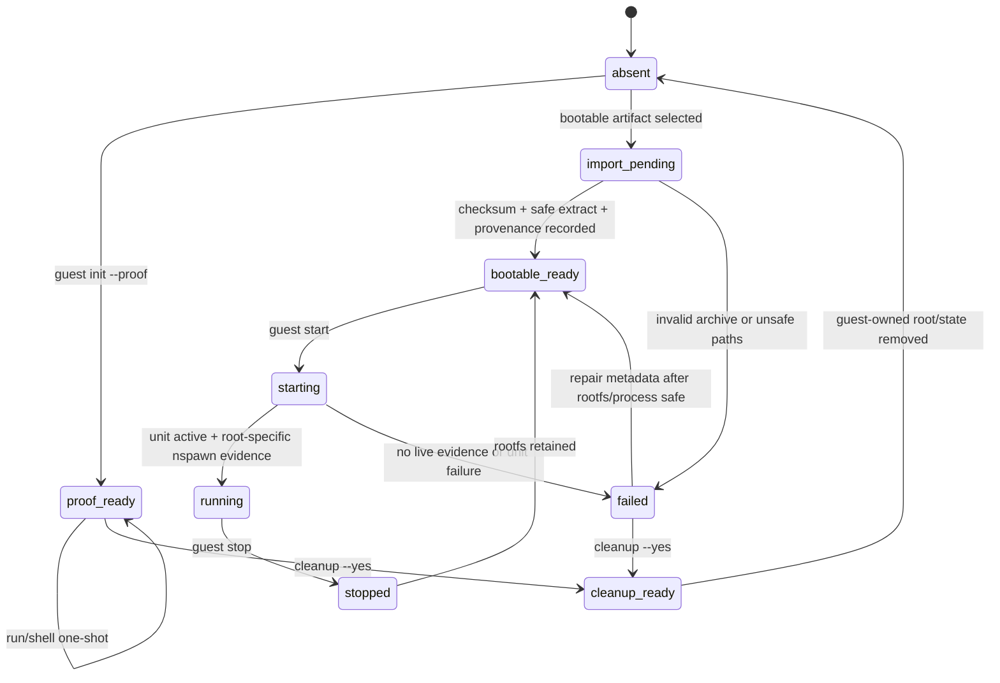
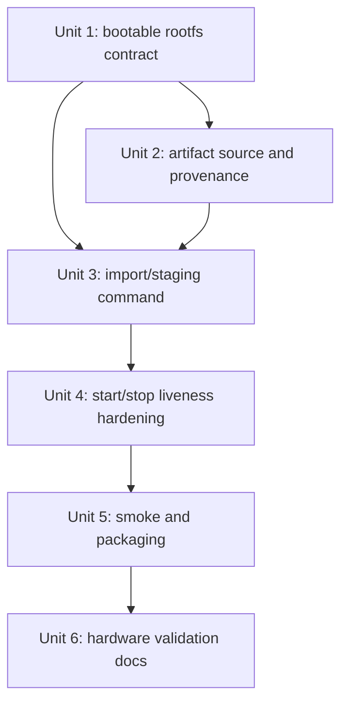
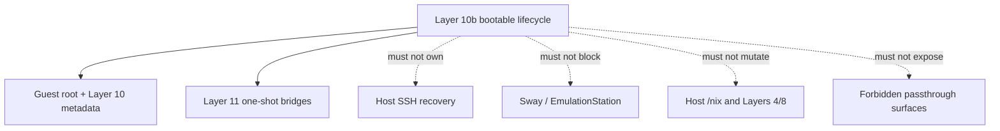

# feat: Add Layer 10b bootable guest rootfs validation

## Overview

Layer 10b fills the main gap left after Layers 10 and 11: a real bootable guest rootfs that can validate `nixctl guest start` and `nixctl guest stop` on SM8550 hardware. Layers 10 and 11 are hardware-Go for proof-mode one-shot commands, but persistent guest lifecycle remains conditional because `/storage/machines/rocknix-guest` is currently a proof root, not a bootable container root.

This plan adds the smallest safe path to bootable-mode Go:

| Rootfs shape | Purpose | Layer 10b decision |
|---|---|---|
| Existing proof root | One-shot `nixctl guest run` / Layer 11 bridges | Preserve as-is; do not treat as bootable evidence |
| Minimal bootable lifecycle fixture | Prove host `start`/`stop` mechanics only | Useful in fixture tests, but not sufficient for hardware Go |
| NixOS/container-style rootfs with init/systemd | Prove real long-running guest lifecycle | Required hardware artifact for Layer 10b Go |

The target outcome is not guest SSH, guest services, autostart, UI passthrough, or NixOS takeover. The target outcome is a reproducible bootable rootfs artifact, a safe import/staging path under `/storage`, stricter bootable liveness checks, and hardware evidence that manual start/stop leaves ROCKNIX healthy with no residual guest process or enabled unit.

## Problem Frame

Layer 10 already implements bootable-mode command surfaces and disabled unit generation, but hardware validation deliberately stopped short because no real bootable rootfs artifact existed. Layer 11 then proved a useful one-shot bridge path without requiring a persistent guest. The next architectural unlock is proving the persistent lifecycle boundary itself: a guest can boot under nspawn as a sidecar, stay manual and resource-bounded, and stop cleanly.

Without Layer 10b, future work that depends on a long-running guest has no safe foundation. Guest SSH, persistent services, remote builders, declarative guest profiles, and any service bridge would be building on fixture-only confidence. Layer 10b should convert that unknown into a bounded, documented hardware Go/No-Go result while preserving ROCKNIX as the host OS.

## Requirements Trace

- R1. Define what counts as a Layer 10 bootable rootfs artifact and how its provenance is recorded.
- R2. Provide a safe import/staging path for a bootable rootfs under `/storage/machines/rocknix-guest` without mutating `/usr`, `/flash`, `/boot`, host `/nix`, ROMs, saves, Steam/FEX, or host service state.
- R3. Keep proof-mode rootfs support unchanged for `run`, `shell`, and Layer 11 one-shot bridges.
- R4. Harden `nixctl guest start` so bootable Go requires live root-specific evidence, not only durable metadata or a generic active unit.
- R5. Keep generated guest units disabled, manually started, resource-bounded, and independent of SSH/Sway/EmulationStation boot paths.
- R6. Extend tests so fixture coverage distinguishes proof roots, minimal bootable fixtures, and imported bootable artifacts.
- R7. Provide repeatable hardware validation instructions or a packaged smoke helper for bootable start/stop.
- R8. Record SM8550/Odin2 Portal Go/No-Go evidence in the Layer 10 contract, Layer roadmap, and device docs.
- R9. Preserve the Layer 10/11 contract boundaries: no guest SSH exposure, no autostart, no persistent service bridge, no GPU/audio/input/Wayland/ROM/save/Steam/FEX passthrough.

## Scope Boundaries

- This plan does not replace ROCKNIX with NixOS.
- This plan does not enable guest autostart.
- This plan does not expose guest SSH, even on an alternate port.
- This plan does not add persistent guest services beyond the minimal services already present inside a bootable rootfs.
- This plan does not add app/service bridges that depend on a running guest.
- This plan does not pass through graphics, audio, input, Wayland/Sway sockets, ROM directories, save directories, Steam state, FEX state, browser profiles, or host UI services.
- This plan does not make the guest share or own host `/nix`; the first bootable artifact should carry its own closure unless a separate plan approves shared-store semantics.
- This plan does not add game-launch freeze/thaw hooks. Those require separate performance validation after bootable lifecycle Go.
- This plan does not ship default guest credentials or enable password-based access. A bootable artifact may contain system users only as required for container boot, not for remote login.

### Deferred to Separate Tasks

- Layer 10c or Layer 12: declarative guest rootfs rebuild/update/rollback.
- Layer 11b: bridges that intentionally target a running guest.
- Layer 12+: guest SSH, persistent service exposure, remote builder integration, or freeze/thaw policy.
- Performance study: gameplay frame-time comparison with idle/running/frozen guest states.

## Context & Research

### Relevant Code and Patterns

- `projects/ROCKNIX/packages/tools/nix-integration/scripts/nixctl` already owns the Layer 10 command surface, including rootfs mode detection, proof init, one-shot run/shell, disabled unit generation, start, stop, and cleanup.
- `projects/ROCKNIX/packages/tools/nix-integration/scripts/nix-doctor` mirrors Layer 10 status and already treats stale `state=running` metadata without live evidence as failed.
- `projects/ROCKNIX/packages/tools/nix-integration/docs/layer10-guest-lifecycle-contract.md` defines proof-mode Go, bootable-mode Go, forbidden passthrough surfaces, cleanup boundaries, and the no-machined `--register=no` requirement.
- `projects/ROCKNIX/packages/tools/nix-integration/tests/nix-integration-runtime-smoke.sh` already has fixture coverage for bootable-ready detection, proof-start refusal, fake-systemctl start, stale running state, and opt-in `LAYER10_SMOKE=bootable` hardware smoke.
- `projects/ROCKNIX/packages/tools/nix-integration/tests/nix-integration-static-checks.sh` already asserts the no-autostart and `--register=no` contracts.
- `projects/ROCKNIX/packages/tools/nix-integration/package.mk` currently installs operator scripts but not the runtime smoke script, which caused Layer 11 hardware validation to rely on a manual sequence.
- `documentation/PER_DEVICE_DOCUMENTATION/SM8550/NIX_EXPERIMENT.md` is the device-facing source of truth for which layers are hardware-Go.

### Institutional Learnings

- `docs/solutions/best-practices/stage-nspawn-rootfs-from-onboard-nix-closures-rocknix-2026-05-06.md`: proof roots are useful for one-shot Nix execution, but they are not bootable NixOS/systemd guests.
- `docs/solutions/developer-experience/nix-layer-9-nspawn-guest-proof-rocknix-2026-05-06.md`: standalone nspawn must use `--register=no` because ROCKNIX has `machined=false`.
- `docs/solutions/runtime-errors/rocknix-layer10-stale-running-state-2026-05-06.md`: running state must be proven from live evidence, not metadata.
- `docs/solutions/developer-experience/custom-fork-update-sm8550-rocknix-2026-05-04.md`: SM8550 image updates require ABL slot precheck before rebooting into updater.
- `docs/plans/2026-05-01-001-explore-nixos-on-rocknix-via-nspawn.md`: NixOS-in-nspawn is the architectural fit for additive “real NixOS userspace” work, but performance and passthrough concerns must stay explicit.

### External References

- No new external research is required before implementation. The plan is driven by already validated repository-specific constraints: ROCKNIX systemd has `machined=false`, `systemd-nspawn --register=no` is validated, mutable state belongs under `/storage`, and proof-mode Layer 10/11 is hardware-Go.

## Key Technical Decisions

| Decision | Rationale |
|---|---|
| Treat Layer 10b as a bootable-lifecycle validation layer, not a service layer | Keeps the next step narrow enough to prove start/stop safely before adding guest SSH or services. |
| Require a NixOS/container-style rootfs for hardware Go | A shell-script init fixture can prove command plumbing but not the persistent systemd guest model future layers depend on. |
| Add import/staging rather than overloading `guest init --proof` | Proof and bootable roots have different provenance, safety expectations, and Go criteria. |
| Record rootfs provenance in Layer 10 metadata | Operators need to know what was imported, when, from which source/checksum, and whether it is safe to clean up. |
| Prefer self-contained rootfs closure for the first bootable artifact | Avoids ambiguous host/guest store coupling until shared-store semantics are separately designed. |
| Strengthen liveness checks before hardware Go | A unit being active is not enough if it does not correspond to the configured guest root. |
| Install or document the smoke path explicitly | Layer 11 proved manual validation works, but packaged smoke availability should be decided rather than accidentally absent. |

## Open Questions

### Resolved During Planning

- Should Layer 10b expose guest SSH? No. SSH exposure is a later layer after start/stop cleanup is proven.
- Should Layer 10b enable guest autostart? No. The generated unit remains disabled and manually started.
- Should Layer 10b use the existing proof root as bootable evidence? No. Proof root validation remains valuable but is not bootable-mode Go.
- Should the first bootable artifact bind host `/storage/.nix-root` as guest `/nix`? No for the first Go. Start with a self-contained rootfs to avoid store ownership ambiguity.
- Should implementation include a tiny bootable fixture? Yes for tests, but hardware Go must use a real container-style rootfs with init/systemd.

### Deferred to Implementation

- Exact rootfs artifact build mechanism: implementation may use a pinned NixOS container tarball expression, a flake, or another reproducible Nix source if it records provenance and avoids local device builds where substitutes are unavailable.
- Exact artifact transfer path to `thor`: choose the least risky path at execution time, but verify checksum locally and on-device before import.
- Exact boot-readiness signal: implementation should choose robust observable evidence such as root-specific nspawn process, host unit state, and guest boot log markers available without machined.
- Exact resource-control support on the target image: start with current CPU/IO/memory/task policy and let preflight/doctor warn when ROCKNIX systemd ignores a key.

## Dependencies / Prerequisites

- Current custom branch includes Layer 11 hardware validation docs or the Layer 11 feature branch has been merged before branching Layer 10b.
- `thor` remains reachable via `ssh root@thor` before and after image updates.
- Layer 10 proof mode remains healthy: `nixctl guest status`, `nixctl guest run`, and `nix-doctor --offline` are clean enough to trust the baseline.
- `/storage` has enough space for the bootable rootfs artifact, extracted rootfs, logs, and rollback margin.
- SM8550 full-image updates continue to run the ABL slot precheck before rebooting into updater.

## High-Level Technical Design

> *This illustrates the intended approach and is directional guidance for review, not implementation specification. The implementing agent should treat it as context, not code to reproduce.*

Layer 10b adds a bootable rootfs import and validation path while preserving proof-mode behavior:



Expected component boundaries:

```mermaid
flowchart TB
  Artifact[Bootable rootfs artifact]
  Import[nixctl guest import/init --bootable]
  Metadata[Layer 10 provenance metadata]
  Rootfs[/storage/machines/rocknix-guest]
  Unit[Disabled storage-local unit]
  Nspawn[systemd-nspawn --boot --register=no]
  Doctor[nix-doctor]
  Smoke[Layer 10b hardware smoke/manual validation]
  Docs[SM8550 docs and Layer 10 contract]

  Artifact --> Import
  Import --> Metadata
  Import --> Rootfs
  Rootfs --> Unit
  Unit --> Nspawn
  Doctor --> Metadata
  Doctor --> Rootfs
  Doctor --> Unit
  Smoke --> Import
  Smoke --> Unit
  Smoke --> Doctor
  Smoke --> Docs
```

## Implementation Units

### Implementation Unit Dependency Graph



- [x] **Unit 1: Define Layer 10b bootable rootfs contract**

**Goal:** Make the bootable artifact boundary explicit before implementation starts modifying lifecycle commands.

**Requirements:** R1, R3, R5, R8, R9

**Dependencies:** Existing Layer 10 contract and Layer 11 hardware validation docs.

**Files:**
- Modify: `projects/ROCKNIX/packages/tools/nix-integration/docs/layer10-guest-lifecycle-contract.md`
- Modify: `docs/plans/2026-04-28-001-feat-layered-nix-integration-plan.md`
- Test: `projects/ROCKNIX/packages/tools/nix-integration/tests/nix-integration-static-checks.sh`

**Approach:**
- Add a Layer 10b subsection that defines the required bootable artifact shape: container-style rootfs, init/systemd entry point, self-contained closure for first validation, no host passthrough, and recorded checksum/provenance.
- Clarify that minimal init fixtures are test aids only and cannot satisfy hardware Go.
- Keep existing proof-mode and Layer 11 one-shot bridge language unchanged.
- Extend static checks so future edits cannot silently erase the bootable-Go criteria.

**Patterns to follow:**
- `projects/ROCKNIX/packages/tools/nix-integration/docs/layer10-guest-lifecycle-contract.md`
- `projects/ROCKNIX/packages/tools/nix-integration/docs/layer11-bridge-contract.md`

**Test scenarios:**
- Static: contract names Layer 10b bootable artifact provenance and checksum recording.
- Static: contract says proof roots remain non-bootable and `guest start` must refuse them.
- Static: contract states no guest SSH, autostart, graphics/audio/input passthrough, or host `/nix` sharing for first validation.
- Static: roadmap distinguishes Layer 10 proof-Go, Layer 10b bootable-Go, and Layer 11 one-shot bridge-Go.

**Verification:**
- Reviewers can tell what evidence is required before bootable Layer 10 is marked Go, and can distinguish test fixtures from hardware validation artifacts.

- [x] **Unit 2: Add a reproducible bootable rootfs artifact source**

**Goal:** Give implementers and operators a pinned, reviewable source for the bootable rootfs used in hardware validation.

**Requirements:** R1, R2, R6, R9

**Dependencies:** Unit 1 complete.

**Files:**
- Create: `projects/ROCKNIX/packages/tools/nix-integration/guest/README.md`
- Create: `projects/ROCKNIX/packages/tools/nix-integration/guest/rocknix-guest.nix`
- Create: `projects/ROCKNIX/packages/tools/nix-integration/guest/flake.nix` if implementation chooses a flake-based build source
- Create: `projects/ROCKNIX/packages/tools/nix-integration/guest/flake.lock` if implementation chooses a flake-based build source
- Modify: `projects/ROCKNIX/packages/tools/nix-integration/tests/nix-integration-static-checks.sh`

**Approach:**
- Define a minimal aarch64 NixOS/container-style guest intended for nspawn, with `boot.isContainer = true` or equivalent container-root behavior.
- Keep the guest headless and non-network-exposed by default. Do not enable OpenSSH or user-facing services in this layer.
- Include only diagnostic packages needed to prove boot and basic shell health; avoid UI, audio, input, browser, Steam/FEX, host-integration packages, default passwords, or remote-login services.
- Document expected artifact type, expected extraction root shape, and checksum capture.
- Prefer a build path that can use binary substitutes and fail clearly if local compilation would be required.

**Patterns to follow:**
- NixOS container-root discussion in `docs/plans/2026-05-01-001-explore-nixos-on-rocknix-via-nspawn.md`
- Provenance discipline from `docs/solutions/developer-experience/custom-fork-update-sm8550-rocknix-2026-05-04.md`

**Test scenarios:**
- Static: guest source exists and names aarch64/container intent.
- Static: guest source does not enable SSH, password login, default credentials, or graphical/audio/input services.
- Static: guest source does not reference `/dev/dri`, PipeWire/PulseAudio sockets, `/dev/input`, ROM/save paths, Steam/FEX paths, or host Wayland/Sway sockets.
- Static: README documents artifact checksum and import expectations.

**Verification:**
- A future operator can build or fetch the intended bootable rootfs artifact without reverse-engineering a one-off NixOS configuration from chat history.

- [x] **Unit 3: Add safe bootable rootfs import/staging**

**Goal:** Let operators stage a bootable rootfs through `nixctl` with path safety, checksum/provenance metadata, and clear separation from proof-mode init.

**Requirements:** R1, R2, R3, R6, R9

**Dependencies:** Units 1-2 complete.

**Files:**
- Modify: `projects/ROCKNIX/packages/tools/nix-integration/scripts/nixctl`
- Modify: `projects/ROCKNIX/packages/tools/nix-integration/scripts/nix-doctor`
- Modify: `projects/ROCKNIX/packages/tools/nix-integration/tests/nix-integration-runtime-smoke.sh`
- Modify: `projects/ROCKNIX/packages/tools/nix-integration/tests/nix-integration-static-checks.sh`
- Modify: `documentation/PER_DEVICE_DOCUMENTATION/SM8550/NIX_EXPERIMENT.md`

**Approach:**
- Add an explicit bootable import action, such as `nixctl guest init --bootable <artifact>` or `nixctl guest import --bootable <artifact>`, while preserving `guest init --proof` behavior.
- Require a regular file artifact, enough free `/storage` space, and an empty or absent guest root unless an explicit replace flow is added.
- Extract only into the configured guest root after path-safety checks. Reject archives with absolute paths, parent traversal, or unexpected ownership/path shapes if implementation can detect them safely.
- Write metadata under `NIX_LAYER10_STATE_DIR`, including rootfs mode, source path or artifact name, sha256, imported timestamp, and importer version.
- Make `nix-doctor` report bootable provenance when present and warn on bootable rootfs without provenance.

**Patterns to follow:**
- `cmd_guest_init`, `layer10_cleanup_path_safe`, and `layer10_write_state` in `projects/ROCKNIX/packages/tools/nix-integration/scripts/nixctl`
- Layer 6/11 owned-state patterns for refusing non-owned conflicts

**Test scenarios:**
- Happy path: valid bootable fixture artifact imports into a temp guest root and status reports `bootable-ready`.
- Happy path: metadata records artifact checksum, import timestamp, and mode.
- Edge case: proof root already exists -> bootable import refuses and tells the operator to cleanup or choose another root.
- Edge case: artifact missing or not a regular file -> import fails before creating guest root state.
- Error path: archive contains absolute path or parent traversal -> import refuses and leaves no partial trusted metadata.
- Error path: guest root override points at `/`, `/storage`, `/nix`, `/usr`, `/flash`, `/boot`, ROMs, saves, or other unsafe roots -> import refuses.
- Integration: `nix-doctor --offline` reports bootable provenance after import and warns if bootable shape exists without metadata.

**Verification:**
- A bootable rootfs can be staged reproducibly under guest-owned storage, and failed imports do not leave ambiguous state that could be mistaken for bootable-Go.

- [x] **Unit 4: Harden bootable start/stop liveness and failure handling**

**Goal:** Make bootable-mode start/stop reliable enough for hardware Go by requiring root-specific live evidence and deterministic recovery from failed starts/stops.

**Requirements:** R4, R5, R6, R9

**Dependencies:** Unit 3 complete.

**Files:**
- Modify: `projects/ROCKNIX/packages/tools/nix-integration/scripts/nixctl`
- Modify: `projects/ROCKNIX/packages/tools/nix-integration/scripts/nix-doctor`
- Modify: `projects/ROCKNIX/packages/tools/nix-integration/tests/nix-integration-runtime-smoke.sh`
- Modify: `projects/ROCKNIX/packages/tools/nix-integration/tests/nix-integration-static-checks.sh`

**Approach:**
- Treat `running` as true only when live evidence matches the configured guest root. An active unit alone should not be enough if process evidence does not point at `NIX_LAYER10_GUEST_ROOT`.
- After `guest start`, verify that the unit is active and a root-specific nspawn process exists; mark failed otherwise.
- Keep the generated unit disabled and manually started. Static checks should continue to reject any `systemctl enable` path.
- Ensure `guest stop` is idempotent and verifies that no nspawn process remains for the configured root.
- Preserve resource-control reporting, and make unsupported controls visible in status/doctor rather than hidden.
- Capture useful logs for failed bootable start without depending on machined or `machinectl`.

**Patterns to follow:**
- Stale-running fix documented in `docs/solutions/runtime-errors/rocknix-layer10-stale-running-state-2026-05-06.md`
- Existing fake-systemctl tests in `projects/ROCKNIX/packages/tools/nix-integration/tests/nix-integration-runtime-smoke.sh`

**Test scenarios:**
- Happy path: bootable root + fake active unit + matching fake process evidence -> status reports running.
- Happy path: `guest stop` after running state clears metadata to stopped/bootable-ready and no matching process remains.
- Edge case: unit active but no matching nspawn root process -> status/doctor reports failed or unsafe, not running.
- Edge case: matching process exists but state metadata says stopped -> live evidence wins and status reports running.
- Edge case: `guest start` called twice while matching live evidence exists -> no duplicate process/start attempt.
- Error path: systemctl start succeeds but process evidence never appears -> state becomes failed and logs point to diagnosis.
- Error path: systemctl stop returns non-zero but process is gone -> command reports stopped/no-op rather than leaving false failure.
- Safety: generated unit has no install enablement used by `nixctl`, no boot target dependency, and includes `--register=no`.

**Verification:**
- Bootable lifecycle state is derived from real host evidence and remains aligned between `nixctl guest status`, `nixctl guest start/stop`, and `nix-doctor --offline`.

- [x] **Unit 5: Make bootable smoke repeatable on-device**

**Goal:** Avoid another manual-only validation gap by deciding how hardware operators run the bootable start/stop smoke on the installed image.

**Requirements:** R6, R7, R8

**Dependencies:** Unit 4 complete.

**Files:**
- Modify: `projects/ROCKNIX/packages/tools/nix-integration/tests/nix-integration-runtime-smoke.sh`
- Modify: `projects/ROCKNIX/packages/tools/nix-integration/package.mk`
- Modify: `projects/ROCKNIX/packages/tools/nix-integration/tests/nix-integration-static-checks.sh`
- Modify: `documentation/PER_DEVICE_DOCUMENTATION/SM8550/NIX_EXPERIMENT.md`

**Approach:**
- Either install the runtime smoke script to a stable image path such as `/usr/lib/nix-integration/tests/nix-integration-runtime-smoke.sh`, or explicitly document the manual validation sequence as the supported path. Prefer packaging the script if size and policy are acceptable.
- Extend `LAYER10_SMOKE=bootable` so it requires an imported bootable root, confirms provenance, starts the guest, observes running state, stops the guest, and confirms no enabled unit/process remains.
- Keep smoke opt-in only. Default CI and default boot must not start a real guest.
- Print a concise evidence block suitable for copying into device docs.

**Patterns to follow:**
- Existing `LAYER10_SMOKE=proof|bootable` shape in `projects/ROCKNIX/packages/tools/nix-integration/tests/nix-integration-runtime-smoke.sh`
- Layer 11 manual hardware evidence now recorded in `docs/plans/2026-05-06-002-feat-nix-layer-11-one-shot-guest-bridges-plan.md`

**Test scenarios:**
- Happy path: packaged or repo-local smoke detects bootable-ready root, starts it, observes running, stops it, and prints success.
- Edge case: smoke script absent from image when packaging is intended -> static/package check fails.
- Edge case: `LAYER10_SMOKE` unset -> no real nspawn start is attempted.
- Error path: bootable root missing provenance -> smoke fails before start with a clear message.
- Error path: start fails -> smoke captures diagnostics and still attempts stop/process cleanup verification.
- Cleanup: after smoke success or failure, no `systemd-nspawn` process for the guest root remains and guest unit is not enabled.

**Verification:**
- The hardware validation path is repeatable by a future agent without relying on unstated local repo paths or chat-only manual commands.

- [ ] **Unit 6: Validate on `thor` and record bootable-mode Go/No-Go** *(pending rebuilt SM8550 image and real bootable artifact)*

**Goal:** Produce the durable SM8550 evidence that unblocks or blocks future persistent guest work.

**Requirements:** R7, R8, R9

**Dependencies:** Units 1-5 complete; SM8550 image built and installed safely.

**Files:**
- Modify: `documentation/PER_DEVICE_DOCUMENTATION/SM8550/NIX_EXPERIMENT.md`
- Modify: `projects/ROCKNIX/packages/tools/nix-integration/docs/layer10-guest-lifecycle-contract.md`
- Modify: `docs/plans/2026-05-06-003-feat-nix-layer-10b-bootable-rootfs-plan.md`
- Modify: `docs/plans/2026-04-28-001-feat-layered-nix-integration-plan.md`
- Create: `docs/solutions/developer-experience/nix-layer-10b-bootable-rootfs-rocknix-2026-05-06.md` if validation exposes reusable gotchas or operational lessons
- Create: `docs/solutions/performance-issues/rocknix-layer10b-bootable-guest-overhead-2026-05-06.md` only if implementation performs performance measurement in this layer

**Approach:**
- Build and install a Layer 10b-enabled SM8550 image using the established GitHub Actions path.
- Before rebooting into updater, perform the SM8550 ABL slot precheck and verify update artifact checksum locally and on-device.
- Import the bootable rootfs artifact, verify provenance, start the guest, observe root-specific running state, stop the guest, and confirm no residual process or enabled unit.
- Confirm host invariants after the smoke: SSH active, ROCKNIX UI unaffected by observation, `/nix` mount active, Layer 10 proof mode not regressed when restored, Layer 11 one-shot bridge eligibility remains understandable.
- Record Go/No-Go decision with build ID, branch, artifact name/checksum, rootfs artifact checksum, start/stop evidence, doctor output summary, and cleanup state.

**Patterns to follow:**
- Hardware evidence sections in `docs/plans/2026-05-06-001-feat-nix-layer-10-managed-guest-operations-plan.md`
- Hardware evidence sections in `docs/plans/2026-05-06-002-feat-nix-layer-11-one-shot-guest-bridges-plan.md`
- ABL precheck workflow in `docs/solutions/developer-experience/custom-fork-update-sm8550-rocknix-2026-05-04.md`

**Test scenarios:**
- Hardware happy path: imported bootable root reports `bootable-ready`, `guest start` transitions to `running`, `guest stop` leaves `running: no`, and `nix-doctor --offline` passes or reports only expected warnings.
- Hardware edge case: reboot after validation does not start the guest and does not enable guest unit.
- Hardware cleanup: guest root and Layer 10 metadata can be removed with guarded cleanup without touching host `/nix`, Layer 6, Layer 8, Layer 11, ROMs, saves, Steam/FEX, or update state.
- Regression: proof-mode `guest run /usr/bin/nix --version` or Layer 11 one-shot bridge behavior still works after restoring/staging the proof root, or docs explicitly state why proof root was replaced and how to restore it.
- No-Go: any host SSH loss, boot dependency, enabled guest unit, residual guest process after stop, forbidden passthrough dependency, unsafe cleanup, or ambiguous running state blocks Layer 10b Go.

**Verification:**
- The docs contain enough concrete evidence for a future Layer 11b/12 plan to know whether persistent guest-dependent work is allowed.

**Implementation evidence before hardware validation:**

```text
Implemented in repo:
- Layer 10b contract and roadmap boundary
- pinned guest source at projects/ROCKNIX/packages/tools/nix-integration/guest
- nixctl guest import --bootable <artifact>
- Layer 10 rootfs provenance metadata with sha256/import timestamp/source
- nix-doctor provenance reporting
- root-specific live nspawn evidence for running state
- packaged runtime smoke helper at /usr/lib/nix-integration/tests/nix-integration-runtime-smoke.sh

Validated locally:
- nix-integration static checks passed
- nix-integration runtime smoke passed
- nix flake show for the Layer 10b guest source evaluates the rootfs package
```

Remaining hardware work:

```text
- build SM8550 image from feat/nix-layer-10b-bootable-rootfs
- build/fetch the Layer 10b aarch64 rootfs artifact
- ABL-precheck and install image on thor
- import artifact with nixctl guest import --bootable
- run LAYER10_SMOKE=bootable from packaged smoke helper
- reboot and verify guest unit remains disabled and no guest is running
- record Go/No-Go evidence here and in SM8550 docs
```

## System-Wide Impact

- **Interaction graph:** Layer 10b touches guest rootfs source/provenance, `nixctl`, `nix-doctor`, runtime/static checks, optional packaging of smoke helpers, SM8550 operator docs, and Layer roadmap docs. It must not touch ROCKNIX boot ownership, firmware, kernel, host SSH ownership, UI startup, ROM/save data, Steam/FEX, or host `/nix` ownership.
- **Error propagation:** Artifact/import/start/stop failures should become `nixctl` errors, Layer 10 metadata, smoke logs, and doctor warnings/failures. They must not propagate into boot failure or disabled host recovery.
- **State lifecycle risks:** Bootable import can leave partial rootfs state; start can leave stale metadata; stop can leave a residual process. The plan addresses this with provenance metadata, path-gated cleanup, root-specific liveness, and smoke cleanup verification.
- **API surface parity:** `nixctl guest status`, top-level `nixctl status`, `nix-doctor --offline`, and runtime smoke should all interpret the same proof/bootable/running/failed state model.
- **Integration coverage:** Static checks cover contracts and forbidden surfaces; fixture runtime tests cover command decisions and failure branches; hardware smoke proves real nspawn boot/stop behavior on SM8550.
- **Unchanged invariants:** ROCKNIX remains the base OS and recovery host. Layer 10b does not make persistent guest services safe by default; it only proves or rejects the manual bootable lifecycle floor.



## Risks & Dependencies

| Risk | Likelihood | Impact | Mitigation |
|---|---:|---:|---|
| Bootable artifact requires expensive local builds | Medium | Medium | Prefer pinned source that uses substitutes; fail clearly if build would compile on-device. |
| Test fixture rootfs gives false confidence | Medium | High | Contract says fixture is not hardware Go; require NixOS/container-style artifact for Go. |
| Import extracts unsafe paths or overwrites existing proof root | Low | High | Path-safety checks, empty-root requirement, explicit cleanup/replace decision, metadata only after successful import. |
| Active unit without matching guest root is misreported as running | Medium | High | Root-specific process evidence and stale-state tests. |
| Guest unit becomes enabled or boot-dependent | Low | High | Static checks, runtime smoke, reboot validation, no `systemctl enable` path. |
| Guest consumes gameplay resources | Medium | High | No autostart, manual start only, existing CPU/IO/memory/task resource policy, stop verification. |
| Rootfs provenance becomes ambiguous | Medium | Medium | Metadata includes artifact checksum/source/import time; doctor warns when bootable root lacks provenance. |
| Layer 11 proof bridge regresses after bootable import replaces proof root | Medium | Medium | Document root mode switch clearly; validate or restore proof root before claiming Layer 11 remains operational. |
| Packaged smoke script increases image surface unexpectedly | Low | Low | Keep script under `/usr/lib/nix-integration/tests`, opt-in only, no enabled unit or boot integration. |

## Documentation / Operational Notes

- Layer 10b is implemented in-repo but remains pending hardware validation until a rebuilt SM8550 image imports and starts/stops a real bootable artifact. Fixture `bootable-ready` is not enough.
- If the bootable rootfs replaces the current proof root at `/storage/machines/rocknix-guest`, docs must explain how to return to proof mode for Layer 11 one-shot bridges.
- The first bootable validation should run with the device in a recoverable state and host SSH verified immediately before start.
- Any SM8550 full update must repeat ABL precheck before rebooting into updater.
- If hardware validation fails, record the failure as No-Go and preserve enough logs/provenance to diagnose without rerunning risky steps blindly.

## Sources & References

- **Origin document:** `docs/plans/2026-05-06-001-feat-nix-layer-10-managed-guest-operations-plan.md`
- Layer 11 validation plan: `docs/plans/2026-05-06-002-feat-nix-layer-11-one-shot-guest-bridges-plan.md`
- Layer roadmap: `docs/plans/2026-04-28-001-feat-layered-nix-integration-plan.md`
- NixOS/nspawn exploration: `docs/plans/2026-05-01-001-explore-nixos-on-rocknix-via-nspawn.md`
- Layer 10 contract: `projects/ROCKNIX/packages/tools/nix-integration/docs/layer10-guest-lifecycle-contract.md`
- Layer 11 contract: `projects/ROCKNIX/packages/tools/nix-integration/docs/layer11-bridge-contract.md`
- Control surface: `projects/ROCKNIX/packages/tools/nix-integration/scripts/nixctl`
- Health checks: `projects/ROCKNIX/packages/tools/nix-integration/scripts/nix-doctor`
- Runtime smoke: `projects/ROCKNIX/packages/tools/nix-integration/tests/nix-integration-runtime-smoke.sh`
- Static checks: `projects/ROCKNIX/packages/tools/nix-integration/tests/nix-integration-static-checks.sh`
- Package install surface: `projects/ROCKNIX/packages/tools/nix-integration/package.mk`
- SM8550 operator docs: `documentation/PER_DEVICE_DOCUMENTATION/SM8550/NIX_EXPERIMENT.md`
- Rootfs staging learning: `docs/solutions/best-practices/stage-nspawn-rootfs-from-onboard-nix-closures-rocknix-2026-05-06.md`
- Stale running state learning: `docs/solutions/runtime-errors/rocknix-layer10-stale-running-state-2026-05-06.md`
- SM8550 update learning: `docs/solutions/developer-experience/custom-fork-update-sm8550-rocknix-2026-05-04.md`
