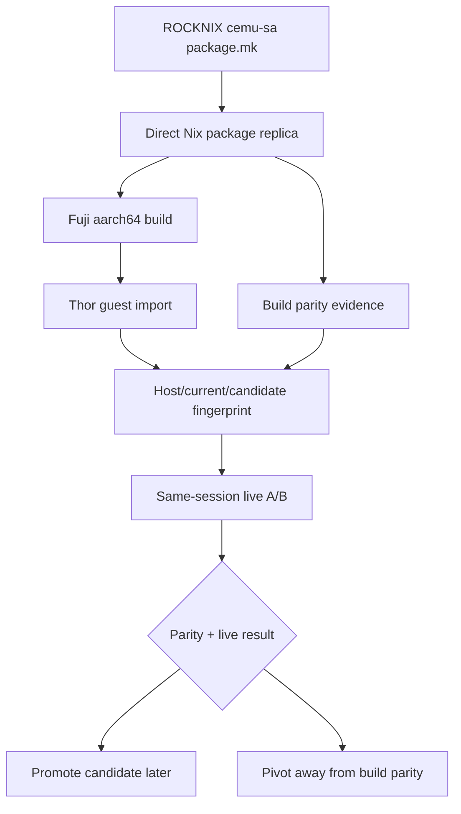
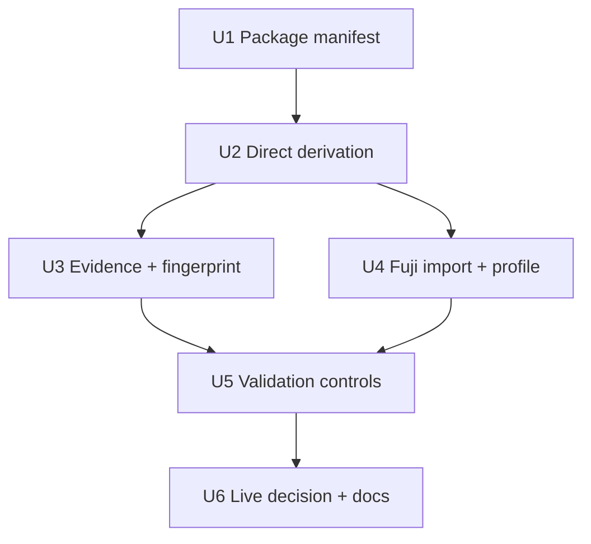

# Fix ROCKNIX Cemu Package Replica

## Summary

Create a from-scratch Nix Cemu derivation that mirrors ROCKNIX `cemu-sa` directly instead of inheriting `nixpkgs#cemu`, then validate it with parity artifacts and same-session host-control/live BOTW comparisons. This plan treats the existing faithful override as an elimination result: the next candidate must remove the nixpkgs package shape itself from the experiment.

---

## Problem Frame

The previous faithful candidate closed the obvious gaps: runtime data, ROCKNIX patches, classic SDL2, ELF `EXEC`, no dynamic Cubeb linkage, and ROCKNIX Mesa passthrough. It still showed host-divergent Cemu behavior: RPL/HLE times stayed around the slow Nix profile, Cubeb still reported unsupported at runtime, and user-visible loading/title behavior remained slow.

Host Cemu through the guest display path has already proven the display route can hit the target. The remaining question is whether a direct Nix reproduction of the ROCKNIX `cemu-sa` build contract can match host behavior, or whether the issue must be reclassified away from build parity.

---

## Requirements

- R1. Add a new guest-native Cemu package output built from a direct `stdenv.mkDerivation` or equivalent, not from `pkgs.cemu`, `baseCemu`, or `overrideAttrs` on nixpkgs Cemu.
- R2. Mirror ROCKNIX `cemu-sa` source, patch, pre-configure, CMake flag, install-layout, and bundled-submodule behavior as the primary package contract.
- R3. Preserve existing Layer 14 safety boundaries: no product host Cemu, no broad host runtime binds, no host Vulkan loader preload, no host boot/recovery mutation, and no broad cache bind.
- R4. Make build parity auditable before FPS interpretation by capturing source, patch hashes, dependency versions, CMake cache/configure evidence, compile/link evidence, ELF/linkage, runtime data, and runtime process maps.
- R5. Build heavy aarch64 candidates on Fuji or another aarch64 builder, then import and verify the closure in the Thor guest runtime namespace before launch.
- R6. Keep validation decisive and fair: host-control and candidate must run the same BOTW profile/scene through the same guest display path, with user-visible in-game evidence outranking title/loading CSV.
- R7. Define an explicit stop rule: if the direct package replica passes the parity manifest but still fails same-scene host-control A/B, stop Cemu build-parity iteration and pivot to a new runtime/scheduler/Cemu-AArch64-backend investigation.

---

## Scope Boundaries

- Do not productize the host Cemu binary inside the guest.
- Do not solve global Nix Mesa/Freedreno packaging in this plan; ROCKNIX Mesa passthrough remains a diagnostic profile unless a separate Mesa plan promotes it.
- Do not change the Layer 14 thin-host boot/recovery architecture.
- Do not redesign the launcher UI.
- Do not continue broad nixpkgs Cemu override tuning as the main path; the new candidate must directly express the ROCKNIX package contract.

### Deferred to Follow-Up Work

- Promote a winning candidate into a stable guest profile/default launcher after live validation passes.
- Package or align a coherent Nix Mesa/Turnip stack if the direct Cemu replica only performs with diagnostic ROCKNIX Mesa passthrough.
- Open a separate runtime/scheduler/AArch64-backend plan if the direct replica still fails after parity artifacts match.
- Long thermal soak testing after performance correctness is established.

---

## Context & Research

### Relevant Code and Patterns

- `projects/ROCKNIX/packages/emulators/standalone/cemu-sa/package.mk` is the source-of-truth host package contract.
- `projects/ROCKNIX/packages/emulators/standalone/cemu-sa/patches/000-build-fixes.patch` carries aarch64 build/link fixes.
- `projects/ROCKNIX/packages/emulators/standalone/cemu-sa/patches/002-opt-seeprom-mlc01-keys-dir.patch` carries Cemu user-data layout parity.
- `projects/ROCKNIX/packages/emulators/standalone/cemu-sa/patches/003-disable-cmake-interprocedural-optimization.patch` disables IPO/LTO.
- `projects/ROCKNIX/packages/emulators/standalone/cemu-sa/scripts/start_cemu.sh` is the host launcher contract for settings, controller, mlc/key layout, and audio behavior.
- `projects/ROCKNIX/packages/tools/nix-integration/guest/flakes/cemu/flake.nix` currently exposes the Cemu flake outputs and should gain the direct package output.
- `projects/ROCKNIX/packages/tools/nix-integration/guest/flakes/cemu/rocknix-faithful.nix` is useful as the eliminated nixpkgs-derived comparison candidate, not as the new implementation base.
- `projects/ROCKNIX/packages/tools/nix-integration/guest/launchers/remote-cemu-build-fingerprint.sh` is the build/runtime comparison harness to extend.
- `projects/ROCKNIX/packages/tools/nix-integration/guest/launchers/remote-cemu-live-campaign.sh` and `projects/ROCKNIX/packages/tools/nix-integration/guest/launchers/remote-cemu-runtime-ab.sh` are the live validation harnesses to harden for same-session controls.
- `projects/ROCKNIX/packages/tools/nix-integration/tests/nix-integration-static-checks.sh` is the static contract gate for new flake outputs and launcher safety.

### Institutional Learnings

- `docs/solutions/performance-issues/rocknix-layer14-cemu-performance-audit-2026-05-09.md` records that the faithful nixpkgs-derived candidate still failed first-order parity and that the display path is not the bottleneck.
- `docs/solutions/best-practices/rocknix-layer14-main-space-cold-boot-autostart-2026-05-08.md` records the Layer 14 guest display/nspawn contract and the need to keep host recovery independent.
- `docs/solutions/runtime-errors/rocknix-layer10-stale-running-state-2026-05-06.md` warns against stale runtime metadata; Cemu harnesses must prove live process evidence.
- `docs/solutions/runtime-errors/rocknix-nix-remote-copy-profile-store-mismatch-2026-05-05.md` warns that off-device builds must be imported with the real Nix store tooling visible to the runtime namespace.

### External References

- External research is not needed for this plan. The decisive contracts and evidence are repository-local: the ROCKNIX package recipe, local Layer 14 learnings, and live run artifacts.

---

## Key Technical Decisions

| Decision | Rationale |
|---|---|
| Build a direct package replica, not another override | The faithful override already closed obvious deltas while preserving the nixpkgs package shape; the next experiment must remove that package shape from the hypothesis. |
| Treat `cemu-sa/package.mk` as the package manifest | It is the only known build/runtime that reaches target BOTW behavior on this device. |
| Keep existing override outputs as controls | Current, ROCKNIX-style, classic-SDL, and faithful outputs remain valuable comparison points and should not be broken by the new derivation. |
| Export build evidence from the derivation | If the direct replica still fails, the team needs CMake/link/dependency artifacts to decide whether parity really matched or only appeared to match. |
| Require a same-session host-control | Performance claims must be compared against a fresh host Cemu control using the same profile/scene/display path, not memory of earlier runs. |
| Keep ROCKNIX Mesa passthrough diagnostic-only | It is a powerful isolation tool, but productizing it would blur the Nix-native runtime target and host recovery boundary. |
| Add a stop rule | Without an explicit exit criterion, build-parity work can become open-ended after the major parity surfaces are exhausted. |

---

## Open Questions

### Resolved During Planning

- **Should the next candidate still inherit `pkgs.cemu`?** No. The plan requires a direct derivation so nixpkgs Cemu packaging does not remain an uncontrolled variable.
- **Should ROCKNIX Mesa passthrough be acceptance or diagnostic?** Diagnostic. It may be used to isolate Cemu-package behavior, but a product runtime needs a separate graphics-stack decision.
- **Should title/loading CSV alone promote a candidate?** No. User-visible in-game validation remains decisive.

### Deferred to Implementation

- **Which Nix dependency versions can be aligned exactly with ROCKNIX without excessive pinning?** This depends on build feasibility and fingerprint deltas.
- **Whether the guest-only screensaver workaround is still required in the direct derivation.** Keep it as an explicit optional delta and validate during build/run.
- **Whether Cubeb runtime support still reports unsupported after direct package replication.** The plan requires surfacing the evidence, but runtime behavior is execution-time discovery.
- **Whether the direct replica should split debug/evidence artifacts into a separate output.** Choose during implementation based on Nix packaging ergonomics and closure size.

---

## High-Level Technical Design

> *This illustrates the intended approach and is directional guidance for review, not implementation specification. The implementing agent should treat it as context, not code to reproduce.*

---

## Implementation Units

### U1. Define the ROCKNIX Cemu package manifest

**Goal:** Create a durable parity manifest that describes what the direct Nix package must mirror from ROCKNIX `cemu-sa`.

**Requirements:** R1, R2, R4

**Dependencies:** None

**Files:**
- Create: `projects/ROCKNIX/packages/tools/nix-integration/guest/flakes/cemu/rocknix-package-manifest.nix`
- Modify: `projects/ROCKNIX/packages/tools/nix-integration/guest/flakes/cemu/README.md`
- Modify: `projects/ROCKNIX/packages/tools/nix-integration/tests/nix-integration-static-checks.sh`
- Test: `projects/ROCKNIX/packages/tools/nix-integration/tests/nix-integration-static-checks.sh`

**Approach:**
- Encode the ROCKNIX Cemu source commit, required patch list, expected pre-configure edits, CMake feature flags, install data directories, and expected runtime-data assertions in one reusable manifest.
- Add static checks that compare the manifest commit against `cemu-sa/package.mk` and require all three ROCKNIX patch references.
- Treat the guest-only screensaver workaround as an explicit Nix-runtime delta, not part of the host package contract.
- Do not encode transient store paths or device-specific run directories in the manifest.

**Execution note:** Characterization-first. Capture the current ROCKNIX package contract before creating the new derivation so future diffs are reviewable.

**Patterns to follow:**
- `projects/ROCKNIX/packages/emulators/standalone/cemu-sa/package.mk`
- `projects/ROCKNIX/packages/tools/nix-integration/guest/flakes/cemu/README.md`
- `projects/ROCKNIX/packages/tools/nix-integration/tests/nix-integration-static-checks.sh`

**Test scenarios:**
- Happy path: static checks pass when the manifest commit matches the ROCKNIX package version and references all required patches.
- Error path: static checks fail if the manifest omits `002-opt-seeprom-mlc01-keys-dir.patch`.
- Error path: static checks fail if the direct package manifest drifts from the host package commit.
- Integration: README documents the manifest as the source for new direct-package candidates, not the old nixpkgs override output.

**Verification:**
- Reviewers can identify every intended host-package parity surface from a single manifest file.
- Static checks guard against obvious source/patch drift.

---

### U2. Add the direct Nix Cemu derivation

**Goal:** Add a new Cemu flake output that builds directly from upstream source/submodules using the ROCKNIX package manifest, without inheriting `nixpkgs#cemu`.

**Requirements:** R1, R2, R3, R4

**Dependencies:** U1

**Files:**
- Create: `projects/ROCKNIX/packages/tools/nix-integration/guest/flakes/cemu/rocknix-package.nix`
- Modify: `projects/ROCKNIX/packages/tools/nix-integration/guest/flakes/cemu/flake.nix`
- Modify: `projects/ROCKNIX/packages/tools/nix-integration/guest/flakes/cemu/README.md`
- Modify: `projects/ROCKNIX/packages/tools/nix-integration/tests/nix-integration-static-checks.sh`
- Test: `projects/ROCKNIX/packages/tools/nix-integration/tests/nix-integration-static-checks.sh`

**Approach:**
- Introduce a new output such as `cemu-rocknix-package` or `rocknix-cemu-package` while preserving all existing diagnostic outputs.
- Use direct source fetching with submodules and direct CMake/Ninja build inputs.
- Apply the three ROCKNIX patches plus any explicitly documented guest-only patch only when required.
- Reproduce the ROCKNIX pre-configure edits: bundled Cubeb path, `glm` link-name fix, PCH flag, GCC diagnostic flag, CMake feature flags, and IPO disabled.
- Install the built binary and Cemu runtime data using the ROCKNIX install layout translated into Nix output layout.
- Add build-time assertions for BOTW game profile and shared Cafe font presence.
- Add static checks forbidding `pkgs.cemu`, `baseCemu`, and `overrideAttrs` inside the direct derivation file.

**Execution note:** Build characterization-first. The first success criterion is not FPS; it is a build that proves the direct package path can reproduce the host contract surfaces.

**Patterns to follow:**
- `projects/ROCKNIX/packages/emulators/standalone/cemu-sa/package.mk`
- `projects/ROCKNIX/packages/tools/nix-integration/guest/flakes/cemu/rocknix-faithful.nix`
- `projects/ROCKNIX/packages/tools/nix-integration/guest/flakes/cemu/flake.nix`

**Test scenarios:**
- Happy path: flake evaluation exposes the new direct package output for aarch64 and leaves existing Cemu outputs available.
- Happy path: a successful build installs the Cemu binary plus `share/Cemu/gameProfiles` and `share/Cemu/resources`.
- Error path: build fails clearly when runtime data is missing from the build tree.
- Error path: static checks fail if the direct derivation inherits nixpkgs Cemu or uses `overrideAttrs` as its implementation base.
- Integration: the new output can be selected through the existing `CEMU_BIN` candidate launcher path.

**Verification:**
- The new package output evaluates locally and builds on Fuji.
- The built output has runtime data and does not replace or regress existing diagnostic outputs.

---

### U3. Capture build evidence and dependency parity

**Goal:** Make the direct derivation produce enough artifacts to explain remaining host/guest differences before live performance testing.

**Requirements:** R2, R4, R7

**Dependencies:** U2

**Files:**
- Modify: `projects/ROCKNIX/packages/tools/nix-integration/guest/flakes/cemu/rocknix-package.nix`
- Modify: `projects/ROCKNIX/packages/tools/nix-integration/guest/launchers/remote-cemu-build-fingerprint.sh`
- Modify: `projects/ROCKNIX/packages/tools/nix-integration/guest/flakes/cemu/README.md`
- Modify: `projects/ROCKNIX/packages/tools/nix-integration/tests/nix-integration-static-checks.sh`
- Test: `projects/ROCKNIX/packages/tools/nix-integration/tests/nix-integration-static-checks.sh`

**Approach:**
- Export build evidence from the candidate output, or a documented debug/evidence output, including CMake cache, configure summary, compile command database when available, final link evidence when available, patch list, source revision, dependency versions, and resolved CMake package paths.
- Extend the fingerprint report to read candidate build evidence and compare it against host package expectations and current guest candidates.
- Record dynamic `NEEDED`, RUNPATH/RPATH, ELF type, SDL/Cubeb/glslang/Vulkan/wx/GTK evidence, and runtime data presence.
- Add a dependency comparison table in the report that highlights material mismatches instead of burying them in raw `ldd` output.

**Patterns to follow:**
- `projects/ROCKNIX/packages/tools/nix-integration/guest/launchers/remote-cemu-build-fingerprint.sh`
- `projects/ROCKNIX/packages/tools/nix-integration/guest/flakes/cemu/rocknix-faithful.nix`
- `docs/solutions/performance-issues/rocknix-layer14-cemu-performance-audit-2026-05-09.md`

**Test scenarios:**
- Happy path: fingerprint report includes candidate build evidence when the direct package is provided.
- Happy path: report shows source commit, patch set, CMake flags, runtime data, ELF type, and dynamic dependencies for host/current/candidate.
- Edge case: candidate lacks debug evidence; report marks that section missing without failing the whole fingerprint command.
- Error path: report makes dynamic Cubeb linkage visible if it reappears.
- Integration: dependency mismatches such as glslang major version are surfaced in a summarized comparison section.

**Verification:**
- A reviewer can decide whether a failed live run is a true parity failure or an unclosed build/dependency delta.
- Fingerprint reports are text-only and safe to archive in the existing run directory structure.

---

### U4. Formalize Fuji build and Thor guest import flow

**Goal:** Make off-device build, closure transfer, guest-store visibility, and candidate selection repeatable without editing scripts for every store hash.

**Requirements:** R3, R5, R6

**Dependencies:** U2

**Files:**
- Modify: `projects/ROCKNIX/packages/tools/nix-integration/guest/flakes/cemu/README.md`
- Modify: `projects/ROCKNIX/packages/tools/nix-integration/guest/launchers/README.md`
- Modify: `projects/ROCKNIX/packages/tools/nix-integration/guest/launchers/remote-cemu-build-fingerprint.sh`
- Modify: `projects/ROCKNIX/packages/tools/nix-integration/tests/nix-integration-static-checks.sh`
- Test: `projects/ROCKNIX/packages/tools/nix-integration/tests/nix-integration-static-checks.sh`

**Approach:**
- Document Fuji as the expected builder for the direct Cemu package and make the output name, not a transient store path, the primary build target.
- Add or document a stable candidate reference mechanism in the guest, such as a named profile link or explicit candidate path recorded in the run report.
- Require import verification from the guest runtime namespace before launch.
- Record closure provenance in fingerprint/live reports: flake output name, resolved store path, source commit, and imported runtime visibility.
- Avoid relying on old nix-portable/proot copy paths that can create profile/store visibility mismatches.

**Patterns to follow:**
- `projects/ROCKNIX/packages/tools/nix-integration/guest/flakes/cemu/README.md`
- `projects/ROCKNIX/packages/tools/nix-integration/guest/launchers/README.md`
- `docs/solutions/runtime-errors/rocknix-nix-remote-copy-profile-store-mismatch-2026-05-05.md`

**Test scenarios:**
- Happy path: documentation describes build/import/fingerprint flow without embedding a stale store hash.
- Happy path: fingerprint report records that the candidate path is executable from the guest runtime namespace.
- Error path: missing guest-visible closure is detected before any live launch.
- Integration: the candidate can be selected by `CEMU_BIN` or a stable profile link without mutating the default launcher.

**Verification:**
- A future implementer can rebuild on Fuji, import to Thor, and launch the candidate without manually rewriting scripts for each store path.

---

### U5. Stabilize host-control and candidate validation harnesses

**Goal:** Ensure the live A/B harness proves the intended binary, graphics stack, profile, state, and scene before drawing performance conclusions.

**Requirements:** R3, R4, R6, R7

**Dependencies:**