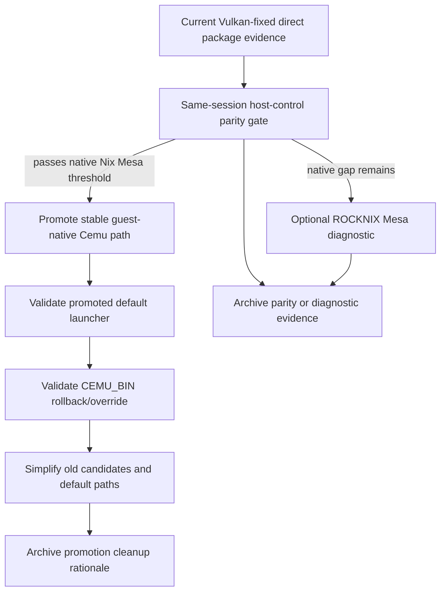
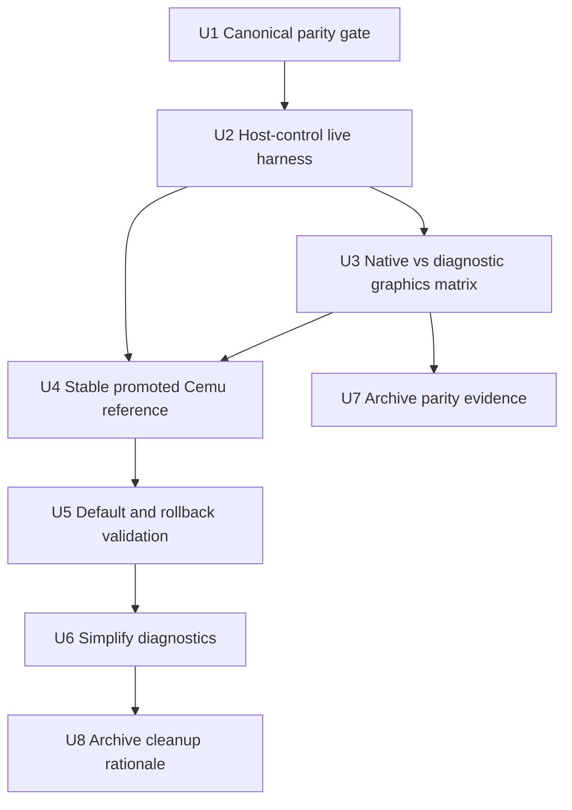

# Fix Cemu Host Parity and Simplification

## Summary

Close the remaining gap between the direct Nix `cemu-rocknix-package` candidate and host ROCKNIX Cemu with same-session evidence, then promote the winning guest-native path and simplify the Cemu experiment stack. The plan treats the current Vulkan-fixed direct package as the baseline, preserves recovery/safety boundaries, and delays cleanup until parity is proven with host-control artifacts.

---

## Problem Frame

The direct ROCKNIX package replica moved Cemu from slow/inconclusive to a viable guest-native path: the Vulkan-fixed candidate reached fast loading and about 38-40 FPS live in-game on native Nix Mesa. Host ROCKNIX Cemu previously reached about 45 FPS through the guest display path, but the final comparison has not yet been performed in the same session, same scene, and same evidence envelope.

The current repo also carries several diagnostic candidates, wrappers, and harness paths that were useful while discovering the fix. Once parity is proven, those should be reduced to a smaller, explicit product path plus a retained rollback/debug surface.

---

## Requirements

- R1. Establish a same-session host-control parity gate for host ROCKNIX Cemu vs the fixed direct Nix `cemu-rocknix-package` candidate.
- R2. Define objective promotion thresholds using visible in-game FPS plus MangoHud recent stats, loading behavior, RPL/HLE timing, and runtime graphics-stack evidence.
- R3. Keep the promoted product path guest-native: direct Nix Cemu plus process-scoped Nix Vulkan-loader visibility, without broad host binds, host Vulkan loader preloads, or diagnostic ROCKNIX Mesa as the default.
- R4. Use ROCKNIX Mesa passthrough only as a diagnostic branch; if native Nix Mesa cannot meet the parity gate but ROCKNIX Mesa does, defer Cemu promotion and open or redirect to a separate graphics-stack plan.
- R5. Promote the winning Cemu through a stable launcher/profile reference instead of a stale raw store path.
- R6. Preserve safety primitives while simplifying: exact cleanup, locks, settings snapshot/restore, power restore, `CEMU_BIN` override, and build/runtime fingerprinting must remain available.
- R7. Remove or demote obsolete failed-candidate defaults only after at least one promoted-default validation and one rollback/override validation pass.
- R8. Update durable docs with the winning run directories, store path, runtime stack, cleanup rationale, and any remaining known deltas.

---

## Scope Boundaries

- Do not redesign the Layer 14 thin-host/recovery architecture.
- Do not productize host `/usr/bin/cemu` inside the guest.
- Do not make broad `/usr`, `/lib`, `/storage/.cache`, host Vulkan-loader, or host Mesa preloads part of the product path.
- Do not solve global Nix Mesa/Freedreno packaging unless same-session evidence proves it is the remaining blocker.
- Do not remove recovery mechanisms, host SSH, `rocknix-recovery-toggle`, exact cleanup, or Cemu override hooks as part of simplification.
- Do not treat title-screen FPS alone as parity; live in-game checkpoint evidence remains decisive.

### Deferred to Follow-Up Work

- A coherent Nix Mesa/Freedreno packaging plan if native Nix Mesa remains materially below host and ROCKNIX Mesa diagnostic runs close the gap.
- Long thermal soak and battery-life tuning after performance correctness and launcher promotion are complete.
- Broader cleanup of non-Cemu Layer 14 experiments that were not part of this Cemu parity path.

---

## Context & Research

### Relevant Code and Patterns

- `projects/ROCKNIX/packages/tools/nix-integration/guest/flakes/cemu/rocknix-package.nix` defines the direct `cemu-rocknix-package` derivation and records build evidence under `$out/nix-support/rocknix-cemu-build/`.
- `projects/ROCKNIX/packages/tools/nix-integration/guest/flakes/cemu/rocknix-package-manifest.nix` records source, patch, CMake, runtime-data, and intentional Nix deltas.
- `projects/ROCKNIX/packages/tools/nix-integration/guest/launchers/start_cemu_guest.sh` is the stable guest launcher. It seeds default SM8550 settings and reads the package-recorded `vulkan-loader-lib-path` for process-scoped Vulkan loader visibility.
- `projects/ROCKNIX/packages/tools/nix-integration/guest/launchers/start_cemu_guest_candidate.sh` preserves launcher semantics while swapping only `CEMU_BIN`.
- `projects/ROCKNIX/packages/tools/nix-integration/guest/launchers/start_cemu_guest_rocknixmesa.sh` is diagnostic-only ROCKNIX Mesa passthrough.
- `projects/ROCKNIX/packages/tools/nix-integration/guest/launchers/remote-cemu-live-campaign.sh` runs live checkpoint campaigns but currently treats cases as guest Cemu binaries rather than first-class host-control cases.
- `projects/ROCKNIX/packages/tools/nix-integration/guest/launchers/remote-cemu-runner.sh` has host-control support but the current variant is hard-coded to an older host BOTW script/profile.
- `projects/ROCKNIX/packages/tools/nix-integration/guest/launchers/remote-cemu-build-fingerprint.sh` captures host/current/candidate build and runtime fingerprints.
- `projects/ROCKNIX/packages/tools/nix-integration/tests/nix-integration-static-checks.sh` is the static safety contract for launcher syntax, forbidden binds, direct package parity, and diagnostic guardrails.
- `projects/ROCKNIX/packages/emulators/standalone/cemu-sa/package.mk` and `projects/ROCKNIX/packages/emulators/standalone/cemu-sa/scripts/start_cemu.sh` remain the host source-of-truth package and launcher references.

### Institutional Learnings

- `docs/solutions/performance-issues/rocknix-layer14-cemu-performance-audit-2026-05-09.md` records the Cemu performance investigation: host Cemu through the guest display path can hit target FPS, Cemu package/runtime parity was the right path, and broad host runtime shortcuts should not become product design.
- `docs/solutions/best-practices/rocknix-layer14-main-space-cold-boot-autostart-2026-05-08.md` records the Layer 14 host/guest boundary and recovery constraints.
- `docs/solutions/runtime-errors/rocknix-nix-remote-copy-profile-store-mismatch-2026-05-05.md` warns that off-device builds must be imported with real Nix store tooling visible to the target runtime namespace.
- `docs/solutions/runtime-errors/rocknix-layer10-stale-running-state-2026-05-06.md` warns that runtime status must be proven from live processes and systemd state, not stale metadata.
- `docs/solutions/developer-experience/nix-layer-9-nspawn-guest-proof-rocknix-2026-05-06.md` reinforces that the guest is removable and the ROCKNIX host remains the recovery plane.

### External References

- External research was skipped. The decisive evidence and contracts are repo-local: ROCKNIX package recipes, Layer 14 docs, and Thor/Fuji run artifacts.

---

## Key Technical Decisions

| Decision | Rationale |
|---|---|
| Use same-session A/B/A or B/A/B before promotion | The remaining 40-vs-45 FPS gap may be scene, thermal, cache, or ordering bias; a same-session comparison is the only fair gate. |
| Default parity threshold: candidate median within 10% of host and p10 within 15% | This gives a concrete close-enough target while still accepting small measurement variance on a handheld device. |
| Treat the fixed direct package as the baseline candidate | It already has fast loading, gameprofile parity, Vulkan active, RPL/HLE near host-like timing, and live 38-40 FPS evidence. |
| Keep ROCKNIX Mesa passthrough diagnostic-only | A pass with passthrough diagnoses a graphics-stack gap; it should trigger a Mesa plan, not silently become the Cemu product path. |
| Promote via a dedicated Nix profile, not raw store path | Raw `/nix/store` paths are brittle across rebuild/import/GC; `/nix/var/nix/profiles/per-user/root/cemu-promoted/bin/Cemu` gives the launcher a simple stable path and a GC root. |
| Simplify only after promotion validation | Removing diagnostics before a passing default-launcher run and rollback run would make regressions harder to explain. |
| Retain core safety harnesses | Cleanup, locks, settings snapshot/restore, power restore, fingerprinting, and `CEMU_BIN` override protect the device and future regressions. |

---

## Open Questions

### Resolved During Planning

- **Should this update the existing package-replica plan or create a follow-up plan?** Create a new follow-up plan so the package-replica plan remains historical context.
- **Is the successful ~40 FPS run using ROCKNIX Mesa passthrough?** No. It used native Nix Mesa 25.2.6 with process-scoped Nix Vulkan-loader visibility.
- **Should simplification happen before or after parity proof?** After parity proof and after validating the promoted default path.

### Deferred to Implementation

- **Exact cleanup list for old diagnostic outputs:** Decide after the parity gate identifies which controls still explain a real risk.
- **Whether native Nix Mesa is close enough without ROCKNIX Mesa diagnostic runs:** Decide from same-session evidence, not plan-time expectation.
- **Whether to keep old override flake outputs indefinitely or move them to archived docs:** Decide after rollback/default validation.

---

## High-Level Technical Design

> *This illustrates the intended approach and is directional guidance for review, not implementation specification. The implementing agent should treat it as context, not code to reproduce.*

### Validation Modes

| Mode | Purpose | Product eligibility |
|---|---|---|
| Host ROCKNIX Cemu control | Establish current device/session ceiling | Control only |
| Direct Nix Cemu + native Nix Mesa | Preferred product path | Eligible if parity gate passes |
| Direct Nix Cemu + ROCKNIX Mesa diagnostic | Isolate graphics-stack delta | Not eligible without a separate Mesa decision |
| Older nixpkgs-derived candidates | Historical controls | Cleanup/demotion candidates |

---

## Implementation Units

### U1. Canonicalize parity thresholds and evidence fields

**Goal:** Define the exact evidence that promotes or rejects the direct Cemu candidate.

**Requirements:** R1, R2, R3, R4, R8

**Dependencies:** None

**Files:**
- Modify: `projects/ROCKNIX/packages/tools/nix-integration/guest/launchers/README.md`
- Modify: `docs/solutions/performance-issues/rocknix-layer14-cemu-performance-audit-2026-05-09.md`
- Modify: `projects/ROCKNIX/packages/tools/nix-integration/tests/nix-integration-static-checks.sh`
- Test: `projects/ROCKNIX/packages/tools/nix-integration/tests/nix-integration-static-checks.sh`

**Approach:**
- Record the Vulkan-fixed direct package result as the current baseline, including the fixed store path, native Nix Mesa stack, visible ~40 FPS correction, and CSV stats.
- Define promotion thresholds in docs: candidate median within 10% of same-session host, p10 within 15%, no visible loading regression, and runtime evidence proving Vulkan + gameprofile + expected Cemu package.
- Keep static checks focused on executable safety invariants: host-control case support, `CEMU_BIN` override preservation, no ROCKNIX Mesa default, and no broad host binds/preloads.
- Make title/loading evidence secondary to in-game checkpoint evidence.

**Patterns to follow:**
- `projects/ROCKNIX/packages/tools/nix-integration/guest/launchers/README.md`
- `docs/solutions/performance-issues/rocknix-layer14-cemu-performance-audit-2026-05-09.md`
- `projects/ROCKNIX/packages/tools/nix-integration/tests/nix-integration-static-checks.sh`

**Test scenarios:**
- Happy path: static checks pass when executable harness invariants are present: host-control case support, candidate override support, and no diagnostic ROCKNIX Mesa default.
- Error path: static checks fail if launcher or harness changes would allow broad host binds/preloads or default to diagnostic ROCKNIX Mesa.
- Integration: the audit document references the current winning candidate, corrected visible FPS note, and relevant run directories without relying on chat memory.

**Verification:**
- A future implementer can tell exactly what evidence is required before promotion.
- The docs preserve the latest successful result and the OpenGL fallback false start.

---

### U2. Add first-class same-session host-control live validation

**Goal:** Make host ROCKNIX Cemu a first-class case in the live parity harness so host and candidate are compared under the same evidence envelope.

**Requirements:** R1, R2, R6

**Dependencies:** U1

**Files:**
- Modify: `projects/ROCKNIX/packages/tools/nix-integration/guest/launchers/remote-cemu-live-campaign.sh`
- Modify: `projects/ROCKNIX/packages/tools/nix-integration/guest/launchers/remote-cemu-runner.sh`
- Modify: `projects/ROCKNIX/packages/tools/nix-integration/guest/launchers/remote-cemu-cleanup.sh`
- Modify: `projects/ROCKNIX/packages/tools/nix-integration/guest/launchers/README.md`
- Modify: `projects/ROCKNIX/packages/tools/nix-integration/tests/nix-integration-static-checks.sh`
- Test: `projects/ROCKNIX/packages/tools/nix-integration/tests/nix-integration-static-checks.sh`

**Approach:**
- Define a typed live-campaign case model so host controls and guest candidates are explicit, for example `guest:<label>:<cemu-bin>` and `host:<label>:<host-launcher-or-mode>:<profile>`.
- Define the supported host-control launch contract before running comparisons: the host case must launch host `/usr/bin/cemu` through the proven guest-display path, accept `RUN_DIR`, `PROFILE`, and `VARIANT` inputs, parameterize/capture display environment such as `XDG_RUNTIME_DIR`, `WAYLAND_DISPLAY`, and any Xwayland/gamescope/MangoHud variables, and write host-side `cemu.log`, MangoHud CSV, env, process, and maps evidence into the child run dir.
- Extend live campaign case handling so a host-control case is not forced through `CEMU_BIN` guest wrappers.
- Replace the hard-coded older `potato-30` host script with an explicit `RUNNER_HOST_LAUNCHER`/typed-case launcher value that matches the parity profile and BOTW scene; if the launcher cannot prove the guest-display path, mark the case inconclusive.
- Add a monotonically increasing case index to child run directories and summary rows so A/B/A or B/A/B runs do not overwrite evidence.
- Ensure host-control runs collect comparable report sections: screenshot, visible checkpoint note, MangoHud CSV or equivalent FPS evidence, host-side process/runtime evidence, Cemu log excerpts, RPL/HLE, driver/runtime stack, power/thermal state, and cleanup results.
- Hold a campaign/global Cemu lock while a launched case is active so another runner cannot corrupt the live checkpoint sample.
- Make cleanup emit a post-cleanup process report and fail the gate if exact-name Cemu/gamescope/MangoHud processes survive, with an explicit manual override only for diagnostics.

**Execution note:** Characterization-first. Preserve the existing guest-only campaign behavior before adding host-control cases.

**Patterns to follow:**
- `projects/ROCKNIX/packages/tools/nix-integration/guest/launchers/remote-cemu-live-campaign.sh`
- `projects/ROCKNIX/packages/tools/nix-integration/guest/launchers/remote-cemu-runner.sh`
- Exact-process cleanup pattern in `projects/ROCKNIX/packages/tools/nix-integration/guest/launchers/remote-cemu-cleanup.sh`

**Test scenarios:**
- Happy path: static checks detect that live campaign supports typed host-control cases and still supports guest `CEMU_BIN` candidates.
- Edge case: repeated A/B/A labels produce distinct indexed child run directories and summary rows instead of overwriting evidence.
- Edge case: runner refuses or clearly reports when another Cemu/gamescope process is already active during a live campaign.
- Error path: host-control missing required host launcher, profile, display environment, or host-side evidence files reports an inconclusive case instead of promoting or deleting evidence.
- Error path: cleanup returns non-zero and marks the case incomplete if exact-name emulator processes survive.
- Integration: a same-session campaign can include host-control and direct Nix candidate cases in one parent report with comparable summary rows.

**Verification:**
- Host-control can be selected as a live campaign case without mutating the product launcher.
- The generated report makes host and candidate rows directly comparable.

---

### U3. Run and classify native Nix Mesa vs diagnostic ROCKNIX Mesa evidence

**Goal:** Determine whether the remaining host gap is Cemu packaging, native Nix Mesa, or measurement noise.

**Requirements:** R1, R2, R3, R4, R8

**Dependencies:** U1, U2

**Files:**
- Modify: `docs/solutions/performance-issues/rocknix-layer14-cemu-performance-audit-2026-05-09.md`
- Modify: `projects/ROCKNIX/packages/tools/nix-integration/guest/launchers/README.md`
- Test expectation: none -- this unit records device validation artifacts and does not add new product behavior beyond U2 harness support.

**Approach:**
- Use the fixed direct package as the primary candidate through native Nix Mesa first.
- If native Nix Mesa misses the parity threshold, run the same direct package through the existing ROCKNIX Mesa diagnostic wrapper to classify the gap.
- Treat a diagnostic-passthrough win as evidence for a future graphics-stack plan, not as Cemu promotion.
- Capture the run directories, visible notes, MangoHud stats, Cemu logs, Vulkan driver versions, shader-cache shapes, and final cleanup state in the audit doc.

**Patterns to follow:**
- `projects/ROCKNIX/packages/tools/nix-integration/guest/launchers/start_cemu_guest_rocknixmesa.sh`
- `projects/ROCKNIX/packages/tools/nix-integration/guest/launchers/remote-cemu-build-fingerprint.sh`
- Existing run-report summaries in `docs/solutions/performance-issues/rocknix-layer14-cemu-performance-audit-2026-05-09.md`

**Test scenarios:**
- Integration: native Nix Mesa candidate run records `Driver version: Mesa 25.2.6` or successor Nix Mesa version and does not use the ROCKNIX Mesa shim.
- Integration: diagnostic run records ROCKNIX Mesa driver evidence and is labeled non-product/diagnostic in the report.
- Error path: missing checkpoint, missing CSV, or missing driver evidence marks the case inconclusive rather than passing or failing parity.

**Verification:**
- The audit clearly states whether native Nix Mesa is sufficient, whether ROCKNIX Mesa closes a remaining gap, and what follow-up is implied.

---

### U4. Promote the winning Cemu through a stable guest reference

**Goal:** Replace brittle hard-coded default Cemu store paths with a stable promoted Cemu reference while preserving candidate override semantics.

**Requirements:** R3, R5, R6, R7

**Dependencies:** U2, U3

**Files:**
- Modify: `projects/ROCKNIX/packages/tools/nix-integration/guest/launchers/start_cemu_guest.sh`
- Modify: `projects/ROCKNIX/packages/tools/nix-integration/guest/launchers/start_cemu_guest_candidate.sh`
- Create or modify: `projects/ROCKNIX/packages/tools/nix-integration/guest/launchers/remote-cemu-promote.sh`
- Modify: `projects/ROCKNIX/packages/tools/nix-integration/guest/flakes/cemu/README.md`
- Modify: `projects/ROCKNIX/packages/tools/nix-integration/guest/launchers/README.md`
- Modify: `projects/ROCKNIX/packages/tools/nix-integration/tests/nix-integration-static-checks.sh`
- Potentially modify only if profile-backed activation proves necessary: `projects/ROCKNIX/packages/tools/nix-integration/guest/profiles/main-space.nix`
- Potentially modify only if profile-backed activation proves necessary: `projects/ROCKNIX/packages/tools/nix-integration/guest/profiles/dev-env.nix`
- Test: `projects/ROCKNIX/packages/tools/nix-integration/tests/nix-integration-static-checks.sh`

**Approach:**
- Use a dedicated promoted-Cemu Nix profile as the stable reference: `/nix/var/nix/profiles/per-user/root/cemu-promoted/bin/Cemu`.
- Add or update a small promotion helper that installs an already-imported direct-package store path into that profile with Nix tooling, making the profile a GC root without wiring the Cemu flake into the whole guest system profile.
- Make `start_cemu_guest.sh` default to the promoted profile path, with a clear missing-profile error that tells the operator to run the promotion helper or pass `CEMU_BIN` explicitly.
- Resolve the real binary before reading package evidence: e.g. derive `CEMU_OUT` from `readlink -f "$CEMU"`, not from the profile user-env path, so the launcher still finds the direct package's `nix-support/rocknix-cemu-build/vulkan-loader-lib-path` metadata after promotion.
- Keep `CEMU_BIN` as the explicit override path for diagnostics and rollback.
- Ensure `start_cemu_guest.sh` still seeds packaged default settings and exposes the process-scoped Vulkan loader path for direct package outputs.
- Avoid making ROCKNIX Mesa passthrough part of the default launcher.

**Patterns to follow:**
- Existing `CEMU_BIN` override in `projects/ROCKNIX/packages/tools/nix-integration/guest/launchers/start_cemu_guest.sh`
- Nix profile/GC-root behavior under `/nix/var/nix/profiles/per-user/root/`
- Static guardrails in `projects/ROCKNIX/packages/tools/nix-integration/tests/nix-integration-static-checks.sh`

**Test scenarios:**
- Happy path: promotion helper points `/nix/var/nix/profiles/per-user/root/cemu-promoted/bin/Cemu` at the imported direct package, and default launcher resolves it without editing the script for each store hash.
- Edge case: `CEMU_BIN` override still launches an alternate candidate and preserves settings/cache semantics.
- Error path: missing promoted profile fails with a clear message before launching BOTW.
- Error path: promoted-profile launch fails static/runtime validation if package metadata lookup uses the profile path instead of the resolved real store output.
- Integration: static checks prevent the diagnostic ROCKNIX Mesa wrapper from becoming the default product launcher and assert that launcher metadata lookup resolves symlinked profile binaries with `readlink -f` or equivalent.

**Verification:**
- The product launcher no longer depends on a stale hard-coded Cemu store hash.
- Diagnostics can still swap candidates without changing the default path.

---

### U5. Validate promoted default and rollback path

**Goal:** Prove that promotion works outside the diagnostic `CEMU_BIN` path and remains reversible.

**Requirements:** R1, R2, R5, R6, R7, R8

**Dependencies:** U4

**Files:**
- Modify: `docs/solutions/performance-issues/rocknix-layer14-cemu-performance-audit-2026-05-09.md`
- Modify: `projects/ROCKNIX/packages/tools/nix-integration/guest/launchers/README.md`
- Test expectation: none -- this unit is device validation and documentation, not new code.

**Approach:**
- Run one clean-start or reboot-equivalent validation through the promoted default launcher, not only through `CEMU_BIN`.
- Run one override/rollback validation proving an alternate Cemu can still be selected with `CEMU_BIN`.
- Record final cleanup evidence: no exact-name Cemu/gamescope/mangohud processes, guest service active, CPU/GPU governors restored, settings restored or intentionally preserved.
- Treat failures as promotion blockers, not cleanup blockers to work around.

**Patterns to follow:**
- `projects/ROCKNIX/packages/tools/nix-integration/guest/launchers/remote-cemu-cleanup.sh`
- `projects/ROCKNIX/packages/tools/nix-integration/guest/launchers/remote-cemu-live-campaign.sh`
- `docs/solutions/runtime-errors/rocknix-layer10-stale-running-state-2026-05-06.md`

**Test scenarios:**
- Integration: promoted default launcher reaches BOTW in-game on the chosen parity profile with runtime evidence matching the winning candidate.
- Integration: override launcher can still select a non-default candidate for rollback/testing.
- Error path: stale Cemu/gamescope processes after validation make the run incomplete until cleanup evidence is captured.

**Verification:**
- Promotion is proven from the default path and rollback remains available.
- The audit records the validation run directories and cleanup state.

---

### U6. Simplify obsolete Cemu diagnostics and stale defaults

**Goal:** Reduce the Cemu experiment surface while keeping the minimum tools needed for safety, rollback, and future performance regressions.

**Requirements:** R6, R7, R8

**Dependencies:** U5

**Files:**
- Modify: `projects/ROCKNIX/packages/tools/nix-integration/guest/flakes/cemu/flake.nix`
- Modify: `projects/ROCKNIX/packages/tools/nix-integration/guest/flakes/cemu/README.md`
- Modify: `projects/ROCKNIX/packages/tools/nix-integration/guest/launchers/README.md`
- Modify: `projects/ROCKNIX/packages/tools/nix-integration/tests/nix-integration-static-checks.sh`
- Potentially modify: `projects/ROCKNIX/packages/tools/nix-integration/guest/flakes/cemu/rocknix-style.nix`
- Potentially modify: `projects/ROCKNIX/packages/tools/nix-integration/guest/flakes/cemu/rocknix-style-classic-sdl.nix`
- Potentially modify: `projects/ROCKNIX/packages/tools/nix-integration/guest/flakes/cemu/rocknix-faithful.nix`
- Test: `projects/ROCKNIX/packages/tools/nix-integration/tests/nix-integration-static-checks.sh`

**Approach:**
- Classify old candidates as one of: remove, keep as archived source, keep as flake output but not default, or document as historical failure.
- Remove stale default store paths and redundant README instructions that predate the direct package promotion.
- Keep the core harnesses: cleanup, fingerprint, live campaign, runtime A/B, candidate override, and ROCKNIX Mesa diagnostic wrapper until at least one soak/release after promotion.
- Make simplification explicit in docs so future agents know why complexity remains where it does.

**Execution note:** Simplification-first after validation. Prefer deleting obsolete paths over adding compatibility abstractions.

**Patterns to follow:**
- Current flake output organization in `projects/ROCKNIX/packages/tools/nix-integration/guest/flakes/cemu/flake.nix`
- Existing static checks that guard direct package parity and launcher safety.

**Test scenarios:**
- Happy path: static checks pass with the promoted direct package as the only product Cemu path.
- Edge case: retained diagnostic outputs are documented as non-default and cannot be accidentally selected by the normal launcher.
- Error path: removing an old output without updating README/static checks fails review because docs still reference it as active.
- Integration: `CEMU_BIN` override and fingerprint scripts still work after cleanup.

**Verification:**
- The default Cemu path is simpler and documented.
- Old experiments are either removed or clearly demoted without losing rollback/fingerprint capability.

---

### U7. Archive parity or diagnostic evidence

**Goal:** Leave durable evidence for the same-session parity result even if promotion is deferred.

**Requirements:** R2, R4, R8

**Dependencies:** U3

**Files:**
- Modify: `docs/solutions/performance-issues/rocknix-layer14-cemu-performance-audit-2026-05-09.md`
- Modify: `projects/ROCKNIX/packages/tools/nix-integration/guest/launchers/README.md`
- Test expectation: none -- documentation consolidation only.

**Approach:**
- Record the final same-session host-control, native Nix candidate, and optional ROCKNIX Mesa diagnostic run directories.
- Capture the accepted or rejected runtime stack: Cemu output, Vulkan loader source, Mesa driver source/version, gameprofile/runtime data status, and remaining known deltas from host.
- If native Nix Mesa passes the parity gate, explicitly mark the direct package eligible for promotion.
- If native Nix Mesa fails and ROCKNIX Mesa diagnostic closes the gap, explicitly defer Cemu promotion and redirect to a graphics-stack plan.
- If both fail, archive the failure as Cemu/scene/runtime evidence before further debugging.

**Patterns to follow:**
- Evidence-log style in `docs/solutions/performance-issues/rocknix-layer14-cemu-performance-audit-2026-05-09.md`
- Launcher documentation style in `projects/ROCKNIX/packages/tools/nix-integration/guest/launchers/README.md`

**Test scenarios:**
- Happy path: docs identify the host-control run, candidate run, and whether the candidate passed the parity gate.
- Edge case: if native Nix Mesa does not meet parity but ROCKNIX Mesa does, docs defer promotion or redirect to graphics-stack work instead of claiming Cemu parity.
- Error path: missing run directory references or missing runtime-stack description make the archival incomplete.

**Verification:**
- A future maintainer can reproduce the parity decision trail without reading chat history.
- The docs distinguish product-eligible native Nix evidence from diagnostic ROCKNIX Mesa evidence.

---

### U8. Archive promotion cleanup rationale

**Goal:** Leave durable evidence explaining what was promoted, what was removed, and what remains intentionally diagnostic.

**Requirements:** R7, R8

**Dependencies:** U6

**Files:**
- Modify: `docs/solutions/performance-issues/rocknix-layer14-cemu-performance-audit-2026-05-09.md`
- Modify: `projects/ROCKNIX/packages/tools/nix-integration/guest/flakes/cemu/README.md`
- Modify: `projects/ROCKNIX/packages/tools/nix-integration/guest/launchers/README.md`
- Test expectation: none -- documentation consolidation only.

**Approach:**
- Record the promoted default, rollback validation, and final cleanup run directories.
- Document which old candidates/wrappers were removed or retained and why.
- Include a short future-work note for any residual gap, especially if host remains a few FPS faster.

**Patterns to follow:**
- Evidence-log style in `docs/solutions/performance-issues/rocknix-layer14-cemu-performance-audit-2026-05-09.md`
- Launcher documentation style in `projects/ROCKNIX/packages/tools/nix-integration/guest/launchers/README.md`

**Test scenarios:**
- Happy path: docs identify the exact promoted profile path and the evidence that justified simplification.
- Edge case: retained diagnostic wrappers are documented as non-default and linked to their specific retained purpose.
- Error path: missing cleanup rationale or missing rollback evidence makes the archival incomplete.

**Verification:**
- The docs distinguish product path, diagnostic path, and historical failures.
- A future maintainer can see why the final build is simpler than the investigation state.

---

## System-Wide Impact

- **Interaction graph:** Cemu package output feeds the guest launcher, BOTW profile launcher, remote validation harnesses, and documentation/static checks. Host-control adds a host-side case to a mostly guest-side campaign flow.
- **Error propagation:** Missing promoted Cemu, missing Vulkan loader path, missing host-control launcher, missing checkpoint, or missing CSV should produce inconclusive/failing reports rather than silent promotion.
- **State lifecycle risks:** Shared `/storage/.config/Cemu` and shader caches can bias A/B results; settings snapshots and cache-shape evidence must remain part of validation. Cleanup must restore power governors and terminate exact Cemu/gamescope/MangoHud processes.
- **API surface parity:** `CEMU_BIN` override, run-directory report schema, and live checkpoint file semantics are de facto operator APIs and should remain stable through simplification.
- **Integration coverage:** Same-session host/candidate validation is required because unit/static checks cannot prove scene, thermal, GPU-driver, or cache parity.
- **Unchanged invariants:** Host ROCKNIX remains the recovery plane; no broad host runtime binds or host Vulkan-loader preloads become product path; ROCKNIX Mesa passthrough remains diagnostic unless a separate plan promotes it.

---

## Risks & Dependencies

| Risk | Mitigation |
|------|------------|
| Same-session host-control cannot be captured through the same display/evidence path | Treat the run as inconclusive and fix the harness before promotion. |
| Candidate appears close due to scene/cache/order bias | Use same profile/scene, explicit checkpoint notes, cache-shape evidence, and A/B/A or B/A/B ordering. |
| Native Nix Mesa remains slightly below host | Use ROCKNIX Mesa diagnostic to classify the gap, then decide whether to accept the gap or open a Mesa plan. |
| Simplification removes useful diagnostics too early | Require promoted-default and rollback validation before cleanup; retain core fingerprint/live/cleanup harnesses for at least one soak/release. |
| Stable Cemu reference breaks after GC or import changes | Use the dedicated promoted-Cemu Nix profile as the GC root and keep explicit missing-profile errors. |
| Host recovery boundary is weakened during cleanup | Static checks and docs must continue forbidding broad host binds/preloads and diagnostic wrappers as defaults. |

---

## Documentation / Operational Notes

- Update the Cemu performance audit with the corrected visible ~40 FPS note and all final parity run directories.
- Keep Thor validation artifacts under `/storage/.guest/runs/`; docs should reference run directories, not copy large artifacts into git.
- Heavy Cemu builds remain a Fuji/aarch64-builder task; Thor is for import and live validation only.
- After simplification, the README should clearly separate normal launch, candidate override, host-control validation, and diagnostic ROCKNIX Mesa workflows.
- The PR description should include a Post-Deploy Monitoring & Validation section covering first-boot default Cemu launch, rollback override, and cleanup/power-state confirmation.

---

## Sources & References

- Origin context: chat request to reach host parity and then simplify the Cemu experiment stack.
- Prior plan: `docs/plans/2026-05-10-002-fix-rocknix-cemu-package-replica-plan.md`
- Cemu audit: `docs/solutions/performance-issues/rocknix-layer14-cemu-performance-audit-2026-05-09.md`
- Layer 14 contract: `projects/ROCKNIX/packages/tools/nix-integration/docs/layer14-main-space-contract.md`
- Direct Cemu package: `projects/ROCKNIX/packages/tools/nix-integration/guest/flakes/cemu/rocknix-package.nix`
- Cemu manifest: `projects/ROCKNIX/packages/tools/nix-integration/guest/flakes/cemu/rocknix-package-manifest.nix`
- Guest launcher: `projects/ROCKNIX/packages/tools/nix-integration/guest/launchers/start_cemu_guest.sh`
- Live campaign harness: `projects/ROCKNIX/packages/tools/nix-integration/guest/launchers/remote-cemu-live-campaign.sh`
- Host/source package: `projects/ROCKNIX/packages/emulators/standalone/cemu-sa/package.mk`
- Static checks: `projects/ROCKNIX/packages/tools/nix-integration/tests/nix-integration-static-checks.sh`
