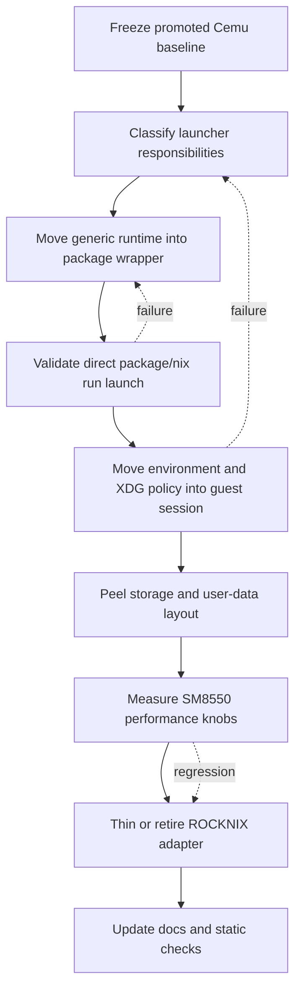
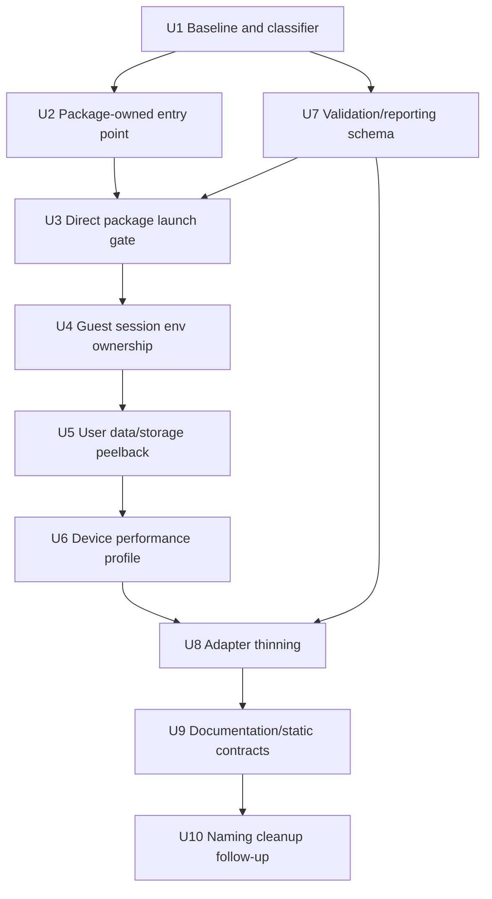

# Refactor Cemu Guest-Owned Runtime Peelback

## Summary

Peel Cemu away from ROCKNIX launcher glue by moving generic runtime responsibilities into the Nix Cemu package and Layer 14 guest, one layer at a time. Each peelback must pass live in-game validation before the next layer is removed, while measured SM8550/Thor performance optimizations stay explicit and reversible.

---

## Problem Frame

The promoted direct Nix Cemu package now runs BOTW at host-like performance using Nix Cemu, Nix Vulkan loader, and Nix Mesa/Freedreno. That proves the guest-native emulator path is viable, but the current runtime still depends on `start_cemu_guest.sh` and surrounding ROCKNIX-oriented glue for Vulkan loader visibility, `/storage` paths, config seeding, user-data symlinks, display/audio defaults, CPU/GPU tuning, and validation harness setup.

The long-term Layer 14 direction is a Nix-owned runtime that can eventually peel away from ROCKNIX as more than a recovery/device substrate. This plan turns the current launcher into a measured decomposition target: move what belongs to the Nix package or guest session inward, keep only proven device-specific performance controls, and avoid letting BOTW/test harness details define the Cemu derivation.

---

## Requirements

- R1. Preserve the current known-good Cemu performance baseline before each peelback: native Nix Mesa/Freedreno, Vulkan backend active, fast loading, and live in-game FPS comparable to the promoted run.
- R2. Move generic Cemu runtime requirements into Nix-owned surfaces: package wrapper, package metadata, guest session environment, or guest device profile.
- R3. Remove ROCKNIX-specific assumptions from the Cemu derivation/runtime unless they are either required for correctness on any Nix guest or measured as SM8550/Thor performance optimizations.
- R4. Keep host ROCKNIX as the thin device/recovery substrate; host-side helpers may remain only when the guest cannot safely own a privileged hardware knob yet.
- R5. Treat BOTW as the validation workload, not as derivation scope: no BOTW-specific build assertions, graphics-pack presets, profile mutations, or title-specific paths should become part of the generic Cemu derivation or package entry point.
- R6. Classify each launcher behavior before moving it: required correctness, measured optimization, temporary ROCKNIX adapter, or removable scaffolding.
- R7. Provide an operator-visible rollback path after every peelback: previous promoted profile generation and `CEMU_BIN` override must remain usable until the new package-owned entry point is proven.
- R8. Keep validation evidence decisive and comparable: live operator checkpoint, MangoHud CSV, Cemu log, Vulkan driver evidence, process/env/maps where relevant, cleanup proof, and PASS/FAIL/INCONCLUSIVE classification.
- R9. Preserve recovery boundaries: no broad host `/usr`, `/lib`, host Vulkan loader preload, broad `/storage`, or host `/etc` dependency may enter the product path.

---

## Scope Boundaries

- Do not change Cemu source behavior or port new emulators in this plan.
- Do not make BOTW-specific assertions, launcher/profile behavior, or title-specific paths part of the generic Cemu derivation. Bundled upstream `gameProfiles` may include BOTW as data, but the derivation should not single BOTW out as its correctness contract.
- Do not remove the host-control harness, `CEMU_BIN` override, cleanup scripts, or rollback profile until package-owned launch has passed live validation.
- Do not productize ROCKNIX Mesa passthrough; it remains diagnostic-only.
- Do not broaden nspawn binds to make Cemu easier; prefer guest-owned state or narrow explicit binds.
- Do not claim a peelback is safe from title-screen/headless results alone; in-game validation remains required.
- Do not force guest ownership of privileged sysfs controls until evidence shows the guest can safely apply and restore them.

### Deferred to Follow-Up Work

- Full Nix-owned graphical session replacement beyond the Cemu-specific entry point.
- Long thermal soak and battery profile tuning after the minimal peelback path remains performant.
- Reworking the full game launcher UI and all BOTW profile exposure policies beyond what is needed for validation.
- Applying the peelback pattern to Switch emulators or other standalone emulators.

---

## Context & Research

### Relevant Code and Patterns

- `projects/ROCKNIX/packages/tools/nix-integration/guest/flakes/cemu/flake.nix` exposes the current Cemu flake output and should become the single build/run entry point.
- `projects/ROCKNIX/packages/tools/nix-integration/guest/flakes/cemu/rocknix-package.nix` is the direct Cemu derivation. It installs `$out/bin/Cemu`, `$out/bin/cemu`, runtime resources, current SM8550 default settings, and build evidence under `$out/nix-support/rocknix-cemu-build/`. The peelback should move SM8550 runtime defaults out of the generic package surface.
- `projects/ROCKNIX/packages/tools/nix-integration/guest/flakes/cemu/rocknix-package-manifest.nix` records the source/patch/build contract mirrored from ROCKNIX `cemu-sa`.
- `projects/ROCKNIX/packages/tools/nix-integration/guest/launchers/start_cemu_guest.sh` is the current decomposition target: promoted profile selection, `CEMU_BIN`, Vulkan loader path, `/storage` config/data layout, BIOS/user-data symlinks, display/audio defaults, XDG paths, SDL hints, and launch logging.
- `projects/ROCKNIX/packages/tools/nix-integration/guest/launchers/botw-guest.sh` owns BOTW profile mutation, CPU/GPU tuning, Sway launch integration, and Cemu thread pinning. It should remain validation/game-specific rather than generic Cemu runtime.
- `projects/ROCKNIX/packages/tools/nix-integration/system.d/rocknix-guest-v2.service` defines the host/guest boundary and currently binds device nodes, sysfs control surfaces, `/storage/roms` read-only, and `/storage/.guest` read-write.
- `projects/ROCKNIX/packages/tools/nix-integration/guest/profiles/main-space.nix` owns the guest Sway session environment and is the likely home for guest-session defaults that should not live in the Cemu package.
- `projects/ROCKNIX/packages/tools/nix-integration/guest/launchers/remote-cemu-runner.sh`, `remote-cemu-live-campaign.sh`, `remote-cemu-cleanup.sh`, and `remote-cemu-promote.sh` provide the validation and rollback harness that should gate each peelback.
- `projects/ROCKNIX/packages/tools/nix-integration/tests/nix-integration-static-checks.sh` is the static contract for forbidding old Cemu variants, broad host leaks, and unsafe launcher changes.

### Institutional Learnings

- `docs/solutions/performance-issues/rocknix-layer14-cemu-performance-audit-2026-05-09.md` records the decisive Cemu finding: native Nix Mesa/Freedreno is product-eligible; the remaining performance issue was launcher/affinity hygiene, not ROCKNIX Mesa passthrough.
- `docs/solutions/best-practices/rocknix-layer14-main-space-cold-boot-autostart-2026-05-08.md` records that the guest should own the main graphical session while the host remains recovery/control plane.
- `docs/solutions/runtime-errors/rocknix-layer10-stale-running-state-2026-05-06.md` warns not to trust stale state; validation and cleanup must prove liveness from processes/systemd state.
- `docs/solutions/best-practices/stage-nspawn-rootfs-from-onboard-nix-closures-rocknix-2026-05-06.md` warns that guest/rootfs cleanup must not touch host `/nix`, profile, or daemon state.
- `docs/solutions/best-practices/rocknix-sm8550-power-profiling-2026-05-04.md` establishes the pattern for reversible CPU/GPU tuning: save restore state, validate live clocks, and prove in-game benefit.

### External References

- External research was skipped. The relevant constraints are repo-local: the current Cemu package, Layer 14 host/guest boundary, and measured Thor validation artifacts.

---

## Key Technical Decisions

| Decision | Rationale |
|---|---|
| Decompose the launcher before deleting it | The launcher currently encodes real correctness and performance knowledge. Classifying each responsibility prevents accidental regression while still moving toward a pure guest-owned entry point. |
| Prefer package wrapper for generic Nix runtime setup | Vulkan loader visibility and package-relative resource discovery are intrinsic to running Nix Cemu and should not depend on ROCKNIX scripts. |
| Prefer guest session/device profile for environment and performance policy | Display/audio/XDG defaults and SM8550 tuning are session/device concerns, not Cemu derivation concerns. Keeping them guest-owned supports the long-term peel-away goal. |
| Keep host helper only for currently privileged hardware controls | If the guest cannot safely write GPU/CPU sysfs knobs yet, host-side glue may remain, but it must be explicit, measured, and temporary. |
| Use BOTW only as validation workload | BOTW is the proven stress test and evidence source, but its graphics profiles and title-specific mutations must not define generic Cemu packaging. |
| Classify missing evidence as INCONCLUSIVE, not PASS | Each peelback could fail because of missing logs/checkpoints rather than real performance. Promotion should require complete evidence, not interpretation. |
| Rename away from `rocknix-package` only after behavior is stable | The naming cleanup is desirable, but it should follow package-owned launch proof so history remains easy to trace during risky runtime changes. |

---

## Open Questions

### Resolved During Planning

- **Should the plan target a pure derivation immediately or an iterative peelback?** Iterative peelback. The current launcher contains proven correctness/performance behavior, so each layer should be moved and validated independently.
- **Should BOTW-specific code be in the Cemu derivation?** No. BOTW remains the validation workload only.
- **Should SM8550/Thor optimizations be forbidden?** No. Keep them when live evidence proves they improve Cemu on this device; place them in a device/session profile rather than the generic package.
- **Should the guest own as much as possible?** Yes. Destination priority is package wrapper first for generic runtime, guest session/device profile second for device/session policy, host adapter only when unavoidable.

### Deferred to Implementation

- **Exact final wrapper name:** Choose during implementation between preserving `$out/bin/Cemu` as wrapped, adding `$out/bin/cemu`, or adding a separate `$out/bin/rocknix-cemu` compatibility wrapper. The plan requires one package-owned generic entry point, not a specific filename.
- **Whether existing `/storage` config should become a narrow bind, guest-owned migration, or explicit session env:** Decide after auditing current live paths and nspawn visibility.
- **Whether CPU affinity remains necessary for guest Cemu:** The host-control evidence proved affinity matters for host Cemu; guest Cemu should be measured with and without the policy before making it default.
- **Whether GPU tuning can be guest-owned:** Current evidence suggests guest sysfs writes may be limited under nspawn; implementation should probe safely and retain host helper only if needed.
- **Where SM8550 default settings belong:** Move SM8550 runtime defaults out of the generic Cemu derivation into a guest/device profile or compatibility adapter. The package may keep provenance/example material only if it is not used as generic runtime default state.

---

## High-Level Technical Design

> *This illustrates the intended approach and is directional guidance for review, not implementation specification. The implementing agent should treat it as context, not code to reproduce.*

### Responsibility Destination Matrix

| Current responsibility | Preferred destination | Keep only if |
|---|---|---|
| Vulkan loader library visibility | Cemu package wrapper | Required to keep Vulkan backend active |
| Package resource/data discovery | Cemu package | Required for generic Cemu game profiles/fonts/resources; not as BOTW-specific assertions |
| XDG/HOME defaults | Guest session profile | Needed for normal guest launch, not package-specific |
| `/storage` Cemu config/data paths | Guest session or migration adapter | Required to preserve existing user state; never pure package default |
| BIOS/key/mlc symlinks | Guest session/user-data adapter | Required for compatibility with existing ROCKNIX storage layout |
| Wayland/audio defaults | Guest session profile | Required because session does not otherwise provide them |
| SDL screensaver hint | Package wrapper or guest session | Required to avoid reproducible crash |
| CPU affinity | SM8550 guest/device profile | Proven in-game benefit vs unpinned guest launch |
| CPU/GPU governor/clocks | SM8550 guest/device profile or temporary host helper | Proven in-game benefit and safe restore path |
| BOTW settings/profile mutation | Game-specific validation/helper layer | Never generic Cemu derivation or package-wrapper scope |
| Host-control launcher | Diagnostic harness | Needed for future parity comparisons only |

---

## Implementation Units

### U1. Freeze baseline and classify launcher responsibilities

**Goal:** Create a concrete inventory of every current Cemu runtime responsibility and classify it before moving anything.

**Requirements:** R1, R3, R6, R8

**Dependencies:** None

**Files:**
- Modify: `projects/ROCKNIX/packages/tools/nix-integration/guest/launchers/README.md`
- Modify: `docs/solutions/performance-issues/rocknix-layer14-cemu-performance-audit-2026-05-09.md`
- Modify: `docs/plans/2026-05-11-001-refactor-cemu-guest-owned-runtime-peelback-plan.md`
- Test: `projects/ROCKNIX/packages/tools/nix-integration/tests/nix-integration-static-checks.sh`

**Approach:**
- Record the promoted baseline run as the reference gate, including runtime stack, live FPS range, MangoHud median/p10, and cleanup result.
- Add a launcher responsibility table covering each meaningful block in `start_cemu_guest.sh` and related BOTW/performance wrappers.
- Classify every behavior as required correctness, measured optimization, temporary ROCKNIX adapter, or removable scaffolding.
- For each item, record intended destination: package wrapper, guest session profile, SM8550 device profile, host adapter, validation harness, or deletion.
- Treat missing classification as a blocker for deletion, not as permission to simplify.

**Patterns to follow:**
- Current audit style in `docs/solutions/performance-issues/rocknix-layer14-cemu-performance-audit-2026-05-09.md`
- Launcher documentation in `projects/ROCKNIX/packages/tools/nix-integration/guest/launchers/README.md`

**Test scenarios:**
- Happy path: static checks continue to pass with the current promoted path and no launcher behavior moved yet.
- Integration: baseline evidence includes Vulkan backend, Nix Mesa/Freedreno driver line, operator-visible in-game FPS, and cleanup proof.
- Edge case: a responsibility with no destination is explicitly marked unresolved rather than silently dropped.

**Verification:**
- A reviewer can inspect the table and know exactly why each current launcher behavior is kept, moved, measured, or removed.
- The current known-good path is reproducible before U2 begins.

---

### U2. Add a package-owned Cemu entry point for generic Nix runtime setup

**Goal:** Move generic package-relative runtime setup out of `start_cemu_guest.sh` and into the Cemu package output.

**Requirements:** R2, R3, R5, R9

**Dependencies:** U1

**Files:**
- Modify: `projects/ROCKNIX/packages/tools/nix-integration/guest/flakes/cemu/rocknix-package.nix`
- Modify: `projects/ROCKNIX/packages/tools/nix-integration/guest/flakes/cemu/README.md`
- Modify: `projects/ROCKNIX/packages/tools/nix-integration/guest/launchers/remote-cemu-build-fingerprint.sh`
- Modify: `projects/ROCKNIX/packages/tools/nix-integration/tests/nix-integration-static-checks.sh`
- Test: `projects/ROCKNIX/packages/tools/nix-integration/tests/nix-integration-static-checks.sh`

**Approach:**
- Install a package-owned executable entry point that can run Cemu with package-relative runtime setup.
- Move Vulkan loader library path handling into that entry point so a direct package launch remains Vulkan-capable without external ROCKNIX glue.
- Keep the wrapper generic: it may use package-relative `$out` metadata and standard `HOME`/`XDG_*`/environment values, but it should not hardcode `/storage`, promoted profiles, BOTW paths, Thor display names, SM8550 runtime defaults, or validation run directories.
- Replace BOTW-specific build assertions with generic runtime-data assertions, such as presence of `gameProfiles` and `resources`; BOTW profile checks belong in the validation harness, not in the generic derivation.
- Keep `$out/bin/Cemu` and `$out/bin/cemu` compatibility clear. If wrapping the real binary, retain a debuggable real-binary path and make fingerprint scripts understand both surfaces.
- Extend static checks to prove the wrapper exists, does not mention forbidden host paths/preloads, and still records/uses the package's Nix Vulkan loader path.

**Execution note:** Characterization-first. Fingerprint the old and new package output before live validation so regressions in ELF/resource/runtime evidence are visible before FPS interpretation.

**Patterns to follow:**
- Build evidence pattern in `projects/ROCKNIX/packages/tools/nix-integration/guest/flakes/cemu/rocknix-package.nix`
- Forbidden-pattern checks in `projects/ROCKNIX/packages/tools/nix-integration/tests/nix-integration-static-checks.sh`

**Test scenarios:**
- Happy path: package build produces a package-owned Cemu entry point and retains generic runtime resources under `$out/share/Cemu`.
- Happy path: static checks confirm the package entry point uses package-relative Vulkan loader metadata and does not depend on host `/usr`, host `/lib`, host Vulkan loader preloads, or `/storage` hardcoding.
- Error path: static checks fail if the wrapper loses Vulkan loader setup or reintroduces ROCKNIX Mesa as a default.
- Integration: fingerprint report can identify the wrapper, real binary, package resources, and Vulkan loader path.

**Verification:**
- Direct package execution has a plausible path to Vulkan without `start_cemu_guest.sh` doing the loader setup.
- The generic package entry point and derivation contract contain no BOTW-specific or ROCKNIX session assumptions beyond documented source provenance.

---

### U3. Validate direct package launch without promoted-profile dependency

**Goal:** Prove the package-owned entry point can run the known-good Cemu build directly, without depending on the promoted profile launcher default.

**Requirements:** R1, R2, R7, R8

**Dependencies:** U2, U7

**Files:**
- Modify: `projects/ROCKNIX/packages/tools/nix-integration/guest/launchers/remote-cemu-runner.sh`
- Modify: `projects/ROCKNIX/packages/tools/nix-integration/guest/launchers/remote-cemu-live-campaign.sh`
- Modify: `projects/ROCKNIX/packages/tools/nix-integration/guest/launchers/remote-cemu-build-fingerprint.sh`
- Modify: `projects/ROCKNIX/packages/tools/nix-integration/guest/launchers/README.md`
- Test: `projects/ROCKNIX/packages/tools/nix-integration/tests/nix-integration-static-checks.sh`

**Approach:**
- Add a validation mode that runs the direct package entry point by explicit store path or `nix run`-equivalent guest command, while preserving the same game-specific validation workload. This path must bypass `start_cemu_guest.sh` Vulkan/env setup so it cannot false-pass through the old launcher.
- Provide only a minimal explicit compatibility environment for user-data paths during this gate if needed; document that U3 proves package-owned Vulkan/runtime setup, while U5 owns the deeper `/storage` and user-data peelback.
- Compare against the current promoted-profile launch in the same session where possible.
- Keep `CEMU_BIN` and profile rollback as the fallback path until direct package launch passes the same live gate.
- Capture whether runtime behavior depends on the profile symlink or only on package-owned wrapper metadata.
- Record failures as package-entry failures, not as Cemu performance failures, when Vulkan/log/runtime evidence is missing.

**Patterns to follow:**
- Typed campaign cases in `projects/ROCKNIX/packages/tools/nix-integration/guest/launchers/remote-cemu-live-campaign.sh`
- Fingerprint report layout in `projects/ROCKNIX/packages/tools/nix-integration/guest/launchers/remote-cemu-build-fingerprint.sh`

**Test scenarios:**
- Happy path: a direct package case and promoted-profile case run in one validation campaign with separate indexed child directories.
- Happy path: direct package launch logs Vulkan backend and Nix Mesa/Freedreno driver evidence.
- Error path: missing direct package entry point, use of `start_cemu_guest.sh` for the supposed direct case, or missing Vulkan evidence marks the case INCONCLUSIVE and preserves rollback.
- Integration: `CEMU_BIN` override still runs through the old launcher path for rollback while direct package validation is active.

**Verification:**
- Direct package launch reaches the same in-game checkpoint with performance close to the promoted baseline.
- Promotion remains rollback-safe if direct launch fails.

---

### U4. Move display/audio/XDG defaults into the guest session layer

**Goal:** Remove generic session environment setup from the Cemu launcher and make the Layer 14 guest session provide it.

**Requirements:** R2, R3, R4, R9

**Dependencies:** U3

**Files:**
- Modify: `projects/ROCKNIX/packages/tools/nix-integration/guest/profiles/main-space.nix`
- Modify: `projects/ROCKNIX/packages/tools/nix-integration/guest/modules/display.nix`
- Modify: `projects/ROCKNIX/packages/tools/nix-integration/guest/modules/audio.nix`
- Modify: `projects/ROCKNIX/packages/tools/nix-integration/guest/launchers/start_cemu_guest.sh`
- Modify: `projects/ROCKNIX/packages/tools/nix-integration/tests/nix-integration-static-checks.sh`
- Test: `projects/ROCKNIX/packages/tools/nix-integration/tests/nix-integration-static-checks.sh`

**Approach:**
- Identify environment variables currently set only for Cemu but actually needed by the guest graphical/audio session, such as `XDG_RUNTIME_DIR`, `WAYLAND_DISPLAY`, audio defaults, and safe HOME/XDG base dirs.
- Move session-wide defaults into the Sway kiosk service or relevant guest modules where they apply to all guest-launched graphical apps.
- Leave package entry point responsible only for Cemu/package-specific environment, such as package-relative Vulkan loader setup and any proven Cemu-specific SDL hint.
- Validate that direct package launch inherits the needed environment from the guest session rather than from a ROCKNIX Cemu wrapper.
- Avoid forcing `/storage` from the package. If `/storage` remains the intended user home for the guest session, make that a guest-session decision.

**Patterns to follow:**
- `systemd.services.rocknix-sway-kiosk.environment` in `projects/ROCKNIX/packages/tools/nix-integration/guest/profiles/main-space.nix`
- Display/audio module structure under `projects/ROCKNIX/packages/tools/nix-integration/guest/modules/`

**Test scenarios:**
- Happy path: launching from the guest session provides display/audio/XDG environment without Cemu-specific launcher exports.
- Edge case: launching from an SSH/debug shell without full session env fails clearly or requires explicit env rather than silently writing to unexpected root paths.
- Error path: missing Wayland/audio environment produces a visible validation failure and does not mutate user config.
- Integration: another graphical guest app is not broken by moving environment defaults into the session.

**Verification:**
- Cemu no longer needs `start_cemu_guest.sh` to fill generic display/audio/XDG defaults for normal session launches.
- Static checks document which variables are guest-session-owned versus package-owned.

---

### U5. Peel `/storage` and Cemu user-data layout into a guest-owned adapter

**Goal:** Separate Cemu's generic package entry point from the ROCKNIX-era `/storage` config, BIOS, keys, and MLC layout while preserving existing user state.

**Requirements:** R2, R3, R4, R7, R9

**Dependencies:** U4

**Files:**
- Modify: `projects/ROCKNIX/packages/tools/nix-integration/guest/launchers/start_cemu_guest.sh`
- Modify: `projects/ROCKNIX/packages/tools/nix-integration/guest/profiles/main-space.nix`
- Modify: `projects/ROCKNIX/packages/tools/nix-integration/system.d/rocknix-guest-v2.service`
- Modify: `projects/ROCKNIX/packages/tools/nix-integration/docs/layer14-main-space-contract.md`
- Modify: `projects/ROCKNIX/packages/tools/nix-integration/tests/nix-integration-static-checks.sh`
- Test: `projects/ROCKNIX/packages/tools/nix-integration/tests/nix-integration-static-checks.sh`

**Approach:**
- Audit the live visibility of `/storage/.config/Cemu`, `/storage/.local/share/Cemu`, `/storage/roms`, and `/storage/roms/bios/cemu` from inside the guest against the nspawn unit's documented binds.
- Decide whether existing Cemu state remains a narrow host bind, migrates once into guest-owned storage, or is expressed through explicit session environment variables.
- Move Cemu user-data setup into a guest-owned adapter that can eventually be replaced by normal XDG paths. This adapter may preserve compatibility with existing ROCKNIX storage, but it should not be in the pure package wrapper.
- Make config seeding idempotent and non-destructive: seed defaults only when no user config exists, and never overwrite mutated settings.
- Make key/online/mlc symlinks explicit compatibility behavior, not hidden generic package behavior.
- Add validation that direct package launch can find settings, keys, MLC data, and saves through the chosen guest-owned layout.

**Execution note:** Characterization-first. Before moving paths, capture current live path resolution and write/mutation behavior so save/config regressions are distinguishable from performance regressions.

**Patterns to follow:**
- Current path setup in `projects/ROCKNIX/packages/tools/nix-integration/guest/launchers/start_cemu_guest.sh`
- Narrow-bind principle in `projects/ROCKNIX/packages/tools/nix-integration/system.d/rocknix-guest-v2.service`
- Layer 14 boundary docs in `projects/ROCKNIX/packages/tools/nix-integration/docs/layer14-main-space-contract.md`

**Test scenarios:**
- Happy path: existing Cemu settings and saves remain available after the path peelback.
- Happy path: a fresh guest state seeds default Cemu settings once and launches without overwriting later user changes.
- Edge case: BIOS/key directories are missing; the adapter creates or reports the expected paths without broad `/storage` assumptions in the package wrapper.
- Error path: read-only or missing bind paths produce a visible failure and leave previous user data intact.
- Integration: direct package launch and legacy `CEMU_BIN` rollback both resolve the same user-data state during the transition.

**Verification:**
- The pure Cemu package no longer hardcodes ROCKNIX `/storage` layout.
- Any remaining `/storage` compatibility lives in a named guest adapter or session config with documented migration/rollback behavior.

---

### U6. Measure and relocate SM8550 performance controls

**Goal:** Keep only device-specific performance enhancements that measurably improve in-game Cemu on Thor/SM8550, and move them out of the generic package path.

**Requirements:** R1, R3, R4, R6, R8

**Dependencies:** U5

**Files:**
- Modify: `projects/ROCKNIX/packages/tools/nix-integration/guest/launchers/botw-guest.sh`
- Modify: `projects/ROCKNIX/packages/tools/nix-integration/guest/launchers/host-tune.sh`
- Modify: `projects/ROCKNIX/packages/tools/nix-integration/guest/profiles/main-space.nix`
- Modify: `projects/ROCKNIX/packages/tools/nix-integration/docs/layer14-main-space-contract.md`
- Modify: `projects/ROCKNIX/packages/tools/nix-integration/guest/launchers/README.md`
- Test: `projects/ROCKNIX/packages/tools/nix-integration/tests/nix-integration-static-checks.sh`

**Approach:**
- Run paired validations for each performance control independently: CPU affinity, CPU governor/caps, GPU governor/frequency, SDL hints, and any Mesa/Freedreno env knobs.
- Classify each control as measured SM8550 optimization, no-op/removable, or privileged host-temporary.
- Move measured guest-safe controls into a guest SM8550 performance profile or session helper rather than the generic Cemu package.
- Keep host-side `host-tune.sh` only for controls the guest cannot safely own, and make its temporary status explicit in docs/static checks.
- Record the live benefit or non-benefit for each retained knob, using in-game FPS/frame pacing and thermals rather than theoretical performance.
- Ensure every mutable sysfs change has restore behavior and cleanup evidence.

**Patterns to follow:**
- Power profiling guidance in `docs/solutions/best-practices/rocknix-sm8550-power-profiling-2026-05-04.md`
- Existing CPU affinity/power logic in `projects/ROCKNIX/packages/tools/nix-integration/guest/launchers/botw-guest.sh`
- Host tune helper in `projects/ROCKNIX/packages/tools/nix-integration/guest/launchers/host-tune.sh`

**Test scenarios:**
- Happy path: pinned and unpinned guest Cemu runs are compared under the same scene/profile and produce an explicit keep/remove decision.
- Happy path: each retained CPU/GPU tuning control has before/after clock evidence and restore evidence.
- Edge case: guest cannot write a sysfs control; the plan records host helper as temporary instead of silently failing.
- Error path: a tuning command fails or cleanup cannot restore clocks/governors; validation marks the run INCONCLUSIVE or FAIL and blocks promotion.
- Integration: retained performance controls improve or preserve FPS without requiring the generic package wrapper to know about SM8550.

**Verification:**
- Every non-generic performance behavior has live evidence attached to its decision.
- The generic Cemu derivation remains free of SM8550 runtime policy; any SM8550 settings live in a guest/device profile or clearly non-runtime provenance/example location.

---

### U7. Standardize per-peelback validation reports

**Goal:** Make every peelback produce comparable PASS/FAIL/INCONCLUSIVE evidence so decisions do not rely on memory or title-screen impressions.

**Requirements:** R1, R7, R8

**Dependencies:** U1

**Files:**
- Modify: `projects/ROCKNIX/packages/tools/nix-integration/guest/launchers/remote-cemu-runner.sh`
- Modify: `projects/ROCKNIX/packages/tools/nix-integration/guest/launchers/remote-cemu-live-campaign.sh`
- Modify: `projects/ROCKNIX/packages/tools/nix-integration/guest/launchers/remote-cemu-cleanup.sh`
- Modify: `projects/ROCKNIX/packages/tools/nix-integration/guest/launchers/README.md`
- Modify: `projects/ROCKNIX/packages/tools/nix-integration/tests/nix-integration-static-checks.sh`
- Test: `projects/ROCKNIX/packages/tools/nix-integration/tests/nix-integration-static-checks.sh`

**Approach:**
- Add a small validation result schema for each peelback run before U3 uses it: target layer, baseline run, candidate run, operator checkpoint, runtime stack, FPS stats, cleanup result, and decision.
- Define objective terminal states: PASS, FAIL, INCONCLUSIVE, and ROLLED_BACK. Default pass threshold is no more than 10% median FPS regression and no more than 15% p10 FPS regression from the same-session promoted baseline, plus no visible loading regression and complete Vulkan/cleanup evidence.
- Treat missing checkpoint, missing CSV, missing Vulkan evidence, mixed host loader evidence, or cleanup failure as INCONCLUSIVE unless there is a clear functional failure.
- Keep host-control support as diagnostic comparison, but do not require host Cemu for every peelback if the current promoted Nix baseline is enough to catch regression.
- Ensure run directories are indexed and never overwritten.
- Keep exact process and stale Sway window cleanup as a gate after every live validation.

**Patterns to follow:**
- Existing report generation in `projects/ROCKNIX/packages/tools/nix-integration/guest/launchers/remote-cemu-runner.sh`
- Cleanup gate in `projects/ROCKNIX/packages/tools/nix-integration/guest/launchers/remote-cemu-cleanup.sh`

**Test scenarios:**
- Happy path: a complete candidate run with Vulkan evidence, FPS stats, checkpoint, and clean cleanup is classified PASS when it meets the default median/p10/loading thresholds.
- Happy path: a regression run with complete evidence is classified FAIL and leaves rollback guidance.
- Edge case: missing MangoHud CSV or operator checkpoint produces INCONCLUSIVE, not PASS.
- Error path: cleanup detects stale Cemu process/window and blocks promotion.
- Integration: reports link baseline and candidate runs so future docs can cite evidence without chat context.

**Verification:**
- Every U3-U6 peelback can be validated through the same evidence envelope.
- The docs make clear which run caused each keep/remove/move decision.

---

### U8. Thin the ROCKNIX adapter after package-owned launch passes

**Goal:** Reduce external launcher surface once direct package/guest-owned launch is proven, without removing rollback or diagnostics prematurely.

**Requirements:** R2, R3, R5, R7, R9

**Dependencies:** U6, U7

**Files:**
- Modify: `projects/ROCKNIX/packages/tools/nix-integration/guest/flakes/cemu/flake.nix`
- Modify: `projects/ROCKNIX/packages/tools/nix-integration/guest/flakes/cemu/README.md`
- Modify: `projects/ROCKNIX/packages/tools/nix-integration/guest/launchers/start_cemu_guest.sh`
- Modify: `projects/ROCKNIX/packages/tools/nix-integration/guest/launchers/remote-cemu-promote.sh`
- Modify: `projects/ROCKNIX/packages/tools/nix-integration/tests/nix-integration-static-checks.sh`
- Test: `projects/ROCKNIX/packages/tools/nix-integration/tests/nix-integration-static-checks.sh`

**Approach:**
- After direct package launch passes, make the flake's public surface read as one Cemu package rather than an experiment matrix. Prefer `default` and a simple `cemu` alias while retaining compatibility aliases only if needed for one transition.
- Defer implementation file renames to U10 so runtime peelback does not take on extra churn.
- Thin `start_cemu_guest.sh` into either a compatibility adapter that delegates to the package entry point or a deprecated rollback wrapper.
- Keep `remote-cemu-promote.sh` only if promoted profile remains useful for GC/rooted deployment. If `nix run` or package profile becomes the actual entry point, update promotion semantics rather than keeping duplicate runtime logic.
- Preserve `CEMU_BIN` override during the transition, but make the default runtime path the package-owned entry point.
- Ensure static checks forbid reintroducing retired variant names, broad host leaks, or Cemu package dependence on ROCKNIX launcher internals.

**Patterns to follow:**
- Recent simplification commit that removed old Cemu variants and kept only the direct package output.
- Flake output simplicity in `projects/ROCKNIX/packages/tools/nix-integration/guest/flakes/cemu/flake.nix`

**Test scenarios:**
- Happy path: `nix build` of the Cemu flake still builds the same package after adapter thinning.
- Happy path: compatibility alias, if retained, points to the same package as `default` and emits no extra variant behavior.
- Error path: static checks fail if `pkgs.cemu`, `overrideAttrs`, old style/faithful names, broad host binds, or ROCKNIX Mesa default returns.
- Integration: old promoted profile rollback and new package-owned launch can both be invoked during the transition.

**Verification:**
- The Cemu folder presents one obvious build/run entry point.
- ROCKNIX adapter scripts no longer contain generic runtime setup that belongs to the package or guest session.

---

### U9. Update durable docs and static contracts for the guest-owned model

**Goal:** Make the new architecture understandable and enforceable after the peelback work lands.

**Requirements:** R3, R4, R5, R8, R9

**Dependencies:** U8

**Files:**
- Modify: `projects/ROCKNIX/packages/tools/nix-integration/guest/flakes/cemu/README.md`
- Modify: `projects/ROCKNIX/packages/tools/nix-integration/guest/launchers/README.md`
- Modify: `projects/ROCKNIX/packages/tools/nix-integration/docs/layer14-main-space-contract.md`
- Modify: `docs/solutions/performance-issues/rocknix-layer14-cemu-performance-audit-2026-05-09.md`
- Modify: `projects/ROCKNIX/packages/tools/nix-integration/tests/nix-integration-static-checks.sh`
- Test: `projects/ROCKNIX/packages/tools/nix-integration/tests/nix-integration-static-checks.sh`

**Approach:**
- Document the final responsibility split: pure Cemu package, package-owned wrapper, guest session/device profile, temporary host adapter, and validation harness.
- Replace “ROCKNIX package replica” language where it obscures the desired guest-owned runtime model, while preserving provenance that the package mirrors `cemu-sa` for build parity.
- Add a concise “how to validate a peelback” section with baseline, candidate, evidence, rollback, and cleanup expectations.
- Record which SM8550 optimizations survived measurement and which were removed as non-beneficial.
- Update static checks to guard the new architecture: no BOTW-specific strings in generic package wrapper, no `/storage` hardcoding in pure package entry point, no host Vulkan/Mesa default, and explicit location for any temporary host helper.

**Patterns to follow:**
- Existing Cemu README and launcher README style.
- Static safety assertions in `projects/ROCKNIX/packages/tools/nix-integration/tests/nix-integration-static-checks.sh`.

**Test scenarios:**
- Happy path: static checks pass with the new guest-owned responsibility split.
- Error path: static checks fail if generic package entry point contains BOTW profiles, `/storage` hardcoding, host loader preload, or ROCKNIX Mesa default.
- Integration: docs cite final validation run directories and clearly explain rollback if the package-owned launch regresses.

**Verification:**
- A future agent can tell where to put a new Cemu runtime concern without re-scattering logic across launchers.
- The Cemu flake is understandable as a Nix-owned runtime, not just a ROCKNIX experiment artifact.

---

### U10. Normalize Cemu package names as a follow-up cleanup

**Goal:** Rename the Cemu package files and public aliases after the runtime split is stable, so the folder reads as a single Nix-owned Cemu package rather than a ROCKNIX experiment.

**Requirements:** R2, R3, R9

**Dependencies:** U9

**Files:**
- Rename/Modify: `projects/ROCKNIX/packages/tools/nix-integration/guest/flakes/cemu/rocknix-package.nix`
- Rename/Modify: `projects/ROCKNIX/packages/tools/nix-integration/guest/flakes/cemu/rocknix-package-manifest.nix`
- Modify: `projects/ROCKNIX/packages/tools/nix-integration/guest/flakes/cemu/flake.nix`
- Modify: `projects/ROCKNIX/packages/tools/nix-integration/guest/flakes/cemu/README.md`
- Modify: `projects/ROCKNIX/packages/tools/nix-integration/tests/nix-integration-static-checks.sh`
- Test: `projects/ROCKNIX/packages/tools/nix-integration/tests/nix-integration-static-checks.sh`

**Approach:**
- Rename `rocknix-package.nix` toward `package.nix` and `rocknix-package-manifest.nix` toward `manifest.nix` after the behavior-bearing units are proven.
- Preserve provenance in docs: the package mirrors ROCKNIX `cemu-sa` for build parity, but the runtime target is Nix-owned Cemu.
- Keep compatibility aliases only for one transition if scripts or docs still need them, then remove the old names once references are updated.

**Patterns to follow:**
- Flake output simplicity in `projects/ROCKNIX/packages/tools/nix-integration/guest/flakes/cemu/flake.nix`

**Test scenarios:**
- Happy path: `nix build` of the Cemu flake still builds the same package after renames.
- Error path: static checks fail if old variant concepts return during renaming.
- Integration: docs, promotion, fingerprint, and validation scripts reference the new names consistently.

**Verification:**
- The Cemu flake reads as one obvious Nix package with historical ROCKNIX provenance, not a matrix of experimental candidates.

---

## System-Wide Impact

- **Interaction graph:** Cemu package, guest Sway session, nspawn binds, Cemu user-data paths, validation harness, and host recovery are all affected. The plan narrows generic runtime behavior into package/session layers while keeping host-control diagnostics separate.
- **Error propagation:** Package-entry failures should surface as launch/runtime errors with preserved logs; validation evidence gaps should surface as INCONCLUSIVE; device tuning/cleanup failures should block promotion.
- **State lifecycle risks:** Cemu settings, saves, MLC data, and key directories are mutable and user-visible. Any path migration must preserve existing state and provide rollback.
- **API surface parity:** The flake output, promoted profile path, `CEMU_BIN`, and validation scripts are operator-facing contracts. Renames should either retain compatibility aliases during transition or update all references atomically.
- **Integration coverage:** Static checks cannot prove Cemu performance or save/config correctness. Every peelback requires live in-game validation plus cleanup proof.
- **Unchanged invariants:** ROCKNIX host SSH/recovery, no broad host runtime binds, no host Vulkan loader preload, and diagnostic-only ROCKNIX Mesa posture remain unchanged.

---

## Risks & Dependencies

| Risk | Mitigation |
|------|------------|
| Moving Vulkan setup into the package causes OpenGL fallback | Require Cemu log evidence for Vulkan backend and driver line before interpreting FPS. Keep promoted-profile rollback. |
| Removing `/storage` assumptions breaks saves/keys/config | Characterize current path resolution first, migrate or bind narrowly, and validate existing and fresh-state launches. |
| Guest cannot own GPU/CPU tuning yet | Keep host helper as explicit temporary device substrate; do not hide it in generic Cemu runtime. |
| Package wrapper becomes another ROCKNIX launcher under a different name | Static checks should forbid `/storage`, BOTW profiles, host loader preloads, and ROCKNIX Mesa defaults in the pure package entry point. |
| Validation becomes too slow to run after each peelback | Keep the per-peel live gate focused on one proven in-game workload/profile, with broader profile validation deferred. |
| Naming cleanup obscures provenance during regression | Defer file/output renames to U10 after package-owned direct launch and adapter thinning have passed. |
| A bad promoted/default path strands normal launch | Preserve previous Nix profile generation, `CEMU_BIN`, and explicit rollback docs until the new entry point is stable. |

---

## Documentation / Operational Notes

- Use Fuji or another aarch64 builder for heavy Cemu builds; Thor remains the live validation target.
- Every live validation should start and end with cleanup proof: no exact-name Cemu/gamescope/MangoHud processes and no stale Cemu Sway windows.
- The baseline validation workload may remain BOTW because it is the proven stress case, but generic Cemu docs should phrase it as “validation workload,” not “runtime contract.”
- Keep old run directories cited in docs with enough context to distinguish historical invalid/contaminated runs from decisive baseline evidence.
- If an optimization is retained, document its measured benefit and restore behavior near the code that applies it.

---

## Sources & References

- Related plan: `docs/plans/2026-05-10-003-fix-cemu-host-parity-simplification-plan.md`
- Performance audit: `docs/solutions/performance-issues/rocknix-layer14-cemu-performance-audit-2026-05-09.md`
- Cemu flake: `projects/ROCKNIX/packages/tools/nix-integration/guest/flakes/cemu/flake.nix`
- Cemu derivation: `projects/ROCKNIX/packages/tools/nix-integration/guest/flakes/cemu/rocknix-package.nix`
- Cemu manifest: `projects/ROCKNIX/packages/tools/nix-integration/guest/flakes/cemu/rocknix-package-manifest.nix`
- Current guest launcher: `projects/ROCKNIX/packages/tools/nix-integration/guest/launchers/start_cemu_guest.sh`
- BOTW validation helper: `projects/ROCKNIX/packages/tools/nix-integration/guest/launchers/botw-guest.sh`
- Validation harnesses: `projects/ROCKNIX/packages/tools/nix-integration/guest/launchers/remote-cemu-runner.sh`, `projects/ROCKNIX/packages/tools/nix-integration/guest/launchers/remote-cemu-live-campaign.sh`, `projects/ROCKNIX/packages/tools/nix-integration/guest/launchers/remote-cemu-cleanup.sh`
- Guest service: `projects/ROCKNIX/packages/tools/nix-integration/system.d/rocknix-guest-v2.service`
- Guest profile: `projects/ROCKNIX/packages/tools/nix-integration/guest/profiles/main-space.nix`
- Static checks: `projects/ROCKNIX/packages/tools/nix-integration/tests/nix-integration-static-checks.sh`
