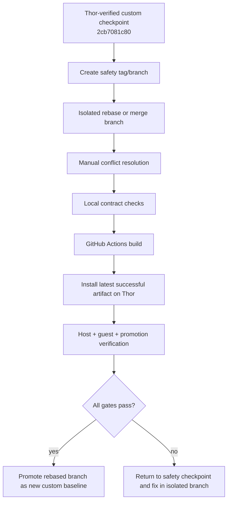

# refactor: Rebase custom ROCKNIX onto upstream next

**Target repo:** `rocknix`

## Summary

Rebase or merge the Thor-verified `custom` branch checkpoint onto current upstream `next` without losing the SM8550 Nix guest substrate, host SSH fallback, recovery toggle, or fast-iter validation workflow. The plan treats the current installed image at `2cb7081c80` as the safety checkpoint, performs the upstream integration in isolation, and only promotes the rebased branch after CI and Thor install verification pass.

---

## Problem Frame

`custom` now carries a working SM8550 thin-host model: ROCKNIX boots a NixOS guest as the product UX while preserving ROCKNIX as update/recovery substrate and host SSH as the development lifeline. The branch has diverged substantially from upstream `ROCKNIX/distribution:next`, so the next reduction work should start from a clean upstream-integrated baseline rather than accumulating larger host deletions on top of a stale fork.

---

## Requirements

- R1. Preserve the current Thor-proven behavior from `custom@2cb7081c80`: normal boot reaches the guest main-space and host SSH remains reachable.
- R2. Integrate upstream `next` changes without dropping custom SM8550 Nix integration, nspawn gating, recovery toggle, guest promotion, or fast-iter workflow changes.
- R3. Preserve upstream SM8550 improvements, especially Thor audio, firmware, device-tree, kernel patch, quirks, and CI updates, unless a conflict is explicitly resolved in favor of the custom invariant.
- R4. Keep rebase work isolated from the currently validated `custom` checkpoint until the rebased tree passes local checks, GitHub Actions, and Thor verification.
- R5. Validate through the same deployment path users rely on: GitHub Actions artifact, checksum verification, `/storage/.update/`, reboot, and live host/guest smoke checks.
- R6. Do not combine the upstream integration with host base reduction or unrelated guest revision bumps; reduction work starts only after the rebased baseline is verified.
- R7. Preserve non-SM8550 build behavior: `nix-integration` and `systemd-nspawn` remain SM8550-only, and at least one non-SM8550 device build is validated before treating the upstream-integrated branch as safe.

---

## Scope Boundaries

- This plan does not remove host emulators, UI, audio, network services, or other ROCKNIX base packages.
- This plan does not change the guest product UX or bump `PKG_NIX_GUEST_REV` unless required solely to repair a rebase-induced packaging failure.
- This plan does not rewrite the host/guest architecture; it preserves the current two-plane model.
- This plan does not attempt to solve long-term upstream contribution strategy.

### Deferred to Follow-Up Work

- SM8550 ROCKNIX base reduction: separate plan/work after the rebased branch is verified on Thor.
- CI hardening to run `nix-integration-static-checks.sh` as a lightweight standalone workflow: recommended follow-up, not required for this rebase.
- Capturing a `/se-compound` learning after the rebase lands, especially if conflict patterns are discovered.

---

## Context & Research

### Relevant Code and Patterns

- `projects/ROCKNIX/packages/tools/nix-integration/package.mk` owns the SM8550-only guest substrate, pinned guest tarball, service enablement, fallback docs, and promotion marker packaging.
- `projects/ROCKNIX/packages/tools/nix-integration/scripts/rocknix-guest-promote` is the current lifecycle-critical helper; it must retain the no-`seq`, no-login-shell, `/storage/.guest` handoff, drift-repair behavior.
- `projects/ROCKNIX/packages/tools/nix-integration/system.d/rocknix-guest-v2.service` is the host/guest boundary contract; forbidden broad binds and no `ExecStopPost=` must survive conflict resolution.
- `projects/ROCKNIX/packages/tools/nix-integration/tests/nix-integration-static-checks.sh` and `projects/ROCKNIX/packages/tools/nix-integration/tests/nix-integration-runtime-smoke.sh` are the executable contract for local and installed validation.
- `projects/ROCKNIX/devices/SM8550/options` carries unified cgroup settings required by guest systemd.
- `projects/ROCKNIX/packages/sysutils/systemd/package.mk` carries the SM8550-only `systemd-nspawn` keep logic and non-SM8550 stripping.
- `projects/ROCKNIX/packages/virtual/image/package.mk` carries the SM8550-only `nix-integration` dependency.
- `.github/workflows/build-image-only.yml`, `.github/workflows/build-aarch64-image.yml`, and `.github/workflows/build-device.yml` are the fast-iter and artifact retention surfaces.

### Institutional Learnings

- `docs/solutions/developer-experience/custom-fork-update-sm8550-rocknix-2026-05-04.md` records the custom fork update path: use `/storage/.update/`, verify checksums locally and on Thor, and run ABL skip/precheck before rebooting.
- `docs/solutions/developer-experience/fast-iter-and-local-rocknix-build-2026-05-08.md` records the fast-iter workflow, including the need for prior full-build artifacts and `CLEAN_NIX_INTEGRATION=true`.
- `docs/solutions/developer-experience/trigger-fork-rocknix-actions-build-from-nixos-2026-05-05.md` explains that this NixOS dev host should dispatch GitHub Actions rather than direct `make` builds.
- `docs/solutions/best-practices/rocknix-layer14-main-space-cold-boot-autostart-2026-05-08.md` captures the main-space cold boot contract to preserve.
- Prior rebase hazard: stale `PKG_DEPENDS_TARGET` entries can fail late in image builds after upstream package removals; audit package references before starting expensive CI.

### External References

- External research was not needed. The work is repo-specific branch integration, and the relevant constraints come from local git history, CI workflows, and Thor validation learnings.

---

## Key Technical Decisions

- Use an isolated branch or worktree for the upstream integration: protects `custom@2cb7081c80` as the verified rollback point until the rebase is proven.
- Use a non-destructive upstream merge branch for the first integration pass rather than rewriting `custom` in place: divergence is large, conflict review matters more than a linear history, and the safety checkpoint must stay easy to restore. If a linear history is later desired, consider that only after the merge result is validated.
- Prefer deliberate manual conflict review over blanket `ours`/`theirs`: several conflicts are semantic, especially systemd nspawn gating, SM8550 cgroup settings, and CI artifact naming.
- Treat host SSH as the non-negotiable floor: every validation stage must prove `multi-user.target` and host `sshd.service` remain reachable.
- Preserve custom `nix-integration` wholesale unless a conflict is intentionally resolved: upstream has no equivalent for the guest promotion/recovery substrate.
- Take upstream SM8550 hardware improvements unless they conflict with a proven custom invariant: Thor audio, firmware, and DTS updates likely matter for future base reduction.
- Install only the latest successful post-rebase artifact on Thor: avoid validating a stale build if follow-up conflict fixes land.

---

## Open Questions

### Resolved During Planning

- Should the rebase happen now? Yes. The latest image containing `2cb7081c80` is installed and verified on Thor, making it a clean checkpoint.
- Should host base reduction be included? No. The rebase should be isolated so failures are attributable to upstream integration, not package deletion.
- Should host SSH remain indefinitely? Yes. It is a hard invariant and validation gate.

### Deferred to Implementation

- Exact conflict resolution details in SM8550 DTS/kernel/config/workflows: these depend on the upstream diff and merge tool output.
- Whether the rebase needs a full CI build before fast-iter: decide after seeing whether upstream changed toolchain/kernel/aarch64 artifacts enough to invalidate the existing fast-iter base.
- Whether untracked `base-*.md` notes should be committed, stashed, or moved: decide before opening the integration branch based on whether they should survive as repo artifacts.
- Exact non-SM8550 device to validate in CI: choose a representative aarch64 device after seeing upstream's current workflow matrix and available artifact cache.

---

## High-Level Technical Design

> *This illustrates the intended approach and is directional guidance for review, not implementation specification. The implementing agent should treat it as context, not code to reproduce.*

---

## Implementation Units

### U1. Capture the rebase safety checkpoint

**Goal:** Preserve the current validated state so the rebase can be abandoned or retried without losing the working Thor baseline.

**Requirements:** R1, R4

**Dependencies:** None

**Files:**
- Modify: none expected
- Test: `projects/ROCKNIX/packages/tools/nix-integration/tests/nix-integration-static-checks.sh`
- Test: `projects/ROCKNIX/packages/tools/nix-integration/tests/nix-integration-runtime-smoke.sh`

**Approach:**
- Record the current `custom` head, remote head, and Thor installed state.
- Preserve a local and/or remote safety reference for `custom@2cb7081c80` before integrating upstream.
- Decide what to do with the untracked `base-*.md` notes before creating the rebase worktree or branch.
- Confirm Thor's current host/guest state remains green before starting the integration.

**Execution note:** Characterization-first: collect current branch, Actions, and Thor state before changing git history.

**Patterns to follow:**
- Current direct-push `custom` workflow from recent commits.
- Host/guest verification pattern used for run `25711264117`.

**Test scenarios:**
- Happy path: current `custom` and `origin/custom` point at `2cb7081c80`; safety reference exists before rebase begins.
- Happy path: local static/runtime checks pass before upstream integration.
- Integration: Thor reports `rocknix-guest-v2.service` active, `rocknix-guest-promote.service` result success, and guest services active before rebase work starts.
- Error path: untracked notes are explicitly handled so the rebase branch/worktree starts from an intentional state.

**Verification:**
- There is a recoverable reference to the pre-rebase checkpoint.
- Local and live baseline evidence is recorded in the working notes or commit message context.

---

### U2. Integrate upstream `next` in isolation

**Goal:** Bring upstream changes into a temporary branch or worktree without mutating the validated `custom` baseline.

**Requirements:** R2, R3, R4

**Dependencies:** U1

**Files:**
- Modify: conflict-dependent, expected candidates include `projects/ROCKNIX/devices/SM8550/options`
- Modify: `projects/ROCKNIX/packages/sysutils/systemd/package.mk`
- Modify: `projects/ROCKNIX/packages/virtual/image/package.mk`
- Modify: `.github/workflows/build-aarch64-image.yml`
- Modify: `.github/workflows/build-device.yml`
- Modify: `.github/workflows/build-nightly.yml`
- Modify: `.github/workflows/trigger-fail-if-upstream-changed.yml`
- Modify: `Dockerfile`
- Modify: `Makefile`
- Modify: `scripts/local-image-build`
- Test: `projects/ROCKNIX/packages/tools/nix-integration/tests/nix-integration-static-checks.sh`

**Approach:**
- Fetch upstream remotes and create an isolated integration branch/worktree.
- Create a safety branch/tag for `2cb7081c80` and push it before touching `custom`.
- Use a non-destructive merge of `upstream/next` into the isolated integration branch for the first pass; do not rewrite `custom` in place.
- Preserve readable conflict resolution history and avoid automatic global conflict strategies.
- Resolve custom-only files by preserving them unless upstream introduced a direct replacement.
- Resolve upstream-only additions by accepting them unless they break an explicit custom invariant.

**Execution note:** Keep conflict resolution reviewable; avoid mixing unrelated cleanup into the rebase commit.

**Patterns to follow:**
- Existing SM8550-only gating pattern in `projects/ROCKNIX/packages/virtual/image/package.mk`.
- Existing systemd non-SM8550 nspawn strip pattern in `projects/ROCKNIX/packages/sysutils/systemd/package.mk`.
- Existing fast-iter artifact suffix pattern in `.github/workflows/build-aarch64-image.yml`.

**Test scenarios:**
- Happy path: upstream `next` commits are present in the integration branch through a merge commit or equivalent non-destructive integration point.
- Happy path: custom-only `projects/ROCKNIX/packages/tools/nix-integration/` subtree remains intact.
- Error path: if upstream deleted a file custom modified, the custom behavior is explicitly kept or intentionally replaced.
- Integration: conflict resolutions are small enough to review file-by-file before commit.

**Verification:**
- Integration branch contains upstream changes and all custom invariants still visible in code.
- Safety branch/tag for the pre-rebase checkpoint exists locally and remotely.
- No broad `ours`/`theirs` resolution hides semantic conflicts.

---

### U3. Resolve high-risk SM8550 and CI conflicts explicitly

**Goal:** Preserve the custom guest substrate while incorporating upstream SM8550 hardware and workflow improvements.

**Requirements:** R1, R2, R3

**Dependencies:** U2

**Files:**
- Modify: `projects/ROCKNIX/devices/SM8550/options`
- Modify: `projects/ROCKNIX/devices/SM8550/linux/dts/qcom/qcs8550-ayn-thor.dts`
- Modify: `projects/ROCKNIX/devices/SM8550/linux/dts/qcom/qcs8550-ayn-common.dtsi`
- Modify: `projects/ROCKNIX/devices/SM8550/linux/dts/qcom/qcs8550-ayaneo-pocket-common.dtsi`
- Modify: `projects/ROCKNIX/devices/SM8550/linux/linux.aarch64.conf`
- Modify: `projects/ROCKNIX/packages/sysutils/systemd/package.mk`
- Modify: `projects/ROCKNIX/packages/virtual/image/package.mk`
- Modify: `.github/workflows/build-aarch64-image.yml`
- Modify: `.github/workflows/build-device.yml`
- Modify: `.github/workflows/build-nightly.yml`
- Modify: `.github/workflows/trigger-fail-if-upstream-changed.yml`
- Test: `projects/ROCKNIX/packages/tools/nix-integration/tests/nix-integration-static-checks.sh`
- Test: `projects/ROCKNIX/packages/tools/nix-integration/tests/nix-integration-runtime-smoke.sh`

**Approach:**
- Keep unified cgroup settings and SM8550-only `systemd-nspawn` availability.
- Keep SM8550-only `nix-integration` image dependency.
- Merge upstream Thor audio/DTS/firmware changes with the custom touchscreen input-name work.
- Preserve custom fast-iter artifact naming and artifact-retention behavior while accepting upstream SM8750/feature-freeze workflow changes where compatible.
- Preserve manual-only upstream-change guard if it still reflects the fork's intentional package patches.

**Patterns to follow:**
- Current comments and static checks in `nix-integration-static-checks.sh` for why old gates and fallback surfaces must not return.
- Existing unit comments in `rocknix-guest-v2.service` for cgroup and bind-boundary rationale.

**Test scenarios:**
- Happy path: SM8550 options contain both upstream-required cmdline updates and custom cgroup v2 settings.
- Happy path: systemd keeps `systemd-nspawn` only for SM8550 and strips it for non-SM8550.
- Happy path: image package still adds `nix-integration` only for SM8550.
- Edge case: Thor DTS retains upstream audio additions and custom touchscreen disambiguation.
- Error path: static check fails if forbidden legacy flags or host fallback surfaces return.
- Integration: workflow files still produce `thin-host` SM8550 update artifacts usable by the existing Thor install path.

**Verification:**
- Conflict-prone files are reviewed against both upstream intent and custom invariants.
- Local static/runtime checks pass after conflict resolution.

---

### U4. Run pre-build local validation and package-reference audit

**Goal:** Catch cheap integration mistakes before starting expensive GitHub Actions builds.

**Requirements:** R2, R4, R5, R7

**Dependencies:** U3

**Files:**
- Modify: none expected
- Test: `projects/ROCKNIX/packages/tools/nix-integration/tests/nix-integration-static-checks.sh`
- Test: `projects/ROCKNIX/packages/tools/nix-integration/tests/nix-integration-runtime-smoke.sh`
- Test: `projects/ROCKNIX/packages/tools/nix-integration/scripts/rocknix-guest-promote`
- Test: `projects/ROCKNIX/packages/tools/nix-integration/scripts/rocknix-guest-prep`
- Test: `projects/ROCKNIX/packages/tools/nix-integration/scripts/rocknix-guest-udev-stage`
- Test: `projects/ROCKNIX/packages/tools/nix-integration/scripts/rocknix-recovery-toggle`

**Approach:**
- Run syntax checks on touched shell scripts.
- Run the nix-integration static and runtime smoke scripts in source-tree mode.
- Audit `PKG_DEPENDS_TARGET` references in the SM8550 image composition against upstream package removals.
- Make the package-reference audit concrete: enumerate package directories or package files removed between the merge base and `upstream/next`, then scan the integrated tree for remaining references to those removed package names in image/package dependency surfaces.
- Inspect the final guest unit for forbidden binds and no `ExecStopPost=`.
- Explicitly verify the SM8550-only gates: non-SM8550 builds must still strip `systemd-nspawn` and must not depend on `nix-integration`.

**Execution note:** Test-first where practical: local checks should fail before any CI build is launched if conflict resolution damaged the contract.

**Patterns to follow:**
- Static checks already encode most invariants; extend them only if the rebase exposes a new recurring foot-gun.

**Test scenarios:**
- Happy path: all shell scripts touched by the rebase parse successfully.
- Happy path: `nix-integration-static-checks.sh` passes on the integration branch.
- Happy path: `nix-integration-runtime-smoke.sh` passes in source-tree mode.
- Error path: package-reference audit catches any image dependency whose package was removed or renamed upstream.
- Error path: checks fail if `--bind-ro=/usr`, `--bind-ro=/lib`, blanket `/storage`, `ExecStopPost=`, `THIN_HOST`, or old `nixctl` surfaces reappear.
- Error path: checks fail if `nix-integration` or `systemd-nspawn` become reachable from non-SM8550 image composition.

**Verification:**
- No GitHub Actions build is started until cheap local validation is green.
- Removed-package audit is clean or every remaining reference is intentionally preserved and backed by an existing package path.
- SM8550-only gate verification is explicitly recorded.

---

### U5. Build the rebased branch with GitHub Actions

**Goal:** Produce verified SM8550 and representative non-SM8550 build evidence from the upstream-integrated branch.

**Requirements:** R4, R5, R7

**Dependencies:** U4

**Files:**
- Modify: `.github/workflows/build-image-only.yml` if conflict resolution requires it
- Modify: `.github/workflows/build-nightly.yml` if conflict resolution requires it
- Modify: `.github/workflows/build-aarch64-image.yml` if conflict resolution requires it
- Test: GitHub Actions workflow artifacts for SM8550 update image

**Approach:**
- Decide whether a full build is required or whether fast-iter can reuse a valid base run.
- If upstream changed kernel/toolchain/aarch64 artifacts significantly, expect a full SM8550 build before image-only iteration.
- Use fast-iter only when its base artifacts are valid for the rebased branch; if the integration touches kernel, toolchain, Dockerfile, aarch64 package stages, or shared workflow artifact boundaries, prefer a full build first.
- Run at least one representative non-SM8550 aarch64 device build or workflow job before baseline promotion to catch shared package/workflow regressions.
- Treat the latest successful run for the integration branch as the only install candidate.

**Patterns to follow:**
- Existing `Build image only (fast-iter)` workflow with `CLEAN_NIX_INTEGRATION=true`.
- Existing artifact naming pattern `ROCKNIX-update-SM8550-thin-host-*-fastiter`.

**Test scenarios:**
- Happy path: a successful Actions run produces an SM8550 update artifact and matching sha256 file.
- Happy path: a representative non-SM8550 device build succeeds with `nix-integration` and `systemd-nspawn` absent from its image composition.
- Edge case: if fast-iter fails due to stale base artifacts, fall back to a full SM8550 build rather than patching around missing compiled packages.
- Error path: build failure in image step is traced to conflict resolution or stale package references before another run is started.
- Integration: downloaded artifact checksum verifies locally.

**Verification:**
- There is a successful SM8550 Actions run for the rebased branch at the intended head SHA.
- There is at least one successful representative non-SM8550 build signal for the same integration branch.
- The update artifact and checksum are available and locally verified.

---

### U6. Install and verify the rebased image on Thor

**Goal:** Prove the upstream-integrated image works on real hardware through the normal ROCKNIX update path.

**Requirements:** R1, R5

**Dependencies:** U5

**Files:**
- Modify: none expected
- Test: installed `/usr/lib/nix-integration/tests/nix-integration-runtime-smoke.sh`
- Test: installed `/usr/bin/rocknix-guest-promote`
- Test: installed `/usr/bin/rocknix-guest-soak`

**Approach:**
- Verify the update artifact checksum locally and after copying to Thor.
- Stage the update under `/storage/.update/` and reboot through the normal updater.
- Confirm `/storage/.update/` empties after reboot.
- Verify host target, guest unit, promotion service, removed legacy surfaces, and runtime smoke.
- Enter the guest namespace and verify core guest services, promotion markers, profile/current-system match, failed-unit count, and ordering constraints.
- Run a recovery smoke if any rebase conflict touched recovery toggle, systemd targets, host networking, or SSH.

**Execution note:** Characterization-first: compare the post-install state against the known-good `2cb7081c80` validation checklist.

**Patterns to follow:**
- Thor install/verification sequence used for run `25711264117`.
- Guest namespace pattern using `systemctl show -p MainPID --value rocknix-guest-v2.service`, child PID, and explicit `nsenter` namespace flags.

**Test scenarios:**
- Happy path: Thor returns over SSH after reboot and `systemctl get-default` is `rocknix-graphical.target`.
- Happy path: `rocknix-guest-v2.service`, `rocknix-graphical.target`, and `rocknix-guest-promote.service` are healthy.
- Happy path: host packaged guest revision matches applied guest revision, and guest profile matches `/run/current-system`.
- Happy path: guest `rocknix-sway-kiosk.service`, `rocknix-hardware-button-handler.service`, audio services, and `rocknix-steam-uinput.service` are active.
- Edge case: promotion skips idempotently if the packaged guest revision is already applied.
- Error path: validation fails if host SSH drops, update dir does not empty, promotion fails, old host reclaim returns, or guest has failed units.
- Integration: if recovery is tested, `/flash/rocknix.no-nspawn` routes to host recovery and clearing it returns to guest boot.

**Verification:**
- Thor is running the rebased image and all host/guest validation gates pass.
- The rebased branch is safe to treat as the new `custom` baseline.

---

### U7. Promote the rebased baseline and record rebase learnings

**Goal:** Make the verified upstream-integrated branch the new working baseline and preserve any discovered conflict knowledge.

**Requirements:** R4, R6

**Dependencies:** U6

**Files:**
- Modify: branch metadata only in the `rocknix` target repo, unless a learning doc is created in the documentation repository
- Create: optional `docs/solutions/developer-experience/<date>-rocknix-upstream-rebase-*.md` in the `rocknix-nix-guest` documentation repo

**Approach:**
- Only update/push `custom` after Thor verification passes.
- Promote by fast-forwarding or merging the verified integration branch into `custom`; avoid force-pushing `origin/custom` unless the user explicitly chooses a rewritten history after validation.
- Keep the pushed pre-rebase safety reference until at least one post-rebase image is installed and used successfully.
- Keep a rollback artifact path available: if the rebased image fails after install, restage the last known-good `2cb7081c80` update artifact through `/storage/.update/` or boot recovery via `/flash/rocknix.no-nspawn` and restore the safety branch.
- Record conflict patterns if the rebase revealed durable knowledge, especially around SM8550 options, systemd nspawn gating, DTS, or workflow conflicts.
- Start host base reduction from the rebased baseline, not from the old checkpoint.

**Patterns to follow:**
- Existing learning docs under `docs/solutions/developer-experience/` in the documentation repository.
- Conventional commit style used on recent `custom` history.

**Test scenarios:**
- Happy path: `origin/custom` points at the Thor-verified rebased head through an auditable fast-forward or merge, not an accidental force-push.
- Happy path: safety reference remains available until the new baseline is trusted.
- Error path: rollback procedure can identify and reinstall the pre-rebase known-good artifact if Thor validation fails after promotion.
- Integration: follow-up base-reduction planning starts from the rebased head.
- Test expectation: none for optional learning doc beyond markdown review; it records process knowledge rather than runtime behavior.

**Verification:**
- New baseline is published and discoverable.
- Any reusable conflict/rebase knowledge is captured or explicitly deemed unnecessary.

---

## System-Wide Impact

- **Interaction graph:** Git history, SM8550 package composition, systemd host units, GitHub Actions, and Thor update flow all interact. The rebase must preserve both upstream hardware fixes and custom guest lifecycle units.
- **Error propagation:** Local static failures should block CI; CI failures should block install; Thor validation failures should block baseline promotion.
- **State lifecycle risks:** Rewriting branch history or moving `custom` before hardware validation can strand the team without a known-good integration point. Guest promotion markers can hide drift if not verified after install.
- **API surface parity:** Host SSH, `/flash/rocknix.no-nspawn`, `rocknix.safe=1`, `/storage/.update/`, and guest promotion markers are operational APIs and must remain stable.
- **Integration coverage:** Only Thor install proves the interaction between upstream kernel/DTS/firmware changes, nspawn, guest promotion, and host SSH.
- **Unchanged invariants:** Host SSH remains indefinite; non-SM8550 devices must not receive `nix-integration` or `systemd-nspawn`; the guest unit must not bind host `/usr`, `/lib`, profile files, or blanket `/storage`.

---

## Risks & Dependencies

| Risk | Mitigation |
|------|------------|
| Semantic conflicts silently drop Nix integration invariants | Avoid blanket merge strategies; run static checks; review high-risk files manually. |
| Upstream SM8550 hardware changes conflict with custom DTS changes | Review resolved DTS and kernel patch stack specifically; keep upstream audio while preserving input-name disambiguation. |
| Fast-iter artifacts are invalid after upstream changes | Use a full SM8550 build if kernel/toolchain/aarch64 artifacts changed materially. |
| Dockerfile or build image changes invalidate local/CI assumptions | Treat Dockerfile conflicts as full-build triggers and verify the workflow runner environment before relying on fast-iter. |
| Host SSH becomes conditional or unreachable | Verify `sshd.service`, `multi-user.target`, and live SSH after install; keep host SSH as release blocker. |
| Promotion appears successful but guest profile drifts | Verify packaged/applied revision, recorded system path, profile, and `/run/current-system` after install. |
| Recovery path is damaged by target or service conflicts | Run recovery smoke when any recovery-toggle, target, SSH, systemd, or storage file is touched. |
| Rebase combines with base reduction and obscures cause of failures | Keep this plan limited to upstream integration; defer reduction to follow-up. |

---

## Documentation / Operational Notes

- The final install verification should mention the GitHub Actions run ID, head SHA, artifact name, and Thor validation summary.
- If conflicts are non-trivial, capture a follow-up learning doc so the next upstream integration has a playbook.
- If the rebase changes the recovery contract or host SSH behavior, update fallback documentation before installing on Thor.

---

## Sources & References

- Related code: `projects/ROCKNIX/packages/tools/nix-integration/package.mk`
- Related code: `projects/ROCKNIX/packages/tools/nix-integration/scripts/rocknix-guest-promote`
- Related code: `projects/ROCKNIX/packages/tools/nix-integration/system.d/rocknix-guest-v2.service`
- Related code: `projects/ROCKNIX/packages/tools/nix-integration/tests/nix-integration-static-checks.sh`
- Related code: `projects/ROCKNIX/packages/tools/nix-integration/tests/nix-integration-runtime-smoke.sh`
- Related code: `projects/ROCKNIX/devices/SM8550/options`
- Related code: `projects/ROCKNIX/packages/sysutils/systemd/package.mk`
- Related code: `projects/ROCKNIX/packages/virtual/image/package.mk`
- Related code: `.github/workflows/build-image-only.yml`
- Related code: `.github/workflows/build-aarch64-image.yml`
- Related code: `.github/workflows/build-device.yml`
- Prior research artifact: `base-architecture-minimum.md`
- Prior research artifact: `base-safety-review.md`
- Prior research artifact: `base-scout-packages.md`
- Prior research artifact: `base-scout-sm8550.md`
