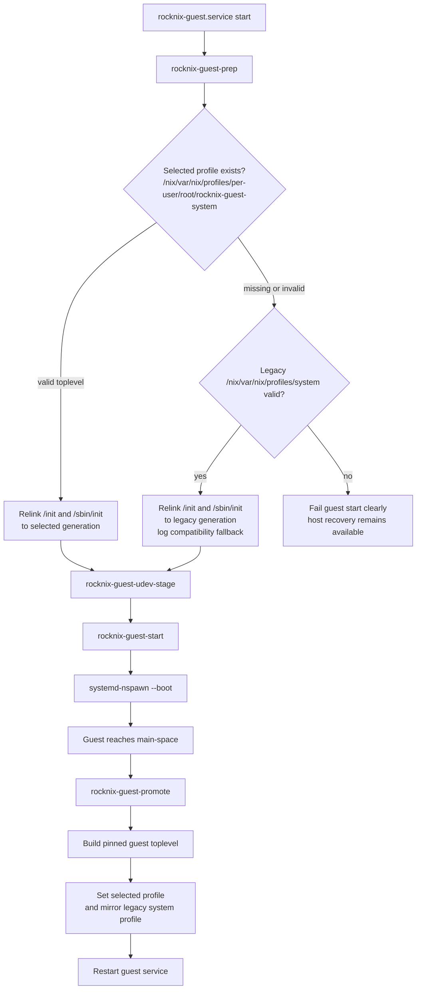

# feat: Stage 10 guest generation selector spike

## Summary

Add a narrow Stage 10 spike that first triages and removes the obsolete host `/nix` substrate if it is no longer used, then makes the NixOS guest boot from an explicit selected Nix system profile. The selector remains guest-absolute at `/nix/var/nix/profiles/per-user/root/rocknix-guest-system`; the host resolves it through the persistent guest rootfs, preserves the existing nspawn/recovery flow, and continues writing the legacy guest-local system profile (`/nix/var/nix/profiles/system`) as a temporary compatibility mirror during each promotion.

---

## Problem Frame

Stage 9 has proven that ROCKNIX can keep shrinking toward a recovery/update/container substrate while the guest owns product-facing behavior. The next Stage 10 proof is not another guest capability; it is making the running guest system identity a Nix generation rather than an implicit, host-mutated rootfs plus marker files.

---

## Assumptions

*This plan uses the user-selected canonical profile path and makes one safety-oriented implementation bet that should be reviewed before execution.*

- The selected profile path is `/nix/var/nix/profiles/per-user/root/rocknix-guest-system`.
- The host `/nix` mount appears to be leftover substrate from earlier Nix integration layers; it should be removed only after a targeted reference/runtime triage confirms current guest boot and promotion use the guest rootfs `/nix` instead.
- For this first selector spike, the selected profile path is treated as a **guest-absolute** Nix profile path under the persistent guest rootfs, resolved by the host as `${GUEST_ROOT}/nix/var/nix/profiles/per-user/root/rocknix-guest-system`. This avoids making host `/nix` and guest `/nix` share a store before that topology is deliberately designed.
- The legacy guest-local `/nix/var/nix/profiles/system` profile remains as a temporary mirror/fallback during the spike so current NixOS activation expectations and recovery workflows do not break.

---

## Requirements

- R1. The selected guest system is represented by `/nix/var/nix/profiles/per-user/root/rocknix-guest-system` inside the guest rootfs.
- R2. `rocknix-guest-prep` prefers the selected profile when it resolves to a valid NixOS toplevel with an `init`, and falls back to the legacy guest system profile (`/nix/var/nix/profiles/system`) only when the selector is absent or invalid.
- R3. `rocknix-guest-promote` writes the selected profile and mirrors the same toplevel to `/nix/var/nix/profiles/system` during the transition.
- R4. Normal boot, guest restart, guest promotion, and explicit recovery toggles continue to work on Thor.
- R5. Missing, dangling, or invalid selected generations fail safely with clear logs and no loss of host SSH/recovery access.
- R6. Static checks, runtime smoke, and soak coverage encode the selected-generation contract so future edits cannot silently drift back to rootfs/marker authority.
- R7. Host `/nix` substrate wiring is either removed before selector work when proven unused, or explicitly documented as still required with a narrow remaining contract.

---

## Scope Boundaries

- This spike does not unify host `/nix` and guest `/nix` into one shared store.
- This spike does not remove guest `/nix`; guest Nix store/profile state under `/storage/machines/rocknix-guest/nix` remains the system-generation substrate for Spike 1.
- This spike does not remove `/storage/machines/rocknix-guest` as the nspawn rootfs.
- This spike does not replace `systemd-nspawn --boot` with an explicit init command; preserving `Type=notify` and watchdog behavior is more important for the first proof.
- This spike does not introduce automatic rollback from a bad generation; explicit recovery remains `/flash/rocknix.no-nspawn`, `rocknix.safe=1`, and host SSH.
- This spike does not support arbitrary in-guest `nixos-rebuild` or manual writes to `/nix/var/nix/profiles/system` as source-of-truth changes; promotion owns profile synchronization until a guest-side activation mirror is deliberately added.
- This spike does not broaden `/dev`, block-device, or host storage exposure.

### Deferred to Follow-Up Work

- Host-visible/shared-store Stage 10 design: decide whether guest `/nix` remains the long-term source of truth, or whether a future dedicated import/shared-store path is needed after host `/nix` retirement.
- Nix-native rollback UX from host recovery: add a safe operator command or service for switching the selected profile back when the guest cannot boot.
- Automatic bad-generation rollback: consider only after manual selector switch/rollback is boring.
- Contract-doc updates in `rocknix-nix-guest: docs/contracts/` once the spike behavior is proven on Thor.

---

## Context & Research

### Relevant Code and Patterns

- `projects/ROCKNIX/packages/tools/rocknix-guest-substrate/scripts/rocknix-guest-prep` already resolves an indirect Nix system profile and relinks `/init` plus `/sbin/init` before nspawn boot.
- `projects/ROCKNIX/packages/tools/rocknix-guest-substrate/scripts/rocknix-guest-promote` already builds the pinned guest source inside the running guest namespace, sets a Nix system profile, writes revision/system markers, and restarts the guest.
- `projects/ROCKNIX/packages/tools/rocknix-guest-substrate/scripts/rocknix-guest-start` centralizes nspawn argument generation and runtime DeviceAllow updates; it should not absorb profile-selection behavior unless start-time validation needs to surface clearer logs.
- `projects/ROCKNIX/packages/tools/rocknix-guest-substrate/system.d/rocknix-guest.service` preserves the recovery contract by avoiding automatic host-side fallback/reclaim hooks and using `Restart=on-failure` under `rocknix-main-space.target`.
- `projects/ROCKNIX/packages/tools/rocknix-guest-substrate/tests/guest-substrate-static-checks.sh` and `projects/ROCKNIX/packages/tools/rocknix-guest-substrate/tests/guest-substrate-runtime-smoke.sh` are fail-closed contract tests; every new selector invariant should be reflected there.
- `projects/ROCKNIX/packages/tools/rocknix-guest-substrate/scripts/rocknix-guest-soak` is the long-running host/guest invariant sampler and should learn how to detect selector drift.
- `projects/ROCKNIX/packages/tools/rocknix-guest-substrate/system.d/nix.mount` and `projects/ROCKNIX/packages/tools/rocknix-guest-substrate/system.d/nix-storage-setup.service` are the current host `/nix` substrate wiring; references in targets, services, and tests must be triaged before removal.

### Institutional Learnings

- `rocknix-nix-guest: docs/thinking/2026-05-10-rocknix-level-n-8-12-report.md` defines Stage 10 as Nix-built guest/rootfs activation becoming the source of truth, with switch/rollback as the meaningful proof rather than one successful boot.
- `rocknix-nix-guest: docs/solutions/best-practices/rocknix-layer14-main-space-cold-boot-autostart-2026-05-08.md` documents the stale `/init` bug: host prep must relink `/init` at every guest start from the current generation, not from an image-time path.
- `base-architecture-minimum.md` preserves the hard substrate floor: host SSH, recovery toggle, `/storage`, `/flash`, `/nix`, update plumbing, and nspawn must survive guest failures.
- Prior Layer 14 work showed `nix-env -p <profile> --set` and rollback-style generation switching are valid primitives inside this substrate; the new work is moving the selected profile from implicit `/nix/var/nix/profiles/system` authority toward a named guest-system selector.

### External References

- None. Local code and project learnings are sufficient for this spike.

---

## Key Technical Decisions

- Triage host `/nix` before adding selector behavior: if all current boot/promotion paths use guest rootfs `/nix`, remove host `nix.mount` and `nix-storage-setup.service` wiring first so the selector namespace is unambiguous.
- Use the user-selected path as a guest-system selector: `/nix/var/nix/profiles/per-user/root/rocknix-guest-system` becomes the named Stage 10 profile for this spike.
- Resolve the selector through `${GUEST_ROOT}` in host scripts: this avoids prematurely binding or merging host `/nix` with guest `/nix` while still making the selected guest generation explicit and Nix-native.
- Keep `--boot` and the `/init` relink path: this preserves nspawn readiness/watchdog behavior and limits the spike to profile selection rather than container-launch semantics.
- Mirror the selector to `/nix/var/nix/profiles/system`: NixOS conventions and current activation/rebuild paths still expect that profile, so it remains a compatibility view during the transition.
- Treat marker files as audit/cache only: live profile symlinks and store-path existence decide the selected generation; `/etc/rocknix-guest-revision` and `/etc/rocknix-guest-system-path` must not become competing sources of truth.
- Treat guest-initiated legacy-profile switches as unsupported during this spike: selected-profile writes through promotion are authoritative, and smoke/soak should alarm on selected-vs-legacy drift rather than silently accepting it.

---

## Open Questions

### Resolved During Planning

- Canonical selected profile path: use `/nix/var/nix/profiles/per-user/root/rocknix-guest-system`.
- First-spike store topology: do not merge host and guest Nix stores yet; remove host `/nix` if unused and resolve the guest-absolute selector via `${GUEST_ROOT}`.
- Host `/nix` dependency gate: if U7 finds host `/nix` is still required, implementation should stop and report back before selector work continues.
- Profile writer scope: for Spike 1, `rocknix-guest-promote` is the only supported writer for the selected profile; arbitrary in-guest `nixos-rebuild switch` support is intentionally out of scope and should surface as drift in smoke/soak.
- Bad-generation retry policy: require bounded `rocknix-guest.service` retries without automatic recovery flag creation, automatic reboot, or host product fallback.
- nspawn mode: keep `--boot` and existing device/bind generation.

### Deferred to Implementation

- Exact helper factoring: implementation may keep resolution inline or extract a shell helper if duplication between prep, promote, smoke, and soak becomes brittle.
- Exact live Thor selector state before the spike image lands: implementation should characterize whether the selected profile already exists and use fallback/migration paths accordingly.
- Whether missing selected profile should be logged as warning or failure on the first upgraded boot: default to warning + legacy fallback while the compatibility mirror exists.

---

## High-Level Technical Design

> *This illustrates the intended approach and is directional guidance for review, not implementation specification. The implementing agent should treat it as context, not code to reproduce.*

---

## Implementation Units

Note: U7 is intentionally listed first because it was added during plan challenge as a prerequisite; existing U-IDs are preserved rather than renumbered.

### U7. Triage and retire host `/nix` substrate wiring

**Goal:** Prove whether host `/nix` is still required; remove it before selector work if current guest boot/promotion paths only depend on guest rootfs `/nix`.

**Requirements:** R4, R5, R7

**Dependencies:** None

**Files:**
- Modify: `projects/ROCKNIX/packages/tools/rocknix-guest-substrate/package.mk`
- Modify: `projects/ROCKNIX/packages/tools/rocknix-guest-substrate/system.d/rocknix-main-space.target`
- Modify: `projects/ROCKNIX/packages/tools/rocknix-guest-substrate/system.d/rocknix-guest.service`
- Modify/Delete: `projects/ROCKNIX/packages/tools/rocknix-guest-substrate/system.d/nix.mount`
- Modify/Delete: `projects/ROCKNIX/packages/tools/rocknix-guest-substrate/system.d/nix-storage-setup.service`
- Modify: `base-architecture-minimum.md` if host `/nix` is removed
- Test: `projects/ROCKNIX/packages/tools/rocknix-guest-substrate/tests/guest-substrate-static-checks.sh`
- Test: `projects/ROCKNIX/packages/tools/rocknix-guest-substrate/tests/guest-substrate-runtime-smoke.sh`

**Approach:**
- Characterize every current host `/nix` dependency in the guest substrate package before deleting anything: service `Requires=`, target `Requires=`, package enablement, smoke/static assertions, and any host-side scripts that read host `/nix` directly.
- If no runtime dependency remains, remove host `nix.mount`, `nix-storage-setup.service`, `/storage/.nix-root` setup, and their service/target dependencies from the SM8550 guest substrate.
- If a real runtime dependency is found, stop implementation and report the dependency before selector work continues; do not keep host `/nix` and proceed as though the namespace is unambiguous.
- Preserve guest rootfs `/nix` and all paths under `/storage/machines/rocknix-guest/nix`; this unit only concerns host root `/nix`.
- If host `/nix` is removed, update `base-architecture-minimum.md` in the same change so the host substrate floor no longer claims root `/nix` is mandatory, while clearly stating that guest `/nix` remains.

**Execution note:** Characterization-first. Confirm the removal target is only host substrate wiring before changing service dependencies.

**Patterns to follow:**
- Existing fail-closed assertions in `guest-substrate-static-checks.sh` and `guest-substrate-runtime-smoke.sh`.
- Existing SM8550-only package gating in `package.mk`.

**Test scenarios:**
- Happy path: static checks assert host `/nix` mount services are no longer enabled or required when removal is chosen.
- Edge case: guest rootfs still contains `/nix` and profile paths after host `/nix` wiring is removed.
- Error path: if a host script still references root `/nix`, static checks fail and force either removal or explicit documentation.
- Integration: installed runtime smoke verifies guest service and main-space target no longer require `nix.mount`, while host SSH/recovery and guest boot remain available.
- Documentation: if host `/nix` is removed, `base-architecture-minimum.md` distinguishes retired host root `/nix` from preserved guest rootfs `/nix`.

**Verification:**
- The host no longer maintains a root `/nix` mount unless a concrete current dependency is documented, and guest `/nix` remains intact.

---

### U1. Prepare the selected-profile storage contract

**Goal:** Make the selected guest-system profile path an explicit, persistent contract without changing boot selection yet.

**Requirements:** R1, R4, R6

**Dependencies:** U7

**Files:**
- Modify: `projects/ROCKNIX/packages/tools/rocknix-guest-substrate/scripts/rocknix-guest-prep`
- Modify: `projects/ROCKNIX/packages/tools/rocknix-guest-substrate/scripts/rocknix-guest-promote`
- Test: `projects/ROCKNIX/packages/tools/rocknix-guest-substrate/tests/guest-substrate-static-checks.sh`
- Test: `projects/ROCKNIX/packages/tools/rocknix-guest-substrate/tests/guest-substrate-runtime-smoke.sh`

**Approach:**
- Add a single named profile constant or environment override for `/nix/var/nix/profiles/per-user/root/rocknix-guest-system` in scripts that need to resolve or write the selected generation.
- If the selected profile parent directory must be created before the first promotion, create it under the guest rootfs from `rocknix-guest-prep` or immediately before `nix-env -p ... --set` in `rocknix-guest-promote`; do not pre-shape host `/nix` for the deferred shared-store design.
- Keep legacy `/nix/var/nix/profiles/system` behavior unchanged in this unit; this is scaffolding and contract declaration only.

**Patterns to follow:**
- Existing `ROCKNIX_GUEST_*` environment override pattern in `rocknix-guest-prep` and `rocknix-guest-promote`.
- Existing static/runtime grep checks for storage and service contracts.

**Test scenarios:**
- Happy path: static checks assert the selected profile string appears in prep/promote.
- Edge case: runtime smoke in source-tree mode validates the scripts remain syntax-clean and still reference the legacy system profile for fallback.
- Integration: installed runtime smoke verifies the selected-profile parent directory exists in the guest-rootfs view when live smoke is enabled.

**Verification:**
- The profile path contract exists in scripts and tests, but no boot-selection behavior has changed yet.

---

### U2. Add selected-generation resolution with compatibility fallback

**Goal:** Teach `rocknix-guest-prep` to choose the selected profile when valid and fallback to the legacy guest system profile when necessary.

**Requirements:** R1, R2, R4, R5, R6

**Dependencies:** U7, U1

**Files:**
- Modify: `projects/ROCKNIX/packages/tools/rocknix-guest-substrate/scripts/rocknix-guest-prep`
- Test: `projects/ROCKNIX/packages/tools/rocknix-guest-substrate/tests/guest-substrate-static-checks.sh`
- Test: `projects/ROCKNIX/packages/tools/rocknix-guest-substrate/tests/guest-substrate-runtime-smoke.sh`

**Approach:**
- Generalize the existing indirect-profile resolver so it can resolve either the selected profile or the legacy profile.
- Validate candidate generations against the guest rootfs view: both selected and legacy candidates must resolve to a `/nix/...` path that exists under `${GUEST_ROOT}` and contains a usable `init`.
- Relink `${GUEST_ROOT}/init` and `${GUEST_ROOT}/sbin/init` from the selected generation when it is valid.
- When the selected profile is missing or invalid but legacy profile is valid, log a compatibility fallback and keep booting the legacy generation.
- When neither profile resolves, fail the prep step with a clear message rather than letting nspawn fail opaquely.

**Execution note:** Characterize the existing legacy resolver behavior before refactoring it so the fallback path remains identical.

**Patterns to follow:**
- The current Bug 6 fix comments and resolver logic in `rocknix-guest-prep`.
- The existing `fail()` logging style in substrate shell scripts.

**Test scenarios:**
- Happy path: selected profile symlink resolves to a guest-visible toplevel; prep relinks both init paths to that generation.
- Edge case: selected profile is absent; legacy profile resolves; prep logs fallback and relinks to legacy generation.
- Error path: selected profile exists but points to a missing guest store path; prep does not use it and falls back only if legacy is valid.
- Error path: legacy profile directory exists but its toplevel lacks `init`; prep fails clearly instead of relinking to an unbootable generation.
- Error path: both selected and legacy profiles are missing or invalid; prep fails clearly before nspawn.
- Integration: source-tree/runtime checks assert prep contains both selected-profile preference and legacy fallback.

**Verification:**
- Boot selection is now data-driven by the selected profile when available, with safe fallback preserving current devices.

---

### U3. Write selected and legacy profiles during guest promotion

**Goal:** Make promotion produce a selected Stage 10 profile while keeping the legacy system profile synchronized during the transition.

**Requirements:** R1, R3, R4, R5, R6

**Dependencies:** U1, U2

**Files:**
- Modify: `projects/ROCKNIX/packages/tools/rocknix-guest-substrate/scripts/rocknix-guest-promote`
- Test: `projects/ROCKNIX/packages/tools/rocknix-guest-substrate/tests/guest-substrate-static-checks.sh`
- Test: `projects/ROCKNIX/packages/tools/rocknix-guest-substrate/tests/guest-substrate-runtime-smoke.sh`

**Approach:**
- After building the pinned guest toplevel inside the running guest namespace, set the selected profile path to the built system.
- Mirror the same system path to `/nix/var/nix/profiles/system` so guest activation and existing tooling still see the current system convention.
- Update drift repair to compare the selected profile first, then repair both selected and legacy profiles from the applied system path when the revision marker matches but profile state diverges.
- Continue returning the built system path through `/storage/.guest`, not stdout parsing.
- Do not treat guest-internal legacy-profile switches as supported selected-generation changes in this spike; any drift they create should be surfaced by smoke/soak.
- Keep all `nsenter` invocations as `sh -c`, never `sh -lc`.

**Execution note:** Implement profile writes test-first at the shell-contract level with static/runtime assertions before installing on Thor.

**Patterns to follow:**
- Existing `nix-env -p /nix/var/nix/profiles/system --set` call in `rocknix-guest-promote`.
- Existing revision-marker drift repair and shared-storage return-file pattern.

**Test scenarios:**
- Happy path: promote builds a toplevel and sets both selected and legacy profiles to the same system path.
- Edge case: revision marker already matches and both profiles resolve to the applied system; promote exits without rebuilding.
- Error path: selected profile drifted but applied system still exists; promote repairs selected and legacy profiles, then restarts the guest.
- Error path: applied system marker exists but store path is missing; promote rebuilds rather than trusting the marker.
- Integration: static/runtime checks assert selected-profile writes are present and legacy-profile mirroring remains during the spike.

**Verification:**
- A promoted guest revision leaves one selected generation identity visible through the new profile and the legacy mirror.

---

### U4. Add selector-aware live validation and soak checks

**Goal:** Make the selected-generation contract observable in runtime smoke and soak so Thor validation can prove more than “it booted.”

**Requirements:** R2, R5, R6

**Dependencies:** U2, U3

**Files:**
- Test: `projects/ROCKNIX/packages/tools/rocknix-guest-substrate/tests/guest-substrate-runtime-smoke.sh`
- Modify: `projects/ROCKNIX/packages/tools/rocknix-guest-substrate/scripts/rocknix-guest-soak`
- Test: `projects/ROCKNIX/packages/tools/rocknix-guest-substrate/tests/guest-substrate-static-checks.sh`

**Approach:**
- Extend live smoke to resolve the selected profile when present and assert that it points to a guest-visible NixOS toplevel with an `init`.
- In live smoke, read selected and legacy profile symlinks from the host view under `${GUEST_ROOT}/nix/var/nix/profiles/...`, then read guest `/run/current-system` through the running guest payload namespace; gate these comparisons behind `ROCKNIX_GUEST_LIVE_SMOKE=1`.
- Treat selected-vs-legacy drift as an alarm during the spike unless the selected profile is absent and the legacy fallback is explicitly active.
- Extend soak to sample selector health over time: selected profile resolution, guest-visible store path, and optional agreement with the running system.
- Keep source-tree mode non-live-safe so CI does not require an installed guest rootfs.

**Patterns to follow:**
- Existing `ROCKNIX_GUEST_LIVE_SMOKE=1` opt-in live checks.
- Existing hourly sample/alarm pattern in `rocknix-guest-soak`.

**Test scenarios:**
- Happy path: live smoke passes when selected profile, legacy profile, and running system agree.
- Edge case: selected profile absent but legacy fallback is active; live smoke reports fallback state without failing during the transition window.
- Error path: selected and legacy profiles both exist but point at different generations; live smoke fails with selector-drift context.
- Error path: selected profile points to a missing store path; live smoke fails with a selector-specific message.
- Integration: soak records selector drift as an alarm without confusing it with guest process liveness or host SSH failures.

**Verification:**
- Operators can validate selected-generation state from the installed image without reverse-engineering symlink chains manually.

---

### U5. Preserve recovery semantics and bound failure visibility

**Goal:** Ensure selector failures do not erode the host recovery contract or create ambiguous crash-loop behavior.

**Requirements:** R4, R5, R6

**Dependencies:** U2, U4

**Files:**
- Modify: `projects/ROCKNIX/packages/tools/rocknix-guest-substrate/system.d/rocknix-guest.service`
- Modify: `projects/ROCKNIX/packages/tools/rocknix-guest-substrate/scripts/rocknix-guest-prep`
- Test: `projects/ROCKNIX/packages/tools/rocknix-guest-substrate/tests/guest-substrate-static-checks.sh`
- Test: `projects/ROCKNIX/packages/tools/rocknix-guest-substrate/tests/guest-substrate-runtime-smoke.sh`

**Approach:**
- Keep explicit recovery paths unchanged: `/flash/rocknix.no-nspawn`, `rocknix.safe=1`, host SSH, and `multi-user.target`.
- Preserve the “no automatic host UI resurrection” invariant; do not add host product fallback or broad `ExecStopPost=` reclaim hooks.
- Add bounded start-limit settings so a generation that passes disk validation but fails to boot does not restart forever.
- Do not add automatic recovery flag creation, automatic reboot, or host product fallback; after bounded retries, the guest unit should remain failed while host SSH/recovery remain available.
- Ensure selector failure logs are unique enough for runtime smoke, soak, and journal inspection.

**Patterns to follow:**
- Existing `rocknix-recovery-toggle` recovery routing.
- Existing static checks forbidding `ExecStopPost=` and legacy v2 aliases.

**Test scenarios:**
- Happy path: normal boot still reaches `rocknix-main-space.target` and `rocknix-guest.service`.
- Error path: invalid selected generation causes bounded guest unit failure/retry while host SSH remains available and recovery toggle remains the documented escape.
- Error path: selected generation passes disk validation but guest PID 1 exits or times out; retries stop at the configured bound without auto-rebooting or setting `/flash/rocknix.no-nspawn`.
- Integration: setting `/flash/rocknix.no-nspawn` bypasses guest start and selector resolution entirely.
- Integration: `rocknix.safe=1` continues to route to recovery without requiring selected profile health.

**Verification:**
- Selector failures are visible and recoverable, but the host does not silently become a product OS again.

---

### U6. Document the spike contract

**Goal:** Capture the selected-generation behavior in host-side comments/tests now, and prepare the sibling guest contract update after Thor validation.

**Requirements:** R1, R4, R6

**Dependencies:** U1, U2, U3, U4, U5

**Files:**
- Modify: `projects/ROCKNIX/packages/tools/rocknix-guest-substrate/scripts/rocknix-guest-prep`
- Modify: `projects/ROCKNIX/packages/tools/rocknix-guest-substrate/scripts/rocknix-guest-promote`
- Modify: `projects/ROCKNIX/packages/tools/rocknix-guest-substrate/system.d/rocknix-guest.service`
- Test: `projects/ROCKNIX/packages/tools/rocknix-guest-substrate/tests/guest-substrate-static-checks.sh`

**Approach:**
- Update script and unit comments so future readers understand the selected profile is the Stage 10 source-of-truth spike and `/nix/var/nix/profiles/system` is a compatibility mirror.
- Keep static-check contract assertions aligned with any script/unit additions.
- Do not bump `PKG_NIX_GUEST_REV` in this plan unless the implementation also lands a sibling guest-doc commit; otherwise defer guest contract docs until after device validation.

**Patterns to follow:**
- Existing explanatory headers in `rocknix-guest.service`, `rocknix-guest-prep`, and `rocknix-guest-promote`.
- Existing guest contract-doc packaging pattern, if a follow-up guest-doc bump is made after validation.

**Test scenarios:**
- Test expectation: none for prose comments themselves; static checks cover the packaged contract surfaces that must not drift.

**Verification:**
- The repository explains the temporary dual-profile bridge and the path to retire the legacy mirror later.

---

## System-Wide Impact

- **Interaction graph:** `rocknix-main-space.target` starts `rocknix-guest.service`; prep resolves and relinks the selected generation; start launches nspawn; promote later builds and updates selected/legacy profiles before restarting the guest.
- **Error propagation:** selector resolution errors should fail prep with clear journal messages; nspawn should not be the first component to discover a missing generation.
- **State lifecycle risks:** selected profile, legacy profile, applied-system marker, and `/run/current-system` can drift; tests and soak should identify which one is authoritative and which one is stale.
- **API surface parity:** static checks, runtime smoke, and soak should all interpret selected-generation state the same way.
- **Integration coverage:** local grep/shell checks prove contracts; installed live smoke and Thor reboot validation prove cold-boot behavior.
- **Unchanged invariants:** no full `/dev` bind, no broad block classes, no host product storage binds, no host UI fallback in normal mode, no loss of host SSH/recovery.

---

## Risks & Dependencies

| Risk | Mitigation |
|------|------------|
| Host `/nix` removal breaks hidden substrate behavior | Characterize references first; if a real dependency exists, stop and report back before selector work; remove only host root `/nix` wiring, not guest rootfs `/nix`; installed smoke must prove boot/recovery still works. |
| Selector path exists in the wrong filesystem namespace | Remove obsolete host `/nix` wiring where possible, then treat the selector path as guest-absolute for this spike and resolve via `${GUEST_ROOT}`; defer any future shared-store design. |
| Legacy profile and selected profile diverge | Promotion writes both; smoke/soak compare them; marker files remain cache only. |
| Missing selector breaks first upgraded boot | Prep falls back to valid legacy profile during the spike window. |
| Bad selected generation causes opaque nspawn failure | Prep validates the toplevel and init before nspawn starts. |
| Recovery semantics get accidentally changed | Static/runtime checks preserve recovery toggle, SSH-first recovery, bounded guest retries, and no host product fallback or auto-reboot. |
| Spike overreaches into Stage 10 store redesign | Scope explicitly excludes host `/nix` / guest `/nix` unification and automatic rollback. |

---

## Documentation / Operational Notes

- If U7 removes host `/nix`, update `base-architecture-minimum.md` in the same change; otherwise future agents will preserve an obsolete host substrate floor.
- After implementation and Thor validation, capture the result with a learning doc because no current learning describes this exact selected-profile bridge.
- If guest contract docs are updated in `rocknix-nix-guest`, bump `PKG_NIX_GUEST_REV` and `PKG_NIX_GUEST_SHA256` in `projects/ROCKNIX/packages/tools/rocknix-guest-substrate/package.mk` as a separate, intentional step.
- Thor validation should include switching selected generation A → B → A where possible, not only a single successful boot. For this spike, that can be a manual validation using existing in-guest Nix profile switch/rollback primitives against the selected profile; a durable host recovery UX for rollback remains deferred.

---

## Sources & References

- Related code: `projects/ROCKNIX/packages/tools/rocknix-guest-substrate/system.d/nix.mount`
- Related code: `projects/ROCKNIX/packages/tools/rocknix-guest-substrate/system.d/nix-storage-setup.service`
- Related code: `projects/ROCKNIX/packages/tools/rocknix-guest-substrate/scripts/rocknix-guest-prep`
- Related code: `projects/ROCKNIX/packages/tools/rocknix-guest-substrate/scripts/rocknix-guest-promote`
- Related code: `projects/ROCKNIX/packages/tools/rocknix-guest-substrate/scripts/rocknix-guest-start`
- Related code: `projects/ROCKNIX/packages/tools/rocknix-guest-substrate/system.d/rocknix-guest.service`
- Related code: `projects/ROCKNIX/packages/tools/rocknix-guest-substrate/tests/guest-substrate-static-checks.sh`
- Related code: `projects/ROCKNIX/packages/tools/rocknix-guest-substrate/tests/guest-substrate-runtime-smoke.sh`
- Related code: `projects/ROCKNIX/packages/tools/rocknix-guest-substrate/scripts/rocknix-guest-soak`
- Related architecture note: `base-architecture-minimum.md`
- Sibling context: `rocknix-nix-guest: docs/thinking/2026-05-10-rocknix-level-n-8-12-report.md`
- Sibling context: `rocknix-nix-guest: docs/solutions/best-practices/rocknix-layer14-main-space-cold-boot-autostart-2026-05-08.md`
