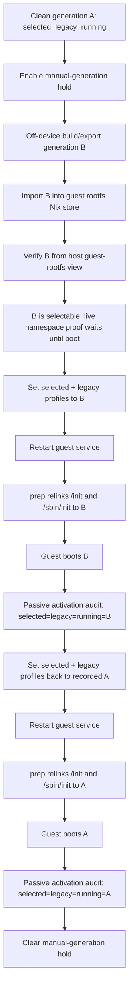

# feat: Stage 10 generation switch proof

## Summary

Prove the next Stage 10 boundary by adding a narrow, operator-driven path for importing an off-device-built guest generation, switching the canonical guest selector from A → B → A, and passively auditing that the booted guest activation really comes from the selected Nix generation. The host remains a generic substrate: it imports/verifies store materialization, points the selected and legacy guest profiles at explicit toplevels, starts the guest, and preserves SSH/recovery without broadening device or storage exposure.

---

## Problem Frame

Stage 10 Spike 1 made `/nix/var/nix/profiles/per-user/root/rocknix-guest-system` the explicit selected guest-system profile and retired host root `/nix`. The remaining proof is stronger than “the current image boots”: we need to show that a guest generation built elsewhere can be imported into the guest store, selected, booted, audited, and rolled back to the previous generation without product-specific host mutation.

---

## Assumptions

*This plan was authored from the current handoff state and repo research. These are explicit implementation bets to review before execution.*

- Stage 10 Spike 1 is already installed and validated on Thor: host root `/nix` is retired, the selected profile exists, the legacy mirror exists, and broad block `DeviceAllow=block-*` entries remain absent.
- Generation B will be built off-device from `rocknix-nix-guest` using the explicit Thor output (`nixosConfigurations.rocknix-guest-main-space-thor.config.system.build.toplevel`) rather than the current on-device impure `by-compatible` autodetection path. Portal/device-generic proof is deferred until Thor passes. The imported artifact is represented by a NixOS toplevel store path, plus enough closure/provenance metadata to verify it after import.
- For this proof, manual A → B → A switching should update both `/nix/var/nix/profiles/per-user/root/rocknix-guest-system` and `/nix/var/nix/profiles/system`; selected-only divergence is deferred until the legacy mirror retirement plan.
- `rocknix-guest-promote.service` must not repair the selector back to the applied image marker during the manual proof. This plan uses an explicit manual-generation hold, waits for any in-flight promotion to finish or stop, and re-checks the hold before promotion writes profiles or markers.
- Marker files such as `/etc/rocknix-guest-revision` and `/etc/rocknix-guest-system-path` remain corroborating audit data, not the source of truth, during manual generation switching.
- Generation B must include a harmless proof marker in the guest generation so audit can distinguish B from A by more than a store-path string.
- Off-device import for this first proof requires a healthy running generation A and verifies through the live guest namespace; offline host-side import is deferred.

---

## Requirements

- R1. Import an off-device-built Thor guest generation into the persistent guest rootfs Nix store, not host root `/nix`.
- R2. Require healthy running generation A for import, then verify imported closure visibility from the host guest-rootfs view and the live guest runtime namespace before selection.
- R3. Provide an explicit, reversible manual-generation switch path that sets both selected and legacy guest profiles to a validated NixOS toplevel.
- R4. Demonstrate A → B → A from a clean starting state where selected, legacy, and running all agree on generation A; switch to imported B, boot and audit B, switch back to A, boot and audit A.
- R5. Prevent promotion drift repair from silently undoing manual selector tests while keeping normal promotion behavior unchanged when no manual hold is active.
- R6. Add a passive activation audit that reports selected, legacy, running, `/init`, `/sbin/init`, applied markers, B proof marker, and ownership-boundary evidence without repairing state.
- R7. Preserve hard substrate invariants: host SSH/recovery, no host `/nix`, no broad `/dev`, no broad block classes, no host product fallback, and no app-specific host storage binds.
- R8. Define a host-side rollback path for the case where generation B cannot boot far enough for in-guest commands, including `rocknix-guest.service` failed/start-limit reset before restarting A.

---

## Scope Boundaries

- This proof is Thor-only; Portal/Sobo and device-generic import/switch behavior are deferred.
- This proof does not support arbitrary in-guest `nixos-rebuild switch` as a canonical profile writer.
- This proof does not retire `/nix/var/nix/profiles/system`; it deliberately keeps selected and legacy profiles mirrored during A → B → A.
- This proof does not introduce automatic rollback, automatic reboot, automatic recovery-flag creation, or host product fallback on bad generations.
- This proof does not unify host and guest Nix stores; host root `/nix` remains retired.
- This proof does not support offline host-side import into the guest store; import requires healthy running A.
- This proof does not broaden block, raw device, or host storage access.
- This proof does not redesign guest promotion; it only adds a deliberate hold so promotion does not fight manual selector validation.

### Deferred to Follow-Up Work

- Arbitrary in-guest rebuild support: decide whether guest-side `nixos-rebuild switch` updates `rocknix-guest-system`, is unsupported but detected as drift, or must go through a wrapper.
- Legacy mirror retirement: remove or demote `/nix/var/nix/profiles/system` after canonical selected-profile switching and rollback are boring.
- Bad-generation behavior drill: deliberately select a broken generation and validate bounded retries/recovery after the happy-path A → B → A proof passes.
- Promotion simplification: reduce host promotion from product-aware build/repair toward generic “start selected generation” mechanics after off-device import is proven.
- Architecture-floor refresh: update `base-architecture-minimum.md` after Thor proof evidence exists, rather than making the architecture contract claim success before validation.

---

## Context & Research

### Relevant Code and Patterns

- `projects/ROCKNIX/packages/tools/rocknix-guest-substrate/scripts/rocknix-guest-prep` already resolves the selected guest profile through `${GUEST_ROOT}`, validates `<system>/init`, and relinks guest `/init` and `/sbin/init` on each start.
- `projects/ROCKNIX/packages/tools/rocknix-guest-substrate/scripts/rocknix-guest-promote` currently builds inside the running guest namespace, sets selected and legacy profiles, writes applied markers, and repairs profile drift when the revision marker matches.
- `projects/ROCKNIX/packages/tools/rocknix-guest-substrate/scripts/rocknix-guest-start` centralizes nspawn argument generation and exact runtime media `DeviceAllow` updates; the generation proof should not move selector policy into this script unless only read-only evidence is needed.
- `projects/ROCKNIX/packages/tools/rocknix-guest-substrate/tests/guest-substrate-static-checks.sh` and `projects/ROCKNIX/packages/tools/rocknix-guest-substrate/tests/guest-substrate-runtime-smoke.sh` are the right places to encode selector/import/audit invariants.
- `projects/ROCKNIX/packages/tools/rocknix-guest-substrate/scripts/rocknix-guest-soak` already samples selected-vs-running generation drift and should reuse the passive audit rather than growing a parallel definition.
- `base-architecture-minimum.md` is the current architecture floor for host/guest responsibility boundaries.

### Institutional Learnings

- `docs/plans/2026-05-13-001-feat-stage10-guest-generation-selector-spike-plan.md` establishes `rocknix-guest-system` as the Stage 10 selector, treats markers as audit/cache, and explicitly names A → B → A as a remaining proof.
- `rocknix-nix-guest: docs/thinking/2026-05-10-rocknix-level-n-8-12-report.md` says Stage 10 success requires Nix-native activation and rollback, not merely one successful boot.
- `rocknix-nix-guest: docs/solutions/runtime-errors/rocknix-nix-remote-copy-profile-store-mismatch-2026-05-05.md` warns that Nix copy/import can appear successful while store paths are invisible in the namespace later used by boot/profile logic.
- `rocknix-nix-guest: docs/solutions/best-practices/rocknix-layer14-main-space-cold-boot-autostart-2026-05-08.md` records the stale `/init` bug; prep must relink init from the current selected generation every start.
- `rocknix-nix-guest: docs/solutions/runtime-errors/rocknix-layer10-stale-running-state-2026-05-06.md` warns that durable metadata does not prove liveness; live `/run/current-system` and process state must corroborate profile state.
- `rocknix-nix-guest: docs/solutions/developer-experience/nix-layer-6-managed-user-environment-rocknix-2026-05-05.md` provides the ownership-audit pattern: record writer ownership, detect external edits/partial activation, and keep repair separate from audit.

### External References

- None. Local code and project learnings are sufficient.

---

## Key Technical Decisions

- Add an explicit manual-generation hold for `rocknix-guest-promote`: promotion drift repair must not race or undo A → B → A, but normal image-driven promotion should remain unchanged when the hold is absent.
- Import into the guest rootfs store, then verify host guest-rootfs visibility before selection and live guest-runtime visibility before accepting the proof: this avoids the false success mode where a closure exists in a different Nix namespace than the one `rocknix-guest-prep` boots.
- Switch selected and legacy profiles together for this proof: existing smoke/soak treats selected-vs-legacy divergence as drift, and legacy mirror retirement is a separate Stage 10 cleanup.
- Keep activation audit passive: the audit may fail or warn, but it must not repair profiles, relink init, restart services, or mutate generation state.
- Record proof state at every boundary: selected, legacy, running, init links, applied markers, imported toplevel, and manual-generation hold state should be observable before switch, after switch, after boot, and after rollback.
- Prefer small host-side helpers over a large “Stage 10 manager”: the goal is to prove the boundary without reintroducing a host product orchestrator.

---

## Open Questions

### Resolved During Planning

- Should A → B → A be bundled with off-device import and passive audit? Yes. These validate one claim: the selected Nix generation defines the booted guest system.
- Should bad-generation testing be bundled? No. Do it after the happy-path proof so failure drills do not obscure whether import/switch/audit works.
- Should the proof update both selected and legacy profiles? Yes, for this proof; selected-only semantics are deferred until legacy mirror retirement.
- Should promotion be left active during manual switching? No. Add an explicit manual-generation hold, make the switch path own stop/wait behavior for any in-flight promotion, and require promotion to re-check the hold before any profile/marker write.
- How should off-device B be targeted? First proof is Thor-only using `rocknix-guest-main-space-thor`; device-generic behavior is deferred.
- How should A/B difference be proven? B carries an explicit harmless proof marker that the activation audit checks.
- Should import support offline host-side mode? No for this proof; require healthy running A and verify import through the live guest namespace.

### Deferred to Implementation

- Exact closure artifact format: choose the simplest off-device export/import format that the available guest Nix tooling can verify from the live generation-A guest namespace.
- Exact provenance metadata shape: implementation may use shell-readable key/value files or another simple format, as long as source ref, target device/profile, toplevel path, and closure identity are captured.
- Exact proof-marker shape: implementation may choose the smallest guest-generation-owned `/etc` marker or equivalent metadata that clearly distinguishes B from A.
- Exact activation audit allowlist: finalize from current guest profile contents during implementation, but keep it narrow and read-only.

---

## Output Structure

    projects/ROCKNIX/packages/tools/rocknix-guest-substrate/
      scripts/
        rocknix-guest-generation-import        [create]
        rocknix-guest-generation-switch        [create]
        rocknix-guest-activation-audit         [create]
        rocknix-guest-promote                  [modify]
        rocknix-guest-soak                     [modify]
      tests/
        guest-substrate-static-checks.sh       [modify]
        guest-substrate-runtime-smoke.sh       [modify]
      package.mk                               [modify]
    documentation/PER_DEVICE_DOCUMENTATION/SM8550/
      STAGE10_GENERATION_PROOF.md              [create]

---

## High-Level Technical Design

> *This illustrates the intended approach and is directional guidance for review, not implementation specification. The implementing agent should treat it as context, not code to reproduce.*

---

## Implementation Units

### U1. Add manual-generation hold semantics to promotion

**Goal:** Prevent `rocknix-guest-promote` from treating intentional manual selector changes as drift during the A → B → A proof.

**Requirements:** R4, R5, R7

**Dependencies:** None

**Files:**
- Modify: `projects/ROCKNIX/packages/tools/rocknix-guest-substrate/scripts/rocknix-guest-promote`
- Modify: `projects/ROCKNIX/packages/tools/rocknix-guest-substrate/tests/guest-substrate-static-checks.sh`
- Modify: `projects/ROCKNIX/packages/tools/rocknix-guest-substrate/tests/guest-substrate-runtime-smoke.sh`
- Modify: `projects/ROCKNIX/packages/tools/rocknix-guest-substrate/scripts/rocknix-guest-soak`

**Approach:**
- Introduce a clearly named manual-generation hold file under the existing `/storage/.guest` control seam.
- Check the hold before promotion compares revision markers, repairs drift, stages source, or builds anything.
- Re-check the hold immediately before any profile write, marker write, or guest restart so an operator can safely create the hold while a long-running promotion build is already in progress.
- Make import/switch operations stop or wait for any active `rocknix-guest-promote.service` before mutating profile state; do not rely on service timing.
- When the hold exists, promotion should log that manual generation selection is active and exit successfully without changing selected, legacy, markers, or services.
- Runtime smoke and soak should surface the hold state as evidence. They should not fail solely because the hold exists, but they should make it obvious so the operator clears it after the proof.

**Patterns to follow:**
- Existing `/storage/.guest` control-file pattern in `rocknix-guest-promote`.
- Existing fail-closed static checks for safety-sensitive promotion behavior.

**Test scenarios:**
- Happy path: with no hold file, promotion behavior remains governed by revision and profile state as today.
- Happy path: with the hold file present, promotion exits before drift repair and before any build/source staging side effects.
- Edge case: if the hold appears while promotion is already running, promotion observes it before profile/marker writes and exits without changing generation state.
- Edge case: a stale hold is visible in live smoke/soak output so normal update suppression is not silent.
- Error path: static checks fail if the hold check appears only after drift repair or if no pre-write hold re-check exists.

**Verification:**
- Manual A → B → A can run without `rocknix-guest-promote` undoing the selected profile, and normal promotion remains unchanged when the hold is absent.

---

### U2. Add off-device guest generation import helper

**Goal:** Provide a narrow import path that places an off-device-built guest generation into the persistent guest rootfs store and verifies it from the namespaces that will later boot it.

**Requirements:** R1, R2, R7

**Dependencies:** None

**Files:**
- Create: `projects/ROCKNIX/packages/tools/rocknix-guest-substrate/scripts/rocknix-guest-generation-import`
- Modify: `projects/ROCKNIX/packages/tools/rocknix-guest-substrate/package.mk`
- Modify: `projects/ROCKNIX/packages/tools/rocknix-guest-substrate/tests/guest-substrate-static-checks.sh`
- Modify: `projects/ROCKNIX/packages/tools/rocknix-guest-substrate/tests/guest-substrate-runtime-smoke.sh`

**Approach:**
- Keep import rooted in guest state: any staged artifact or manifest should enter through `/storage/.guest`, but the resulting store paths must materialize under `/storage/machines/rocknix-guest/nix/store`.
- Define the off-device build contract explicitly. Because current on-device promotion uses impure `rocknix-guest-main-space-by-compatible` evaluation against `/proc/device-tree/compatible`, the first proof uses the explicit Thor output (`rocknix-guest-main-space-thor`) rather than relying on the builder host's device tree.
- Require a candidate NixOS toplevel path and verify it has an executable `init` under the host view of `${GUEST_ROOT}` before it can be selected.
- Require a healthy running generation A and verify import from inside that live guest namespace before selection; do not add offline host-side import in this proof.
- Verify host guest-rootfs visibility before selection as a second check. When B later boots, verify the same toplevel, closure, and proof marker from inside the live B guest namespace before counting import as proof-complete.
- Record simple provenance for the imported candidate: source ref or build identity, Thor target identity, candidate toplevel, import time, and closure verification result.
- Do not change selected or legacy profiles in this unit; import only makes B selectable.

**Patterns to follow:**
- `rocknix-guest-promote` namespace discovery via `systemctl show`, `pgrep`, and `nsenter`.
- Existing script style: `/bin/sh`, `set -eu`, `log()`, `fail()`, `ROCKNIX_GUEST_*` environment overrides.

**Test scenarios:**
- Happy path: a staged candidate whose toplevel and closure are visible under `${GUEST_ROOT}` is accepted and provenance is recorded.
- Happy path: provenance captures Thor target identity so an off-device build cannot accidentally use the builder host's compatible data.
- Edge case: a candidate path that exists in a host or wrong namespace but not under `${GUEST_ROOT}` is rejected.
- Error path: a candidate without executable `init` is rejected before any profile switch.
- Error path: a partial import that fails host guest-rootfs visibility checks is rejected and leaves profiles unchanged.
- Integration: after B boots, live smoke/audit confirms the imported B closure and proof marker are visible from the running guest namespace before the proof is accepted.

**Verification:**
- Generation B is present and verifiable in the guest store before selector mutation begins.

---

### U3. Add manual selected-generation switch helper

**Goal:** Make the A → B → A switch explicit, reversible, and safe to run from host SSH even if the target guest generation later fails.

**Requirements:** R3, R4, R5, R7, R8

**Dependencies:** U1, U2

**Files:**
- Create: `projects/ROCKNIX/packages/tools/rocknix-guest-substrate/scripts/rocknix-guest-generation-switch`
- Modify: `projects/ROCKNIX/packages/tools/rocknix-guest-substrate/package.mk`
- Modify: `projects/ROCKNIX/packages/tools/rocknix-guest-substrate/tests/guest-substrate-static-checks.sh`
- Modify: `projects/ROCKNIX/packages/tools/rocknix-guest-substrate/tests/guest-substrate-runtime-smoke.sh`

**Approach:**
- Require a clean proof start where selected, legacy, and running generation all agree; if they do not, stop and make the operator resolve the ambiguity before naming A.
- Read and record generation A before any switch so it can be restored from the host side.
- Require the manual-generation hold from U1 before allowing a switch; this makes the promotion interaction deliberate.
- Stop or wait for any active `rocknix-guest-promote.service` before mutating selected or legacy profiles.
- Validate the requested toplevel as a guest-absolute `/nix/...` path whose store path exists under `${GUEST_ROOT}` and contains a usable `init`.
- Set both selected and legacy profiles to the requested toplevel using guest Nix tooling when the guest is running; provide a host-side fallback for restoring a previously recorded profile target when the guest cannot boot, without inventing a host root `/nix` dependency.
- When restoring A after a failed B, reset `rocknix-guest.service` failed/start-limit state before restarting so bounded retry protection does not block recovery.
- Leave applied revision/system marker files unchanged, but record proof evidence that markers are secondary during manual-generation hold.

**Patterns to follow:**
- Selected-profile resolution helpers in `rocknix-guest-prep` and `rocknix-guest-promote`.
- Existing bounded failure posture in `rocknix-guest.service`: no auto-reboot, no auto recovery flag, no host product fallback.

**Test scenarios:**
- Happy path: starting from selected=legacy=running=A, switching to validated B updates selected and legacy profiles to B and does not change applied markers.
- Happy path: switching back to recorded A restores selected and legacy profiles to A.
- Edge case: selected=B while running=A before restart is reported as an expected transitional state, not confused with a successful boot.
- Edge case: a failed/start-limit-hit guest service is reset before restarting restored A.
- Error path: switching to a missing, non-`/nix`, or non-NixOS-toplevel path is rejected with profiles unchanged.
- Error path: attempting to switch while manual-generation hold is absent is rejected to avoid drift repair races.
- Integration: after a switch and guest restart, `rocknix-guest-prep` relinks `/init` and `/sbin/init` to the selected generation.

**Verification:**
- An operator can restore A from host SSH using recorded proof state even if B fails before guest userspace becomes usable.

---

### U4. Add passive activation ownership audit

**Goal:** Provide read-only evidence that selected profile, legacy mirror, booted `/run/current-system`, init symlinks, and product-facing activation state agree with the selected generation.

**Requirements:** R2, R4, R6, R7

**Dependencies:** U1, U2, U3

**Files:**
- Create: `projects/ROCKNIX/packages/tools/rocknix-guest-substrate/scripts/rocknix-guest-activation-audit`
- Modify: `projects/ROCKNIX/packages/tools/rocknix-guest-substrate/package.mk`
- Modify: `projects/ROCKNIX/packages/tools/rocknix-guest-substrate/scripts/rocknix-guest-soak`
- Modify: `projects/ROCKNIX/packages/tools/rocknix-guest-substrate/tests/guest-substrate-static-checks.sh`
- Modify: `projects/ROCKNIX/packages/tools/rocknix-guest-substrate/tests/guest-substrate-runtime-smoke.sh`

**Approach:**
- Report a state matrix containing selected profile, legacy profile, running `/run/current-system`, `/init`, `/sbin/init`, applied marker files, B proof marker, manual-generation hold state, and recent imported candidate state.
- Distinguish expected transitional states from failures: selected can differ from running before restart, but after guest boot completes selected/legacy/running/init links should converge.
- Keep the ownership check narrow for this proof: report direct generation-authority surfaces and existing substrate invariants rather than building a broad host/guest product-file scanner.
- Fail or warn read-only based on severity, but never repair, relink, restart, or write marker/profile state.
- Reuse this audit from live smoke and soak so Stage 10 evidence has one definition.

**Patterns to follow:**
- `rocknix-guest-soak` selected-profile and `/run/current-system` checks.
- Layer 6 managed activation ownership pattern from the Nix experiment learnings.

**Test scenarios:**
- Happy path: after booting A or B, selected, legacy, running, `/init`, and `/sbin/init` all resolve to the same generation; B also exposes the expected proof marker.
- Edge case: selected=B and running=A before restart is reported as transitional, not as boot proof.
- Error path: selected/legacy divergence fails outside explicitly allowed transition windows.
- Error path: running `/run/current-system` differs from selected after guest boot completes.
- Error path: app-specific host storage binds or forbidden substrate exposures appear in the audited invariants.
- Integration: live smoke and soak use the audit rather than duplicating generation-state logic.

**Verification:**
- The proof can show generation identity with live evidence, not only durable marker files.

---

### U5. Document the A → B → A proof runbook and recovery path

**Goal:** Give the operator a concise, repeatable validation path for importing B, switching A → B → A, collecting evidence, and recovering if B fails.

**Requirements:** R4, R5, R7, R8

**Dependencies:** U1, U2, U3, U4

**Files:**
- Create: `documentation/PER_DEVICE_DOCUMENTATION/SM8550/STAGE10_GENERATION_PROOF.md`

**Approach:**
- Describe the expected proof states: clean initial A, imported B, selected-but-not-running B, booted B, selected-but-not-running A, restored booted A.
- Include the evidence matrix the operator should capture at each state: selected, legacy, running, init links, applied markers, B proof marker, manual-generation hold, import provenance, guest failed units, host failed units, and substrate safety invariants.
- Document the manual-generation hold lifecycle clearly: when it is enabled, why it exists, and when it must be cleared.
- Document host-side rollback when B cannot boot: use the recorded A toplevel and host SSH/recovery to restore selected and legacy profiles, reset `rocknix-guest.service` failed/start-limit state, and restart without needing B guest userspace.
- Treat architecture-floor updates as post-validation documentation follow-up rather than part of the proof implementation.

**Patterns to follow:**
- Existing SM8550 docs under `documentation/PER_DEVICE_DOCUMENTATION/SM8550/`.
- Architecture-boundary language in `base-architecture-minimum.md`, without changing it before Thor proof evidence exists.

**Test scenarios:**
- Test expectation: none for prose itself, but docs must be reviewed against U1–U4 behavior so they do not prescribe unsupported commands or imply automatic rollback.

**Verification:**
- A later operator can run the proof without rediscovering manual-generation hold, namespace visibility, marker semantics, or host-side rollback assumptions.

---

## System-Wide Impact

- **Interaction graph:** `rocknix-guest-promote`, `rocknix-guest-generation-import`, `rocknix-guest-generation-switch`, `rocknix-guest-activation-audit`, `rocknix-guest-prep`, `rocknix-guest.service`, live smoke, and soak all observe the same selected/legacy/running generation state.
- **Error propagation:** import/switch/audit failures should stop the proof with clear logs while leaving host SSH and recovery available. They should not trigger automatic rollback or host product fallback.
- **State lifecycle risks:** manual-generation hold is a temporary non-normal state; stale holds suppress normal promotion and must be visible in smoke/soak/docs.
- **API surface parity:** selected and legacy profile switching must remain mirrored during this proof so current smoke/soak/promotion expectations do not split into two incompatible authorities.
- **Integration coverage:** unit-like shell fixture tests cannot prove namespace visibility; import-time validation must check the host guest-rootfs view, and live validation must check the booted B closure from the running guest namespace before the proof passes.
- **Unchanged invariants:** host root `/nix` remains retired; guest rootfs `/nix` remains authoritative; device access remains exact/narrow; `/storage/.guest` remains the only host/guest storage seam.

---

## Risks & Dependencies

| Risk | Mitigation |
|------|------------|
| Promotion drift repair silently reverts B to A | Add explicit manual-generation hold, make switch/import wait for any in-flight promotion, and re-check the hold immediately before promotion profile/marker writes. |
| Closure import succeeds in the wrong namespace | Verify candidate toplevel and closure through `${GUEST_ROOT}` before selection and from inside the running guest namespace before accepting boot proof. |
| B cannot boot and blocks guest-side rollback | Require clean A at proof start, record A before switching, restore selected/legacy from host SSH, and reset `rocknix-guest.service` failed/start-limit state before restarting A. |
| Stale manual hold suppresses future image promotion | Make hold visible in live smoke, soak, and docs; require clearing it at proof end. |
| Audit becomes a repair mechanism and reintroduces host authority | Keep audit read-only; profile writes belong to switch/promote only. |
| New helpers broaden substrate access | Static checks forbid host `/nix`, full `/dev`, broad block classes, and broad/app-specific storage binds. |

---

## Documentation / Operational Notes

- This plan should be validated first on Thor/Bandai using a fast SM8550 image, then repeated on Portal/Sobo only after Thor A → B → A is boring.
- The runbook should clearly distinguish normal image-driven promotion from manual proof-mode generation switching.
- After validation, capture a `docs/solutions/` learning in the guest repo or host repo documenting the namespace/import pitfalls and the final proof shape.

---

## Sources & References

- **Origin document:** `docs/plans/2026-05-13-001-feat-stage10-guest-generation-selector-spike-plan.md`
- Related architecture: `base-architecture-minimum.md`
- Related substrate scripts: `projects/ROCKNIX/packages/tools/rocknix-guest-substrate/scripts/rocknix-guest-prep`
- Related substrate scripts: `projects/ROCKNIX/packages/tools/rocknix-guest-substrate/scripts/rocknix-guest-promote`
- Related substrate scripts: `projects/ROCKNIX/packages/tools/rocknix-guest-substrate/scripts/rocknix-guest-soak`
- Related tests: `projects/ROCKNIX/packages/tools/rocknix-guest-substrate/tests/guest-substrate-static-checks.sh`
- Related tests: `projects/ROCKNIX/packages/tools/rocknix-guest-substrate/tests/guest-substrate-runtime-smoke.sh`
- Sibling thinking doc: `rocknix-nix-guest: docs/thinking/2026-05-10-rocknix-level-n-8-12-report.md`
