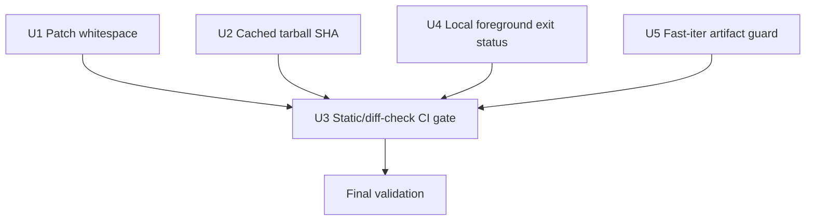

# fix: Harden ROCKNIX build-integrity checks

**Target repo:** `rocknix` host repo. Implementation file paths below are repo-relative to that target repo unless explicitly marked as documentation references.

## Summary

Tighten the current custom-branch build pipeline by fixing the known diff-check failure, making guest-substrate static checks part of CI, preserving local foreground build failures through logging, rejecting incompatible fast-iter artifact reuse, and verifying cached guest tarballs before extraction. This is intentionally a narrow build-integrity pass, not a redesign of SM8550 guest/recovery behavior.

---

## Problem Frame

The branch is close to a full SM8550 build, but several validation and integrity gaps can let bad inputs pass unnoticed: patch whitespace breaks `git diff --check`, existing guest-substrate static checks are manual-only, local foreground builds can hide failures behind `tee`, fast-iter can mix artifacts from another branch or stale same-branch build, and cached guest source tarballs are trusted without rehashing.

---

## Requirements

- R1. `git diff --check upstream/next...HEAD` must pass for the current branch's changed patch files without breaking patch application.
- R2. Guest-substrate static checks and the upstream diff-check gate must run in GitHub Actions before image artifacts are produced or reused.
- R3. `scripts/local-image-build` foreground mode must exit with the actual build launch/build status even when output is piped through `tee`.
- R4. `build-image-only.yml` must reject a `BASE_RUN_ID` from any branch other than the workflow dispatch branch before downloading artifacts.
- R5. `build-image-only.yml` must prevent stale same-branch artifact reuse unless the current diff from the base run is limited to image-step-safe paths that cannot invalidate reused heavy artifacts.
- R6. `rocknix-guest-substrate/package.mk` must verify the cached `rocknix-nix-guest` tarball SHA before extraction, not only freshly downloaded `.tmp` files.
- R7. Static checks must encode the package, workflow, and local-build invariants so regressions are caught without requiring a full image build.

---

## Scope Boundaries

- Do not redesign SM8550 first-boot guest seeding.
- Do not change recovery target selection, systemd generator behavior, or `/flash/rocknix.no-nspawn` semantics.
- Do not redesign guest block-device passthrough or nspawn device exposure.
- Do not change host SSH/root-password policy.
- Do not broaden or restructure the full ROCKNIX build matrix beyond the minimal CI gates needed for this fix.
- Do not move planning/docs back into the host repo.

### Deferred to Follow-Up Work

- Recovery-boundary hardening: address same-boot recovery target selection and `/flash` ordering in a separate recovery-focused plan.
- Guest rootfs seeding: decide how fresh `/storage` images should seed `/storage/machines/rocknix-guest` in a separate boot-lifecycle plan.
- Block-device passthrough allowlist: replace heuristic media detection with a positive allowlist in a separate safety plan.
- Post-fix learning capture: after implementation, add or refresh a `docs/solutions/` entry in the docs repo for build-integrity conventions.
- Fast-iter build-container pinning: replace the mutable `rocknix-build:latest` dependency with a branch/digest-compatible image selection in a separate CI hardening pass.

---

## Context & Research

### Relevant Code and Patterns

- `.github/workflows/build-nightly.yml` is the top-level **Build** workflow and already centralizes branch/default-device behavior for the custom fork.
- `.github/workflows/build-image-only.yml` already validates `BASE_RUN_ID` status and workflow name before artifact download; it should extend that same preflight step to branch equality, SHA ancestry, and image-step-safe path checks.
- `.github/workflows/build-aarch64-image.yml` uses a Docker exit-code capture pattern before piping logs through filtering; this is the precedent for preserving command status across log pipelines.
- `scripts/local-image-build` uses Bash arrays and already separates foreground from background behavior; the failure-propagation change should stay foreground-local.
- `projects/ROCKNIX/packages/tools/rocknix-guest-substrate/package.mk` downloads and stages the pinned guest source and already treats SHA verification as mandatory for fresh downloads.
- `projects/ROCKNIX/packages/tools/rocknix-guest-substrate/tests/guest-substrate-static-checks.sh` is the existing static contract test; extend it rather than introducing a second guest-substrate test harness.
- `projects/ROCKNIX/devices/SM8550/patches/linux/0054-edt-ft5x06-honour-DT-input-name.patch` and `projects/ROCKNIX/packages/tools/rocknix-splash/patches/rocknix-splash-0001-use-custom-boot-logo.patch` are the current `git diff --check` offenders.

### Institutional Learnings

- `docs/solutions/developer-experience/fast-iter-and-local-rocknix-build-2026-05-08.md` records that fast-iter CI is safe only when artifact reuse stays branch/device-compatible, and that the local wrapper is the SSH-safe build path.
- `docs/solutions/developer-experience/trigger-fork-rocknix-actions-build-from-nixos-2026-05-05.md` reinforces dispatching and consuming artifacts from the intended branch/ref.
- `docs/solutions/developer-experience/custom-fork-update-sm8550-rocknix-2026-05-04.md` treats artifact SHA verification as mandatory evidence, not a one-time download nicety.
- `docs/solutions/developer-experience/rocknix-stage10-generation-switch-proof-sm8550-2026-05-13.md` emphasizes exact revision/provenance verification for imported or embedded guest material.

### External References

- External research was skipped. The needed patterns are local: POSIX/Bash exit handling, existing GitHub Actions preflight style, and the existing guest-substrate static-check harness are sufficient for this bounded fix.

---

## Key Technical Decisions

- Keep the fix narrow and validation-oriented: this plan addresses known build/check integrity gaps and deliberately leaves larger recovery/security architecture findings to separate plans.
- Extend existing preflight points instead of adding a new subsystem: `build-image-only.yml` already owns base-run validation, `package.mk` already owns guest tarball integrity, and `guest-substrate-static-checks.sh` already owns substrate static contracts.
- Fail closed on cached guest tarball mismatch: mirror the current fresh-download mismatch behavior by printing expected/actual SHA and refusing extraction rather than silently trusting or repairing a bad cache.
- Compare fast-iter branches against `GITHUB_REF_NAME`: `workflow_dispatch` runs against a selected branch ref, so the base run's `.head_branch` should match that branch before artifacts are reused.
- Treat same-branch stale artifacts as safe only for image-step-compatible diffs: the workflow should log base/current SHAs and fail closed when changed paths since the base run could invalidate reused heavy artifacts.
- Preserve background local-build behavior: the bug is foreground status loss through `tee`; background launch/tail semantics should not change.
- Keep CI permissions least-privilege for new gates: repository-owned static checks should not require secrets, and workflow permissions should grant only the read scopes needed for checkout and Actions metadata/artifact access.

---

## Open Questions

### Resolved During Planning

- Cached tarball mismatch behavior: fail closed and do not extract. Optional cache deletion may be included if it is explicit and still fails the current build, but silent re-download should be avoided.
- Fast-iter ref support: treat the workflow as branch-oriented; reject empty/null base branches rather than adding tag compatibility in this pass.
- Static-check CI placement: gate both full Build and image-only artifact reuse paths; use direct execution of the existing static-check script so executable-bit and shebang assumptions remain visible.

### Deferred to Implementation

- Exact workflow layout: implementation may choose a dedicated lightweight job or reusable step, but artifact-producing jobs must depend on it explicitly rather than merely running it in parallel.
- Exact patch-cleanup method: implementation may regenerate zero-context patches or surgically remove diff-check whitespace, as long as the patches still apply.
- Exact local-build status-capture idiom: use `PIPESTATUS[0]` or `pipefail` only if Ctrl+C and foreground logging semantics stay clear.
- Exact image-step-safe path allowlist: choose the narrowest practical set from existing fast-iter documentation; when uncertain, fail closed and require a full Build.
- Fast-iter package reinstall policy: when the allowed diff touches `rocknix-guest-substrate` package, script, unit, or test paths, force `CLEAN_GUEST_SUBSTRATE=true` behavior or fail before artifact download if the run disables it.

---

## High-Level Technical Design

> *This illustrates the intended approach and is directional guidance for review, not implementation specification. The implementing agent should treat it as context, not code to reproduce.*

The independent fixes should be small, but the CI/static-check unit should land after the package/workflow/script invariants it asserts are present.

---

## Implementation Units

### U1. Clean changed patch files for diff-check safety

**Goal:** Make the branch pass `git diff --check upstream/next...HEAD` without altering the intended Thor touchscreen or splash behavior.

**Requirements:** R1, R2, R7

**Dependencies:** None

**Files:**
- Modify: `projects/ROCKNIX/devices/SM8550/patches/linux/0054-edt-ft5x06-honour-DT-input-name.patch`
- Modify: `projects/ROCKNIX/packages/tools/rocknix-splash/patches/rocknix-splash-0001-use-custom-boot-logo.patch`
- Modify: `projects/ROCKNIX/packages/tools/rocknix-guest-substrate/tests/guest-substrate-static-checks.sh`

**Approach:**
- Regenerate or minimize these patches so changed lines no longer include context forms that `git diff --check` flags, such as blank context lines represented by a single space or context lines whose required unified-diff marker is followed by a target-file tab.
- Do not strip required unified-diff context markers by hand; prefer zero-context or minimal-context regeneration when normal context would keep producing diff-check warnings.
- Remove format-patch footer/signature whitespace if present and not needed by the package patch application path.
- Keep the patch payload semantically identical: the Linux patch should still add the optional `input-name` override, and the splash patch should still swap the embedded logo paths/colors.

**Patterns to follow:**
- Existing package patch layout under `projects/ROCKNIX/devices/SM8550/patches/linux/`.
- Existing `rocknix-splash` patch placement under `projects/ROCKNIX/packages/tools/rocknix-splash/patches/`.

**Test scenarios:**
- Happy path: changed patch files have no changed-line trailing whitespace or space-before-tab warnings -> `git diff --check upstream/next...HEAD` reports no errors.
- Integration: affected package patch application still succeeds -> patch cleanup did not remove meaningful context or payload.
- Edge case: target-file tab indentation is preserved in the applied result without leaving changed lines that trigger `space before tab` in the repository diff.
- Static contract: the CI/static gate includes a fork-safe upstream diff-check path, so future patch whitespace regressions are not manual-only.

**Verification:**
- Branch-level diff check passes.
- Affected patches still apply in their package build/patch-application path.

---

### U2. Verify cached guest tarball before extraction

**Goal:** Ensure `rocknix-guest-substrate` verifies the pinned guest tarball every time it is used, including cache hits.

**Requirements:** R6, R7

**Dependencies:** None

**Files:**
- Modify: `projects/ROCKNIX/packages/tools/rocknix-guest-substrate/package.mk`
- Modify: `projects/ROCKNIX/packages/tools/rocknix-guest-substrate/tests/guest-substrate-static-checks.sh`

**Approach:**
- Refactor the existing fresh-download SHA comparison into a small package-local verification shape or add a second explicit cached-file verification block before extraction.
- Verify the final `${guest_tarball}` after the download-if-missing block and before `tar -xzf`.
- On mismatch, print expected and actual SHA and fail before extraction.
- Keep the fresh `.tmp` verification before moving into the cache so interrupted or wrong downloads never become trusted cache entries.
- Update static checks so they prove both fresh `.tmp` verification and final cached tarball verification remain present.
- Make the static assertion order-sensitive enough to catch verification code that exists but is not load-bearing before extraction; a tiny fixture is preferable if it can stay cheap and deterministic.

**Patterns to follow:**
- Current `package.mk` SHA mismatch messaging and fail-closed behavior.
- Existing literal contract assertions in `guest-substrate-static-checks.sh`.

**Test scenarios:**
- Happy path: cache miss downloads `.tmp`, verifies `.tmp`, moves it to `${guest_tarball}`, verifies `${guest_tarball}`, then extracts.
- Happy path: cache hit skips download, verifies `${guest_tarball}`, then extracts.
- Error path: cache hit with wrong SHA emits expected/actual values and exits before extraction.
- Error path: fresh download with wrong SHA removes or leaves only the `.tmp` failure artifact according to existing behavior and exits before moving into cache.
- Static contract: removing final cached tarball verification causes `guest-substrate-static-checks.sh` to fail.
- Static/fixture contract: moving extraction before final verification causes the static check or fixture to fail.

**Verification:**
- Static checks pass with both fresh-download and cache-hit verification assertions.
- Package install logic has no path from existing cache file to extraction without SHA comparison.

---

### U3. Gate CI with guest-substrate static and diff checks

**Goal:** Ensure the existing guest-substrate static contract and upstream diff-check run in GitHub Actions before full or fast-iter image outputs can be trusted.

**Requirements:** R1, R2, R7

**Dependencies:** U1, U2, U4, U5

**Files:**
- Modify: `.github/workflows/build-nightly.yml`
- Modify: `.github/workflows/build-image-only.yml`
- Modify: `projects/ROCKNIX/packages/tools/rocknix-guest-substrate/tests/guest-substrate-static-checks.sh`

**Approach:**
- Add a lightweight validation gate to the full **Build** workflow path before expensive image/device jobs proceed.
- Make artifact-producing jobs explicitly depend on the validation gate; it is not enough for the gate to run in parallel.
- Add the same direct static-check execution to `build-image-only.yml` after checkout and before artifact downloads or image build.
- Include a fork-safe upstream diff-check: fetch `ROCKNIX/distribution` `next` or another explicit upstream ref before running the branch diff check, rather than assuming `upstream/next` exists in Actions.
- Execute `guest-substrate-static-checks.sh` directly rather than via `sh script` so CI also depends on the executable bit and shebang being correct.
- Extend static checks with repo-level assertions for the new CI wiring and dependency shape so future workflow edits cannot silently drop or de-gate the validation.
- Keep this CI gate cheap: no Docker image build, no package compilation, and no secrets.
- Use explicit minimal workflow permissions for the new validation path and for image-only metadata/artifact reads.

**Patterns to follow:**
- Existing GitHub Actions checkout and shell-step style in `build-nightly.yml` and `build-image-only.yml`.
- Existing `guest-substrate-static-checks.sh` fail-fast contract style.

**Test scenarios:**
- Happy path: full Build workflow checks out the repo and runs validation before downstream artifact-producing jobs.
- Happy path: image-only workflow runs validation before base artifact download.
- Happy path: CI fetches an explicit upstream ref and runs the same branch diff-check that caught the patch whitespace failure.
- Error path: a failing static check or diff-check stops the workflow before image artifacts are uploaded.
- Static contract: removing the CI step/job from either workflow makes `guest-substrate-static-checks.sh` fail.
- Static contract: removing the `needs` dependency from artifact-producing jobs makes `guest-substrate-static-checks.sh` fail.
- Edge case: script execution in CI uses the checked-out file's executable bit and does not depend on host-specific shell aliases.

**Verification:**
- Workflow YAML remains syntactically valid.
- Static checks pass locally and are visibly invoked by both relevant workflow paths.
- Artifact-producing jobs cannot run when the validation gate fails.
- CI failure surfaces the static-check or diff-check message rather than failing later in an expensive build step.

---

### U4. Preserve foreground local-build exit status through logging

**Goal:** Make `scripts/local-image-build` foreground mode return the build command's failure status instead of `tee`'s status.

**Requirements:** R3, R7

**Dependencies:** None

**Files:**
- Modify: `scripts/local-image-build`
- Modify: `projects/ROCKNIX/packages/tools/rocknix-guest-substrate/tests/guest-substrate-static-checks.sh`

**Approach:**
- Change only the foreground path that currently pipes `RUN_CMD` output through `tee`.
- Capture the left side of the pipeline immediately after it runs, or use `pipefail` in a way that still preserves the intended Ctrl+C behavior.
- Return the build command status to the caller.
- Keep background mode's launch/tail behavior unchanged.
- Add a static assertion or lightweight fixture in `guest-substrate-static-checks.sh` so the pipeline cannot regress to unqualified `cmd | tee` status loss; prefer a fixture that proves a fake foreground failure propagates non-zero if it can stay cheap.

**Patterns to follow:**
- Existing Docker exit-code capture in `.github/workflows/build-aarch64-image.yml` for preserving command status through log filtering.
- Existing `scripts/local-image-build` foreground/background separation.

**Test scenarios:**
- Happy path: foreground build command exits `0` -> script exits `0` and writes log output.
- Error path: foreground build command exits non-zero while `tee` succeeds -> script exits with the non-zero build status.
- Error path: failed `systemd-run`, `podman`, or inner build launch is reflected as non-zero by the script.
- Edge case: background mode still starts, tails, and exits according to its existing launch semantics; it is not coupled to foreground exit capture.
- Static contract: reverting to a bare `"${RUN_CMD[@]}" 2>&1 | tee "${LOG_FILE}"` without status handling makes static checks fail.
- Fixture contract: a fake foreground command returning non-zero propagates that non-zero status through the logging path.

**Verification:**
- `scripts/local-image-build` remains Bash-syntax valid.
- A simulated failing foreground command or reviewed fixture proves non-zero status propagates.
- Existing status/abort/background command paths are unchanged in behavior.

---

### U5. Enforce fast-iter artifact compatibility before reuse

**Goal:** Prevent `build-image-only.yml` from combining the current checkout with incompatible successful Build artifacts.

**Requirements:** R4, R5, R7

**Dependencies:** None

**Files:**
- Modify: `.github/workflows/build-image-only.yml`
- Modify: `projects/ROCKNIX/packages/tools/rocknix-guest-substrate/tests/guest-substrate-static-checks.sh`

**Approach:**
- Extend the existing `Verify base run is on the same branch and successful` step.
- Compare `.head_branch` from the `gh api` run metadata to the current workflow branch (`GITHUB_REF_NAME`).
- Also inspect/log the base run SHA and current SHA before artifact download.
- Require the base run SHA to be an ancestor of the current checkout and fail when the changed paths since that SHA are outside a narrow image-step-safe allowlist.
- When changed paths include `rocknix-guest-substrate` package/script/systemd/test files, require the workflow to rerun that package install path by forcing the existing clean behavior; fail before artifact download if the input disables that clean.
- Fail with a clear `::error::` before any `gh run download` when branches differ, the base branch is empty/null, the base SHA is incompatible, or changed paths could invalidate reused heavy artifacts.
- Keep the existing success-conclusion and workflow-name checks.
- Add static-check assertions that the branch comparison, SHA/path compatibility guard, and pre-download ordering remain present.

**Patterns to follow:**
- Existing `gh api` + `jq` metadata extraction in `build-image-only.yml`.
- Existing `::error::` workflow failure messages in the same step.

**Test scenarios:**
- Happy path: base run `.head_branch` equals `GITHUB_REF_NAME`, base SHA is compatible, changed paths are image-step-safe, and conclusion/workflow checks pass -> artifact downloads may proceed.
- Error path: base run conclusion is not `success` -> existing failure behavior remains.
- Error path: base run workflow name is not `Build` -> existing failure behavior remains.
- Error path: base run branch differs from `GITHUB_REF_NAME` -> workflow fails before artifact downloads with a branch-mismatch message.
- Error path: base run branch is empty/null -> workflow fails closed rather than treating it as compatible.
- Error path: same-branch base run is not an ancestor of current checkout -> workflow fails before artifact downloads.
- Error path: same-branch diff includes non-image-step-safe files -> workflow fails and asks for a full Build.
- Error path: same-branch diff includes `rocknix-guest-substrate` package/script/systemd/test files while package clean is disabled -> workflow fails before artifact downloads.
- Static contract: removing the branch equality or SHA/path compatibility check makes `guest-substrate-static-checks.sh` fail.
- Static/order contract: moving compatibility checks after `gh run download` makes `guest-substrate-static-checks.sh` fail.

**Verification:**
- The fast-iter workflow's validation step logs base/current branch and SHA.
- Cross-branch `BASE_RUN_ID` cannot reach artifact download steps.
- Stale same-branch artifacts cannot be reused when intervening changes could invalidate heavy artifacts.
- Allowed guest-substrate image-step changes cannot bypass package reinstall through `CLEAN_GUEST_SUBSTRATE=false`.
- Existing same-branch successful Build runs still pass the preflight when the intervening diff is image-step-safe.

---

## System-Wide Impact

- **Interaction graph:** GitHub Actions Build and image-only workflows, local build wrapper, and guest-substrate package staging all become stricter before artifacts are produced or reused.
- **Error propagation:** Failures should move earlier and become clearer: static/diff-check failures stop CI before builds, branch/SHA/path mismatches stop before artifact downloads, tarball mismatch stops before extraction, and local build failures surface as script exit failures.
- **State lifecycle risks:** Cached guest tarballs remain persistent under `${SOURCES}` but are no longer trusted without rehashing. Background local-build state and logs should not change.
- **API surface parity:** No public runtime API changes. The externally visible surfaces are CI workflow behavior and local CLI exit status.
- **Integration coverage:** CI/static checks cover configuration invariants; full image build remains the integration proof that cleaned patches apply and the packaged guest tarball still stages correctly.
- **Unchanged invariants:** SM8550 thin-host behavior, nspawn device policy, recovery mode, guest promotion semantics, and host networking/security policy are intentionally unchanged.

---

## Risks & Dependencies

| Risk | Mitigation |
|------|------------|
| Patch whitespace cleanup breaks patch application | Validate affected patch application/build path in addition to `git diff --check`. |
| CI wiring adds noise or slows iteration | Keep the gate shell-only, run it before expensive jobs, and make artifact jobs explicitly depend on it. |
| Static checks become too brittle | Assert durable invariants and ordering/control-flow where practical; use fixtures for failure propagation and pre-extraction/pre-download ordering when cheap. |
| `local-image-build` status capture changes Ctrl+C behavior | Keep the change limited to foreground exit capture and explicitly validate cancellation/launch failure behavior. |
| Cached tarball mismatch failure requires manual cleanup | Prefer fail-closed integrity over silent repair; include clear expected/actual output so cleanup is obvious. |
| Artifact guard rejects unusual refs or non-image-step diffs | Treat fast-iter as branch-only and image-step-only in this pass; require a full Build for anything outside the allowlist. |
| Mutable `rocknix-build:latest` can drift independently of base artifacts | Document as follow-up CI hardening; this pass blocks known branch/SHA/path and package-clean mismatches but does not solve image digest pinning. |

---

## Documentation / Operational Notes

- The plan document lives in the `rocknix-nix-guest` docs repo, but implementation targets the `rocknix` host repo.
- Follow-up only: after implementation, consider adding a docs-repo solution note for the build-integrity convention if these checks become a recurring pattern.
- The GitHub Actions build currently running for the prior SHA is not a substitute for this plan's post-fix validation; these fixes should be validated on the SHA that contains them.

---

## Sources & References

- Related code: `.github/workflows/build-nightly.yml`
- Related code: `.github/workflows/build-image-only.yml`
- Related code: `.github/workflows/build-aarch64-image.yml`
- Related code: `scripts/local-image-build`
- Related code: `projects/ROCKNIX/packages/tools/rocknix-guest-substrate/package.mk`
- Related code: `projects/ROCKNIX/packages/tools/rocknix-guest-substrate/tests/guest-substrate-static-checks.sh`
- Related code: `projects/ROCKNIX/devices/SM8550/patches/linux/0054-edt-ft5x06-honour-DT-input-name.patch`
- Related code: `projects/ROCKNIX/packages/tools/rocknix-splash/patches/rocknix-splash-0001-use-custom-boot-logo.patch`
- Institutional learning: `docs/solutions/developer-experience/fast-iter-and-local-rocknix-build-2026-05-08.md`
- Institutional learning: `docs/solutions/developer-experience/trigger-fork-rocknix-actions-build-from-nixos-2026-05-05.md`
- Institutional learning: `docs/solutions/developer-experience/custom-fork-update-sm8550-rocknix-2026-05-04.md`
- Institutional learning: `docs/solutions/developer-experience/rocknix-stage10-generation-switch-proof-sm8550-2026-05-13.md`
