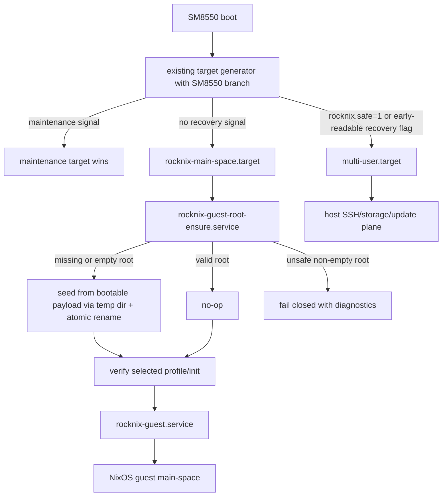

# fix: Harden SM8550 first boot and recovery selection

## Summary

This plan hardens the SM8550 thin-host boot path so a fresh or wiped `/storage` creates a bootable persistent guest root before the guest is started, and recovery signals prevent the NixOS guest from starting during the same boot. The approach defines an explicit bootable guest seed artifact, adds a fail-closed guest-root ensure step, moves boot-mode selection into early target generation, and verifies both paths with source-tree and runtime smoke coverage.

---

## Problem Frame

The current thin-host image stages the packaged guest under `/usr/lib/rocknix-guest-substrate/guest`, but `rocknix-guest.service` and `rocknix-guest-promote.service` both skip when `/storage/machines/rocknix-guest` does not already exist. On a fresh install or wiped `/storage`, the guest may never be created. Separately, `rocknix-recovery-toggle.service` calls `systemctl set-default` during boot, which is too late to reliably change the already-constructed boot transaction and may fail to prevent the guest from starting on the same boot.

---

## Requirements

- R1. A fresh SM8550 thin-host boot with no `/storage/machines/rocknix-guest` must create a valid persistent guest rootfs before `rocknix-guest.service` starts.
- R2. Guest-root creation and repair must be idempotent and conservative: valid existing roots are preserved, incomplete roots are not destructively overwritten, and failures leave the host recovery/update plane reachable.
- R3. `rocknix.safe=1` must prevent root ensure, `rocknix-guest.service`, guest promotion, and guest Wi-Fi readiness from starting during the same boot.
- R4. The sticky `/flash/rocknix.no-nspawn` recovery flag must prevent guest mutation/startup during the same boot even if target selection happens before `/flash` is readable.
- R5. Existing ROCKNIX maintenance targets such as resize, factory reset, backup restore, text mode, and installer must keep precedence over SM8550 guest/recovery target selection.
- R6. The fixes must be covered by the existing guest-substrate static checks and runtime smoke posture.

---

## Scope Boundaries

- Do not broaden or redesign guest device passthrough, block-device allowlisting, or nspawn capabilities.
- Do not change SSH password/root-login policy in this plan.
- Do not modify fast-iter CI branch validation, artifact-reuse logic, or local build tooling. Verification changes should stay in guest-substrate static/runtime smoke unless implementation proves a concrete CI coverage gap.
- Do not reintroduce legacy host UI recovery; SM8550 recovery remains SSH/storage/update oriented through `multi-user.target`.
- Do not redesign guest promotion beyond the ordering and safety needed for first-boot root availability.
- Do not fetch or build guest content during first boot or recovery; first-boot seeding must use a packaged bootable artifact.

### Deferred to Follow-Up Work

- Broader hardening from the upstream-diff review: block-device allowlist tightening, host SSH authentication policy, cached guest tarball re-verification, and fast-iter branch guard fixes should be planned separately.

---

## Context & Research

### Relevant Code and Patterns

- `projects/ROCKNIX/packages/tools/rocknix-guest-substrate/package.mk` stages the packaged guest, installs scripts/units, and enables the guest/main-space services.
- `projects/ROCKNIX/packages/tools/rocknix-guest-substrate/system.d/rocknix-guest.service` currently depends on `/storage/machines/rocknix-guest` already existing and starts through `rocknix-guest-start`.
- `projects/ROCKNIX/packages/tools/rocknix-guest-substrate/system.d/rocknix-main-space.target` is the SM8550 default target and pulls in the guest.
- `projects/ROCKNIX/packages/tools/rocknix-guest-substrate/scripts/rocknix-guest-prep` validates the selected guest system profile and links `/init`/`/sbin/init` to the selected generation.
- `projects/ROCKNIX/packages/tools/rocknix-guest-substrate/scripts/rocknix-guest-promote` already uses temp-dir staging and atomic rename patterns for packaged guest promotion material.
- `projects/ROCKNIX/packages/tools/rocknix-guest-substrate/scripts/rocknix-recovery-toggle` currently persists default-target selection with `systemctl set-default`; this is useful as an audit/history seam but not sufficient for same-boot transaction selection.
- `packages/sysutils/busybox/scripts/libreelec-target-generator` is the existing early target-selection pattern. It writes `$EARLY_DIR/default.target` for maintenance modes.
- `projects/ROCKNIX/packages/tools/rocknix-guest-substrate/tests/guest-substrate-static-checks.sh` is the canonical source-tree contract test for this substrate.
- `projects/ROCKNIX/packages/tools/rocknix-guest-substrate/tests/guest-substrate-runtime-smoke.sh` is the installed/live smoke surface.

### Institutional Learnings

- Thin-host recovery is intentionally SSH-first: guest/product UX belongs to the NixOS guest, while the host owns boot/update/storage/recovery.
- The selected guest boot authority is `/nix/var/nix/profiles/per-user/root/rocknix-guest-system` inside the persistent guest rootfs. Applied revision markers are audit data, not profile-repair authority.
- Promotion assumes an already booted guest and should not be the first-boot rootfs creation mechanism.
- The packaged guest source is pinned and staged under `/usr/lib/rocknix-guest-substrate/guest`; first-boot work should use a packaged bootable payload and not fetch/build ad hoc during recovery.

### External References

- systemd generator documentation: https://www.freedesktop.org/software/systemd/man/257/systemd.generator.html
- systemd special target documentation: https://www.freedesktop.org/software/systemd/man/257/systemd.special.html
- `systemctl set-default` documentation: https://www.freedesktop.org/software/systemd/man/257/systemctl.html#set-default%20TARGET
- systemd unit conditions documentation: https://www.freedesktop.org/software/systemd/man/257/systemd.unit.html#Conditions%20and%20Asserts
- tmpfiles and copy semantics reference: https://www.freedesktop.org/software/systemd/man/257/tmpfiles.d.html

---

## Key Technical Decisions

- Split guest packaging roles before wiring boot: `/usr/lib/rocknix-guest-substrate/guest` remains the packaged source/promotion input, while first-boot seeding consumes a separate prebuilt bootable rootfs seed archive pinned by revision and SHA256, installed under `/usr/lib/rocknix-guest-substrate/guest-rootfs-seed`. No ensure service should be enabled until that bootable seed contract is proven.
- Add a dedicated guest-root ensure helper and oneshot service instead of putting creation in `rocknix-guest.service` `ExecStartPre`: `ConditionPathExists` currently prevents `ExecStartPre` from running on fresh installs, and creation should have its own fail-closed unit boundary.
- Use temp-dir staging and atomic rename for missing-root creation: this matches the promotion script’s staging posture and avoids leaving a half-copied guest root at the authoritative path.
- Repair conservatively: valid existing roots are no-op; absent/empty roots are seedable; arbitrary non-empty invalid roots fail closed with diagnostics by default. Quarantine/reseed is allowed only for helper-owned interrupted states or when implementation defines an explicit operator-approved policy.
- Move same-boot target selection into the existing target-generator flow rather than a competing parallel generator: systemd runs generators independently, so SM8550 recovery/main-space selection must preserve maintenance-target precedence without relying on which generator writes `default.target` last.
- Keep guest-root ensure and all guest-path services guarded against recovery flags as a second line of defense: conditions on the ensure, guest, promotion, and Wi-Fi readiness units prevent guest mutation/startup even if sticky `/flash` recovery is only visible after generator time.
- Preserve maintenance target precedence: SM8550 target selection must not override resize, factory reset, backup restore, text mode, or installer boots.
- Make `rocknix-recovery-toggle` non-authoritative for boot selection: if retained, it should log/audit the chosen mode and must not mutate persistent `default.target` during boot.

---

## Open Questions

### Resolved During Planning

- Should the plan be limited to the two named findings? Yes — adjacent hardening items from the upstream-diff review are explicitly deferred.
- Should recovery return to the legacy host UI? No — SM8550 minimal-host recovery remains `multi-user.target` with SSH/storage/update capabilities.
- Should target selection be implemented as a separate parallel generator? No — generator ordering would make maintenance-target precedence race-prone, so SM8550 selection should be incorporated into the existing target-generation decision path or otherwise consolidated into a single deterministic generator flow.

### Deferred to Implementation

- Can the early target-generation path read `/flash/rocknix.no-nspawn` on SM8550? The plan does not depend solely on that being true; generator support is used when readable, while service guards provide same-boot suppression once `/flash` is mounted.
- Exact quarantine naming and retention policy for helper-owned interrupted roots: choose a simple timestamp or numbered suffix during implementation, preserving data and avoiding repeated overwrite loops.

---

## Output Structure

    projects/ROCKNIX/packages/tools/rocknix-guest-substrate/
      package.mk
      scripts/
        rocknix-guest-root-ensure
        rocknix-recovery-toggle
      system.d/
        rocknix-guest-root-ensure.service
        rocknix-guest.service
        rocknix-guest-promote.service
        rocknix-guest-wifi-ready.service
        rocknix-main-space.target
        rocknix-recovery-toggle.service
      tests/
        guest-substrate-runtime-smoke.sh
        guest-substrate-static-checks.sh
    packages/sysutils/busybox/scripts/
      libreelec-target-generator

---

## High-Level Technical Design

> *This illustrates the intended approach and is directional guidance for review, not implementation specification. The implementing agent should treat it as context, not code to reproduce.*

---

## Implementation Units

### U6. Define bootable guest seed artifact contract

**Goal:** Separate the packaged guest source used for promotion from the bootable rootfs payload used for first-boot seeding, and make the seed payload contract explicit before any service can depend on it.

**Requirements:** R1, R2, R6

**Dependencies:** None

**Files:**
- Modify: `projects/ROCKNIX/packages/tools/rocknix-guest-substrate/package.mk`
- Modify: `projects/ROCKNIX/packages/tools/rocknix-guest-substrate/tests/guest-substrate-static-checks.sh`
- Test: `projects/ROCKNIX/packages/tools/rocknix-guest-substrate/tests/guest-substrate-static-checks.sh`

**Approach:**
- Define two explicit packaged artifacts: the guest source/promotion input and a prebuilt bootable guest rootfs seed archive. They may share a revision, but their paths and validation contracts are distinct so first-boot seeding never copies source material that cannot boot.
- Fetch and verify the seed archive by SHA256 in `package.mk`, extract it under `/usr/lib/rocknix-guest-substrate/guest-rootfs-seed`, and verify the bootable seed payload includes the guest `/nix` closure, selected `rocknix-guest-system` profile, executable selected-system `init`, `/init` and `/sbin/init` boot links or linkable targets, required `/etc` structure, and a seed revision/contract marker.
- Fail the image build or static checks if the seed payload cannot satisfy the bootable-rootfs contract. This must be resolved before U1/U2 are considered complete.
- Keep applied revision/system markers audit-only; the selected profile and executable init remain boot authority.

**Execution note:** Treat this as the design gate for the rest of the plan; do not enable guest-root ensure until this contract is testable.

**Patterns to follow:**
- Existing pinned guest fetch and SHA posture in `projects/ROCKNIX/packages/tools/rocknix-guest-substrate/package.mk`.
- Boot authority validation in `projects/ROCKNIX/packages/tools/rocknix-guest-substrate/scripts/rocknix-guest-prep`.

**Test scenarios:**
- Happy path: packaged seed payload contains the selected profile and executable init -> static checks accept it as seedable.
- Error path: payload contains only guest source files and no bootable `/nix` root -> static checks fail before service wiring can pass.
- Error path: payload has revision markers but broken selected profile -> static checks reject it because markers are not boot authority.
- Integration: package install includes both promotion source and bootable seed paths without conflating their purposes.

**Verification:**
- Static checks prove the image contains a seed payload that can become `/storage/machines/rocknix-guest` without a running guest.

---

### U1. Add guest-root ensure helper

**Goal:** Create an idempotent helper that materializes `/storage/machines/rocknix-guest` from the packaged bootable seed payload when missing and validates the persistent root before guest startup.

**Requirements:** R1, R2

**Dependencies:** U6

**Files:**
- Create: `projects/ROCKNIX/packages/tools/rocknix-guest-substrate/scripts/rocknix-guest-root-ensure`
- Modify: `projects/ROCKNIX/packages/tools/rocknix-guest-substrate/tests/guest-substrate-static-checks.sh`
- Test: `projects/ROCKNIX/packages/tools/rocknix-guest-substrate/tests/guest-substrate-static-checks.sh`

**Approach:**
- Add a POSIX-shell helper following the existing substrate script style (`set -eu`, overridable paths for fixtures, clear `fail`/`log` functions).
- Validate the bootable seed payload before using it: required directories, selected guest profile, executable selected system init, `/init`/`/sbin/init` linkability, and seed contract marker.
- Acquire a shared guest-root mutation lock at a root-owned, non-user-controlled path such as `/run/lock/rocknix-guest-root.lock` before touching persistent state, and refuse to mutate while the guest is running or the root is mounted/active.
- Require safe ownership/mode on `/storage/machines` and `/storage/machines/rocknix-guest` when present; treat `/storage` writers as device-admin equivalent and document that trust boundary.
- Refuse unsafe paths: `/storage/machines` and `/storage/machines/rocknix-guest` must not be symlinks or resolve outside the expected storage tree.
- If the persistent root is absent or precisely empty, copy the seed payload to a temp directory on the same filesystem, preserve metadata, validate the staged root, write a seed-complete marker last, sync where available, then atomically rename it to `/storage/machines/rocknix-guest`.
- If the persistent root exists and validates, including safe ownership/mode and required completion or legacy-approved boot markers, do nothing.
- If the persistent root is non-empty and invalid, fail closed with persistent diagnostics by default. Only helper-owned interrupted temp states may be cleaned automatically; quarantine/reseed of arbitrary invalid roots requires an explicit policy or operator action.
- Treat manual generation hold conservatively: it should not block creating a missing root, but it should prevent automatic selected-profile changes in an existing root.

**Execution note:** Start with fixture coverage in `guest-substrate-static-checks.sh` for missing, valid, and partial roots before changing service wiring.

**Patterns to follow:**
- Temp staging and atomic rename posture in `projects/ROCKNIX/packages/tools/rocknix-guest-substrate/scripts/rocknix-guest-promote`.
- Profile validation and init relinking checks in `projects/ROCKNIX/packages/tools/rocknix-guest-substrate/scripts/rocknix-guest-prep`.

**Test scenarios:**
- Happy path: packaged seed payload is valid and persistent root is missing -> helper creates a valid persistent root and writes/retains the seed completion marker.
- Happy path: persistent root already validates, including ownership/mode and completion/legacy-approved marker state -> helper exits successfully without recopying or changing selected generation.
- Edge case: persistent root directory exists but is empty -> helper treats it as seedable and produces a valid root.
- Edge case: helper-owned stale temp directory from an interrupted previous copy exists -> helper cleans or replaces only the marked temp path and completes deterministic seeding.
- Error path: packaged seed payload is missing required bootable rootfs structure -> helper fails before modifying the persistent root.
- Error path: existing root is non-empty and structurally unsafe -> helper fails closed with diagnostics and does not hide or overwrite user data by default.
- Error path: `/storage/machines/rocknix-guest` is a symlink, mountpoint, or resolves outside expected storage -> helper refuses to operate.
- Error path: storage space/inode preflight fails, copy fails, or rename fails -> no authoritative half-copied `/storage/machines/rocknix-guest` remains.

**Verification:**
- Source-tree static checks exercise the helper through fixture directories.
- A missing persistent root is no longer a silent skip condition for the guest boot path.

---

### U4. Guard guest services against recovery flags

**Goal:** Ensure `rocknix.safe=1` and `/flash/rocknix.no-nspawn` suppress guest startup in the same boot; the new root ensure unit receives its recovery guard when it is created in U2.

**Requirements:** R3, R4, R6

**Dependencies:** None

**Files:**
- Modify: `projects/ROCKNIX/packages/tools/rocknix-guest-substrate/system.d/rocknix-guest.service`
- Modify: `projects/ROCKNIX/packages/tools/rocknix-guest-substrate/system.d/rocknix-guest-promote.service`
- Modify: `projects/ROCKNIX/packages/tools/rocknix-guest-substrate/system.d/rocknix-guest-wifi-ready.service`
- Modify: `projects/ROCKNIX/packages/tools/rocknix-guest-substrate/system.d/rocknix-main-space.target`
- Modify: `projects/ROCKNIX/packages/tools/rocknix-guest-substrate/tests/guest-substrate-static-checks.sh`
- Modify: `projects/ROCKNIX/packages/tools/rocknix-guest-substrate/tests/guest-substrate-runtime-smoke.sh`
- Test: `projects/ROCKNIX/packages/tools/rocknix-guest-substrate/tests/guest-substrate-static-checks.sh`
- Test: `projects/ROCKNIX/packages/tools/rocknix-guest-substrate/tests/guest-substrate-runtime-smoke.sh`

**Approach:**
- Add unit-level recovery guards to the guest, promotion, and Wi-Fi readiness services for both `rocknix.safe=1` and `/flash/rocknix.no-nspawn`.
- Add mount/ordering requirements needed for `/flash` evaluation at service start time, and fail closed if `/flash` cannot be evaluated safely in a boot where sticky recovery may be present.
- Keep `rocknix-guest.service` wanted only by `rocknix-main-space.target`; do not add guest services to `multi-user.target`.
- Treat early target selection as the primary same-boot target selector and these conditions as a fail-safe that suppresses guest work if a sticky flag appears after generator time.
- Update comments/docs in unit files so the recovery contract no longer promises late `set-default` as the boot selector.

**Patterns to follow:**
- Existing recovery-flag semantics in `projects/ROCKNIX/packages/tools/rocknix-guest-substrate/scripts/rocknix-recovery-toggle`.
- systemd condition semantics: conditions skip unit execution but should not be relied upon to prune dependencies or choose the whole target.

**Test scenarios:**
- Happy path: `/flash/rocknix.no-nspawn` present -> guest, promotion, and Wi-Fi readiness services are skipped/suppressed even if main-space target was reached.
- Happy path: `rocknix.safe=1` present -> guest, promotion, and Wi-Fi readiness services are skipped/suppressed.
- Edge case: recovery flag removed before the next boot -> guards no longer suppress guest services and normal main-space can start.
- Integration: no guest unit has `WantedBy=multi-user.target` or another recovery-plane target.
- Error path: `/flash` unavailable for condition evaluation -> behavior is explicit and logged rather than silently starting the guest under recovery intent.

**Verification:**
- Source-tree checks assert recovery guards exist on each guest-path service.
- Runtime smoke distinguishes normal main-space boots from recovery boots by guest service state, not only by `systemctl get-default`.

---

### U2. Wire guest-root ensure into SM8550 boot ordering

**Goal:** Ensure the rootfs creation/validation step runs before any guest, promotion, or guest Wi-Fi readiness service can start.

**Requirements:** R1, R2, R6

**Dependencies:** U1

**Files:**
- Create: `projects/ROCKNIX/packages/tools/rocknix-guest-substrate/system.d/rocknix-guest-root-ensure.service`
- Modify: `projects/ROCKNIX/packages/tools/rocknix-guest-substrate/package.mk`
- Modify: `projects/ROCKNIX/packages/tools/rocknix-guest-substrate/system.d/rocknix-main-space.target`
- Modify: `projects/ROCKNIX/packages/tools/rocknix-guest-substrate/system.d/rocknix-guest.service`
- Modify: `projects/ROCKNIX/packages/tools/rocknix-guest-substrate/system.d/rocknix-guest-promote.service`
- Modify: `projects/ROCKNIX/packages/tools/rocknix-guest-substrate/system.d/rocknix-guest-wifi-ready.service`
- Modify: `projects/ROCKNIX/packages/tools/rocknix-guest-substrate/tests/guest-substrate-static-checks.sh`
- Modify: `projects/ROCKNIX/packages/tools/rocknix-guest-substrate/tests/guest-substrate-runtime-smoke.sh`
- Test: `projects/ROCKNIX/packages/tools/rocknix-guest-substrate/tests/guest-substrate-static-checks.sh`
- Test: `projects/ROCKNIX/packages/tools/rocknix-guest-substrate/tests/guest-substrate-runtime-smoke.sh`

**Approach:**
- Add a oneshot unit with `RequiresMountsFor=/storage`, ordered before `rocknix-guest.service`, `rocknix-guest-promote.service`, and `rocknix-guest-wifi-ready.service`.
- Put the ensure dependency on each consuming service, not only on `rocknix-main-space.target`, so manual starts also trigger the same fail-closed precondition.
- Guard the ensure unit against recovery intent (`rocknix.safe=1` and sticky recovery) so recovery boots do not mutate guest state unless an operator explicitly runs the helper.
- Have `rocknix-main-space.target` pull the ensure unit in before the guest path. Use dependencies that make failure fail closed: if the root cannot be ensured, do not start the guest or promotion path, and do not fall into emergency/reboot loops.
- Remove or convert `ConditionPathExists=/storage/machines/rocknix-guest` on guest and promote units so it no longer prevents first-boot creation. The ensure unit should own the missing-root case; guest service can validate post-ensure state through `rocknix-guest-prep`.
- Install the helper and unit from `package.mk`, and enable the ensure unit only for SM8550 via the existing package-level SM8550 guard.
- Extend runtime smoke to check the installed helper/unit exists and that guest service ordering references the ensure unit.

**Patterns to follow:**
- Existing `enable_service` usage in `projects/ROCKNIX/packages/tools/rocknix-guest-substrate/package.mk`.
- Existing service ordering style in `rocknix-guest.service` and `rocknix-guest-promote.service`.

**Test scenarios:**
- Integration: `rocknix-main-space.target` wants/requires the ensure unit and each guest-path service requires/orders after it, including manual-start paths.
- Integration: promotion and Wi-Fi readiness are ordered after successful root ensure.
- Error path: ensure unit failure prevents guest startup rather than causing a guest restart loop, while SSH/storage/update recovery remains reachable.
- Edge case: source-tree checks fail if `rocknix-guest.service` has a missing-root condition that bypasses first-boot creation.
- Runtime smoke: installed unit/helper paths exist in the image root and expose the expected ordering/requirements.

**Verification:**
- Static checks prove the service graph has an explicit root ensure owner before the guest path.
- Runtime smoke can identify images missing the installed helper or ordering unit.

---

### U3. Extend early target selection for same-boot SM8550 recovery

**Goal:** Select SM8550 main-space vs recovery early enough for the current boot, while preserving existing ROCKNIX maintenance target precedence without parallel-generator races.

**Requirements:** R3, R4, R5, R6

**Dependencies:** U4

**Files:**
- Modify: `packages/sysutils/busybox/scripts/libreelec-target-generator`
- Modify: `projects/ROCKNIX/packages/tools/rocknix-guest-substrate/package.mk`
- Modify: `projects/ROCKNIX/packages/tools/rocknix-guest-substrate/scripts/rocknix-recovery-toggle`
- Modify: `projects/ROCKNIX/packages/tools/rocknix-guest-substrate/system.d/rocknix-recovery-toggle.service`
- Modify: `projects/ROCKNIX/packages/tools/rocknix-guest-substrate/tests/guest-substrate-static-checks.sh`
- Modify: `projects/ROCKNIX/packages/tools/rocknix-guest-substrate/tests/guest-substrate-runtime-smoke.sh`
- Test: `projects/ROCKNIX/packages/tools/rocknix-guest-substrate/tests/guest-substrate-static-checks.sh`
- Test: `projects/ROCKNIX/packages/tools/rocknix-guest-substrate/tests/guest-substrate-runtime-smoke.sh`

**Approach:**
- Extend the existing `libreelec-target-generator` flow, or otherwise consolidate SM8550 selection into the same generator decision path, so maintenance target precedence is deterministic and not dependent on generator execution order.
- Use the documented early generator output directory for `default.target` overrides and do not call `systemctl`.
- Preserve existing maintenance targets (`textmode`, `installer`, resize, factory reset, backup restore) as higher priority than SM8550 main-space/recovery selection.
- Gate SM8550-specific behavior through a reliable device check, such as SM8550/Thor compatible detection and presence of `rocknix-main-space.target`, so other devices keep existing target behavior.
- If `rocknix.safe=1` is present in `/proc/cmdline`, generate `default.target -> multi-user.target` for this boot.
- Attempt to honor `/flash/rocknix.no-nspawn` in the generator when it is readable early, but rely on U4 service guards as the required sticky-flag same-boot backstop.
- If no recovery or maintenance signal is present, generate `default.target -> rocknix-main-space.target` for this boot so stale persistent defaults from previous `set-default` calls cannot trap the device in recovery.
- Keep `rocknix-recovery-toggle` only as an audit/logging or compatibility helper; remove boot-time persistent `set-default` mutation.

**Execution note:** Add generator fixture tests before relying on it for boot recovery; the target-selection behavior is safety-critical.

**Patterns to follow:**
- `packages/sysutils/busybox/scripts/libreelec-target-generator` for early generator directory usage and maintenance target precedence.
- systemd generator documentation for no-`systemctl`, early-output behavior.

**Test scenarios:**
- Happy path: no maintenance target and no recovery flag -> generated `default.target` points to `rocknix-main-space.target`.
- Happy path: `rocknix.safe=1` -> generated `default.target` points to `multi-user.target`.
- Happy path: `/flash/rocknix.no-nspawn` readable at generator time -> generated `default.target` points to `multi-user.target`.
- Edge case: resize, factory reset, backup restore, textmode, or installer signal is present -> that maintenance target wins over SM8550 recovery/main-space.
- Edge case: persistent `default.target` points to `multi-user.target` but no recovery flag is present -> generator selects `rocknix-main-space.target` for the current boot.
- Error path: generator output directory is missing -> generator logs/fails without mutating persistent unit files.
- Static contract: recovery toggle no longer claims `systemctl set-default` is the authoritative same-boot mechanism.

**Verification:**
- Static checks prove target selection is installed and covered by fixture cases.
- Runtime smoke can report whether the current boot target and guest state match the selected recovery/main-space mode.

---

### U5. Strengthen recovery and first-boot verification

**Goal:** Make the two fixed flows hard to regress through static checks, runtime smoke, and build integrity gates.

**Requirements:** R1, R2, R3, R4, R5, R6

**Dependencies:** U1, U2, U3, U4, U6

**Files:**
- Modify: `projects/ROCKNIX/packages/tools/rocknix-guest-substrate/tests/guest-substrate-static-checks.sh`
- Modify: `projects/ROCKNIX/packages/tools/rocknix-guest-substrate/tests/guest-substrate-runtime-smoke.sh`
- Test: `projects/ROCKNIX/packages/tools/rocknix-guest-substrate/tests/guest-substrate-static-checks.sh`
- Test: `projects/ROCKNIX/packages/tools/rocknix-guest-substrate/tests/guest-substrate-runtime-smoke.sh`

**Approach:**
- Extend static checks with fixture-driven tests for seed payload validation, root ensure, and early target-selection behavior rather than only grep assertions.
- Keep source-tree checks executable outside the image build so developers can validate changes quickly.
- Extend the existing `guest-substrate-static-checks.sh` coverage consumed by CI; only adjust workflow files if implementation proves the current integrity gates no longer invoke the static check before artifact publication.
- Extend runtime smoke to verify installed helper/unit/target-selection behavior and, in live mode, verify expected service states for normal and recovery boots.
- Avoid making CI require live hardware; live recovery validation remains an explicit hardware smoke checklist.

**Patterns to follow:**
- Existing fixture sections in `projects/ROCKNIX/packages/tools/rocknix-guest-substrate/tests/guest-substrate-static-checks.sh`.
- Existing live gating through `ROCKNIX_GUEST_LIVE_SMOKE=1` in `guest-substrate-runtime-smoke.sh`.
- Existing workflow validation posture in `.github/workflows/build-nightly.yml` and `.github/workflows/build-image-only.yml`.

**Test scenarios:**
- Integration: CI fails when the seed payload contract, guest-root ensure helper/unit, or guest service ordering is missing.
- Integration: CI fails when target-selection fixture cases do not preserve maintenance target precedence.
- Integration: CI fails when root ensure or `rocknix-guest.service` can start under `rocknix.safe=1` or sticky recovery guard conditions are removed.
- Runtime smoke: installed image exposes seed payload, guest-root ensure helper/unit, and target-selection behavior in expected paths.
- Integration: non-SM8550 or no-`rocknix-main-space.target` fixture preserves existing target-generator behavior and never emits SM8550 targets.
- Runtime smoke live mode: normal boot with valid root reports guest active; recovery boot reports SSH active and root ensure/guest/promote/Wi-Fi readiness inactive.
- Error path: fixture test simulates a failed root copy and asserts no authoritative partial root remains.

**Verification:**
- The existing static check script becomes the local completion gate for the strict two-issue fix.
- CI and fast-iter workflows fail before artifact upload if the new recovery/rootfs contracts regress.

---

## System-Wide Impact

- **Interaction graph:** Boot flows through early target generation, `default.target`, `rocknix-main-space.target`, the new root ensure unit, and then guest/promotion services. The root ensure unit becomes the explicit bridge between immutable bootable seed payload and persistent `/storage` guest root.
- **Error propagation:** Root ensure failures should fail the guest path closed and leave host SSH/storage/update reachable in normal boots; generator-selected recovery uses `multi-user.target`, while sticky flags discovered after generator time may allow `rocknix-main-space.target` to be reached but guest-path units must still be suppressed; they must not send the device into emergency mode or reboot loops. Target-selection failures should not mutate persistent unit files.
- **State lifecycle risks:** First-boot seeding touches persistent guest rootfs state. The transaction model is immutable seed payload -> same-filesystem temp root -> staged-root validation -> seed-complete marker -> durable activation rename -> post-activation validation. Existing guest roots are never overwritten in place.
- **API surface parity:** No public API changes. The recovery signal contract remains `rocknix.safe=1` and `/flash/rocknix.no-nspawn`.
- **Integration coverage:** Unit-level fixture tests prove helper/target-selection logic; live smoke remains necessary to prove actual Thor boot transaction behavior.
- **Unchanged invariants:** Guest services remain owned by `rocknix-main-space.target`; generator-selected recovery remains `multi-user.target`; if a sticky flag is only visible after generator time, guarded guest-path units still keep SSH/storage/update available; guest promotion remains responsible for updating an already bootable guest rather than creating the first root from nothing.

---

## Risks & Dependencies

| Risk | Mitigation |
|------|------------|
| Packaged guest path is source-only, not bootable rootfs | U6 separates source and seed artifacts and blocks service wiring until the seed payload validates as bootable. |
| Target selection conflicts with existing maintenance modes | U3 consolidates SM8550 selection into the existing target-generator flow and adds fixture tests for maintenance precedence. |
| Sticky `/flash` flag is not readable during generator execution | U4 adds service-level guards so root ensure and guest startup are suppressed once `/flash` is available. |
| Non-empty corrupt root repair hides or overwrites user data | U1 fails closed with diagnostics by default and only cleans helper-owned temp state automatically. |
| Persistent defaults from old recovery toggle trap normal boots | U3 emits normal main-space target when no recovery/maintenance signal is present and removes boot-time `set-default` mutation authority. |
| CI misses a boot-critical regression | U5 wires fixture-based static checks into existing integrity gates and extends runtime smoke. |
| Power loss during root copy exposes incomplete root | U1 uses same-filesystem temp staging, seed-complete marker, sync where available, and post-activation validation; roots missing the completion marker do not boot. |
| Concurrent ensure/promote/manual operation corrupts root state | U1 requires a shared guest-root mutation lock and refuses mutation while the guest is running. |
| Symlink/path traversal writes outside the guest root | U1 refuses symlinked authoritative paths and non-canonical storage paths. |
| Storage exhaustion during repair fills `/storage` | U1 preflights space/inodes and avoids repeated automatic quarantine/copy loops. |
| Recovery boot mutates guest state | U2 applies recovery guards to root ensure, and U4 applies recovery guards to guest/promote/Wi-Fi services. |

---

## Documentation / Operational Notes

- Update comments in `rocknix-recovery-toggle.service` and `rocknix-recovery-toggle` so they describe the early target-selection/guard model rather than late default-target mutation.
- If the recovery fallback documentation shipped from the guest repo mentions `rocknix.no-nspawn`, ensure the on-image behavior matches: sticky recovery must suppress the guest during the same boot, even if target selection falls back to service guards.
- Record live hardware validation separately after implementation: fresh `/storage` boot, `rocknix.safe=1` boot, sticky recovery flag boot, and flag removal return-to-main-space boot.
- Require journal/kmsg evidence for target selection reason, maintenance-target preservation, root ensure state classification, seed payload revision, activation/quarantine decisions, and recovery service-guard suppression.
- Treat any guest activity during recovery, unexpected quarantine, or guest restart after stable boot as a release blocker until investigated.

---

## Hardware Validation Checklist

- Normal boot with an existing valid guest root: live runtime smoke passes, guest is active, root ensure reports no-op, and no unexpected guest restart loop occurs.
- Fresh/missing root boot on disposable or backed-up Thor: `/storage/machines/rocknix-guest` is created, selected profile resolves to executable `init`, and guest starts only after root ensure succeeds.
- Sticky recovery flag boot: `/flash/rocknix.no-nspawn` exists, SSH is active, and root ensure/guest/promote/Wi-Fi readiness are inactive or skipped in the same boot.
- Recovery flag removal boot: removing `/flash/rocknix.no-nspawn` returns to `rocknix-main-space.target` and the guest starts.
- Kernel safe-mode boot: `rocknix.safe=1` is visible in `/proc/cmdline`, SSH is active, and root ensure/guest/promote/Wi-Fi readiness are inactive or skipped.
- Maintenance precedence: resize, factory reset, backup restore, textmode, or installer signals select their existing maintenance targets rather than being overridden by SM8550 main-space/recovery selection.
- Rollback readiness: before installing candidate artifacts, keep a previous known-good SM8550 update artifact and confirm SSH plus non-guest recovery access are available.

---

## Sources & References

- Related code: `projects/ROCKNIX/packages/tools/rocknix-guest-substrate/package.mk`
- Related code: `projects/ROCKNIX/packages/tools/rocknix-guest-substrate/system.d/rocknix-guest.service`
- Related code: `projects/ROCKNIX/packages/tools/rocknix-guest-substrate/system.d/rocknix-main-space.target`
- Related code: `projects/ROCKNIX/packages/tools/rocknix-guest-substrate/scripts/rocknix-guest-prep`
- Related code: `projects/ROCKNIX/packages/tools/rocknix-guest-substrate/scripts/rocknix-guest-promote`
- Related code: `projects/ROCKNIX/packages/tools/rocknix-guest-substrate/scripts/rocknix-recovery-toggle`
- Related code: `packages/sysutils/busybox/scripts/libreelec-target-generator`
- Related tests: `projects/ROCKNIX/packages/tools/rocknix-guest-substrate/tests/guest-substrate-static-checks.sh`
- Related tests: `projects/ROCKNIX/packages/tools/rocknix-guest-substrate/tests/guest-substrate-runtime-smoke.sh`
- External docs: https://www.freedesktop.org/software/systemd/man/257/systemd.generator.html
- External docs: https://www.freedesktop.org/software/systemd/man/257/systemd.special.html
- External docs: https://www.freedesktop.org/software/systemd/man/257/systemctl.html#set-default%20TARGET
- External docs: https://www.freedesktop.org/software/systemd/man/257/systemd.unit.html#Conditions%20and%20Asserts
